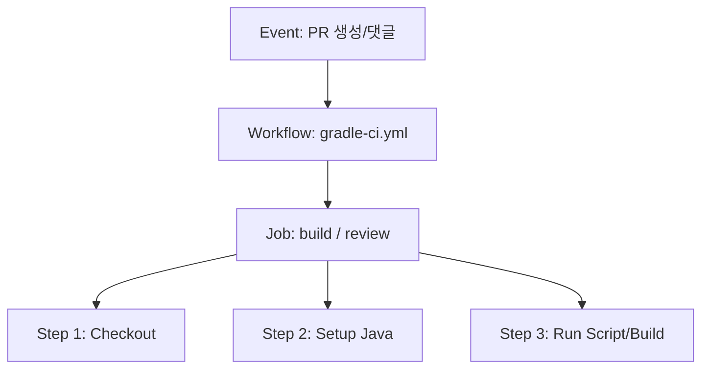

# ⚙️ 초보자를 위한 CI/CD & GitHub Actions 파이프라인 정밀 해설서

안녕하세요, 교육생 여러분! 신한DS 배달 프로젝트의 자동화 배포 및 검증 엔진인 **CI/CD 파이프라인 안내 문서**에 오신 것을 환영합니다.

개발을 처음 배울 때는 로컬 컴퓨터에서만 코드가 잘 돌면 완성된 것처럼 느껴집니다. 하지만 여러 명이 함께 개발하는 협업 환경에서는 **"내 컴퓨터에서는 잘 되는데 서버나 동료 컴퓨터에서는 왜 안 되지?"**하는 일명 *"It works on my machine"* 문제가 자주 발생합니다.

이 문서는 **CI/CD가 무엇인지, 깃허브 액션(GitHub Actions)이 어떻게 작동하는지, 그리고 우리 프로젝트의 CI/CD 파이프라인 속 각 단계(Step)들이 도대체 왜 만들어졌는지**를 친절한 비유와 함께 해설해 드립니다. 🎓

---

## 📚 목차
* **Part 1. CI/CD란 무엇인가요? (개념과 철학)**
* **Part 2. GitHub Actions의 작동 원리 (Event ➔ Workflow ➔ Job ➔ Step)**
* **Part 3. 우리 프로젝트 CI/CD Step별 정밀 해설 (Why & How)**
  * 3-1. 메인 빌드 & 검증 파이프라인 (`gradle-ci.yml`)
  * 3-2. AI 코드 리뷰어 파이프라인 (`gemini-code-review.yml`)
  * 3-3. PR 자동 라벨러 & 담당자 배정 (`pr-labeler.yml`)
* **Part 4. [공식 규칙] CI/CD 파이프라인 변경 시 문서화 의무화**

---

## Part 1. CI/CD란 무엇인가요? (개념과 철학)

### 1. 🔄 CI (Continuous Integration: 지속적 통합)
*   **뜻:** 개발자들이 각자 작업한 코드 변경 사항을 공유 저장소(Git)에 **자주, 그리고 자동으로 합치고 검증(테스트/빌드)하는 과정**입니다.
*   **비유:** 자동차 공장의 자동 품질 검사 로봇과 같습니다. 부품(코드)이 조립 라인(PR)에 올라올 때마다 로봇이 즉시 렌치를 조여보고(컴파일), 시동을 걸어보며(단위 테스트), 규격이 맞는지(Linter) 검사합니다.
*   **목적:** 버그나 충돌을 배포 직전이 아니라, **코드가 올려진 바로 그 순간 조기에 발견**하는 것입니다.

### 2. 🚀 CD (Continuous Deployment / Delivery: 지속적 제공/배포)
*   **뜻:** CI 검증을 무사히 통과한 검증된 코드를 **실제 운영 서버(Production)나 검증 서버(Staging)에 자동으로 배포하는 과정**입니다.
*   **비유:** 품질 검사를 통과한 신차가 트럭에 실려 자동으로 전국 대리점(운영 서버)으로 출고되는 시스템입니다.

---

## Part 2. GitHub Actions의 작동 원리 (Event ➔ Workflow ➔ Job ➔ Step)

깃허브 액션은 **"깃허브가 제공하는 가상의 클라우드 컴퓨터(리눅스/윈도우 등)"**에서 설정한 규칙대로 명령어를 실행해 주는 자동화 플랫폼입니다.

1.  **⚡ Event (이벤트):** 파이프라인을 작동시키는 **시작 스위치**입니다. 
    * *예: PR이 열렸을 때(`pull_request`), 댓글에 `/review`가 달렸을 때(`issue_comment`)*
2.  **📜 Workflow (워크플로우):** 자동화 작업의 **전체 설계도 파일**입니다. (`.github/workflows/*.yml`)
3.  **🏢 Job (작업):** 가상 클라우드 컴퓨터 1대를 할당받아 실행되는 **독립된 작업 단위**입니다.
4.  **🐾 Step (단계):** Job 안에서 순차적으로 실행되는 **하나하나의 명령어 단락**입니다. 윗 단계가 성공해야 다음 단계로 넘어갑니다.

---

## Part 3. 우리 프로젝트 CI/CD Step별 정밀 해설 (Why & How)

---

### 3-1. 🛠️ 메인 빌드 & 검증 파이프라인 ([.github/workflows/gradle-ci.yml](../.github/workflows/gradle-ci.yml))

우리가 제출한 PR 코드가 기존 시스템을 깨뜨리지 않는지 클라우드 가상 환경(Ubuntu)에서 검증하는 핵심 워크플로우입니다.

#### 0. 💡 `paths-ignore` 필터 (빌드 최적화 설정)
*   **어떻게 작동하나요?:** `docs/**`, `README.md`, `.gitignore` 등 순수 문서나 설정 파일만 수정된 PR일 경우, 빌드 머신을 구동하지 않고 파이프라인을 즉시 생략(Skip)합니다.
*   **왜 도입했나요?:** 오타 하나 수정한 문서 PR 때문에 무거운 자바 컴파일과 데이터베이스 컨테이너를 띄우느라 개발자가 3분씩 기다리는 낭비를 막고 서버 리소스를 절약하기 위함입니다.

#### 0-1. 🐬 `services: mariadb` (가상 DB 서버 구동)
*   **어떻게 작동하나요?:** 가상 컴퓨터 내부에 테스트용 MariaDB 11.4 샌드박스 컨테이너를 즉시 구동시킵니다.
*   **왜 도입했나요?:** 백엔드 테스트 실행 시 실제 데이터베이스 연결이 필요합니다. 가상 DB 환경을 함께 제공함으로써 로컬 DB 상태에 의존하지 않는 독립된 검증 환경을 만듭니다.

#### 🐾 Step 1. `Checkout repository` (`actions/checkout@v4`)
*   **어떻게 작동하나요?:** 깃허브 원격 저장소에 있는 최신 소스 코드를 가상 컴퓨터의 작업 폴더로 다운로드(git clone)해 옵니다.
*   **왜 필요하나요?:** 코드를 받아오지 않으면 가상 컴퓨터가 검사할 파일 자체가 없기 때문에 모든 CI의 첫 번째 단계는 무조건 Checkout이어야 합니다.

#### 🐾 Step 2. `Set up JDK 17` (`actions/setup-java@v4`)
*   **어떻게 작동하나요?:** 가상 컴퓨터에 Java 17(Temurin) 개발 키트를 설치하고, `cache: 'gradle'` 옵션으로 이전에 다운로드한 라이브러리를 재사용합니다.
*   **왜 필요하나요?:** 스프링 부트를 빌드하려면 자바 실행 환경이 필요합니다. 캐싱을 적용해 매번 라이브러리를 다운로드하는 대기 시간을 3분에서 20초로 줄여줍니다.

#### 🐾 Step 3. `Grant execute permission for gradlew`
*   **어떻게 작동하나요?:** `chmod +x gradlew` 커맨드를 실행합니다.
*   **왜 필요하나요?:** 리눅스 환경에서는 보안상 쉘 스크립트 실행 권한이 없으면 실행이 거부됩니다. Gradle 빌드 도구(`./gradlew`)를 켤 수 있도록 권한을 부여합니다.

#### 🐾 Step 4. `Verify Flyway Migration Filenames`
*   **어떻게 작동하나요?:** `bash scripts/lint-flyway-filenames.sh`를 실행해 SQL 파일명 오타를 검사합니다.
*   **왜 필요하나요?:** 무거운 Gradle 빌드를 돌리기 전에, 파일명 오타(`V1_init.sql` 등)로 인해 Flyway가 쿼리를 무시하는 실수를 초래할 수 있는 파일들을 초반 수 초 만에 빠르게 걸러냅니다.

#### 🐾 Step 5. `Verify Flyway Migration DDL Rules (Online DDL)`
*   **어떻게 작동하나요?:** `bash scripts/lint-flyway-ddl.sh`를 실행해 DDL 락 위험 구문을 스캔합니다.
*   **왜 필요하나요?:** `ALTER TABLE`이나 `CREATE INDEX` 시 무중단 옵션(`ALGORITHM=INPLACE, LOCK=NONE`)이 빠져 운영 DB 전체가 락에 걸리는 대형 장애를 정적 단계에서 미리 차단합니다.

#### 🐾 Step 6. `Verify Code Style (Spotless)`
*   **어떻게 작동하나요?:** `./gradlew spotlessCheck`를 실행해 구글 자바 스타일 규격을 준수했는지 확인합니다.
*   **왜 필요하나요?:** 들여쓰기나 띄어쓰기가 어긋난 코드가 메인 브랜치에 유입되지 않도록 막아 코드 가독성을 일정하게 유지시킵니다.

#### 🐾 Step 7. `Verify JaCoCo Coverage Gate & ArchUnit Architecture Rules`
*   **어떻게 작동하나요?:** `./gradlew test jacocoTestReport jacocoTestCoverageVerification`을 실행하여 전체 단위/통합 테스트 통과, ArchUnit 아키텍처 규칙 검증, 및 서비스 계층 커버리지 최소 60% 이상 충족 여부(JaCoCo Quality Gate)를 검증합니다.
*   **왜 필요하나요?:** 레이어 의존성 위반(`Controller` ➔ `Repository` 직접 호출)을 차단하고, 테스트 코드가 부실한 소스 코드가 메인 브랜치에 병합되는 것을 자동 차단합니다.
*   **`env` (DB 접속 정보):** `DB_URL`/`DB_USER`/`DB_PASSWORD`/`DB_DRIVER` 4개를 모두 명시적으로 설정해야 합니다. `application.yaml`의 `spring.datasource.driver-class-name`이 `DB_DRIVER` 환경변수가 없을 경우 로컬 무설정(zero-config) 편의를 위해 **H2**로 기본 폴백하도록 되어 있는데, 이 워크플로는 실제 `services: mariadb` 컨테이너를 쓰므로 `DB_DRIVER=org.mariadb.jdbc.Driver`를 반드시 함께 지정해야 합니다. 빠뜨리면 "URL은 MariaDB인데 드라이버는 H2"인 상태가 되어 `ApplicationContext` 로딩 단계에서 전체 테스트가 실패합니다.

#### 🐾 Step 8. `Upload JaCoCo Coverage Report Artifact` (`actions/upload-artifact@v4`)
*   **어떻게 작동하나요?:** `build/reports/jacoco/test/html/` 경로에 생성된 시각화 HTML 커버리지 리포트를 GitHub Actions 아티팩트(`jacoco-coverage-report`)로 자동 업로드합니다.
*   **왜 필요하나요?:** PR 리뷰어가 Actions 탭에서 커버리지 리포트 압축파일을 다운로드하여 라인별 테스트 검증 현황을 직관적으로 확인할 수 있습니다.

#### 🐾 Step 9. `Run Gradle Build and Package`
*   **어떻게 작동하나요?:** `./gradlew build -x test` 명령을 통해 최종 상용 패키지(JAR) 컴파일 및 빌드를 완성합니다.
*   **왜 필요하나요?:** 이미 이전 스텝에서 테스트 및 커버리지 검증을 완벽히 마쳤으므로, 최종 패키징 단계에서는 컴파일 이상 유무만을 신속히 검증하여 전체 빌드 타임을 최적화합니다.

---

### 3-2. 🤖 AI 코드 리뷰어 파이프라인 ([.github/workflows/gemini-code-review.yml](../.github/workflows/gemini-code-review.yml))

교육생이 제출한 PR 코드를 감지하여 다정한 튜터링 톤으로 1차 코드 리뷰를 남겨주는 자동화 워크플로우입니다.

#### 💡 하이브리드 트리거 (`pull_request` + `issue_comment`)
*   **왜 도입했나요?:** PR 최초 오픈 시에는 자동 1회 가동되지만, 이후 추가 수정 푸시 시에는 API 한도 절약을 위해 자동으로 돌지 않고 개발자가 댓글로 `/review`라고 입력할 때만 수동 호출되도록 설계했습니다.

#### 🐾 Step 1. `Load Gemini Review Prompt`
*   **어떻게 작동하나요?:** [.github/prompts/gemini-review-prompt.md](../.github/prompts/gemini-review-prompt.md) 마크다운 파일의 프롬프트 지침 텍스트를 읽어옵니다.
*   **왜 도입했나요?:** AI용 지침 문장을 YAML 워크플로우 파일과 분리 모듈화하여, 지침 수정이 편리하고 가독성을 높였습니다.

#### 🐾 Step 2. `Gemini AI Code Review`
*   **어떻게 작동하나요?:** Google Gemini 3.5 Flash 모델에 변경된 소스 디프(Diff)와 프롬프트를 전달하고, 반환된 한국어 리뷰 코멘트를 PR 페이지에 작성합니다.

---

### 3-3. 🏷️ PR 자동 라벨러 파이프라인 ([.github/workflows/pr-labeler.yml](../.github/workflows/pr-labeler.yml))

#### 🐾 Step 1. `Auto Label & Assignee`
*   **어떻게 작동하나요?:** PR 작성자를 담당자(Assignee)로 자동 지정하고, 브랜치명(`feat/`, `fix/`, `docs/`) 및 Draft 상태를 감지하여 알맞은 태그 라벨(`feature`, `bugfix`, `documentation`, `WIP`)을 부착합니다.
*   **왜 도입했나요?:** 수동 라벨링 번거로움을 없애고 PR 목록 화면에서 어떤 종류의 작업인지 직관적으로 분류하기 위함입니다.

---

## Part 4. 📜 [공식 규칙] CI/CD 파이프라인 변경 시 문서화 의무화

앞으로 우리 프로젝트에서 **CI/CD 워크플로우 파일(`.github/workflows/*.yml`)을 수정하거나 새로운 Step/스크립트를 추가하는 경우**, 다음 지침을 반드시 준수해야 합니다:

1.  **문서 업데이트 필수:**
    *   새로운 Step이 도입되면 본 문서([**docs/cicd-pipeline-guide.md**](./cicd-pipeline-guide.md))의 **Part 3 섹션에 해당 Step의 명칭, 작동 방식, 그리고 왜 도입했는지(Why)**를 개발 초급자가 이해할 수 있는 어조로 반드시 추가 기재해야 합니다.
2.  **PR 자가 체크리스트 준수:**
    *   PR 제출 시 자가 체크리스트의 `[ ] (CI/CD 변경 시) docs/cicd-pipeline-guide.md 안내 문서를 함께 업데이트하셨나요?` 항목을 반드시 체크하여 제출해야 합니다.

이 문서를 통해 자동화 도구 뒤에 숨겨진 수많은 고민과 가치를 이해하고, 더 견고한 소프트웨어를 만들어 나가는 계기가 되기를 바랍니다. 화이팅입니다! 🚀
