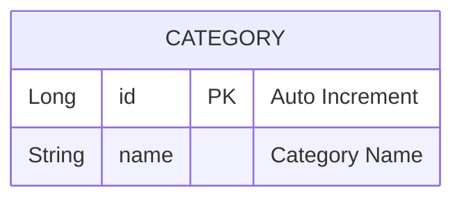

# 설계서: 물품 카테고리 목록 조회 (Category)

이 문서는 배송 신청 시 고객이 선택하는 물품 카테고리 목록을 조회하는 기능에 대한 설계 문서입니다.

---

## 1. 요구사항 정의서 (User Story)

* **User Story:**
  우리는 **화주 고객**으로서, 배송을 신청할 때 물품 종류를 쉽게 고르기 위해 **미리 정의된 물품 카테고리 목록을 조회**하기를 원한다.
* **성공 기준 (Acceptance Criteria):**
  1. `GET /api/v1/categories` 호출 시 카테고리 12종이 항상 반환된다(모든 환경에 항상 존재하는 마스터 데이터).
  2. 카테고리는 조회 전용이며, 생성/수정/삭제 API는 이번 범위에 없다.

---

## 2. ERD 설계 (Entity-Relationship Diagram)

다른 엔티티와 연관관계 없는 독립 참조 테이블이다(이번 범위에서는 `DeliveryRequest`와 FK 연결하지 않음).



* 카테고리 12종을 `V8__create_category_table.sql` 마이그레이션의 INSERT로 시딩한다. `DataSeedInitializer`(로컬 더미 데이터 전용, `.env` 플래그로 on/off)가 아니라 마이그레이션으로 넣는 이유는, 카테고리가 dev/test/prod 모든 환경에 항상 존재해야 하는 실제 마스터 데이터이기 때문이다.

| name |
|---|
| 전자기기/가전 |
| 식품/음료 |
| 의류/패션잡화 |
| 서류/문서 |
| 생활용품/잡화 |
| 가구/인테리어 |
| 화장품/뷰티 |
| 도서/음반 |
| 스포츠/레저 |
| 반려동물 용품 |
| 꽃/식물 |
| 기타 |

---

## 3. API 명세서 (API Specification)

### 3.1 카테고리 목록 조회
* **엔드포인트:** `GET /api/v1/categories`
  * (이슈 원문은 `GET /api/categories`이나, 이 저장소의 실제 컨벤션 `/api/v1/...`에 맞춤)
* **응답 바디 및 상태 코드 (Response Body & Status):**
  * **Success (200 OK):** 리스트를 래핑하지 않고 배열로 직접 반환한다(`getDeliveryRequests()` 등 기존 목록 조회 API와 동일 패턴).
    ```json
    [
      { "id": 1, "name": "전자기기/가전" },
      { "id": 2, "name": "식품/음료" }
    ]
    ```

---

## 4. 작업 분할 목록 (WBS)

- [ ] `V8__create_category_table.sql` 마이그레이션 작성 (테이블 생성 + 12종 INSERT)
- [ ] `Category` Entity 작성 (Lombok `@Getter/@Setter`)
- [ ] `CategoryRepository extends JpaRepository<Category, Long>` 작성
- [ ] `CategoryResponse` record 작성
- [ ] `CategoryService.getCategories()` 작성
- [ ] `CategoryController`에 `GET /api/v1/categories` 추가
- [ ] 단위 테스트(12종 반환 검증)
