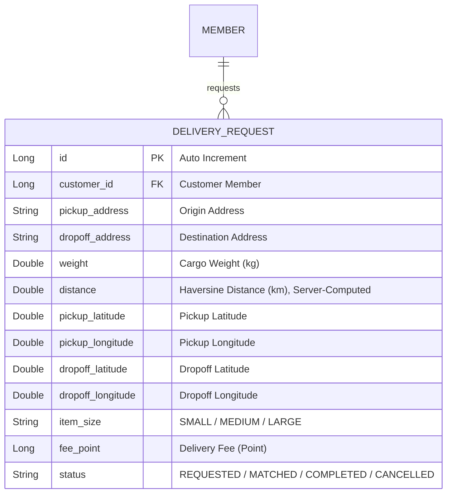

# 설계서: 배송 요청 등록 및 조회 (Delivery Request)

이 문서는 화주 고객이 배송을 의뢰하는 배송 요청 기능에 대한 설계 문서입니다.

---

## 1. 요구사항 정의서 (User Story)

* **User Story:** 
  우리는 **화주 고객(Client)**으로서, 상품을 배송지로 운송하기 위해 **배송할 화물의 위치 정보(출발지/목적지 좌표)와 무게·크기를 기록해 배송 요청을 등록하고 조회**하기를 원한다.
* **성공 기준 (Acceptance Criteria):**
  1. 배송을 요청하는 회원은 반드시 실제로 존재하는 회원이어야 하며, 아닐 경우 `404 Not Found` 에러를 반환한다.
  2. 요청하는 배송 화물의 무게는 `0`보다 커야 하고, 출발지·도착지 좌표로 계산한 거리도 `0`보다 커야 하며(같은 좌표 입력 시 거절), 미달 시 `400 Bad Request` 에러를 발생시킨다.
  3. 배송 요청이 신규 등록되면, 차량이 콜을 수락하기 전이므로 최초 상태값은 `REQUESTED`가 되고, **3.3 견적과 동일한 공식**(하버사인 거리·무게·크기 기반)으로 배송 요금(`feePoint`)이 자동 계산된다. 클라이언트가 임의의 거리값을 주입해 요금을 조작할 수 없다(거리는 좌표로만 서버가 계산).

---

## 2. ERD 설계 (Entity-Relationship Diagram)



* `V9__add_dropoff_coordinates_and_item_size.sql` 마이그레이션으로 `dropoff_latitude`/`dropoff_longitude`/`item_size` 컬럼을 추가한다(기존 행 호환을 위해 `dropoff_*`는 `DEFAULT 0`, `item_size`는 `DEFAULT 'MEDIUM'`).

---

## 3. API 명세서 (API Specification)

### 3.1 배송 요청 생성
* **엔드포인트:** `POST /api/v1/delivery-requests`
* **요청 바디 (Request Body):** `distance`는 더 이상 클라이언트가 주지 않는다(서버가 좌표로 직접 계산) — 대신 도착지 좌표와 `itemSize`를 받는다.
  ```json
  {
    "customerId": 1,
    "pickupAddress": "서울시 마포구 백범로 31",
    "dropoffAddress": "서울시 중구 을지로 100",
    "weight": 10,
    "pickupLatitude": 37.0,
    "pickupLongitude": 127.0,
    "dropoffLatitude": 38.0,
    "dropoffLongitude": 127.0,
    "itemSize": "MEDIUM"
  }
  ```
* **응답 바디 및 상태 코드 (Response Body & Status):**
  * **Success (201 Created):** (위 예시 좌표 기준 약 111.19km, 10kg, MEDIUM → 3.3과 동일한 공식으로 `feePoint` 78,776 계산)
    ```json
    {
      "id": 1,
      "customerId": 1,
      "pickupAddress": "서울시 마포구 백범로 31",
      "dropoffAddress": "서울시 중구 을지로 100",
      "weight": 10,
      "distance": 111.19,
      "status": "REQUESTED",
      "feePoint": 78776,
      "pickupLatitude": 37.0,
      "pickupLongitude": 127.0,
      "dropoffLatitude": 38.0,
      "dropoffLongitude": 127.0,
      "itemSize": "MEDIUM"
    }
    ```
  * **Failure (404 Not Found - 고객 존재 안 함, ErrorCode `M001`):**
    ```json
    {
      "status": 404,
      "code": "M001",
      "message": "존재하지 않는 회원입니다.",
      "timestamp": "2026-07-28T10:00:00"
    }
    ```
  * **Failure (400 Bad Request - 출발지·도착지 좌표가 같아 거리가 0, ErrorCode `D005`):** 클라이언트가 픽업/도착 좌표를 동일하게 보내면 거절한다.

### 3.2 배송 요청 단건 조회
* **엔드포인트:** `GET /api/v1/delivery-requests/{id}`
* **응답 바디 및 상태 코드 (Response Body & Status):**
  * **Success (200 OK):** 3.1과 동일한 필드 구성(도착지 좌표·`itemSize` 포함).
  * **Failure (404 Not Found - 배송 요청 없음, ErrorCode `D001`):**
    ```json
    {
      "status": 404,
      "code": "D001",
      "message": "존재하지 않는 배송 요청입니다.",
      "timestamp": "2026-07-28T10:00:00"
    }
    ```

### 3.3 배송 요금 견적
* **엔드포인트:** `POST /api/v1/delivery-requests/estimate`
* **설명:** 실제 배송 요청을 생성하지 않고, 출발지·도착지 좌표·물품 무게·물품 크기로 예상 요금을 미리 계산한다.
  1. `subtotal` = 기본료(3,000원) + 거리 할증(하버사인 거리 × 500원/km) + 무게 할증(무게(kg) × 200원/kg)
  2. `sizeSurcharge` = `subtotal` × 크기 할증률(`SMALL` 0% / `MEDIUM` 30% / `LARGE` 60%)
  3. `totalFee` = `subtotal` + `sizeSurcharge`

  3.1의 `feePoint` 계산도 이제 이 공식과 완전히 동일하다(#142에서 통합 — 과거에는 3.1이 `거리×100원+무게×10원`(클라이언트가 준 raw distance)이라는 별개의 공식을 썼으나, 견적과 실제 청구 금액이 달라지는 문제가 있어 하나로 합쳤다).
* **요청 바디 (Request Body):**
  ```json
  {
    "pickupLatitude": 37.5665,
    "pickupLongitude": 126.9780,
    "destinationLatitude": 35.1796,
    "destinationLongitude": 129.0756,
    "weight": 10,
    "itemSize": "MEDIUM"
  }
  ```
* **응답 바디 및 상태 코드 (Response Body & Status):**
  * **Success (200 OK):** (서울시청 → 부산시청, 약 325.1km, 10kg, MEDIUM 기준)
    ```json
    {
      "baseFee": 3000,
      "distanceSurcharge": 162556,
      "weightSurcharge": 2000,
      "sizeSurcharge": 50267,
      "totalFee": 217823
    }
    ```
  * **Failure (400 Bad Request - 좌표/무게/크기 누락 또는 무게 0 이하):** 표준 `MethodArgumentNotValidException` 처리(`GlobalExceptionHandler`)를 그대로 따른다.

---

## 4. 작업 분할 목록 (WBS)

- [x] 배송 요청 스키마 생성 마이그레이션 스크립트 작성 (`V4__create_delivery_request_table.sql`)
- [x] `DeliveryRequest` 도메인 Entity 설계 및 `DeliveryStatus` 상태 이늄 설정
- [x] 공통 `EntityNotFoundException` + `ErrorCode.DELIVERY_NOT_FOUND` 조합으로 배송 요청 미존재 처리
- [x] 화주 고객 정보 유효성 검사 및 화물 무게·거리 유효 범위(`> 0`) 체크 비즈니스 로직 작성
- [x] 배송 요청 등록/조회 서비스 레이어 비즈니스 로직 설계 및 단위 테스트 구현
- [x] `DeliveryController` 및 API 컨트롤러 슬라이스 통합 테스트 구현
- [x] 배송 요금 견적(`POST /estimate`) 요청/응답 DTO 추가
- [x] `DeliveryService.estimateFee()` + 하버사인 거리 계산 로직 추가
- [x] `DeliveryController`에 견적 엔드포인트 추가 및 단위 테스트(동일 좌표/장거리/좌표·무게 누락) 구현
- [x] `ItemSize`(SMALL/MEDIUM/LARGE) 크기 할증 필드 추가 및 `sizeSurcharge` 계산 로직 반영 (#139)
- [x] 크기 할증 관련 테스트(무게+크기 복합 계산, 크기 누락 400) 추가 (#139)
- [ ] `V9` 마이그레이션으로 `dropoff_latitude`/`dropoff_longitude`/`item_size` 컬럼 추가 (#142)
- [ ] `DeliveryCreateRequest`에서 `distance` 필드 제거, 도착지 좌표·`itemSize` 필드 추가 (#142)
- [ ] `DeliveryService.requestDelivery()`가 `estimateFee()`와 동일한 계산 로직(공유 private 메서드)을 쓰도록 통합 (#142)
- [ ] 기존 `calculateFee`/`FEE_PER_DISTANCE`/`FEE_PER_WEIGHT` 제거 및 관련 테스트 갱신 (#142)
