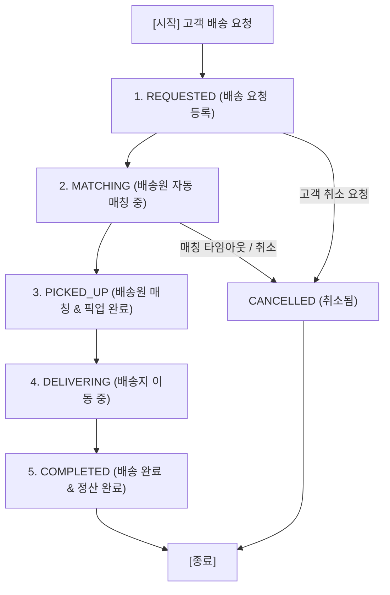

# 🕸️ 배송 도메인 상태 전이 그래프 명세서 (Delivery State Graph Design)

> **Shinhan Delivery 배송 주문 생애주기(Delivery Request Lifecycle) 상태 전이 그래프 및 동시성 제어 설계 명세서**

---

## 📌 1. 개요 및 목적
배송 서비스의 핵심 엔티티인 `DeliveryRequest` 및 `Matching`은 복잡한 비즈니스 로직과 여러 사용자의 동시 요청이 얽혀있는 영역입니다.
본 문서는 배송 주문의 불법 상태 변경을 차단하고 멱등성(Idempotency) 및 스레드 안전성을 사수하기 위해 **상태 전이 그래프(State Machine Graph)**를 명세합니다.

---

## 🗺️ 2. 배송 상태 전이 그래프 (State Transition Graph)

---

## 📋 3. 상태 전이 규칙 및 API 매핑 테이블

| 출발 상태 (From) | 목적 상태 (To) | 허용 조건 및 락 정책 | 관련 API / 이벤트 |
| :--- | :--- | :--- | :--- |
| `[시작]` | `REQUESTED` | 결제/지갑 잔액 검증 통과 시 | `POST /api/v1/deliveries` |
| `REQUESTED` | `MATCHING` | 자동 매칭 시스템 기동 및 비관적 락(`PESSIMISTIC_WRITE`) 확보 | `POST /api/v1/deliveries/{id}/match` |
| `MATCHING` | `PICKED_UP` | 배송원 수락 및 픽업 완료 확인 시 | `PATCH /api/v1/deliveries/{id}/pickup` |
| `PICKED_UP` | `DELIVERING` | 배송원의 배송 시작 버튼 클릭 시 | `PATCH /api/v1/deliveries/{id}/start` |
| `DELIVERING` | `COMPLETED` | 배송 완료 서명/사진 업로드 및 포인트 정산 완료 시 | `PATCH /api/v1/deliveries/{id}/complete` |
| `REQUESTED` / `MATCHING` | `CANCELLED` | 배송 픽업 전 고객/시스템 취소 요청 시 (환불 처리) | `DELETE /api/v1/deliveries/{id}` |

---

## 🛡️ 4. 예외 및 불가능한 전이 규칙 (Forbidden Edges)

1. **상태 역전 금지 (No Backward Edge):**
   - `PICKED_UP` ➔ `REQUESTED` 또는 `COMPLETED` ➔ `DELIVERING`과 같이 과거 상태로 되돌아갈 수 없습니다.
2. **완료 상태 전이 불가능 (Terminal State Lock):**
   - `COMPLETED` 및 `CANCELLED` 상태는 그래프의 최종 노드(Terminal Node)이며, 어떠한 경우에도 상태 변경이나 취소가 불가능합니다.
3. **동시성 락 제어 (Concurrency Control):**
   - 동일 배송 요청에 대해 여러 배송원이 동시 수락을 시도할 경우, `PESSIMISTIC_WRITE` (DB `SELECT ... FOR UPDATE`) 락을 거친 최우선 배송원 1명만 `MATCHING` ➔ `PICKED_UP` 상태 전이에 성공하며 나머지는 `AlreadyMatchedException`을 응답받습니다.
