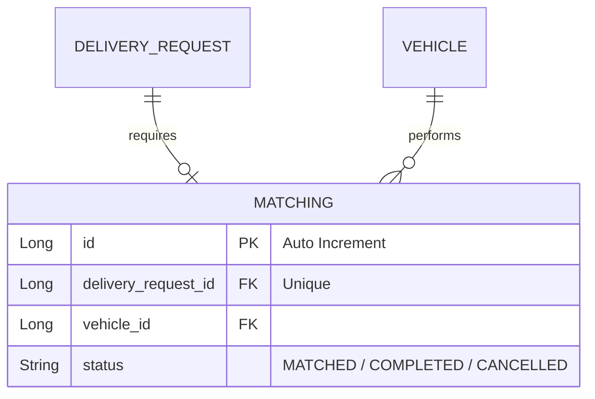

# 설계서: 배송 매칭 (Matching)

이 문서는 생성된 배송 요청에 가용 차량(배송원)을 연결하고 상호 리소스의 상태를 조율하는 매칭 기능에 대한 설계 문서입니다.

---

## 1. 요구사항 정의서 (User Story)

* **User Story:** 
  우리는 **배송원(Courier)**으로서, 내가 운행 가능한 조건(무게·거리)에 맞는 배송 요청(콜)을 찾아 수락하기 위해 **열린 콜 목록을 조회하고, 원하는 콜을 수락(매칭)**하기를 원한다. 매칭이 확정되면 시스템은 배송 및 차량 상태를 자동으로 연동하여 갱신한다.
* **성공 기준 (Acceptance Criteria):**
  1. 차량이 콜을 수락해 매칭이 생성되면 매칭 데이터가 기록되고, 대상 차량의 상태는 즉시 `BUSY`로 전환되어 다른 콜에 중복 배정되지 않아야 한다. 동시에 대상 배송 요청 상태는 `MATCHED`로 갱신된다. 여러 차량이 동시에 같은 콜을 수락하려 하면 배송 요청 행에 비관적 락을 걸어 먼저 커밋한 차량 하나만 성공한다.
  2. 이미 다른 콜을 수행 중인 `BUSY` 상태의 차량이 매칭을 시도하면 `409 Conflict`(`VehicleNotAvailableException`), 차량의 무게·거리 조건이 배송 요청을 감당하지 못하면 `400 Bad Request`(`VehicleCapacityMismatchException`)를 발생시킨다.
  3. 완료(`COMPLETED`)나 취소/삭제(`CANCELLED`) 등 매칭 상태가 해제되는 이벤트가 발생하면, 대상 차량 상태는 자동으로 `AVAILABLE`로 복귀되어야 한다. 허용되지 않는 상태 전이(예: `COMPLETED`에서 다른 상태로 이동)를 시도하면 `409 Conflict`(`InvalidMatchingTransitionException`)를 반환한다.

---

## 2. ERD 설계 (Entity-Relationship Diagram)



---

## 3. API 명세서 (API Specification)

### 3.1 콜 수락 (매칭 생성)
* **엔드포인트:** `POST /api/v1/matchings`
* **요청 바디 (Request Body):**
  ```json
  {
    "deliveryRequestId": 1,
    "vehicleId": 1
  }
  ```
* **응답 바디 및 상태 코드 (Response Body & Status):**
  * **Success (201 Created):**
    ```json
    {
      "id": 1,
      "deliveryRequestId": 1,
      "vehicleId": 1,
      "status": "MATCHED",
      "matchedAt": "2026-07-28T10:00:00"
    }
    ```
  * **Failure (409 Conflict - 차량 상태가 AVAILABLE이 아님, ErrorCode `V003`):**
    ```json
    {
      "status": 409,
      "code": "V003",
      "message": "이미 매칭중인 차량입니다: vehicleId=1",
      "timestamp": "2026-07-28T10:00:00"
    }
    ```
  * **Failure (409 Conflict - 이미 처리된 배송 요청, ErrorCode `D003`):**
    ```json
    {
      "status": 409,
      "code": "D003",
      "message": "이미 매칭된 배송 요청입니다: 1",
      "timestamp": "2026-07-28T10:00:00"
    }
    ```

### 3.2 열린 콜 목록 조회
* **엔드포인트:** `GET /api/v1/matchings/calls?vehicleId={vehicleId}`
* **설명:** 차량이 `AVAILABLE` 상태일 때, 그 차량의 무게·거리 조건을 만족하는 `REQUESTED` 상태 배송 요청 목록을 반환한다. 차량이 `BUSY`면 빈 목록을 반환한다.
* **응답 바디 및 상태 코드 (Response Body & Status):**
  * **Success (200 OK):**
    ```json
    [
      {
        "id": 2,
        "customerId": 3,
        "pickupAddress": "Busan Haeundae",
        "dropoffAddress": "Busan Seomyeon",
        "weight": 10.0,
        "distance": 5.0,
        "status": "REQUESTED",
        "feePoint": 600,
        "pickupLatitude": 35.18,
        "pickupLongitude": 129.08
      }
    ]
    ```

### 3.3 매칭 완료 처리 (상태 수정)
* **엔드포인트:** `PUT /api/v1/matchings/{id}`
* **요청 바디 (Request Body):**
  ```json
  {
    "status": "COMPLETED"
  }
  ```
* **응답 바디 및 상태 코드 (Response Body & Status):**
  * **Success (200 OK):**
    ```json
    {
      "id": 1,
      "deliveryRequestId": 1,
      "vehicleId": 1,
      "status": "COMPLETED"
    }
    ```
  *(비즈니스 로직 연동: 배송 요청 상태는 COMPLETED가 되고, 차량 상태는 AVAILABLE로 원상복귀됨)*

### 3.4 매칭 삭제 (취소 처리)
* **엔드포인트:** `DELETE /api/v1/matchings/{id}`
* **응답 상태 코드:** `204 No Content`
  *(비즈니스 로직 연동: 차량 상태는 AVAILABLE로 돌아가고, 배송 요청은 미매칭 상태인 REQUESTED로 복원됨)*

---

## 4. 작업 분할 목록 (WBS)

- [x] 매칭 관리 테이블 생성 스크립트 작성 (`V5__create_matching_table.sql`)
- [x] `Matching` 도메인 Entity 설계 및 `MatchingStatus` 매핑
- [x] `AlreadyMatchedException`, `VehicleNotAvailableException`, `VehicleCapacityMismatchException`, `InvalidMatchingTransitionException`(모두 `BusinessException` 상속) 및 공통 `EntityNotFoundException` + `ErrorCode.MATCHING_NOT_FOUND` 매핑
- [x] 매칭 상태 변화에 따른 타겟 테이블(`Vehicle`, `DeliveryRequest`) 데이터 동기화 로직 구현 (`applyStatus` 헬퍼 설계)
- [x] 콜 수락 시 배송 요청 행에 비관적 락(`findByIdForUpdate`)을 걸어 동시 수락 경합 방지
- [x] 매칭 생성(콜 수락)/열린 콜 조회/수정/삭제 비즈니스 로직 구현 및 통합 예외 처리 단위 테스트 구현
- [x] `MatchingController` 엔드포인트 연동 및 API E2E 검증 테스트 구현
