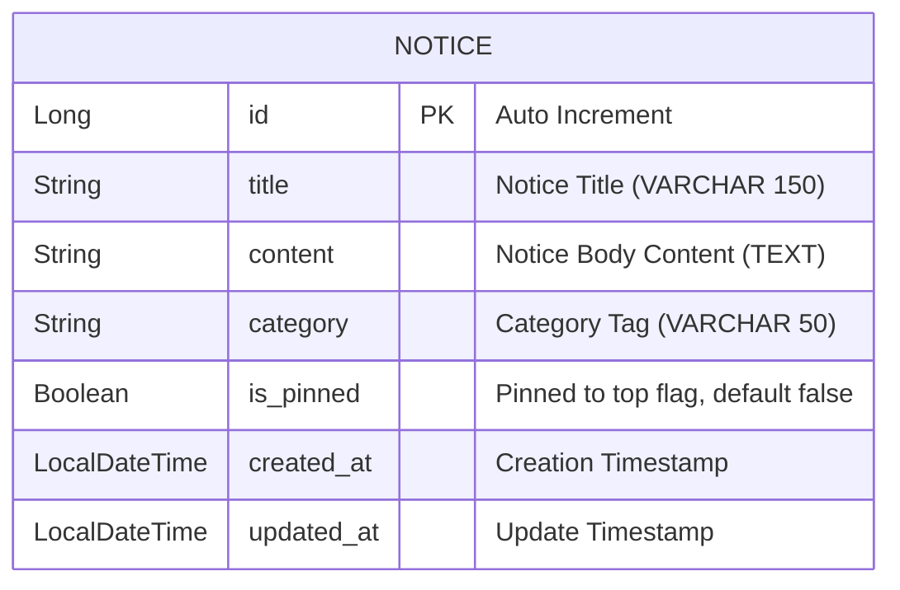

# 설계서: 공지사항 목록 및 상세 조회 (Notice)

이 문서는 사용자가 공지사항 목록을 페이징으로 조회하고 공지사항 상세 내용을 확인하는 기능에 대한 설계 문서입니다.

---

## 1. 요구사항 정의서 (User Story)

* **User Story:**
  우리는 **서비스 이용 사용자 (고객 및 배송원)**로서, 플랫폼의 주요 업데이트, 이벤트 및 점검 소식을 **공지사항 목록과 상세 화면을 통해 확인**하기를 원한다.
* **성공 기준 (Acceptance Criteria):**
  1. 공지사항 목록 조회(`GET /api/v1/notices`)는 상단 고정(`is_pinned` DESC) 및 최신순(`created_at` DESC) 정렬로 페이징 결과를 반환한다.
  2. `category` 쿼리 파라미터로 공지사항 카테고리별(SYSTEM, EVENT, SERVICE, ANNOUNCEMENT 등) 필터링이 가능하다.
  3. 공지사항 상세 조회(`GET /api/v1/notices/{id}`)는 특정 공지사항의 제목, 본문, 작성일시, 상단고정 여부 등의 상세 정보를 반환한다.
  4. 존재하지 않는 공지사항 ID로 상세 조회 시 `404 Not Found` (ErrorCode: `N002`, `NOTICE_NOT_FOUND`) 에러를 반환한다.
  5. 공지사항 조회 API는 로그인 여부와 관계없이 접근 가능하거나 인증된 사용자가 자유롭게 조회할 수 있다.

---

## 2. ERD 설계 (Entity-Relationship Diagram)



* `V13__create_notice_table.sql`로 `notice` 테이블을 생성하고 기본 시드 데이터를 추가한다.
* 복합 인덱스 `(is_pinned, created_at)`를 추가하여 상단 고정 우선 정렬 및 최신순 조회 시 Full Scan + Filesort를 방지한다.

---

## 3. API 명세서 (API Specification)

### 3.1 공지사항 목록 조회
* **엔드포인트:** `GET /api/v1/notices?category={선택}&page={n}&size={n}`
* **인증:** 인증 불필요 (Public / Authenticated 모두 조회 가능)
* **응답 바디 및 상태 코드 (Response Body & Status):**
  * **Success (200 OK):** `Page<NoticeResponse>` 페이징 구조 반환
    ```json
    {
      "content": [
        {
          "id": 1,
          "title": "[안내] 서비스 정기 점검 안내",
          "category": "SYSTEM",
          "isPinned": true,
          "createdAt": "2026-07-30T09:00:00",
          "updatedAt": "2026-07-30T09:00:00"
        }
      ],
      "totalElements": 1,
      "totalPages": 1,
      "number": 0,
      "size": 10
    }
    ```

### 3.2 공지사항 상세 조회
* **엔드포인트:** `GET /api/v1/notices/{id}`
* **인증:** 인증 불필요
* **응답 바디 및 상태 코드 (Response Body & Status):**
  * **Success (200 OK):** `NoticeDetailResponse` 반환
    ```json
    {
      "id": 1,
      "title": "[안내] 서비스 정기 점검 안내",
      "content": "안녕하세요. 서비스 안정화를 위한 정기 점검이 진행될 예정입니다...",
      "category": "SYSTEM",
      "isPinned": true,
      "createdAt": "2026-07-30T09:00:00",
      "updatedAt": "2026-07-30T09:00:00"
    }
    ```
  * **Failure (404 Not Found - ErrorCode `N002` / `NOTICE_NOT_FOUND`):**
    ```json
    {
      "code": "N002",
      "message": "존재하지 않는 공지사항입니다."
    }
    ```

---

## 4. 작업 분할 목록 (WBS)

- [x] `V13__create_notice_table.sql` Flyway 마이그레이션 작성 (테이블 생성 & 인덱스 & 초기 데이터 시딩)
- [x] `Notice` Entity & `NoticeRepository` (`findByCategoryOrderByIsPinnedDescCreatedAtDesc`, `findAllByOrderByIsPinnedDescCreatedAtDesc`)
- [x] `NoticeResponse`, `NoticeDetailResponse` DTO 작성
- [x] `ErrorCode.NOTICE_NOT_FOUND`(N002) 추가 및 `NoticeNotFoundException` 구현
- [x] `NoticeService`: `getNotices(category, pageable)`, `getNoticeDetail(noticeId)` 구현
- [x] `NoticeController`: `GET /api/v1/notices`, `GET /api/v1/notices/{id}` 컨트롤러 엔드포인트 구현 (Swagger 어노테이션 적용)
- [x] 단위 테스트 (`NoticeServiceTest`, `NoticeControllerTest`, `NoticeRepositoryTest`)
