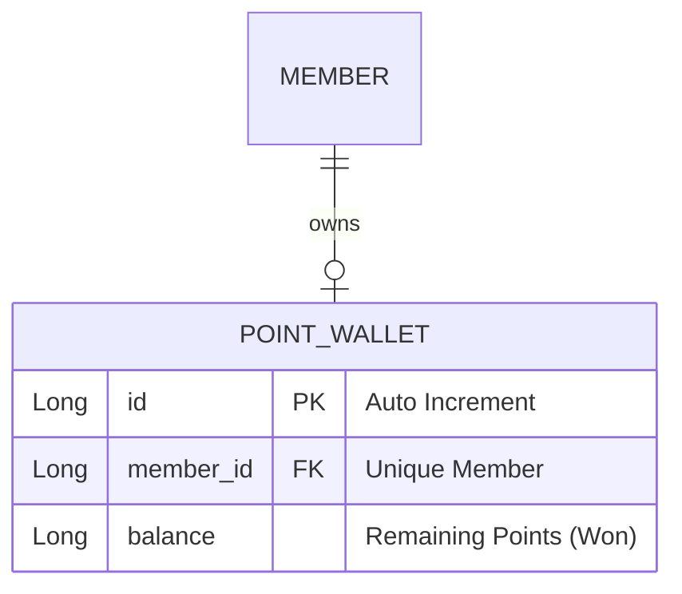

# 설계서: 포인트 지갑 및 결제 (Point Wallet & Payments)

이 문서는 사용자의 포인트 지갑 개설, 금액 충전 및 차감(사용)을 담당하는 포인트 지갑 기능에 대한 설계 문서입니다.

---

## 1. 요구사항 정의서 (User Story)

* **User Story:** 
  우리는 **회원(Member)**으로서, 매칭 대금 정산 및 지불을 위해 **개인 포인트 지갑을 개설하고, 원하는 금액만큼 포인트를 충전하고 잔액 한도 내에서 차감(사용)**하기를 원한다.
* **성공 기준 (Acceptance Criteria):**
  1. 하나의 회원은 오직 하나의 포인트 지갑만 개설할 수 있으며, 중복 개설 시도 시 예외를 발생시킨다.
  2. 포인트 충전 금액은 `0`원 이상이어야 하며, 0원 미만 충전 시 `400 Bad Request` 에러를 반환한다.
  3. 포인트 사용(차감) 시 현재 지갑 잔액보다 큰 금액을 사용하려 하면 `400 Bad Request (잔액 부족 오류)`를 반환하고 트랜잭션을 취소해야 한다.

---

## 2. ERD 설계 (Entity-Relationship Diagram)



---

## 3. API 명세서 (API Specification)

### 3.1 포인트 지갑 개설
* **엔드포인트:** `POST /api/v1/point-wallets`
* **요청 바디 (Request Body):**
  ```json
  {
    "memberId": 1
  }
  ```
* **응답 바디 및 상태 코드 (Response Body & Status):**
  * **Success (201 Created):**
    ```json
    {
      "id": 1,
      "memberId": 1,
      "balance": 0
    }
    ```

### 3.2 포인트 충전
* **엔드포인트:** `POST /api/v1/point-wallets/{walletId}/charge`
* **요청 바디 (Request Body):**
  ```json
  {
    "amount": 50000
  }
  ```
* **응답 바디 및 상태 코드 (Response Body & Status):**
  * **Success (200 OK):**
    ```json
    {
      "id": 1,
      "memberId": 1,
      "balance": 50000
    }
    ```

### 3.3 포인트 사용 (차감)
* **엔드포인트:** `POST /api/v1/point-wallets/{walletId}/use`
* **요청 바디 (Request Body):**
  ```json
  {
    "amount": 15000
  }
  ```
* **응답 바디 및 상태 코드 (Response Body & Status):**
  * **Success (200 OK):**
    ```json
    {
      "id": 1,
      "memberId": 1,
      "balance": 35000
    }
    ```
  * **Failure (400 Bad Request - 잔액 부족, ErrorCode `P002`):**
    ```json
    {
      "status": 400,
      "code": "P002",
      "message": "포인트 잔액이 부족합니다. (Wallet ID: 1, 요청 금액: 15000)",
      "timestamp": "2026-07-28T10:00:00"
    }
    ```

---

## 4. 작업 분할 목록 (WBS)

- [x] 포인트 지갑 테이블 생성 DB 마이그레이션 스크립트 작성 (`V6__create_point_wallet_table.sql`)
- [x] `PointWallet` 도메인 Entity 설계 (회원 외래키 unique 제약 조건 설정)
- [x] `InsufficientPointException`(`BusinessException` 상속) 및 공통 `EntityNotFoundException` + `ErrorCode.POINT_WALLET_NOT_FOUND` 매핑
- [x] 포인트 지갑 생성/충전/차감 시의 비즈니스 유효성 검증(잔액 점검, 마이너스 충전 방지) 로직 구현
- [x] `PaymentService` 비즈니스 레이어 로직 작성 및 트랜잭션 원자성(Atomicity) 단위 테스트 구현
- [x] `PaymentController` 엔드포인트 연동 및 API E2E 검증 테스트 구현
