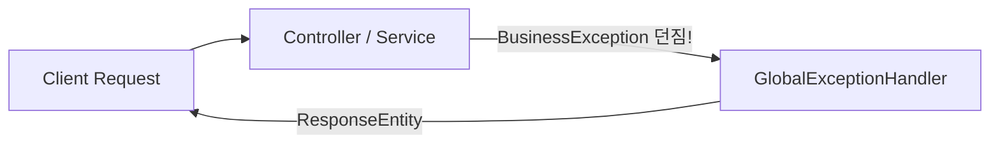

# 🛡️ 초보자를 위한 전역 예외 처리(Global Exception Handling) 가이드

안녕하세요, 교육생 여러분! 신한DS 개척자 백엔드 개발팀입니다.

백엔드 개발에서 **예외(Exception) 처리**는 기능 구현만큼이나 중요합니다. 예외를 제대로 제어하지 않으면 민감한 서버 내부 코드(Stacktrace)가 클라이언트에 쌩으로 노출되어 보안 해킹 위험에 노출되거나, 프론트엔드 개발자가 원인을 알 수 없어 서비스가 멈추게 됩니다.

이 문서는 **왜 전역 예외 처리를 사용하는지, 스프링 부트의 `@RestControllerAdvice`가 어떻게 작동하는지, 그리고 우리 프로젝트의 표준 에러 응답 체계 사용법**을 친절하게 해설해 드립니다. 🎓

---

## 📚 목차
* **Part 1. 예외 처리가 왜 중요한가요? (보안 및 사용자 경험)**
* **Part 2. 전역 예외 처리기(@RestControllerAdvice)의 작동 원리**
* **Part 3. 표준 에러 응답 구조 (ErrorCode & ErrorResponse)**
* **Part 4. 실전 예외 던지기(Throw) 코드 작성법**
* **Part 5. [공식 규칙] 우리 프로젝트의 예외 처리 수칙**

---

## Part 1. 예외 처리가 왜 중요한가요? (보안 및 사용자 경험)

### 1. 🚨 예외 처리를 안 했을 때 발생하는 참사
1.  **민감 정보 유출 (보안 문제):**
    `NullPointerException`이나 `SQLException`이 처리되지 않고 클라이언트에 노출되면, DB 테이블 구조, 사용 중인 라이브러리 버전, 파일 경로 등이 그대로 렌더링되어 공격자의 표적이 됩니다.
2.  **프론트엔드와의 통신 마비:**
    에러가 났을 때 어떤 곳은 HTTP status `500`에 텍스트를 보내고, 어떤 곳은 status `200`에 `"error"`라는 글자를 반환하면, 프론트엔드 개발자는 예외 처리를 일관되게 작성할 수 없게 됩니다.

### 2. 🛡️ 올바른 예외 처리의 3대 이점
*   **보안성:** 내부 스택트레이스는 서버 로거(`log.error()`)에만 남기고, 클라이언트에는 정제된 메시지만 반환합니다.
*   **일관성:** 어떤 예외가 발생하더라도 똑같은 JSON 데이터 구조(`ErrorResponse`)로 응답합니다.
*   **생산성:** 컨트롤러마다 `try-catch` 구문을 누더기처럼 적지 않고, 서비스 레이어에서 예외만 툭 던지면(`throw`) 전역 처리기가 알아서 캡처합니다.

---

## Part 2. 전역 예외 처리기(@RestControllerAdvice)의 작동 원리

스프링 부트는 컨트롤러 단에서 발생하는 모든 예외를 한곳으로 모아 처리할 수 있는 `@RestControllerAdvice` 기능을 제공합니다.



1.  개발자가 컨트롤러나 서비스에서 `throw new BusinessException(ErrorCode.MEMBER_NOT_FOUND);`를 실행합니다.
2.  스프링 AOP가 이 예외를 감지하여 [GlobalExceptionHandler.java](file:///Users/sungminjo/workspace/shinhan/shinhan-delivery/src/main/java/com/example/shinhandelivery/common/exception/GlobalExceptionHandler.java)로 전달합니다.
3.  `@ExceptionHandler` 메서드가 알맞은 HTTP 상태 코드(예: `404 NOT_FOUND`)와 표준 DTO(`ErrorResponse`)를 조립하여 클라이언트에 깔끔하게 응답합니다.

---

## Part 3. 표준 에러 응답 구조 (ErrorCode & ErrorResponse)

### 0. 🔍 요청 진입 시 traceId 발급 (`MdcLoggingFilter`)

모든 HTTP 요청은 가장 먼저 [`MdcLoggingFilter`](file:///Users/sungminjo/workspace/shinhan/shinhan-delivery/src/main/java/com/example/shinhandelivery/common/logging/MdcLoggingFilter.java)를 통과합니다. 이 필터는 요청 헤더 `X-Trace-Id`가 있으면 그 값을, 없으면 새 UUID를 발급해 SLF4J의 MDC(Mapped Diagnostic Context)에 `traceId`로 주입하고, 요청이 끝나면 `MDC.clear()`로 정리합니다.

그 덕분에 **해당 요청 처리 중 찍히는 모든 로그 줄에 자동으로 같은 traceId가 붙고**, 아래에서 볼 `ErrorResponse`에도 같은 값이 담깁니다. 클라이언트가 에러를 겪었을 때 응답의 `traceId`만 알려주면, 서버 로그에서 그 값으로 검색해 해당 요청의 전체 처리 과정을 즉시 역추적할 수 있습니다 — 별도로 요청 ID를 로그마다 직접 찍는 코드를 작성할 필요가 없습니다.

### 1. 🏷️ 에러 코드 관리 (`ErrorCode.java`)
도메인별로 발생할 수 있는 에러 상황을 Enum으로 정형화해 관리합니다.

*   `C001 ~ C099`: 공통 에러 (입력값 유효성 검사 실패, 지원하지 않는 메서드 등)
*   `M001 ~ M099`: 회원(Member) 도메인 에러 (`MEMBER_NOT_FOUND`, `DUPLICATE_EMAIL`)
*   `V001 ~ V099`: 차량(Vehicle) 도메인 에러
*   `D001 ~ D099`: 배송(Delivery) 도메인 에러
*   `P001 ~ P099`: 결제/포인트(Payment) 도메인 에러

### 2. 📦 표준 응답 DTO (`ErrorResponse.java`)
예외 발생 시 클라이언트에 반환되는 JSON 구조입니다:

```json
{
  "status": 404,
  "code": "M001",
  "message": "존재하지 않는 회원입니다.",
  "timestamp": "2026-07-27T17:20:00",
  "traceId": "a1b2c3d4-e5f6-7890-abcd-ef1234567890"
}
```

만약 DTO `@Valid` 검증 실패 시에는 아래처럼 에러가 난 필드 세부 정보(`errors`)가 함께 전달됩니다:
```json
{
  "status": 400,
  "code": "C001",
  "message": "유효하지 않은 입력값입니다.",
  "timestamp": "2026-07-27T17:20:00",
  "traceId": "a1b2c3d4-e5f6-7890-abcd-ef1234567890",
  "errors": [
    {
      "field": "email",
      "value": "invalid-email",
      "reason": "올바른 이메일 형식이 아닙니다."
    }
  ]
}
```

---

## Part 4. 실전 예외 던지기(Throw) 코드 작성법

서비스 레이어에서 조회 대상이 없거나 예외 상황을 마주했을 때 다음과 같이 심플하게 작성합니다:

```java
// BAD ❌ : 컨트롤러나 서비스에서 try-catch를 지저분하게 적는 행위
try {
    Member member = memberRepository.findById(id).orElseThrow();
} catch (Exception e) {
    return ResponseEntity.status(500).body("에러 발생");
}

// GOOD ⭕ : 공통 EntityNotFoundException과 ErrorCode를 주입하여 던지기
Member member = memberRepository.findById(id)
    .orElseThrow(() -> new EntityNotFoundException(ErrorCode.MEMBER_NOT_FOUND));

// 💡 팁: MemberNotFoundException, VehicleNotFoundException 등의 개별 예외 클래스를 도메인마다 수십 개씩 새로 생성하지 않고,
// 공통 EntityNotFoundException 하나에 ErrorCode를 주입하여 클래스 폭발(Class Explosion)을 방지하고 코드를 간결하게 유지합니다!
```

---

## Part 5. [공식 규칙] 우리 프로젝트의 예외 처리 수칙

1.  **컨트롤러에 `try-catch` 작성 금지:** 
    특수한 로깅 목적이 아니라면 모든 예외는 서비스/도메인 레이어에서 `BusinessException`으로 던져 전역 처리기(`GlobalExceptionHandler`)가 수집하도록 합니다.
2.  **새로운 에러 정의 시 `ErrorCode` Enum 등록:**
    새로운 비즈니스 예외 상황이 추가되면 `ErrorCode.java`에 도메인 코드(`M003`, `V002` 등)와 안내 메시지를 등록하고 사용합니다.
3.  **PR 자가 체크리스트 필수 확인:**
    PR 제출 시 자가 체크리스트의 `[ ] 예외 발생 시 try-catch 대신 BusinessException 및 ErrorCode(docs/exception-handling-guide.md)를 활용하셨나요?` 항목을 검토합니다.

안전하고 정돈된 예외 처리 체계를 통해 더욱 튼튼한 백엔드 시스템을 만들어 나갑시다! 🚀
