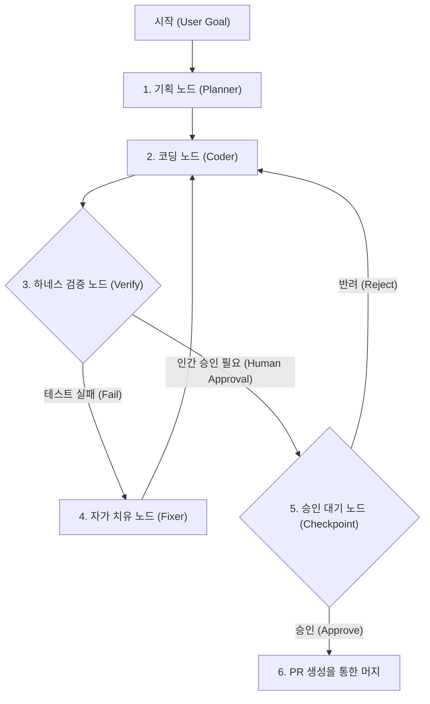
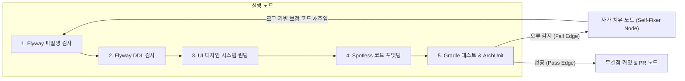
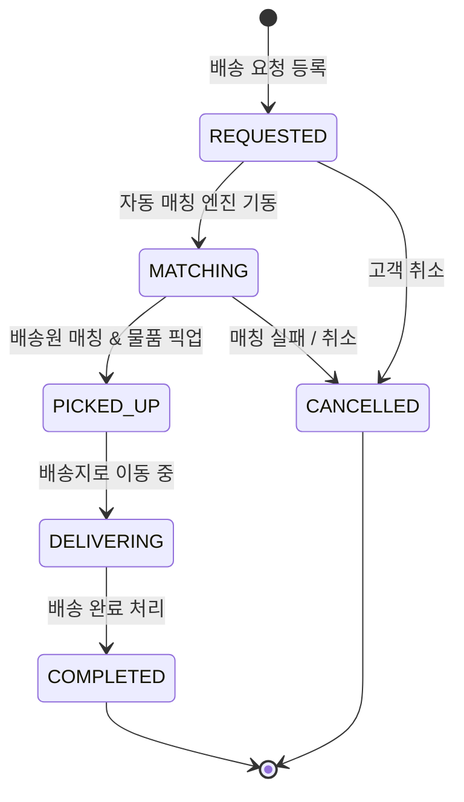

# 🕸️ 그래프 엔지니어링 & 에이전트 오케스트레이션 아키텍처 가이드 (Graph Engineering Guide)

> **LangGraph, GraphRAG 및 지식 그래프(Knowledge Graph) 기반의 현대적 AI 에이전트 설계 및 도메인 그래프 아키텍처 가이드북**

---

## 📑 목차
- [1. 왜 그래프 엔지니어링인가? (Core WHY)](#1-왜-그래프-엔지니어링인가-core-why)
- [2. LangGraph: 상태 기반 에이전트 오케스트레이션](#2-langgraph-상태-기반-에이전트-오케스트레이션)
- [3. GraphRAG: 지식 그래프 기반의 검색 및 다단계 추론](#3-graphrag-지식-그래프-기반의-검색-및-다단계-추론)
- [4. AI 하네스 자동화에서의 그래프 엔지니어링 적용 사례](#4-ai-하네스-자동화에서의-그래프-엔지니어링-적용-사례)
- [5. Shinhan Delivery 배송 도메인 상태 머신 그래프 (Domain State Graph)](#5-shinhan-delivery-배송-도메인-상태-머신-그래프-domain-state-graph)
- [6. 실증 검증 명령어 & 참고 도서](#6-실증-검증-명령어--참고-도서)

---

## 1. 왜 그래프 엔지니어링인가? (Core WHY)

과거의 AI 시스템이 단순 단발성 질의응답(Prompt)이나 순차적인 사슬 구조(Sequential Chain: A ➔ B ➔ C)로 작동했다면, 현대의 **에이전틱 AI(Agentic AI)**는 스스로 목표를 수립하고 도구를 실행하며 오류를 복구합니다.

그러나 단순한 자유 루프(ReAct Loop) 방식은 에이전트가 환각(Hallucination)에 빠지거나 동일한 에러를 무한 반복하며 토큰과 리소스를 낭비하는 치명적 한계가 존재합니다.

**그래프 엔지니어링(Graph Engineering)**은 이러한 한계를 극복하기 위해 에이전트의 동작을 **노드(Node: 역할/도구), 엣지(Edge: 실행 조건 및 경로), 상태(Shared State: 공유 메모리)**로 이루어진 명시적 네트워크(DAG/Graph)로 오케스트레이션하여 시스템의 신뢰성과 안정성을 100% 보장하는 설계론입니다.

```
┌─────────────────────────────────────────────────────────────────────────────┐
│  1. 프롬프트 엔지니어링 ──▶ AI에게 정확한 지시문 작성                            │
│  2. RAG 엔지니어링    ──▶ 벡터 DB 기반 연관 텍스트 파편 검색 주입               │
│  3. 루프 엔지니어링    ──▶ 하네스 검증 ➔ 자가치유 ➔ 자산화 자율 피드백            │
│  4. 그래프 엔지니어링  ──▶ 노드/엣지 네트워크 기반 "에이전트 제어 & 오케스트레이션" │
└─────────────────────────────────────────────────────────────────────────────┘
```

---

## 2. LangGraph: 상태 기반 에이전트 오케스트레이션

### 💡 LangGraph의 핵심 아키텍처
**LangGraph**는 AI 에이전트를 **상태 머신(State Machine)** 형태의 그래프로 구축할 수 있도록 지원하는 프레임워크입니다.



### 🧱 LangGraph 4대 핵심 구성 요소

| 요소 | 기술적 정의 | 본 프로젝트에서의 활용 |
| :--- | :--- | :--- |
| **1. Node (노드)** | 특정 미션을 수행하는 독립적 함수 또는 에이전트 | `코드 작성자`, `하네스 검증기(verify.sh)`, `자가 치유기`, `문서 동기화기` |
| **2. Edge (엣지)** | 노드 간의 상태 기반 이동 경로 (조건부 회귀 및 분기) | "하네스 통과 시 ➔ 셀프 리뷰 노드로 이동", "실패 시 ➔ 자가 치유 노드로 빽" |
| **3. Shared State (상태)** | 노드 간 오가며 업데이트되는 데이터 구조체 | 수정 파일 목록, 스택 트레이스 로그, 검증 Pass/Fail 상태 |
| **4. Checkpointer (체크포인터)** | 그래프 실행 상태의 영속 저장 및 롤백/재개 지점 | 에러 발생 시 이전 안정적 시점으로 상태 복원 및 사용자 승인 대기 |

---

## 3. GraphRAG: 지식 그래프 기반의 검색 및 다단계 추론

### 💡 Vector RAG vs GraphRAG 차이점

기존의 **Vector RAG**는 단어의 세분화된 벡터 유사도(Cosine Similarity)만을 비교하여 파편화된 텍스트 조각(Chunk)을 검색하지만, 문서 전반에 걸친 복잡한 연관 관계를 추론하는 데 한계가 있습니다.

**GraphRAG(Knowledge Graph RAG)**는 비구조화된 텍스트 문서로부터 **엔티티(Entity: 노드)와 관계(Relationship: 엣지)**를 커뮤니티 단위로 자동 추출하여 지식 그래프를 구성함으로써 **다단계 추론(Multi-hop Reasoning)**과 전역적 맥락(Global Context) 파악을 가능하게 합니다.

| 구 분 | 기존 Vector RAG | Microsoft GraphRAG |
| :--- | :--- | :--- |
| **검색 메커니즘** | 단어 벡터 임베딩 유사도 검색 | 엔티티(노드) - 관계(엣지) 지식 네트워크 트래버스 |
| **강점 영역** | 단일 문장, 특정 FAQ, 단순 사실 검색 | 시스템 전체 구조 분석, 관계성 추론, 다단계 의존성 분석 |
| **적용 예시** | "API 키 설정 방법은?" | "A 서비스 수정 시 B, C 모듈 및 DB 스키마에 미치는 파급 효과는?" |

---

## 4. AI 하네스 자동화에서의 그래프 엔지니어링 적용 사례

`shinhan-delivery` 프로젝트의 품질 검증 하네스(`./scripts/verify.sh`)는 그래프 엔지니어링의 **조건부 회귀(Cyclic Edge) 및 자가 치유(Self-Healing)** 원리를 구현한 대표적 사례입니다.



---

## 5. Shinhan Delivery 배송 도메인 상태 머신 그래프 (Domain State Graph)

온디맨드 배송 서비스의 배송 주문(`DeliveryRequest`) 생애주기는 비즈니스 도메인 관점의 **상태 전이 그래프(State Transition Graph)**로 설계되어 불법적인 상태 변경을 완벽히 차단합니다.



- **그래프 검증 규칙:**
  - `REQUESTED` 상태가 아닌 주문은 `PICKED_UP`으로 직접 전이될 수 없습니다.
  - `COMPLETED` 완료 상태에 도달한 그래프 노드는 `CANCELLED`로 회귀될 수 없으며 멱등성이 보장됩니다.

---

## 6. 실증 검증 명령어 & 참고 도서

### 🛡️ 통합 그래프 하네스 검증 실행
```bash
# 로컬 CI 5단계 통합 하네스 실행 (Flyway + Design System + Spotless + ArchUnit + Test)
./scripts/verify.sh
```

### 📚 참고 자료
- Microsoft Research: *GraphRAG: Unlocking LLM discovery on narrative networks (2024)*
- LangChain: *LangGraph - Building Language Agents as Graphs (2024)*
