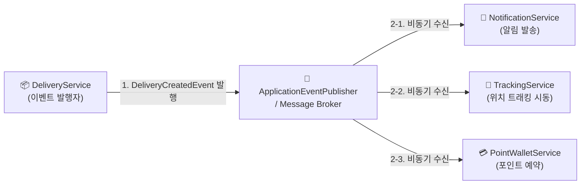

---
metadata:
  version: "1.0.0"
  ssot_owner: "docs/methodologies/event-driven.md"
  last_updated: "2026-07-31"
  status: "APPROVED"
---

# 📡 EDA (Event-Driven Architecture, 이벤트 주도 아키텍처) 학습 가이드

이 문서는 `shinhan-delivery` 프로젝트에서 **서비스 간 강한 결합을 해소하고 비동기 이벤트 발행/구독 모델을 통해 시스템 확장성을 확보하는 이벤트 주도 아키텍처(EDA)**의 가이드북입니다.

---

## 📌 1. 이벤트 주도 아키텍처란 무엇인가? (WHY)

전통적인 동기식(HTTP/REST) 호출은 한 작업이 완료될 때까지 다음 작업이 대기해야 하며, 결제/알림/트래킹 시스템 간 강한 결합이 발생합니다.

EDA는 **"어떤 일이 일어났다(Event)"는 사실을 메시지로 발행(Publish)하고, 관심 있는 여러 서비스가 이를 비동기로 수신(Subscribe)하여 처리**하는 파이프라인 구조입니다.



---

## 📐 2. EDA 핵심 구성 요소 & 최종 일관성 (Core Concepts)

### ① 📨 Event (이벤트 객체)
- 과거에 일어난 불변의 사건 (`DeliveryMatchedEvent`, `PaymentCompletedEvent`).
- 자바에서는 불변 Record 또는 `@Value` 객체로 작성합니다.

### ② 📢 Publisher & Listener (발행자와 수신기)
- **Publisher:** 비즈니스 로직 성공 후 이벤트를 브로드캐스트.
- **Listener:** `@EventListener` 또는 `@TransactionalEventListener`로 이벤트를 수신하여 부가 작업 수행.

### 🔄 최종 일관성 (Eventual Consistency)
- 데이터베이스의 강한 트랜잭션(ACID) 일관성 대신, 비동기 이벤트 처리를 통해 **시간이 지나면 결과적으로 시스템 상태가 일치**하도록 보장하는 개념.

---

## 💻 3. 우리 프로젝트 실전 적용 코드 예시

```java
// 1. 이벤트 불변 객체
public record DeliveryMatchedEvent(
    Long deliveryId,
    Long courierId,
    Long customerId,
    LocalDateTime matchedAt
) {}

// 2. 이벤트 발행 (Service)
@Service
@RequiredArgsConstructor
public class DeliveryService {
    private final ApplicationEventPublisher eventPublisher;

    @Transactional
    public void matchCourier(Long deliveryId, Long courierId) {
        // 비즈니스 로직 수행...
        
        // 이벤트 발행
        eventPublisher.publishEvent(new DeliveryMatchedEvent(deliveryId, courierId, 1L, LocalDateTime.now()));
    }
}

// 3. 이벤트 수신 (Notification Service)
@Component
@RequiredArgsConstructor
public class NotificationEventListener {
    private final NotificationService notificationService;

    @TransactionalEventListener(phase = TransactionPhase.AFTER_COMMIT)
    public void handleDeliveryMatched(DeliveryMatchedEvent event) {
        // 트랜잭션이 성공적으로 커밋된 후 알림 전송
        notificationService.sendNotification(event.customerId(), "기사님이 매칭되었습니다!");
    }
}
```

---

## 🧪 4. 검증 및 테스트 (Verification)

Spring의 `@RecordApplicationEvents` 및 `@MockitoBean`을 사용하여 이벤트 발행 여부를 테스트합니다:

```bash
./gradlew test --tests "com.example.shinhandelivery.test.service.DeliveryServiceTest"
```
