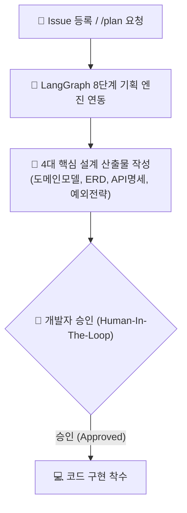

---
metadata:
  version: "1.0.0"
  ssot_owner: "docs/methodologies/spec-driven-development.md"
  last_updated: "2026-07-31"
  status: "APPROVED"
---

# 📝 Spec / Plan-Driven Development (명세/기획 주도 개발) 학습 가이드

이 문서는 `shinhan-delivery` 프로젝트에서 **실제 코딩에 착수하기 전 4대 설계 산출물을 수립하고 승인(Checkpoint) 절차를 거치는 명세/기획 주도 개발** 방법론의 가이드북입니다.

---

## 📌 1. 명세/기획 주도 개발이란 무엇인가? (WHY)

설계 없이 막연하게 코딩부터 시작하면 레이어 간 인터페이스가 꼬이거나 예외 처리 전략이 누락되어 대대적인 재작업(Rework) 비용이 발생합니다.

명세 주도 개발은 **기능 개발 전 도메인 모델, ERD, REST API 명세, 예외 전략 4대 산출물을 명확히 정의(SpecFirst)한 후 코드 작성에 착수**하는 기법입니다.

---

## 📐 2. 4대 핵심 설계 산출물 양식 (Core Design Artifacts)

1. **도메인 모델 명세:** Entity/VO 식별자, 핵심 비즈니스 메서드 시그니처.
2. **ERD & DB 스키마:** 테이블 구조 및 Foreign Key, Index 전략.
3. **REST API 명세:** URI, HTTP 메서드, Request/Response DTO JSON 스키마.
4. **전역 예외 전략:** 처리할 예외 Class, ErrorCode 매핑, HTTP Status Code.

---

## 💻 3. 우리 프로젝트 실천 도구 연동

- **기능 개발 전 설계 단계 프로세스 가이드:** [docs/design-phase-guide.md](../design-phase-guide.md)
- **LangGraph 이슈 기획 자동화 지침 (`/plan <이슈번호>`):** [docs/langgraph-planning-workflow-guide.md](../langgraph-planning-workflow-guide.md)
