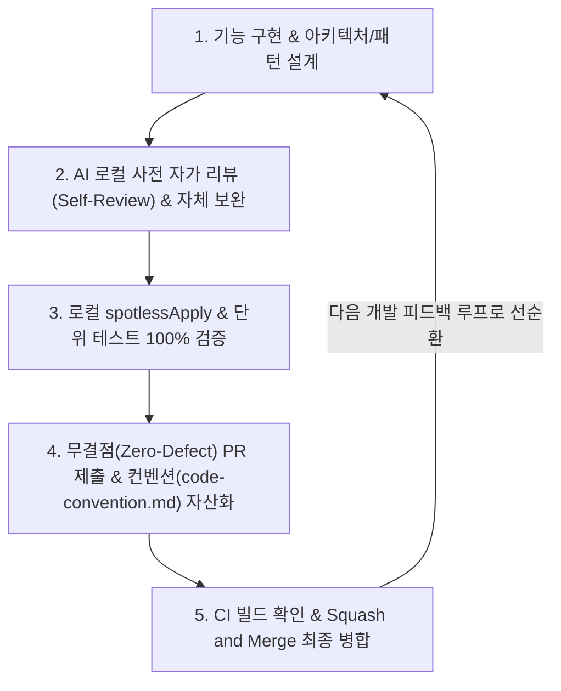

# 🌱 초보 개발자를 위한 온보딩 및 기능 개발 로드맵 (Onboarding Roadmap)

신한 배달(Shinhan Delivery) 프로젝트에 오신 것을 진심으로 환영합니다! 🎉
개발을 처음 시작할 때 전체 프로젝트의 규모와 다양한 협업 도구들은 복잡하고 낯설게 느껴질 수 있습니다. 

이 문서는 여러분이 **"무엇을 어떤 순서로 학습하고"**, **"실제 기능을 개발할 때 어떤 단계별 순서로 손을 움직여야 하는지"**를 친절하게 안내하기 위해 작성되었습니다. 차근차근 아래 가이드라인을 따라가며 멋진 배달원/개발자로 성장해 보세요!

---

## 🧭 파트 1: 첫 3일간의 온보딩 학습 코스 (What to Learn)

가장 먼저 프로젝트의 구조와 도구들을 로컬 컴퓨터에 세팅하고 개념을 익히는 단계입니다.

### 1일차: 내 컴퓨터에 개발 환경 구축하기
1. 프로젝트 홈의 [**README.md**](../README.md) 파일을 가볍게 읽어 프로젝트가 무엇을 만드는 서비스인지 파악합니다.
2. [**로컬 개발 환경 및 자동화 도구 사용 가이드 (docs/developer-env-guide.md)**](./developer-env-guide.md)의 **3번(로컬 테스트용 더미 데이터 자동 적재)**을 참고하여, 프로젝트 루트에 `.env` 파일을 만들고 아래 코드를 입력해 저장합니다:
   ```env
   DB_URL=jdbc:mariadb://localhost:3306/shinhan_delivery
   DB_USER=root
   DB_PASSWORD=본인의_MariaDB_비밀번호
   DATA_SEED_ENABLED=true
   ```
3. 터미널에서 아래 명령을 실행해 프로젝트를 띄웁니다.
   ```bash
   ./gradlew bootRun
   ```
4. 실행 중 문제가 생긴다면 주저하지 말고 [**로컬 개발 트러블슈팅 가이드 (docs/troubleshooting.md)**](./troubleshooting.md)를 열어 해결책을 따라 해 보세요.
5. 브라우저로 [http://localhost:8080/swagger-ui/index.html](http://localhost:8080/swagger-ui/index.html)에 접속하여 화면에 펼쳐진 API 명세를 둘러봅니다. (자동으로 데이터가 적재되어 있으므로 수동 테스트도 해볼 수 있습니다.)

### 2일차: 협업 도구 및 깃 커밋 연동하기
1. 터미널에서 다음 명령어를 실행해 Git 커밋 템플릿 설정을 완료합니다.
   ```bash
   git config --local commit.template .gitmessage
   ```
   앞으로 `git commit`을 작성할 때 템플릿 창이 켜져 규칙을 자연스럽게 알게 됩니다.
2. 로컬 코드 스타일의 자동 검증을 강제하기 위해 pre-commit hook인 **Lefthook**을 설치 및 등록합니다:
   * 본인의 OS 개발 도구에 따라 `brew install lefthook` 또는 `npm install -g @evilmartians/lefthook` 등으로 설치합니다.
   * 설치 후 프로젝트 루트 경로 터미널에서 아래 명령을 1회 실행하여 활성화합니다:
     ```bash
     lefthook install
     ```
3. [**Git Flow 및 커밋 컨벤션 가이드 (docs/git-flow-guide.md)**](./git-flow-guide.md)를 정독하여, 브랜치를 왜 나누어 쓰는지와 왜 **`Squash and Merge`** 방식으로만 PR을 병합하는지 그 흐름을 이해합니다.
4. [**Flyway 데이터베이스 마이그레이션 가이드 (docs/flyway-guide.md)**](./flyway-guide.md)를 읽고, 데이터베이스 테이블 변경을 자바 코드가 아닌 SQL 스크립트 기반으로 추적하는 규칙을 배웁니다.

### 3일차: 기능 설계 과정 이해하기
1. [**기능 개발 전 설계 단계 프로세스 가이드 (docs/design-phase-guide.md)**](./design-phase-guide.md)를 정독하여, 코딩을 바로 시작하지 않고 '설계 PR'을 먼저 올리는 프로세스를 익힙니다.
2. [**docs/design/**](./design/) 폴더 아래의 기존 도메인 설계 문서들(예: 회원, 차량, 배송 등)을 1~2개 열어보며 선배들이 어떻게 기능을 설계했는지 레퍼런스를 파악합니다.

---

## 🛠️ 파트 2: 실전 기능 개발 7단계 흐름 (How to Develop)

온보딩 학습을 마친 후, 실제로 배정받은 기능을 코딩하여 프로젝트에 기여할 때의 하루 업무 흐름입니다.

### 1단계: 분석 및 설계 브랜치 생성
* 작업할 기능의 요구사항을 쪼개어 이해합니다.
* 로컬의 `main` 브랜치를 최신으로 가져온 뒤, `design/기능이름` 브랜치를 새로 만듭니다.
  ```bash
  git checkout main && git pull origin main
  git checkout -b design/my-feature-name
  ```

### 2단계: 설계 PR 제출 (1차 PR)
* `docs/design-phase-guide.md` 양식에 맞추어 `docs/design/기능이름-design.md` 파일을 작성합니다. (사용자 스토리, ERD, API 명세, 작업 분할 체크리스트 기재)
* 작성한 설계 파일을 커밋하고 원격에 푸시한 뒤 GitHub에서 PR을 작성합니다.
* 팀원들과 리뷰를 진행하며 피드백에 따라 설계를 수정한 후, 승인이 나면 `Squash and Merge`로 병합(Merge)합니다.

### 3단계: 구현 브랜치 생성
* 이제 본격적으로 코딩할 차례입니다! 병합된 설계 문서가 있는 최신 `main` 브랜치에서 `feat/기능이름` 브랜치를 만듭니다.
  ```bash
  git checkout main && git pull origin main
  git checkout -b feat/my-feature-name
  ```

### 4단계: 비즈니스 로직 및 테스트 코드 작성
* 데이터베이스 테이블 수정이 필요하다면 `src/main/resources/db/migration/` 아래에 순서에 맞게 Flyway SQL 스크립트를 작성합니다.
* Java 엔티티, 리포지토리, 서비스, 컨트롤러 코드를 차례로 작성합니다.
* API 명세 자동화를 위해 컨트롤러와 DTO 단에 **Swagger 어노테이션**(`@Tag`, `@Operation`, `@Schema`)을 성실히 기입합니다.
* 로직 검증을 위한 JUnit 테스트 코드를 반드시 작성합니다.

### 5단계: 로컬 포맷 정돈 및 자가 테스트
* 코드가 완성되면 터미널에 아래 명령을 날려 코드 스타일을 구글 정형 양식으로 정돈합니다.
  ```bash
  ./gradlew spotlessApply
  ```
* 서버를 구동(`bootRun`)하여 Swagger UI에서 우리가 구성해 둔 더미 데이터를 활용해 직접 테스트를 진행해 봅니다.

### 6단계: AI 로컬 자가 리뷰(Self-Review) 및 무결점 PR 제출

PR을 원격 저장소에 제출하기 전, 로컬 개발 환경에서 **AI 자가 코드 리뷰 및 검증 피드백 루프**를 거쳐 결함이 0개인 가장 완벽한 상태의 코드만 푸시합니다.

1. **로컬 AI 자가 코드 리뷰 (Self-Review):** 기능 구현 완료 후 커밋 전, AI 어시스턴트(Antigravity)가 `git diff` 및 작성 코드를 사전 다각도 검토(컨벤션, 예외 구조, 엣지케이스, DTO 변환)합니다.
2. **개선사항 로컬 즉시 반영:** 리뷰 지적사항이나 보완점이 발견되면 PR 생성 전 로컬에서 즉시 자체 수정을 거쳐 완성도를 최고 수준으로 끌어올립니다.
3. **로컬 빌드, 커버리지 & 포맷팅 100% 검증:** `./gradlew spotlessApply && ./gradlew test jacocoTestReport jacocoTestCoverageVerification`을 실행하여 (1) 전체 테스트 100% 통과, (2) 서비스 계층 커버리지 최소 60% 이상 충족(JaCoCo Quality Gate), (3) ArchUnit 계층 구조 규칙 준수 여부를 종합 검증 후 커밋/푸시합니다.
4. **무결점(Zero-Defect) PR 생성:** 미완성 커밋이나 오타 수정 커밋을 원격에 올리지 않고, 가장 정돈되고 완전무결한 커밋만을 제출합니다.

### 7단계: 지속적 피드백 루프 & 컨벤션 자산화 (Continuous Feedback Loop)

코드 리뷰와 빌드 검증은 단순한 지적질이 아니라 **팀 전체의 기술 자산과 규격을 승화시키는 지속적 피드백 루프(Continuous Feedback Loop)**입니다.



* **피드백 수집 및 반영:** PR을 올리면 **Gemini AI 코드 리뷰어**가 원격에서 최종 검증 차원의 2차 피드백 코멘트를 남깁니다.
* **추가 리뷰 요청 방법 (중요):** 수정한 코드에 대해 재검사를 받고 싶다면, **해당 PR 댓글 창에 `/review`라고 입력하여 전송**해 주세요. Actions가 댓글을 감지해 실시간으로 다시 코드 리뷰 피드백을 작성해 줍니다.
* **컨벤션 자산화 (Feedback Loop의 핵심):** 리뷰 과정에서 새롭게 도입된 코드 패턴, 에러 구조, 아키텍처 규칙이 있다면 이를 단회성 작업으로 끝내지 않고 **`code-convention.md`와 `docs/` 가이드 문서에 즉시 동기화하여 지식 자산으로 영구 적재**합니다.
* **최종 병합:** AI와 팀원 피드백을 수용하여 컨벤션 문서 갱신과 코드 수정을 마친 뒤 최종 승인(Approve)을 받아 **`Squash and Merge`** 버튼으로 작업을 병합합니다!

---

> 💡 **명심해 주세요:**  
> 처음이라 빌드가 실패하거나 깃 명령어가 꼬이는 것은 지극히 정상적인 성장 과정입니다. 막히는 부분이 생기면 언제든 `docs/troubleshooting.md`를 찾아보거나 주저하지 말고 동료 교육생 및 멘토에게 질문하세요! 여러분의 도전을 응원합니다!
