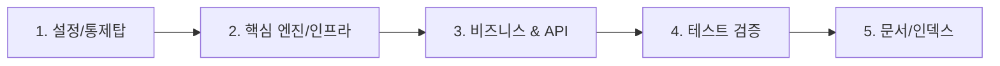

## 📌 관련 이슈
* Closes #이슈번호

---

## 🛠️ 작업 개요
[이 PR에서 수행한 작업의 핵심 내용을 1~2줄로 요약 기술합니다.]

---

## 🗺️ [Reviewer 3-Minute Walkthrough] PR 리뷰어 3분 족보 가이드

### 1. ⏱️ 1분 퀵 서머리 (Executive Summary)
* **이 PR이 해결하는 문제 (WHY):** [해당 PR의 도입 배경 1~2줄 요약]
* **변경 영향 범위 (Impact Scope):** [수정된 도메인 및 사이드 이펙트 여부]
* **하네스 검증 상태:** 🟢 `./scripts/verify.sh` 전수 패스 (테스트 PASS, JaCoCo 커버리지 60%+ & ArchUnit 검증 통과)

---

### 2. 🗺️ 추천 파일 읽기 순서 (Recommended Reading Order)
리뷰어분들의 소중한 시간을 아끼기 위해 아래 **1 ➔ 2 ➔ 3 ➔ 4 ➔ 5 단계 순서**로 파일 변경사항을 확인하시는 것을 권장합니다:

---

### 3. 🎯 파일별 1줄 핵심 체크포인트 (Key Highlights)

#### 📌 1단계: 설정 & 통제탑 (Config)
* `XxxConfig.java`: [설정 핵심 요약]

#### 📌 2단계: 핵심 엔진/인프라 (Core)
* `XxxProvider.java`: [인프라 모듈 핵심 요약]

#### 📌 3단계: 비즈니스 연동 & DTO (Service & Controller)
* `XxxService.java`: [비즈니스 로직 핵심 요약]
* `XxxController.java`: [API 엔드포인트 핵심 요약]

#### 📌 4단계: 동작 증명 테스트 (Tests)
* `XxxTest.java`: [단위/통합 테스트 검증 내용]

#### 📌 5단계: 지식 자산화 (Docs)
* `docs/xxx-guide.md`: [가이드북 신설 내역]

---

### 4. 🛡️ 리뷰어 전용 1초 체크리스트 (Reviewer Verification Checklist)
- [ ] 비즈니스 예외가 `GlobalExceptionHandler`에 매핑되어 처리되는가?
- [ ] Controller에서 Entity를 직접 반환하지 않고 DTO로 변환하는가?
- [ ] 새로 추가된 모든 클래스에 수동 getter/setter 없이 Lombok `@Getter`/`@Setter`가 100% 적용되었는가?
- [ ] 신규/수정 문서가 SSOT(단일 원본 관리 원칙)를 준수하여 중복 없이 원본 마크다운 링크로 참조되었는가?
- [ ] 신규 화면이나 기능 추가 시 `docs/전체-유저-플로우-가이드.md`에 E2E 유저 플로우 및 화면 매핑을 필수 업데이트하였는가?
- [ ] 기존 API 하위 호환성 및 기존 테스트가 깨지지 않고 유지되는가?
