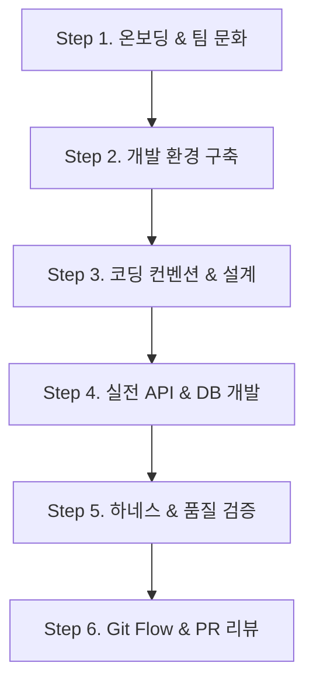

# 🚀 신한 개척자 (shinhan-gaecheokja)

> **Spring Boot & Thymeleaf/HTML5/Vanilla JS 기반의 스마트 퀵배송 & 온디맨드 매칭 플랫폼**  
> 초급 개발자부터 AI 에이전트까지 세계 최고 수준(Google, Apple, Meta 급)의 무결점 개발 규격을 준수하며 함께 성장하는 프로젝트입니다.

---

## 📑 목차 (Table of Contents)
- [🛠️ 프로젝트 기술 스택 (Tech Stack)](#-프로젝트-기술-스택-tech-stack)
- [🚀 빠른 시작 (Quick Start)](#-빠른-시작-quick-start)
- [🎓 초급 개발자 단계별 학습 로드맵 (Step-by-Step Learning Roadmap)](#-초급-개발자-단계별-학습-로드맵-step-by-step-learning-roadmap)
  - [Step 1. 온보딩 & 팀 개발 문화 체득](#step-1-온보딩--팀-개발-문화-체득-onboarding)
  - [Step 2. 로컬 개발 환경 & 도구 구축](#step-2-로컬-개발-환경--도구-구축-environment)
  - [Step 3. 단일 원본(SSOT) 코딩 규약 & 설계 원칙](#step-3-단일-원본ssot-코딩-규약--설계-원칙-principles)
  - [Step 4. 비즈니스 로직 & 백엔드 실전 개발](#step-4-비즈니스-로직--백엔드-실전-개발-development)
  - [Step 5. 품질 검증 하네스 & 자가 치유 피드백](#step-5-품질-검증-하네스--자가-치유-피드백-testing)
  - [Step 6. Git Flow 브랜치 전략 & PR 협업](#step-6-git-flow-브랜치-전략--pr-협업-workflow)
- [📚 주제별 전체 문서 보물창고 (Documentation Index)](#-주제별-전체-문서-보물창고-documentation-index)
  - [🏛️ 개발 거버넌스 & AI 행동 수칙](#️-개발-거버넌스--ai-행동-수칙)
  - [📜 아키텍처 의사결정 기록 (ADR)](#-아키텍처-의사결정-기록-adr)
  - [📦 도메인별 기능 명세 & 설계서](#-도메인별-기능-명세--설계서)
  - [📋 양식 & 트러블슈팅 템플릿](#-양식--트러블슈팅-템플릿)

---

## 🛠️ 프로젝트 기술 스택 (Tech Stack)

| 구분 | 기술 스택 | 주요 역할 및 설명 |
| :--- | :--- | :--- |
| **Backend Core** | Java 17, Spring Boot 3.x | 백엔드 핵심 코어 프레임워크 및 런타임 |
| **Security & Auth** | Spring Security, Stateless JWT | JWT 기반 무상태 인증/인가 및 역할 분기 (`CUSTOMER`/`COURIER`/`ADMIN`) |
| **Database & Migration** | MariaDB, Flyway | 관계형 데이터베이스 및 무중단 Online DDL 마이그레이션 관리 |
| **Frontend & Template** | HTML5, Vanilla CSS, Vanilla JS, Thymeleaf | 반응형 UI 구성 및 서버 사이드 템플릿 엔진 |
| **Realtime Messaging** | WebSocket (STOMP) | 배송 위치 실시간 브로드캐스트 및 상태 트래킹 |
| **Testing & Quality Gate** | JUnit 5, Mockito, ArchUnit, JaCoCo | 단위/통합 테스트, 아키텍처 규칙 검증 및 커버리지 게이트 (60%+) |
| **DevOps & Code Style** | Spotless, Gradle, GitHub Actions | 코드 포맷팅 자동화, 빌드 도구 및 CI/CD 자동화 파이프라인 |

---

## 🚀 빠른 시작 (Quick Start)

### 1. 로컬 환경 설정 (.env)
로컬 데이터베이스 연결 설정을 위해 프로젝트 루트 디렉토리에 `.env` 파일을 생성하고 아래 내용을 입력합니다.  
*(주의: `.env` 파일은 절대 Git에 커밋되지 않도록 보안 제외 처리되어 있습니다.)*

```env
# 로컬 MariaDB 설정
DB_URL=jdbc:mariadb://localhost:3306/shinhan_gaecheokja
DB_USER=root
DB_PASSWORD=your_password_here

# 로컬 테스트용 더미 데이터(회원, 지갑, 차량 등) 자동 적재 여부 (true/false)
DATA_SEED_ENABLED=true
```

### 2. 애플리케이션 실행
아래 명령어를 사용하여 애플리케이션을 기동합니다.
```bash
./gradlew bootRun
```
💡 *실행 중 에러가 발생하거나 DB 연결 실패 시 [**로컬 개발 트러블슈팅 가이드 (docs/troubleshooting.md)**](./docs/troubleshooting.md)를 참고해 주세요.*

### 3. 로컬 CI 검증 및 원클릭 PR 제출 하네스 (./pr)
개발 완료 또는 소스 수정 후 터미널에 아래 명령어를 실행하면 **Flyway 린트, Spotless 포맷팅, ArchUnit 아키텍처 검증, JaCoCo 커버리지 게이트(60%+), 전체 90+개 테스트**를 검증하고 커밋/PR까지 일괄 처리합니다.
```bash
./pr
# 또는 로컬 검증만 실행할 경우: ./scripts/verify.sh
```
💡 *JaCoCo 테스트 커버리지 시각화 HTML 리포트는 `./gradlew jacocoTestReport` 실행 후 `build/reports/jacoco/test/html/index.html`에서 확인하실 수 있습니다.*

### 4. Git 커밋 템플릿 설정 (.gitmessage)
협업 규칙에 따른 일관된 커밋 작성을 위해 아래 명령어로 로컬 커밋 템플릿을 등록해 주세요. 등록 후 `git commit` 실행 시 버퍼 창에 템플릿 힌트가 자동으로 채워집니다.
```bash
git config --local commit.template .gitmessage
```
👉 [**로컬 개발 환경 및 자동화 도구 사용 가이드 바로가기 (docs/developer-env-guide.md)**](./docs/developer-env-guide.md)

---

## 🎓 초급 개발자 단계별 학습 로드맵 (Step-by-Step Learning Roadmap)

신규 개발자 및 입문자가 막연함 없이 **Step 1부터 Step 6까지 차근차근 배워나갈 수 있도록** 구성된 순차 가이드입니다.



---

### Step 1. 온보딩 & 팀 개발 문화 체득 (Onboarding)
프로젝트에 첫발을 내딛는 개발자가 신속하게 합류하고, 심리적 안전지대 속에서 팀 문화를 이해하는 단계입니다.

* [**초보 개발자 온보딩 및 기능 개발 로드맵 (docs/onboarding-roadmap.md)**](./docs/onboarding-roadmap.md) - 입문자를 위한 필수 학습 순서 및 실전 기능 개발 7단계 흐름 가이드 🚀
* [**팀 개발 문화 & 일하는 방식 7대 철학 가이드 (docs/engineering-culture-and-working-style.md)**](./docs/engineering-culture-and-working-style.md) - 비난 없는 심리적 안전, 15분 질문 룰, 공감 코드 리뷰 7대 문화 🕊️
* [**팀 리더십 & 프로젝트 운용 프레임워크 가이드 (docs/team-operating-model-guide.md)**](./docs/team-operating-model-guide.md) - 리더와 팀원이 협업할 때 준수할 5대 운용 기둥 및 문화 프레임워크 👑
* [**협업 문화 및 자동화 도구 도입 배경 가이드 (docs/development-culture-guide.md)**](./docs/development-culture-guide.md) - 왜 이런 협업 규칙과 DevOps 도구들을 도입했는지 설명해 주는 입문자 필독서 🎓

---

### Step 2. 로컬 개발 환경 & 도구 구축 (Environment)
내 컴퓨터에 실행 환경을 구축하고, 문제가 발생했을 때 스스로 해결하는 능력을 기르는 단계입니다.

* [**로컬 개발 환경 및 자동화 도구 사용 가이드 (docs/developer-env-guide.md)**](./docs/developer-env-guide.md) - Spotless 포맷 자동 가공 명령어, Swagger UI, 로컬 더미 데이터 설정 🛠️
* [**로컬 개발 트러블슈팅 가이드 (docs/troubleshooting.md)**](./docs/troubleshooting.md) - Flyway 해시 충돌, 포트 선점, 데이터베이스 권한 에러 해결 가이드 💡

---

### Step 3. 단일 원본(SSOT) 코딩 규약 & 설계 원칙 (Principles)
세계 최고 수준의 무결점 코드를 작성하기 위해 표준 아키텍처 규칙과 API 설계 방식을 익히는 단계입니다.

* [**코딩 컨벤션 및 6대 개발 규칙 (code-convention.md)**](./code-convention.md) - 우리 프로젝트에서 개발자와 AI가 엄격히 준수해야 할 단일 원본 코딩 규약 📐
* [**AI 에이전트 행동 지침 및 8대 수칙 (AGENTS.md)**](./AGENTS.md) - Google, Apple, Meta 수준의 결과물을 도출하기 위한 8대 무결점 작업 원칙 🏛️
* [**RESTful API 설계 및 규격 가이드 (docs/rest-api-guide.md)**](./docs/rest-api-guide.md) - REST API 개념, 자원/행위 매핑 규칙, 초보자 안티패턴 및 HTTP 상태 코드 표준 응답 규칙 🌐
* [**기능 개발 전 설계 단계 프로세스 가이드 (docs/design-phase-guide.md)**](./docs/design-phase-guide.md) - 기능 개발에 착수하기 전 작성해야 할 4대 핵심 산출물 양식과 2단계 PR 전략 📝
* [**단일 원본 관리(SSOT) 문서 정책 가이드 (docs/ssot-documentation-policy.md)**](./docs/ssot-documentation-policy.md) - 정보 중복을 방지하고 지식의 파편화를 차단하는 프로젝트 단일 원본 문서 관리 규격 🏛️

---

### Step 4. 비즈니스 로직 & 백엔드 실전 개발 (Development)
이슈 할당부터 Controller - Service - Repository 레이어드 아키텍처로 안전한 비즈니스 로직을 개발하는 단계입니다.

* [**초급 개발자를 위한 7단계 초상세 태스크 분할 가이드 (docs/junior-developer-task-guide.md)**](./docs/junior-developer-task-guide.md) - 입문자가 막연함 없이 100% 무결점 코드를 완성하도록 인도하는 Step-by-Step 가이드북 🔰
* [**초급자 전용 CRUD & 레이어별 초상세 이슈 분할 가이드 (docs/beginner-crud-issue-template-guide.md)**](./docs/beginner-crud-issue-template-guide.md) - DTO, Entity, Service, Controller 단계별 디테일 가이드 템플릿 🔰
* [**전역 예외 처리 및 표준 에러 코드 가이드 (docs/exception-handling-guide.md)**](./docs/exception-handling-guide.md) - `@RestControllerAdvice` 작동 원리, ErrorCode Enum, ErrorResponse DTO 및 방어적 프로그래밍 수칙 🛡️
* [**Flyway 데이터베이스 마이그레이션 가이드 (docs/flyway-guide.md)**](./docs/flyway-guide.md) - Flyway 스크립트 작성 규칙, JPA Buddy 플러그인을 활용한 무중단 마이그레이션 방법 🗄️
* [**Deliver Happiness 전체 기능 명세서 & 개발 로드맵 (docs/project-spec-and-task-breakdown.md)**](./docs/project-spec-and-task-breakdown.md) - 10대 모듈, 30+ REST API 및 6대 스프린트 파트별 태스크 할당서 📦

---

### Step 5. 품질 검증 하네스 & 자가 치유 피드백 (Testing)
테스트 코드 작성과 자동 검증 하네스를 통해 결함 0개(Zero-Defect)를 사수하고 자가 치유 피드백을 받는 단계입니다.

* [**테스트 하네스 구축 및 검증 항목 판단 정책 가이드 (docs/harness-decision-framework.md)**](./docs/harness-decision-framework.md) - 하네스 검증 4대 판단 프레임워크 및 무결점 결함 0개를 위한 초엄격 6대 통제 정책 🛡️
* [**테스트 하네스 & LLM 피드백 루프 가이드 (docs/harness-and-llm-guide.md)**](./docs/harness-and-llm-guide.md) - 초보자와 AI 사용자를 위한 자동 검사 하네스 및 에러 자가 치유 활용법 🏗️
* [**AI 기반 초급자 페어 프로그래밍 & 차근차근 개발 가이드 (docs/ai-paired-development-guide.md)**](./docs/ai-paired-development-guide.md) - 초급자가 AI와 5단계 순차 워크플로우로 무결점 코드를 완성하는 가이드 🤖
* [**LLM 기반 현대 SW 엔지니어링 방법론 가이드 (docs/llm-software-engineering-guide.md)**](./docs/llm-software-engineering-guide.md) - 프롬프트/하네스/컨텍스트 엔지니어링, 루프 엔지니어링 등 AI 활용 개발 방법론 입문서 🤖

---

### Step 6. Git Flow 브랜치 전략 & PR 협업 (Workflow)
작업한 결과를 브랜치에 푸시하고 3분 족보 가이드를 부착하여 리뷰어와 효율적으로 소통하는 단계입니다.

* [**Git Flow, 이슈 수칙 및 커밋 컨벤션 가이드 (docs/git-flow-guide.md)**](./docs/git-flow-guide.md) - 브랜치 운용 규칙, Issue 템플릿 태그 수칙, Conventional Commits 헤더 가이드 🔀
* [**PR 리뷰어 3분 족보 가이드 작성 규격 (docs/pr-review-guide.md)**](./docs/pr-review-guide.md) - 리뷰어의 검토 피로도를 낮추고 3분 만에 핵심 코드를 파악하게 돕는 PR 가이드 작성 규격 🗺️
* [**학습 및 지식 공유형 GitHub Issue 분할 가이드 (docs/learning-oriented-issue-guide.md)**](./docs/learning-oriented-issue-guide.md) - 단순 개발을 넘어 팀 전체의 동반 성장을 이끄는 3단계 학습형 이슈 작성 규격 🎓
* [**CI/CD 파이프라인 및 GitHub Actions Step 해설 가이드 (docs/cicd-pipeline-guide.md)**](./docs/cicd-pipeline-guide.md) - 지속적 통합/배포 개념, JaCoCo Coverage Gate, Actions 동작 원리 및 Step별 해설 ⚙️

---

## 📚 주제별 전체 문서 보물창고 (Documentation Index)

### 🏛️ 개발 거버넌스 & AI 행동 수칙
* [**프로젝트 착수 전 6대 사전 리스크 감사 & 거버넌스 가이드 (docs/pre-launch-risk-and-governance-guide.md)**](./docs/pre-launch-risk-and-governance-guide.md) - 개발자/리더/PM 관점 6대 리스크 방어 수칙 🛡️
* [**공통 디자인 시스템 가이드 (docs/design-system.md)**](./docs/design-system.md) - UI 토큰, 공통 컴포넌트, Thymeleaf Fragment 및 스타일 가이드 🎨
* [**그래프 엔지니어링 & 에이전트 오케스트레이션 가이드 (docs/graph-engineering-architecture.md)**](./docs/graph-engineering-architecture.md) - LangGraph, GraphRAG 및 지식 그래프 아키텍처 가이드북 🕸️
* [**LangGraph 기반 에이전트 오케스트레이션 가이드 (docs/langgraph-implementation-guide.md)**](./docs/langgraph-implementation-guide.md) - LangGraph StateGraph 에이전트 흐름 제어 가이드 🤖
* [**LangGraph 이슈 기획 & 자동화 파이프라인 가이드 (docs/langgraph-planning-workflow-guide.md)**](./docs/langgraph-planning-workflow-guide.md) - /plan 워크플로우를 승화한 8단계 이슈 기획 엔진 📋
* [**GraphRAG 지식 그래프 검색 가이드 (docs/graphrag-implementation-guide.md)**](./docs/graphrag-implementation-guide.md) - 지식 데이터셋 및 다단계 추론 검색 엔진 🔍
* [**프로젝트 전체 지식 그래프 인덱스 (docs/project-knowledge-graph.md)**](./docs/project-knowledge-graph.md) - 문서, 백엔드 계층, DB 스키마 간 지식 네트워크 지도 🗺️
* [**AI 에이전트 행동 지침 및 8대 수칙 (AGENTS.md)**](./AGENTS.md) - 무결점 작업 원칙 🏛️
* [**코딩 컨벤션 및 6대 개발 규칙 (code-convention.md)**](./code-convention.md) - 프로젝트 표준 단일 원본 코딩 규약 📐

### 📜 아키텍처 의사결정 기록 (ADR)
* [**ADR-0001: JWT 기반 무상태 인증 체계 채택 (docs/adr/0001-stateless-jwt-authentication.md)**](./docs/adr/0001-stateless-jwt-authentication.md) - 세션 vs JWT 인증 비교 및 무상태 인증 채택 의사결정 기록 📜

### 📦 도메인별 기능 명세 & 설계서
* [**회원 및 인증 설계서 (docs/design/member-auth-design.md)**](./docs/design/member-auth-design.md) - 회원가입, 중복 가입 방지 예외, 암호화 저장, 상세 조회 API 명세 및 ERD 👤
* [**차량 등록 및 조회 설계서 (docs/design/vehicle-design.md)**](./docs/design/vehicle-design.md) - 차량 사양 유효 검증, 소유주 정보 매핑, 가용성 조회 API 명세 및 ERD 🛵
* [**배송 요청 및 단건 조회 설계서 (docs/design/delivery-request-design.md)**](./docs/design/delivery-request-design.md) - 출발/목적지, 화물 무게 및 배송 상태 API 명세 및 ERD 📦
* [**배송 매칭 설계서 (docs/design/matching-design.md)**](./docs/design/matching-design.md) - 수동 배송 매칭, 상태 수정/삭제에 따른 실시간 리소스 데이터 동기화 API 명세 및 ERD 🤝
* [**포인트 지갑 및 결제 설계서 (docs/design/point-wallet-design.md)**](./docs/design/point-wallet-design.md) - 지갑 개설, 충전, 차감 검증 및 잔액 에러 처리 API 명세 및 ERD 💳
* [**실시간 위치 추적 설계서 (docs/design/tracking-design.md)**](./docs/design/tracking-design.md) - WebSocket(STOMP) 기반 실시간 위치 브로드캐스트 및 메시지 명세 📍
* [**물품 카테고리 목록 조회 설계서 (docs/design/category-design.md)**](./docs/design/category-design.md) - 물품 카테고리 12종 마이그레이션 시딩 및 목록 조회 API 명세 🏷️
* [**이미지 업로드 설계서 (docs/design/image-upload-design.md)**](./docs/design/image-upload-design.md) - Multipart 이미지 업로드, 확장자·크기 검증 및 정적 리소스 서빙 API 명세 🖼️
* [**알림 목록 조회/읽음 처리 설계서 (docs/design/notification-design.md)**](./docs/design/notification-design.md) - 로그인 사용자 기준 알림 페이징 조회, 카테고리 필터링 및 읽음 처리 API 명세 🔔
* [**배송 도메인 상태 전이 그래프 명세서 (docs/design/delivery-state-graph.md)**](./docs/design/delivery-state-graph.md) - 배송 주문 생애주기 상태 전이 그래프, 멱등성 및 동시성 락 규칙 명세 🕸️

### 📋 양식 & 트러블슈팅 템플릿
* [**기능 개발 이슈 템플릿 (.github/ISSUE_TEMPLATE/feature_request.md)**](./.github/ISSUE_TEMPLATE/feature_request.md) - 신규 기능 등록 양식 🚀
* [**버그 조치 이슈 템플릿 (.github/ISSUE_TEMPLATE/bug_report.md)**](./.github/ISSUE_TEMPLATE/bug_report.md) - 버그 보고 및 조치 양식 🐛
* [**아키텍처 결정 레코드 (ADR) 템플릿 (docs/templates/adr-template.md)**](./docs/templates/adr-template.md) - 기술 의사결정의 배경, 대안, 장단점 기록 양식 🏛️
* [**트러블슈팅 및 장애 회고 템플릿 (docs/templates/troubleshooting-log-template.md)**](./docs/templates/troubleshooting-log-template.md) - 에러 발생 시 현상, 원인분석(5 Whys), 재발 방지책 회고일지 양식 💡
