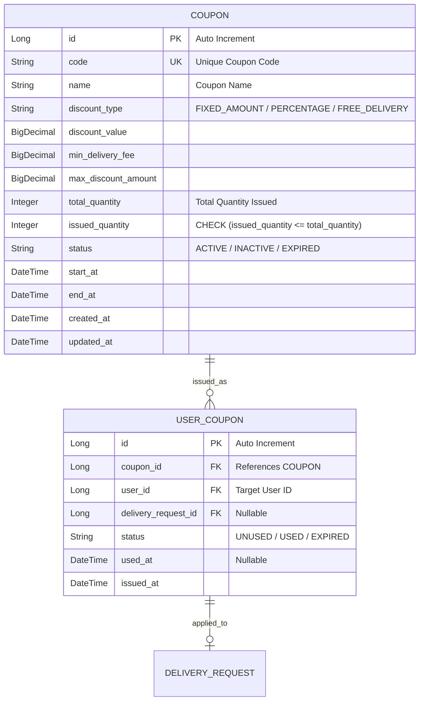

# 설계서: 쿠폰 관리 (Coupon Management)

이 문서는 관리자가 배송비 할인 프로모션 목적으로 배송 쿠폰을 발급, 수정 , 조회, 비활성화(삭제)하고 배송 요청 시 쿠폰이 정상 적용될 수 있도록 상태와 조건 정책을 관리하는 기능에 대한 설계 문서입니다.

---

## 1. 요구사항 정의서 (User Story)

* **User Story:**
  우리는 **관리자(Admin)**으로서, 고객의 배송 사이트 이용을 촉진하고 배송비 부담을 낮추기 위해 배송 전용 할인 쿠폰(배송비 할인, 무료 배송)을 발행하고 발행된 쿠폰 목록을 조회/수정하여 필요 시 비활성화(삭제) 관리하기를 원한다. 
* 배송 조건(최소 배송비, 최대 할인 금액, 배송 쿠폰 유효기간) 설정에 따라 고객이 쿠폰 사용 시 정확히 할인 혜택이 적용될 수 있도록 시스템이 상태를 연동하여 검증 및 갱신한다.
* **성공 기준 (Acceptance Criteria):**
    1. 관리자가 배송 쿠폰 생성 시 쿠폰 정보(쿠폰명, 할인 유형[FIXED_AMOUNT / PERCENTAGE / FREE_DELIVERY], 할인 값, 최소 배송비 조건, 최대 할인 금액, 총 발급 가능 수량, 유효기간 등)가 기록되며, 기본 상태는 ACTIVE(활성)로 등록된다. 시스템 전체(전역)에서 동일한 쿠폰 코드(COUPON.code)의 중복 생성을 시도할 경우 `409 Conflict(DuplicateCouponCodeException)`를 발생시킨다.
    2. 고객이 배송 요청 시 배송비 조건을 충족하지 않거나(예: 최소 배송비 미달), 유효기간이 지난 쿠폰을 적용하려 하면 `400 Bad Request(InvalidDeliveryCouponException)`를 반환한다.
    3. 만료일시가 지난 배송 쿠폰은 상태 조회를 거치거나 배치/이벤트에 의해 EXPIRED로 전환되며, 배송 요청 시 더 이상 적용할 수 없다. 관리자가 쿠폰을 수동 비활성화/삭제할 경우 상태는 INACTIVE로 갱신된다.
    4. 이미 고객에게 발급되어 배송 요청에 사용되었거나 보유 중인 쿠폰이 있는 경우, 배송비 할인율/할인금액 등 핵심 정책 수정 시도를 차단하고 `400 Bad Request(UnmodifiableCouponException)`를 반환한다.
    5. 존재하지 않는 배송 쿠폰 ID나 코드로 조회/수정/삭제를 시도할 경우 `404 Not Found(CouponNotFoundException)`를 반환한다.
---

## 2. ERD 설계 (Entity-Relationship Diagram)



---

## 3. API 명세서 (API Specification)

### 3.1 배송 쿠폰 생성 (등록)
* **엔드포인트:** `POST /api/v1/admin/coupons`
* **설명:** 관리자가 새로운 할인 쿠폰을 생성한다.
* **요청 바디 (Request Body):**
  ```json
  {
    "code": "DELIVERY2026",
    "name": "여름맞이 무료 배송 쿠폰",
    "discountType": "FREE_DELIVERY",
    "discountValue": 0,
    "minDeliveryFee": 3000,
    "maxDiscountAmount": 5000,
    "totalQuantity": 1000,
    "startAt": "2026-08-10T00:00:00",
    "endAt": "2026-08-31T23:59:59"
  }
  ```
  
  * **응답 바디 및 상태 코드 (Response Body & Status):**
      * **Success (201 Created):**
        ```json
        {
         "id": 1,
         "code": "DELIVERY2026",
         "name": "여름맞이 무료 배송 쿠폰",
         "discountType": "FREE_DELIVERY",
         "discountValue": 0,
         "minDeliveryFee": 3000,
         "maxDiscountAmount": 5000,
         "totalQuantity": 1000,
         "issuedQuantity": 0,
         "status": "ACTIVE",
         "startAt": "2026-08-10T00:00:00",
         "endAt": "2026-08-31T23:59:59",
         "createdAt": "2026-08-10T11:40:00"
        }
        ```
        
      * **Failure (409 Conflict - 중복된 쿠폰 코드, ErrorCode `C001`):**
        ```json
        {
          "status": 409,
          "code": "C001",
          "message": "이미 존재하는 쿠폰 코드입니다: DELIVERY2026",
          "timestamp": "2026-08-10T11:40:00"
        }
        ```

      * **Failure (409 Conflict / 400 Bad Request - 수량 초과, ErrorCode `C004`):**
        ```json
        {
          "status": 409,
          "code": "C004",
          "message": "쿠폰 발급 수량이 모두 소진되었습니다.",
          "timestamp": "2026-08-10T11:40:00"
        }
        ```

        

### 3.2 배송 쿠폰 목록 조회 (관리자용)
* **엔드포인트:** `GET /api/v1/admin/coupons?status={status}&page=0&size=10`
* **설명:** 관리자가 등록된 배송 쿠폰 목록을 검색 조건(상태 등)과 페이징 처리를 거쳐 조회한다.
* **응답 바디 및 상태 코드 (Response Body & Status):**
    * **Success (200 OK):**
```json
{
  "content": [
    {
      "id": 1,
      "code": "DELIVERY2026",
      "name": "여름맞이 무료 배송 쿠폰",
      "discountType": "FREE_DELIVERY",
      "discountValue": 0,
      "minDeliveryFee": 3000,
      "maxDiscountAmount": 5000,
      "totalQuantity": 1000,
      "issuedQuantity": 150,
      "status": "ACTIVE",
      "startAt": "2026-08-10T00:00:00",
      "endAt": "2026-08-31T23:59:59"
    }
  ],
  "pageNumber": 0,
  "pageSize": 10,
  "totalElements": 1,
  "totalPages": 1
}
```

### 3.3 배송 쿠폰 단건 상세 조회
* **엔드포인트:** `GET /api/v1/admin/coupons/{id}`
* * **설명:** 지정한 쿠폰 ID의 상세 정보 및 발급 현황을 조회한다.
* * **응답 바디 및 상태 코드 (Response Body & Status):**
  * **Success (200 OK):**
    ```json
{
  "id": 1,
  "code": "DELIVERY2026",
  "name": "여름맞이 무료 배송 쿠폰",
  "discountType": "FREE_DELIVERY",
  "discountValue": 0,
  "minDeliveryFee": 3000,
  "maxDiscountAmount": 5000,
  "totalQuantity": 1000,
  "issuedQuantity": 150,
  "status": "ACTIVE",
  "startAt": "2026-08-10T00:00:00",
  "endAt": "2026-08-31T23:59:59",
  "createdAt": "2026-08-10T11:40:00",
  "updatedAt": "2026-08-10T11:40:00"
}
  ```
    
* **Failure (404 Not Found - 존재하지 않는 쿠폰, ErrorCode `C002`):**
```json
{
  "status": 404,
  "code": "C002",
  "message": "존재하지 않는 쿠폰입니다: id=99",
  "timestamp": "2026-08-10T11:40:00"
}
  ```
    
### 3.4 배송 쿠폰 정보 수정
* **엔드포인트:** `PUT /api/v1/admin/coupons/{id}`
* **설명:** 등록된 배송 쿠폰의 정책 및 상태를 수정한다. (단, 이미 발급 및 사용 내역이 존재하는 쿠폰의 할인 정책 수정 시 실패)
* **요청 바디 (Request Body):**
```json
{
  "name": "[시즌2] 여름맞이 무료 배송 쿠폰",
  "totalQuantity": 2000,
  "status": "ACTIVE",
  "endAt": "2026-09-15T23:59:59"
}
  ```

* * **응답 바디 및 상태 코드 (Response Body & Status):**
* **Success (200 OK):**
  ```json
{
  "id": 1,
  "code": "DELIVERY2026",
  "name": "[시즌2] 여름맞이 무료 배송 쿠폰",
  "discountType": "FREE_DELIVERY",
  "discountValue": 0,
  "minDeliveryFee": 3000,
  "maxDiscountAmount": 5000,
  "totalQuantity": 2000,
  "issuedQuantity": 150,
  "status": "ACTIVE",
  "startAt": "2026-08-10T00:00:00",
  "endAt": "2026-09-15T23:59:59"
}
  ```

* **Failure (400 Bad Request - 사용 내역이 있어 수정 불가, ErrorCode `C003`):**
```json
{
  "status": 400,
  "code": "C003",
  "message": "이미 발급되거나 사용된 내역이 존재하는 쿠폰은 수정할 수 없습니다.",
  "timestamp": "2026-08-10T11:40:00"
}
  ```

### 3.5 배송 쿠폰 비활성화(삭제/중단 처리)
* **엔드포인트:** `DELETE /api/v1/admin/coupons/{id}`
* **설명:** 쿠폰 상태를 INACTIVE로 전환하여 더 이상 신규 발급 및 배송 적용이 불가능하도록 비활성화 처리한다.
* **응답 코드:** 204 No Content

---

## 4. 작업 분할 목록 (WBS)

- [x] 배송 쿠폰 및 사용자 쿠폰 관리 테이블 생성 스크립트 작성 (`V1__create_coupon_tables.sql`)
- [x] Coupon 및 UserCoupon 도메인 Entity 설계, `CouponDiscountType`, `CouponStatus`, `UserCouponStatus` 매핑
- [x] `DuplicateCouponCodeException`, `CouponNotFoundException`, `UnmodifiableCouponException`, `InvalidDeliveryCouponException(모두 BusinessException 상속)` 예외 클래스 및 ErrorCode 매핑
- [x] 배송 쿠폰 생성/조회/수정/비활성화(삭제) 관리자용 CRUD 비즈니스 로직 구현 및 단위 테스트 작성
- [x] 쿠폰 상태 전환(유효기간 만료 체크 및 `유효기간이 만료된 상태(EXPIRED)` 자동 업데이트) 헬퍼 메서드 및 검증 로직 구현
- [x] 쿠폰 정보 수정 시 이미 발급/사용된 내역 존재 여부 검증 기능 구현
- [x] `AdminCouponController` 엔드포인트 연동 및 관리자 쿠폰 CRUD API E2E 검증 테스트 구현
