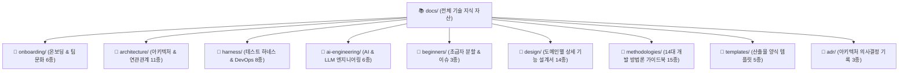

# 📚 신한 딜리버리 전체 기술 가이드북 지식 지도 (Documentation Sitemap)

> [!NOTE]
> 본 문서는 **신한 딜리버리(Shinhan Delivery)** 프로젝트의 9대 영역별 지식 자산 마크다운 가이드북(총 68개)을 체계적으로 탐색할 수 있는 **통합 색인 및 사이트맵 지식 지도**입니다.

---

## 🧭 9대 서브폴더 지식 구조도

---

## 📂 카테고리별 세부 문서 가이드 (9 Subfolders)

### 1. 🚀 [`docs/onboarding/`](./onboarding/) — 온보딩 & 팀 개발 문화 (6종)
신규 합류한 팀원이 심리적 안전지대 속에서 팀 문화를 체득하고 로드맵을 따라 성장하는 튜터링 문서입니다.
* 📖 [**초보 개발자 온보딩 로드맵**](./onboarding/온보딩-로드맵.md) — 7단계 학습 및 실전 개발 순서 가이드
* 📖 [**팀 개발 문화 & 일하는 방식 7대 철학**](./onboarding/엔지니어링-문화-및-일하는-방식.md) — 15분 질문 룰 및 비난 없는 코드 리뷰
* 📖 [**팀 리더십 & 프로젝트 운용 프레임워크**](./onboarding/팀-운용-프레임워크-가이드.md) — 5대 운용 기둥 및 리더십 가이드
* 📖 [**협업 문화 & 자동화 도구 도입 배경**](./onboarding/개발-문화-가이드.md) — DevOps 및 자동화 도구 도입 취지 필독서
* 📖 [**AI 기반 페어 프로그래밍 가이드**](./onboarding/AI-기반-페어-프로그래밍-가이드.md) — AI 보조 도구를 활용한 짝 프로그래밍
* 📖 [**사전 리스크 감사 & 거버넌스 가이드**](./onboarding/사전-리스크-감사-및-거버넌스-가이드.md) — 6대 사전 리스크 예방 프로세스

---

### 2. 🏛️ [`docs/architecture/`](./architecture/) — 핵심 시스템 아키텍처 & 유저플로우 (14종)
서버, 데이터베이스, 보안, REST API, 프론트엔드 디자인 시스템 및 E2E 유저 플로우의 표준 규격입니다.
* 📖 [**전체 E2E 유저 플로우 & 화면-서비스 매핑 가이드**](./architecture/전체-유저-플로우-가이드.md) — E2E 여정 및 7대 도메인 딥다이브 맵
* 📖 [**RESTful API 설계 규격 가이드**](./architecture/REST-API-설계-규격-가이드.md) — REST API 자원/행위 매핑 및 HTTP 상태 응답 규격
* 📖 [**ERD 데이터베이스 연관관계도**](./architecture/ERD-데이터베이스-연관관계도.md) — 전체 엔티티 테이블 설계 및 FK 연관관계도
* 📖 [**Flyway 마이그레이션 가이드**](./architecture/Flyway-마이그레이션-가이드.md) — DDL 무중단 마이그레이션 및 파일명 규격
* 📖 [**보안 및 JWT 가이드**](./architecture/보안-및-JWT-가이드.md) — 무상태 JWT 인증 및 메서드 시큐리티 수칙
* 📖 [**전역 예외 처리 규격 가이드**](./architecture/전역-예외-처리-규격-가이드.md) — `@RestControllerAdvice` 및 ErrorCode 체계
* 📖 [**동시성 제어 가이드**](./architecture/동시성-제어-가이드.md) — 비관적/낙관적 락 기반 주문 및 잔액 동시성 제어
* 📖 [**UI 공통 디자인 시스템**](./architecture/UI-공통-디자인-시스템.md) — CSS 디자인 토큰 및 Thymeleaf 프래그먼트 규격
* 📖 [**프로젝트 스펙 및 태스크 분할**](./architecture/프로젝트-스펙-및-태스크-분할.md) — 10대 모듈 30+ REST API 스펙
* 📖 [**프로젝트 지식 그래프**](./architecture/프로젝트-지식-그래프.md) — 기술 스택 및 지식 노드 관계도
* 📖 [**단일 원본(SSOT) 문서화 정책 가이드**](./architecture/SSOT-문서화-정책-가이드.md) — 지식 자산 일원화 및 매핑 레지스트리
* 📖 [**배송원 API 표준 명세서**](./architecture/courier-api-specification.md) — 배송원 워크스페이스 & 배송 매칭 API 명세서
* 📖 [**배송원 ERD 명세서**](./architecture/courier-erd-specification.md) — 배송원 및 매칭 시스템 데이터 모델 명세서
* 📖 [**배송원 매칭 가이드**](./architecture/rider-matching-guide.md) — 배송원 출근 및 동시성 제어 주문 매칭 가이드

---

### 3. 🛡️ [`docs/harness/`](./harness/) — 품질 검증 하네스 & DevOps (9종)
결함 0개를 사수하기 위한 자동화 테스트 하네스, CI/CD 및 Git 커밋/PR 절칙입니다.
* 📖 [**테스트 하네스 판단 및 통제 정책**](./harness/테스트-하네스-판단-및-통제-정책.md) — 6대 통제 정책 및 자가 치유 피드백 루프
* 📖 [**테스트 하네스 & LLM 가이드**](./harness/테스트-하네스-및-LLM-가이드.md) — AI 에이전트 자동 검증 프로세스
* 📖 [**CI/CD 파이프라인 가이드**](./harness/CICD-파이프라인-가이드.md) — GitHub Actions 구축 및 자동 검증 파이프라인
* 📖 [**Git Flow & 커밋 컨벤션**](./harness/Git-Flow-및-커밋-컨벤션.md) — 마이크로 커밋 및 브랜치 전략
* 📖 [**PR 리뷰어 3분 족보 가이드**](./harness/PR-리뷰어-3분-족보-가이드.md) — 5대 리뷰 표준 구성 요소 및 인라인 댓글 규격
* 📖 [**기능 설계 2단계 PR 절차 가이드**](./harness/기능-설계-2단계-PR-절차-가이드.md) — 2단계 PR 전략 및 사전 산출물
* 📖 [**개발자 환경 설정 가이드**](./harness/개발자-환경-설정-가이드.md) — 로컬 개발 환경 및 도구 세팅
* 📖 [**트러블슈팅 가이드**](./harness/트러블슈팅-가이드.md) — 자주 발생하는 빌드 및 DB 마이그레이션 에러 해결집
* 📖 [**이슈 구현 계획서**](./harness/implementation_plan.md) — Phase 1 출근 및 배송 매칭 구현 계획서

---

### 4. 🤖 [`docs/ai-engineering/`](./ai-engineering/) — AI & LLM 엔지니어링 (6종)
LangChain, LangGraph, GraphRAG 및 LLM 기반 소프트웨어 엔지니어링 구축 문서입니다.
* 📖 [**LLM 소프트웨어 엔지니어링 가이드**](./ai-engineering/LLM-소프트웨어-엔지니어링-가이드.md) — LLM을 활용한 고도화 개발
* 📖 [**그래프 엔지니어링 아키텍처**](./ai-engineering/그래프-엔지니어링-아키텍처.md) — 그래프 구조 기반 아키텍처 설계
* 📖 [**LangGraph 기획 워크플로우 가이드**](./ai-engineering/LangGraph-기획-워크플로우-가이드.md) — 기획 자동화 에이전트 그래프
* 📖 [**LangGraph 구현 가이드**](./ai-engineering/LangGraph-구현-가이드.md) — Stateful 멀티노드 파이썬 그래프 구현
* 📖 [**LangChain & LangGraph 심화 분석**](./ai-engineering/LangChain-LangGraph-심화-분석.md) — 프레임워크 비교 및 심화 원리
* 📖 [**GraphRAG 구현 가이드**](./ai-engineering/GraphRAG-구현-가이드.md) — 지식 그래프 기반 RAG 검색 엔진

---

### 5. 🔰 [`docs/beginners/`](./beginners/) — 초급자 가이드 & 이슈 규격 (3종)
신입 개발자가 막연함 없이 100% 무결점 코드를 완성하도록 안내하는 세부 가이드입니다.
* 📖 [**초급 개발자 7단계 태스크 분할 가이드**](./beginners/초급-개발자-태스크-분할-가이드.md) — Step-by-Step 태스크 분할법
* 📖 [**초급자 CRUD & 레이어별 이슈 분할 템플릿**](./beginners/초급자-CRUD-이슈-템플릿-가이드.md) — DTO, Entity, Service, Controller 단계별 디테일 가이드
* 📖 [**학습형 3단계 이슈 작성 규격 가이드**](./beginners/학습형-이슈-작성-규격-가이드.md) — 배경, 문제 및 체크리스트 중심 이슈 작성 규격

---

### 6. 🎨 [`docs/design/`](./design/) — 도메인별 디테일 기능 설계서 (14종)
* 📖 [**회원 인증 기능 설계서**](./design/회원-인증-기능-설계서.md)
* 📖 [**배송 요청 기능 설계서**](./design/배송-요청-기능-설계서.md)
* 📖 [**배송 매칭 기능 설계서**](./design/배송-매칭-기능-설계서.md)
* 📖 [**포인트 지갑 기능 설계서**](./design/포인트-지갑-기능-설계서.md)
* 📖 [**위치 추적 기능 설계서**](./design/위치-추적-기능-설계서.md)
* 📖 [**배송 상태 전이도**](./design/배송-상태-전이도.md)
* 📖 [**알림 기능 설계서**](./design/알림-기능-설계서.md)
* 📖 [**차량 기능 설계서**](./design/차량-기능-설계서.md)
* 📖 [**카테고리 기능 설계서**](./design/카테고리-기능-설계서.md)
* 📖 [**이미지 업로드 기능 설계서**](./design/이미지-업로드-기능-설계서.md)
* 📖 [**공지사항 기능 설계서**](./design/공지사항-기능-설계서.md)
* 📖 [**배송 매칭 PRD 예시**](./design/배송-매칭-PRD-예시.md) / [**API 명세 예시**](./design/배송-매칭-API-명세-예시.md) / [**ERD 예시**](./design/배송-매칭-ERD-예시.md)

---

### 7. 📚 [`docs/methodologies/`](./methodologies/) — 14대 현대 개발 방법론 (15종)
* 📖 [**14대 개발 방법론 종합 총서**](./methodologies/README.md) (DDD, TDD, BDD, 클린 아키텍처 등 14개 개별 총서)

---

### 8. 📝 [`docs/templates/`](./templates/) — 문서 템플릿 (5종)
* 📖 [**PRD 작성 템플릿**](./templates/PRD-작성-템플릿.md) / [**API 명세 템플릿**](./templates/API-명세-작성-템플릿.md) / [**ERD 템플릿**](./templates/ERD-작성-템플릿.md) / [**ADR 템플릿**](./templates/ADR-작성-템플릿.md) / [**트러블슈팅 템플릿**](./templates/트러블슈팅-일지-템플릿.md)

---

### 9. 🏛️ [`docs/adr/`](./adr/) — 아키텍처 의사결정 기록 (3종)
* 📖 [**ADR 기록 소식지**](./adr/README.md) (0001 무상태 JWT 인증 체계 등)

---

### 10. 🎤 [`docs/presentation/`](./presentation/) — 프로젝트 발표 자료 (PPT) 표준 가이드
* 📖 [**개발자 발표 PPT 표준 템플릿 가이드**](./presentation/개발자-발표-PPT-표준-템플릿-가이드.md) — 5-Slide 표준 덱 양식 및 발표 가이드
* 🎤 [**신한 딜리버리 REST API 기술 성과 발표**](./presentation/REST-API-기술성과발표-남윤재.md) — 실제 배송 API 코드, `fetch`, 취소 정산, HATEOAS 확장 방향을 담은 7-Slide 발표 자료
