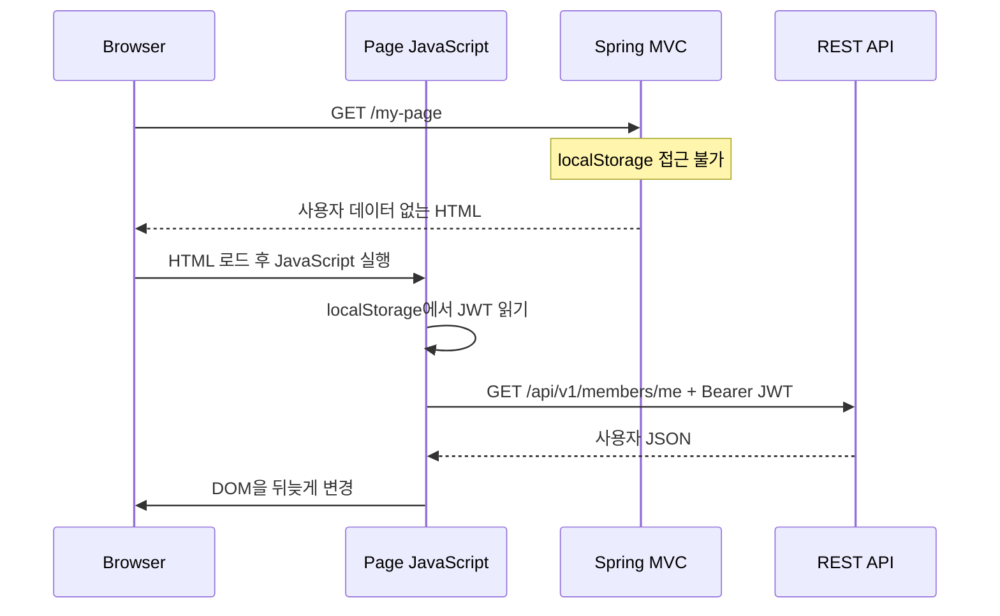
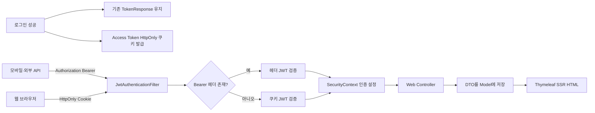

---
metadata:
  version: "1.0.0"
  ssot_owner: "docs/adr/0002-HttpOnly-쿠키-JWT-SSR-인증-병행.md"
  last_updated: "2026-08-11"
  status: "PROPOSED"
---

# ADR-0002: HttpOnly 쿠키와 Bearer 헤더를 병행하는 JWT 기반 SSR 인증

* **상태 (Status):** 🟡 PROPOSED (팀 검토 필요)
* **날짜 (Date):** 2026-08-11
* **결정자 (Deciders):** Shinhan Delivery 아키텍처 팀
* **연관 ADR:** [ADR-0001: JWT 기반 무상태 인증 및 인가 체계](./0001-무상태-JWT-인증-체계.md)
* **연관 이슈 (Related Issue):** 미정
* **연관 PR (Related PR):** 미정

---

## 1. 1분 의사결정 요약

현재 웹 클라이언트는 JWT를 `localStorage`에 저장하고 JavaScript가 매 API 요청의 `Authorization: Bearer <token>` 헤더에 토큰을 넣는다. 이 방식에서는 Spring MVC가 HTML을 생성하는 시점에 브라우저의 `localStorage`를 읽을 수 없으므로, 로그인 사용자 데이터를 사용하는 Thymeleaf SSR 화면을 만들 수 없다.

제안안은 **기존 Bearer 헤더 인증을 유지하면서 웹 브라우저용 Access Token을 `HttpOnly` 쿠키로도 전달하는 하이브리드 방식**이다. 서버 세션을 만들지 않으므로 ADR-0001의 무상태 JWT 원칙은 유지되며, 모바일 앱과 기존 API 소비자는 Bearer 헤더를 계속 사용할 수 있다.

> [!IMPORTANT]
> 권고안은 단순히 쿠키만 추가하는 것이 아니다. `HttpOnly`, `Secure`, `SameSite`, 짧은 Access Token 만료, CSRF 방어, 명시적 로그아웃 쿠키 삭제를 하나의 보안 묶음으로 적용해야 한다.

### 권고 결론

| 판단 항목 | 권고 |
| :--- | :--- |
| 아키텍처 | Bearer 헤더 + HttpOnly 쿠키 병행 |
| 서버 상태 | 세션 저장소 없이 JWT 무상태 유지 |
| 웹 SSR | 쿠키 JWT로 인증 주체를 복원하여 허용 |
| 기존 API·모바일 | 기존 Bearer 헤더 계약 유지 |
| 토큰 우선순위 | `Authorization` 헤더 우선, 없을 때 쿠키 사용 |
| CSRF | 상태 변경 요청에 별도 방어 적용 필수 |
| 문서 상태 | 팀 승인 전까지 `PROPOSED` |

---

## 2. 배경과 문제 정의

현재 인증 필터는 HTTP 요청의 `Authorization` 헤더만 검사한다. 로그인 화면은 응답받은 JWT를 브라우저 `localStorage`에 저장하고, 화면별 JavaScript가 토큰을 읽어 API를 호출한다.



이 흐름은 CSR(Client-Side Rendering)에는 적합하지만, Controller가 `Model`에 사용자 DTO를 담아 완성된 HTML을 반환하는 SSR과 맞지 않는다. 서버가 페이지 요청 시점에 인증 정보를 받으려면 브라우저가 자동으로 전송할 수 있는 쿠키 또는 서버 세션이 필요하다.

### 목표

1. 로그인 사용자 화면을 Thymeleaf SSR로 렌더링한다.
2. 기존 REST API의 Bearer 헤더 계약과 모바일 확장 가능성을 유지한다.
3. Redis나 서버 메모리 기반 세션 저장소를 도입하지 않는다.
4. 토큰이 JavaScript에 직접 노출되는 범위를 줄인다.
5. 기존 DTO, HTTP Status 및 API URL을 파괴적으로 변경하지 않는다.

### 비목표

* 지도 이동, WebSocket 실시간 갱신, 입력값 즉시 검증 등 브라우저 상호작용을 모두 제거하지 않는다.
* JWT를 서버 세션 방식으로 교체하지 않는다.
* 이번 결정만으로 Refresh Token 폐기 목록이나 강제 로그아웃 인프라까지 도입하지 않는다.

---

## 3. 대안 비교

| 대안 | SSR 가능 | XSS 토큰 탈취 방어 | CSRF 부담 | 기존 API 호환 | 서버 상태 | 종합 판단 |
| :--- | :---: | :---: | :---: | :---: | :---: | :--- |
| A. 현행 `localStorage` + Bearer | ❌ | 낮음 | 낮음 | 매우 높음 | 무상태 | SSR 목표 미충족 |
| B. 서버 세션 + `JSESSIONID` | ✅ | 높음 | 있음 | 별도 대응 필요 | 상태 저장 | 운영 인프라 증가 |
| C. JWT를 HttpOnly 쿠키로만 사용 | ✅ | 높음 | 있음 | 모바일·외부 API 변경 | 무상태 | 호환성 손실 |
| D. Bearer + HttpOnly 쿠키 병행 | ✅ | 높음 | 있음 | 높음 | 무상태 | **권고안** |

### A. 현행 유지

**장점**

* 구현 변경이 없고 모바일·외부 API에서 Bearer 토큰을 사용하기 쉽다.
* 브라우저가 토큰을 자동 전송하지 않으므로 전통적인 쿠키 기반 CSRF 공격 표면이 작다.

**약점**

* Spring MVC가 페이지 요청 시 인증 사용자를 알 수 없어 로그인 기반 SSR이 불가능하다.
* XSS가 발생하면 악성 JavaScript가 `localStorage`의 토큰을 읽어 외부로 반출할 수 있다.
* 각 화면이 인증 헤더 구성, 로딩, 오류 처리와 DOM 생성을 반복한다.

### B. 서버 세션 도입

**장점**

* 서버에서 즉시 세션을 폐기할 수 있고 전통적인 Spring MVC 인증과 자연스럽게 결합된다.
* 토큰 페이로드가 브라우저 JavaScript에 노출되지 않는다.

**약점**

* 다중 서버 환경에서 세션 공유를 위한 Redis 등의 운영 인프라가 필요하다.
* ADR-0001에서 채택한 무상태 인증 원칙을 변경해야 한다.
* 모바일·외부 API를 위한 별도 인증 경로가 필요할 수 있다.

### C. HttpOnly 쿠키 전용 JWT

**장점**

* 웹 SSR 구조가 단순하고 JavaScript가 토큰을 직접 읽을 수 없다.
* 서버 세션 저장소 없이 JWT의 무상태성을 유지한다.

**약점**

* 기존 Bearer 기반 테스트·모바일·외부 API 클라이언트가 영향을 받는다.
* 쿠키를 자동 전송하지 않는 클라이언트에 추가 구현이 필요하다.

### D. Bearer 헤더와 HttpOnly 쿠키 병행 — 권고

**장점**

* 브라우저 페이지 요청에 쿠키가 자동 포함되므로 Web Controller에서 인증 사용자를 복원하고 SSR할 수 있다.
* 기존 Bearer 헤더를 유지하므로 REST API와 비브라우저 클라이언트의 하위 호환성이 보존된다.
* `HttpOnly` 쿠키는 JavaScript의 토큰 직접 읽기를 차단하여 XSS 발생 시 토큰 반출 위험을 낮춘다.
* 서버 세션 저장소가 필요 없어 수평 확장 특성을 유지한다.

**약점**

* 브라우저가 쿠키를 자동 전송하므로 상태 변경 요청에 대한 CSRF 방어가 필요하다.
* 헤더와 쿠키라는 두 인증 입력 경로의 우선순위, 테스트 및 장애 분석 기준을 관리해야 한다.
* XSS 자체를 막아주는 것은 아니다. 탈취는 어려워지지만 악성 스크립트가 사용자의 브라우저에서 인증 요청을 실행할 수는 있다.
* 쿠키의 도메인, 경로, SameSite 및 CORS 설정이 환경별로 어긋나면 로그인 장애가 발생할 수 있다.

---

## 4. 제안 아키텍처



### 인증 처리 우선순위

1. 유효한 `Authorization: Bearer` 헤더가 있으면 해당 토큰을 사용한다.
2. Bearer 헤더가 없으면 정해진 이름의 인증 쿠키를 검사한다.
3. 두 값이 동시에 존재하고 서로 다른 사용자를 나타내면 헤더 우선 정책을 적용하고 보안 감사 로그를 남긴다. 단, 원문 토큰은 절대 로그에 기록하지 않는다.
4. 토큰이 없거나 유효하지 않으면 인증되지 않은 요청으로 처리한다.

> [!WARNING]
> “유효하지 않은 Bearer 헤더가 있으면 쿠키로 자동 폴백”하면 잘못된 클라이언트 요청을 숨길 수 있다. 헤더가 명시적으로 전달된 경우에는 그 결과를 우선하는 정책이 장애 분석과 보안 측면에서 더 명확하다.

### 권장 쿠키 속성

| 속성 | 권장값 | 이유 |
| :--- | :--- | :--- |
| `HttpOnly` | `true` | JavaScript의 토큰 직접 접근 차단 |
| `Secure` | 운영 `true` | HTTPS 연결에서만 쿠키 전송 |
| `SameSite` | 기본 `Lax` | 일반적인 동일 사이트 SSR과 외부 링크 진입을 지원하면서 CSRF 위험 완화 |
| `Path` | `/` | SSR 페이지와 API 요청에서 동일 인증 사용 |
| `Max-Age` | Access Token 만료와 동일 | 쿠키와 JWT의 수명 불일치 방지 |
| `Domain` | 가능하면 생략 | 발급 호스트로 범위를 제한 |

> [!CAUTION]
> 운영 환경에서 `Secure=false`를 허용하면 네트워크 구간에서 쿠키 보호 수준이 낮아진다. 로컬 HTTP 개발 환경과 운영 HTTPS 환경의 설정을 프로필로 분리해야 한다.

---

## 5. 핵심 Trade-off

### 5.1 보안

| 얻는 이점 | 새로 생기는 위험 | 필수 완화책 |
| :--- | :--- | :--- |
| JavaScript가 Access Token을 직접 읽지 못함 | 쿠키 자동 전송으로 CSRF 가능 | SameSite + CSRF 토큰 또는 요청 출처 검증 |
| XSS를 통한 토큰 외부 반출 난이도 증가 | XSS가 사용자 브라우저 안에서 요청 실행 가능 | 출력 이스케이프, CSP, 입력 검증 유지 |
| 쿠키 범위와 수명을 서버가 통제 | 잘못된 Domain/Path 설정 시 과도한 전송 | 최소 범위, 환경별 자동 테스트 |
| 로그·예외에 토큰이 노출될 가능성 감소 | 프록시·접근 로그가 Cookie 헤더를 기록할 가능성 | Cookie/Authorization 헤더 마스킹 |

`HttpOnly`는 **XSS 방어 전체가 아니라 토큰 직접 탈취 방어의 한 계층**이다. Thymeleaf의 기본 이스케이프 출력인 `th:text`를 사용하고, 사용자 입력을 `th:utext` 또는 검증되지 않은 `innerHTML`로 출력하지 않는 규칙을 유지해야 한다.

### 5.2 SSR과 사용자 경험

**이점**

* 첫 HTML 응답에 사용자 이름, 주소, 배송 목록 등이 포함되어 로딩 후 화면이 뒤늦게 바뀌는 현상이 줄어든다.
* 초기 데이터용 `fetch`, 로딩 상태, DOM 조립 코드가 줄어 화면별 중복이 감소한다.
* JavaScript 실행이 늦거나 실패해도 기본 콘텐츠를 확인할 수 있다.

**약점**

* 페이지 이동 때 서버 렌더링 요청이 발생하므로 SPA처럼 모든 전환이 즉시 일어나지는 않는다.
* 지도, 위치 추적, WebSocket, 파일 업로드 진행률, 입력값 즉시 검증은 여전히 JavaScript가 필요하다.
* SSR Controller가 여러 Service를 무분별하게 호출하면 응답 지연과 N+1 조회가 발생할 수 있다.

### 5.3 하위 호환성과 운영

**이점**

* 기존 `TokenResponse` 필드와 Bearer 인증을 유지하여 모바일·테스트·외부 연동을 깨뜨리지 않는다.
* 서버 세션 저장소가 없으므로 기존 배포 및 수평 확장 모델을 유지한다.

**약점**

* 인증 필터가 헤더와 쿠키를 모두 지원하므로 테스트 조합이 늘어난다.
* 로그아웃 시 브라우저 쿠키 삭제와 클라이언트 저장 토큰 정리를 함께 처리해야 한다.
* JWT가 만료되기 전 서버에서 즉시 폐기하기 어려운 기존 JWT 특성은 그대로 남는다.

---

## 6. CSRF 방어 의사결정

현재 Spring Security의 CSRF 보호는 비활성화되어 있다. Bearer 헤더만 사용할 때는 브라우저가 인증 헤더를 자동으로 추가하지 않지만, 인증 쿠키를 도입하면 브라우저가 요청에 쿠키를 자동 포함한다.

따라서 다음 중 하나를 팀이 명시적으로 선택해야 한다.

1. **Spring Security CSRF 토큰 활성화 — 우선 권고**
   * Thymeleaf 폼에는 CSRF hidden input을 자동 또는 명시적으로 포함한다.
   * JavaScript 상태 변경 요청에는 CSRF 토큰 헤더를 포함한다.
2. **SameSite + Origin/Referer 검증**
   * API 중심 구조에서 적용 가능하지만 프록시와 브라우저 호환성을 세밀하게 검증해야 한다.
3. **인증 쿠키는 SSR GET에만 사용하고 상태 변경 API는 Bearer 헤더만 허용**
   * CSRF 표면은 줄지만 웹 요청의 인증 정책이 복잡해지고 토큰을 JavaScript에 다시 노출할 수 있다.

> [!IMPORTANT]
> 쿠키 인증을 상태 변경 API에도 허용하면서 CSRF를 계속 전역 비활성화하는 선택은 권고하지 않는다.

---

## 7. 단계적 도입 및 롤백 전략

### 단계적 도입

1. JWT 인증 필터에 Bearer 우선·쿠키 차선 해석을 추가한다.
2. 로그인 응답의 기존 JSON 계약을 유지하면서 Access Token 쿠키를 병행 발급한다.
3. 로그아웃 시 인증 쿠키를 즉시 만료시키는 엔드포인트를 제공한다.
4. CSRF 방어와 보안 헤더 마스킹을 적용한다.
5. 공개 데이터 화면부터 SSR로 전환한다.
6. 마이페이지·주소·배송·결제처럼 인증 데이터가 필요한 화면을 순차 전환한다.
7. 충분한 호환 기간 후 웹의 `localStorage` 토큰 의존 제거 여부를 별도로 결정한다.

### 롤백

* 쿠키 발급과 쿠키 해석 기능을 비활성화해 기존 Bearer 전용 방식으로 즉시 돌아갈 수 있어야 한다.
* 기존 `TokenResponse`, API URL, Bearer 인증 코드는 롤백 기간 동안 제거하지 않는다.
* 데이터베이스 스키마 변경이 없으므로 롤백 시 데이터 마이그레이션은 필요하지 않다.

---

## 8. 승인 체크리스트

- [ ] SSR 대상 화면과 CSR 유지 영역이 구분됐는가?
- [ ] Bearer 헤더 우선순위와 쿠키 폴백 규칙에 합의했는가?
- [ ] Access Token과 Refresh Token의 쿠키 저장 범위를 결정했는가?
- [ ] CSRF 방어 방식을 선택했는가?
- [ ] 운영 쿠키에 `HttpOnly`, `Secure`, `SameSite`가 적용되는가?
- [ ] 로그인·갱신·로그아웃 시 쿠키 생명주기가 일관적인가?
- [ ] 기존 모바일·외부 API·자동화 테스트의 Bearer 인증이 유지되는가?
- [ ] 인증 헤더와 쿠키가 로그, 예외 및 응답 DTO에 노출되지 않는가?
- [ ] 잘못된 쿠키 설정을 즉시 롤백할 수 있는가?

---

## 9. 실증 검증 계획

이 문서는 제안서이므로 아래 명령은 구현 승인 후 충족해야 할 인수 기준이다.

```bash
# 전체 품질 게이트
./scripts/verify.sh

# Bearer 헤더 하위 호환성
curl -i -H "Authorization: Bearer <ACCESS_TOKEN>" \
  http://localhost:8080/api/v1/members/me

# 쿠키를 사용한 SSR 페이지 요청
curl -i --cookie "SHINHAN_ACCESS_TOKEN=<ACCESS_TOKEN>" \
  http://localhost:8080/my-page

# 인증 쿠키 속성 확인
curl -i -X POST http://localhost:8080/api/v1/members/login \
  -H "Content-Type: application/json" \
  -d '{"email":"user@example.com","password":"<PASSWORD>"}'
```

### 기대 결과

* Bearer 헤더를 사용하는 기존 API 요청이 기존과 동일하게 성공한다.
* 유효한 인증 쿠키만 가진 `/my-page` 요청에서 사용자 DTO가 서버 렌더링된 HTML에 포함된다.
* 로그인 응답의 `Set-Cookie`에 `HttpOnly`, 운영 환경의 `Secure`, 합의된 `SameSite`가 포함된다.
* 상태 변경 요청은 합의한 CSRF 정책을 통과해야만 처리된다.
* 토큰 원문이 애플리케이션 로그, 예외 메시지 또는 HTML에 출력되지 않는다.

---

## 10. 최종 승인 요청 사항

팀은 다음 세 항목을 승인해야 구현에 착수할 수 있다.

1. **하이브리드 인증 채택:** Bearer 헤더를 유지하면서 웹 SSR용 HttpOnly JWT 쿠키를 추가한다.
2. **CSRF 정책:** Spring Security CSRF 토큰 활성화를 기본안으로 채택한다.
3. **마이그레이션 정책:** 기존 웹 `localStorage` 방식은 호환 기간 동안 유지하고, SSR 전환 완료 후 제거 여부를 별도로 결정한다.

승인되면 문서 상태를 `ACCEPTED`로 변경하고, 구현 PR과 연관 이슈 번호를 기록한다.
