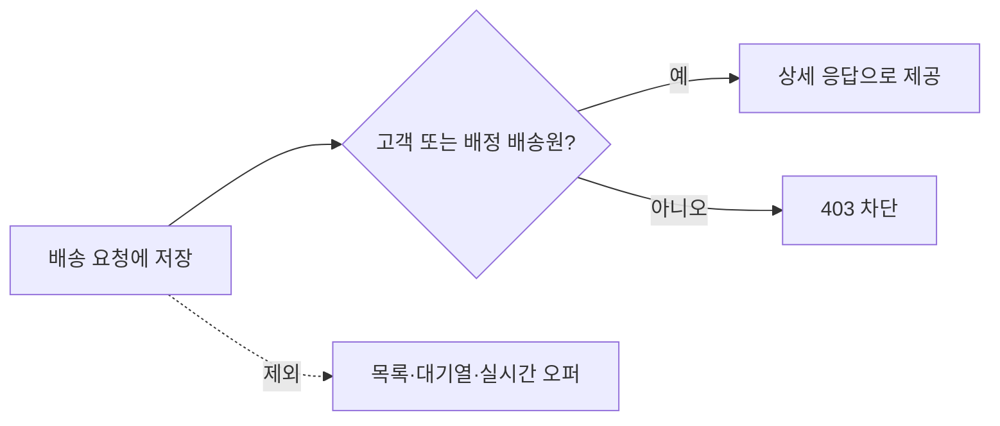

---
metadata:
  version: "1.0.0"
  ssot_owner: "docs/adr/0002-배송-출입정보-최소노출.md"
  last_updated: "2026-08-11"
  status: "ACCEPTED"
---

# ADR-0002: 배송 출입정보 최소 노출

* **상태 (Status):** 🟢 ACCEPTED
* **날짜 (Date):** 2026-08-11
* **결정자 (Deciders):** Shinhan Delivery Team
* **연관 이슈 (Related Issue):** [Issue #279](https://github.com/ShinhanDSProject/shinhan-delivery/issues/279)

## 배경

공동현관 출입번호는 배송원이 현장에 접근하는 데 필요하지만, 불필요한 응답이나 로그에 포함되면 거주 공간의 보안 위험을 높인다.



> [!CAUTION]
> 출입번호를 예외 메시지, 애플리케이션 로그 또는 공개 범위가 넓은 DTO에 추가하지 않는다.

## 검토 대안과 결정

평문 저장 후 응답 최소화, 애플리케이션 암호화, 별도 Secret 저장소를 검토했다. 현재 운영 키 관리 인프라가 없는 상태에서 하드코딩된 암호화 키를 도입하지 않고, 기존 상세 조회 인가와 전용 DTO를 통한 최소 노출을 채택한다.

장점은 기존 인프라에서 즉시 접근 범위를 통제하고 목록 유출을 구조적으로 방지한다는 점이다. 저장 계층 침해에는 평문이 노출될 수 있다는 한계가 있으므로 KMS 도입 시 envelope encryption으로 전환한다.

## 검증

```bash
./scripts/verify.sh
```

기대 결과: 비인가 상세 조회 테스트가 403을 반환하고, 일반 배송 응답에는 `entranceCode`가 없다.
