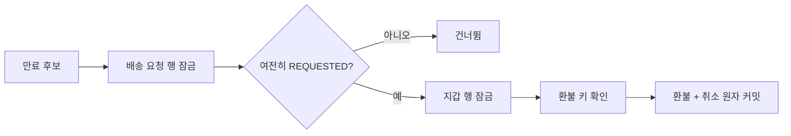

---
metadata:
  version: "1.0.0"
  ssot_owner: "docs/adr/0003-배송-타임아웃-락과-멱등-환불.md"
  last_updated: "2026-08-11"
  status: "PROPOSED"
---

# ADR-0003: 배송 타임아웃 락과 멱등 환불

* **상태:** 🟡 PROPOSED
* **날짜:** 2026-08-11
* **연관 이슈:** [#285](https://github.com/ShinhanDSProject/shinhan-delivery/issues/285)

## 배경

자동 타임아웃과 배송원 콜 수락이 동시에 같은 `REQUESTED` 배송을 변경할 수 있고, 중복 스케줄 실행은 고객 포인트를 여러 번 환불할 수 있다.



## 검토 대안

1. Redis 분산 락: 다중 인스턴스 제어는 가능하지만 신규 인프라와 장애 지점을 추가한다.
2. DB 낙관적 락: 충돌 재시도 정책이 필요하고 자동 배치의 예측 가능성이 낮다.
3. DB 비관적 락과 환불 유니크 키: 기존 프로젝트 패턴을 재사용하고 단일 DB 트랜잭션으로 원자성을 확보한다.

## 결정

세 번째 대안을 채택한다. 모든 경로는 배송 요청을 먼저 잠그고 이후 포인트 지갑을 잠근다. 환불 이력의 회원·멱등 키 유니크 제약을 이중 방어로 사용한다. 스케줄러는 후보별 Service 트랜잭션을 호출해 실패를 격리한다.

> [!WARNING]
> 락 획득 순서를 반대로 구현하면 콜 수락·포인트 처리와 데드락이 발생할 수 있으므로 `DeliveryRequest → PointWallet` 순서를 유지한다.

## 결과와 트레이드오프

중복 환불과 잘못된 매칭을 방지하고 환불 실패 시 전체 롤백된다. 대신 경합 시 DB 락 대기가 발생하며, 영구 실패 요청은 다음 스케줄에서 반복 재시도된다.

## 검증

```bash
./scripts/verify.sh
```

기대 결과: 자동 취소·멱등 환불·콜 수락 경쟁 테스트와 전체 하네스가 통과한다.
