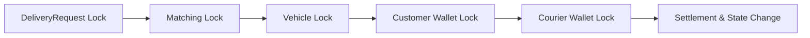

# ADR-0004: 고객 취소 원자적 포인트 정산과 락 순서

## Context

`MATCHED` 배송의 고객 취소는 고객 환불, 배송원 이동 보상, 매칭 취소, 차량 가용화가 함께 성공하거나 함께 실패해야 한다. 동시에 배송원이 픽업할 수 있으므로 일관된 락 순서도 필요하다.

## Decision



- 모든 정산을 하나의 Service 트랜잭션에서 수행한다.
- 고객 취소의 락 순서를 `DeliveryRequest → Matching → Vehicle → 고객 PointWallet → 배송원 PointWallet`로 고정한다.
- 픽업·매칭·타임아웃처럼 일부 자원만 사용하는 경합 흐름도 자신이 사용하는 락을 이 전역 순서와 반대로 획득하지 않는다.
- 고객 환불과 배송원 보상은 `(PointHistoryType, deliveryRequestId)`를 멱등 기준으로 사용한다.
- 배송 요청을 삭제하지 않고 상태와 정산 감사 값을 보존한다.

> [!IMPORTANT]
> 포인트 금액은 클라이언트 입력을 신뢰하지 않고 배송 결제액과 서버 정책으로만 계산한다.

## Trade-off

트랜잭션이 여러 행을 잠가 처리 시간이 늘 수 있지만, 돈과 상태가 부분 반영되는 위험보다 정합성을 우선한다. 정산 실패 시 사용자가 재시도할 수 있으며 멱등 원장이 중복 지급을 차단한다.

## Verification

```bash
./gradlew test --tests '*DeliveryCancellationConcurrencyTest'
./scripts/verify.sh
```
