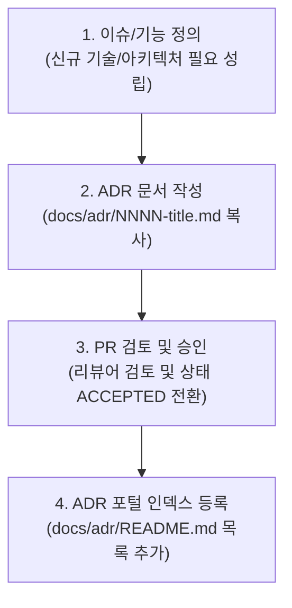

# 📜 아키텍처 의사결정 기록 (ADR - Architecture Decision Records) 포털

이 디렉토리는 `shinhan-delivery` 프로젝트의 **중요한 아키텍처 의사결정(Architecture Decisions)의 도입 배경, 비교 대안, 최종 결정 이유, 파급 효과를 기록하고 관리하는 공식 지식 포털**입니다.

---

## 📐 1. ADR 작성 가이드라인 (Systemization Rule)

새로운 기능을 개발하거나 프로젝트 구조를 변경할 때 아래 **3대 조건 중 하나에 해당하면 100% 의무적으로 ADR을 작성**해야 합니다.

### 🔴 ADR 필수 작성 조건 (Trigger Conditions):
1. **신규 기술 스택/라이브러리/프레임워크 도입:**
   - 예: Spring Security, JJWT, QueryDSL, Redis, Kafka, FeignClient 등 신규 기술 채택 시
2. **DB 스키마 구조 변경 및 마이그레이션 아키텍처 설계:**
   - 예: DDL 무중단 마이그레이션 전략, 샤딩/파티셔닝, 캐싱 전략 변경 시
3. **공통 횡단 관심사(Cross-cutting Concerns) 및 전역 규칙 변경:**
   - 예: 전역 예외 처리 체계 변경, REST API 응답 포맷 규격 변경, 로깅/트레이싱 아키텍처 변경 시

---

## 🛠️ 2. ADR 작성 절차 4단계 Workflow

1. **파일 생성:** `docs/adr/template.md`를 복사하여 `docs/adr/NNNN-title-in-kebab-case.md` 형태로 생성 (예: `0002-querydsl-jpa-adoption.md`).
2. **내용 작성:** 5대 구조(상태, 배경, 비교 대안, 최종 결정, 파급 효과)를 작성.
3. **상태 관리:**
   - `PROPOSED` (제안됨 / PR 검토 중)
   - `ACCEPTED` (채택됨 / PR 병합 완료)
   - `REJECTED` (반려됨)
   - `SUPERSEDED` (더 새로운 ADR에 의해 대체됨)

---

## 📋 3. ADR 전체 목록 (ADR Registry Index)

| 번호 (ID) | 의사결정 제목 (Title) | 상태 (Status) | 작성일 | 연관 이슈/PR |
| :--- | :--- | :--- | :--- | :--- |
| [**ADR-0001**](./0001-무상태-JWT-인증-체계.md) | JWT 기반 무상태 인증 체계 채택 | 🟢 ACCEPTED | 2026-07-28 | [#70](https://github.com/ShinhanDSProject/shinhan-delivery/issues/70) / [#84](https://github.com/ShinhanDSProject/shinhan-delivery/pull/84) |
| [**ADR-0002**](./0002-SSR-쿠키-폴백-인증-체계.md) | SSR 페이지를 위한 JWT 쿠키 폴백 인증 도입 | 🟡 PROPOSED | 2026-08-11 | (미정) |

---

## 📄 4. 템플릿 사용법

새로운 ADR을 작성하려면 [**ADR 표준 템플릿 (`ADR-템플릿.md`)**](./ADR-템플릿.md)을 복사하여 작성하세요.
