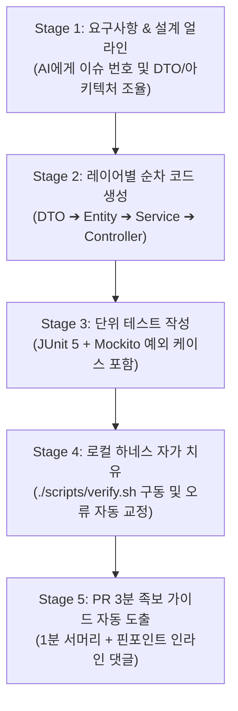
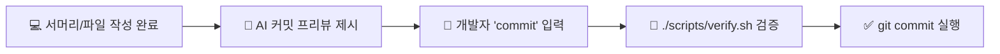
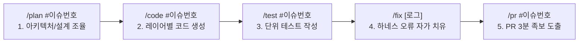

---
metadata:
  version: "1.0.0"
  ssot_owner: "docs/ai-paired-development-guide.md"
  last_updated: "2026-07-28"
  status: "APPROVED (SSOT Primary)"
---

# 🤖 AI 기반 초급자 페어 프로그래밍 & 차근차근 개발 가이드북

이 문서는 `shinhan-gaecheokja` 프로젝트의 **초급 개발자가 AI 에이전트(Antigravity, Cursor, Copilot 등)와 1:1 페어 프로그래머로 협업하며 5단계 순차 워크플로우에 따라 차근차근 무결점 코드를 완성하는 실전 가이드북**입니다.

> [!NOTE]
> 본 가이드북은 [docs/ssot-documentation-policy.md](./ssot-documentation-policy.md) 단일 원본 원칙과 [docs/beginner-crud-issue-template-guide.md](./beginner-crud-issue-template-guide.md) 초급자 CRUD 가이드를 100% 반영합니다.

---

## 🏛️ AI 페어 프로그래밍 5단계 가이드 워크플로우

AI에게 한 번에 *"이 기능 다 만들어줘"*라고 요청하면 전체 아키텍처가 깨지기 쉽습니다.  
초급자는 아래 **5단계 순차 프롬프트(Sequential Prompting) 플로우**에 따라 AI와 차근차근 대화하며 조율합니다:



---

## 🌿 세분화 마이크로 커밋(Micro-Commit) & `commit` 커맨드 승인 규칙

개발 진행 시 큰 커밋 1개가 아니라, **레이어/파일 단위 서브태스크가 완성될 때마다 AI가 커밋 프리뷰를 제시하고, 개발자가 `commit` 명령어를 입력하여 즉시 커밋**합니다:



### 📌 5단계 세분화 마이크로 커밋 규격 예시 (Issue #93)
1. **[1단계: DTO]** `feat(#93): [회원] 이메일 로그인 Request/Response DTO 수록`
2. **[2단계: Entity/Repo]** `feat(#93): [회원] Member Entity @Getter 확인 및 MemberRepository 수록`
3. **[3단계: Service]** `feat(#93): [회원] MemberService 이메일 검증 및 JWT 발급 비즈니스 로직 구현`
4. **[4단계: Controller]** `feat(#93): [회원] MemberController POST /login 엔드포인트 수록`
5. **[5단계: Test]** `test(#93): [회원] MemberService 이메일 로그인 성공 및 예외 단위 테스트 수록`

> **💡 대화형 승인 팁:** 각 파일 작성 완료 후 개발자가 `commit` (또는 `/commit`)이라고 입력하면 AI가 로컬 하네스(`verify.sh`) 구동 후 즉시 해당 서브태스크 마이크로 커밋을 실행합니다.

---

## ⚡ 초간편 6대 슬래시 커맨드(Slash Command) 인터페이스

긴 프롬프트 문장을 매번 복사/붙여넣기할 필요 없이, 초급 개발자는 **터미널이나 AI 차트창에 아래 5가지 한 줄 슬래시 커맨드만 입력**하여 차근차근 개발을 진행할 수 있습니다:



---

### 1️⃣ `/plan #이슈번호` : 요구사항 & 아키텍처 조율
- **사용법:** `/plan #93`
- **AI 수행 역할:** 이슈 #93의 DTO 명세, Entity/Repository 필요 여부, `BusinessException` 매핑, 프로젝트 수칙(Lombok `@Getter` 100%, Entity 반환 금지) 준수 방안을 1분 만에 설계하여 개발자에게 승인을 요청합니다.

### 2️⃣ `/code #이슈번호` : 단방향 레이어별 순차 코드 생성
- **사용법:** `/code #93`
- **AI 수행 역할:** DTO ➔ Entity & Repository ➔ Service ➔ Controller 순서로 단방향 레이어링 규칙 및 `code-convention.md` 수칙을 100% 반영한 전체 코드를 생성합니다.

### 3️⃣ `/test #이슈번호` : 단위 테스트 자동 작성
- **사용법:** `/test #93`
- **AI 수행 역할:** JUnit 5와 Mockito를 활용하여 정상 작동(200/201) 및 비즈니스 예외(400/401/404/409) 케이스에 대한 격리된 단위 테스트 코드를 생성합니다.

### 4️⃣ `/fix [에러로그]` : 하네스 자가 치유 (Self-Healing)
- **사용법:** `/fix [verify.sh 구동 실패 로그]`
- **AI 수행 역할:** `./scripts/verify.sh` 구동 중 발생한 Spotless 린트 오타 또는 테스트 실패 로그를 객관적 스택트레이스로 분석하여 0 exit code 상태로 교정한 수정한 코드를 제공합니다.

### 5️⃣ `/pr #이슈번호` : PR 3분 족보 가이드 & 인라인 댓글 도출
- **사용법:** `/pr #93`
- **AI 수행 역할:** 리뷰어(팀장)를 위한 `1분 서머리 + Mermaid 읽기 순서 + 체크리스트` 및 `Files changed` 탭 핀포인트 인라인 댓글 3개를 자동 생성합니다.

---

## 📋 5단계 상세 프롬프트 (참고용 원문)

슬래시 커맨드의 내부 동작 원리 및 세부 프롬프트 원문입니다:

---

### 🔹 Stage 1: 요구사항 & 아키텍처 얼라인 (설계 검증)
> **AI 전달 프롬프트:**
> ```text
> 안녕하세요! 저는 신입 개발자이고 GitHub Issue #[이슈번호] ([이슈제목]) 작업을 시작하려고 합니다.
> 코드를 작성하기 전에 먼저 아래 내용을 점검해 주세요:
> 1. 이 기능에 필요한 Request/Response DTO 명세 구조
> 2. Entity 및 Repository 변경/추가 필요 여부
> 3. 발생 가능한 비즈니스 예외(BusinessException)와 ErrorCode 매핑
> 4. 프로젝트 규칙(Lombok @Getter 100% 사용, Controller에서 Entity 직접 반환 금지) 준수 방안
> 
> 위 4가지 설계를 먼저 요약해 주시고, 승인하면 다음 단계를 진행하겠습니다.
> ```

---

### 🔹 Stage 2: 레이어별 순차 코드 작성 (Clean Code Construction)
> **AI 전달 프롬프트:**
> ```text
> 좋습니다! 아키텍처 설계가 승인되었습니다. 
> 프로젝트의 단방향 레이어 규칙(Controller -> Service -> Repository)과 code-convention.md 수칙에 맞추어 다음 순서로 코드를 작성해 주세요:
> 
> 1. DTO 작성 (Lombok @Getter, @NoArgsConstructor/@AllArgsConstructor 적용, 수동 Getter 0개, Bean Validation 어노테이션 부착)
> 2. Entity & Repository 작성/확인 (@Getter 적용)
> 3. Service 로직 구현 (BusinessException 예외 처리 포함)
> 4. Controller 엔드포인트 수록 (Entity 직접 반환 절대 금지, ResponseEntity<DTO> 반환)
> 
> 각 레이어별 코드를 완성된 파일 전체 형태로 보여주세요.
> ```

---

### 🔹 Stage 3: 단위 테스트 작성 (Unit Test Verification)
> **AI 전달 프롬프트:**
> ```text
> 소스 코드가 작성되었습니다. 이제 JUnit 5와 Mockito를 활용하여 Service와 Controller에 대한 단위 테스트 코드를 작성해 주세요:
> 1. 정상 작동 케이스 (200 OK / 201 Created)
> 2. 비즈니스 예외 케이스 (400 Bad Request, 401 Unauthorized, 404 Not Found, 409 Conflict 등)
> 3. Mockito @Mock 및 @InjectMocks를 활용한 격리된 단위 테스트
> ```

---

### 🔹 Stage 4: 로컬 하네스 자가 치유 (Self-Healing Harness Loop)
> **AI 전달 프롬프트:**
> ```text
> 터미널에서 `./scripts/verify.sh`를 실행했습니다.
> [터미널 에러 로그를 여기에 붙여넣기]
> 
> 발생한 Spotless 린트 오타 또는 테스트 실패 원인을 객관적 스택트레이스를 바탕으로 분석하고, 0 exit code 상태가 되도록 수정한 최종 코드를 제공해 주세요.
> ```

---

### 🔹 Stage 5: PR 3분 족보 가이드 및 인라인 댓글 생성
> **AI 전달 프롬프트:**
> ```text
> `./scripts/verify.sh` 로컬 하네스 검증이 100% 통과했습니다!
> 팀장(리뷰어)이 3분 만에 핵심 코드를 검토할 수 있도록 `docs/pr-review-guide.md` 규격에 부합하는 PR 본문을 생성해 주세요:
> 1. 1분 퀵 서머리 (Executive Summary)
> 2. 추천 파일 읽기 순서 (Mermaid 다이어그램 포함)
> 3. 파일별 1줄 핵심 체크포인트
> 4. `Files changed` 탭에 부착할 핀포인트 인라인 댓글 3가지 위치 및 내용
> ```

---

## 💡 AI와 함께 일할 때 초급 개발자가 지켜야 할 3대 룰

1. **AI 코드를 눈으로 직접 검증 (Blind Trust 금지):**  
   AI가 생성한 코드에 수동 Getter/Setter가 들어가거나, Controller에서 Entity를 그대로 반환하지 않는지 체크합니다.
2. **`./scripts/verify.sh` 1초 구동 습관화:**  
   AI에게 수정을 요청하기 전 반드시 `./scripts/verify.sh`를 구동하여 자동 검증을 받습니다.
3. **학습 노트 기록:**  
   AI가 설명해 준 개념 중 새로 알게 된 점(예: `@Version` 낙관적 락, `@Valid` Bean Validation)을 본인의 학습 노트나 PR 설명에 기록합니다.

---

## 🧪 실증 검증 명령어 (Verification Commands)

```bash
# 로컬 하네스 검증 구동
./scripts/verify.sh
```
