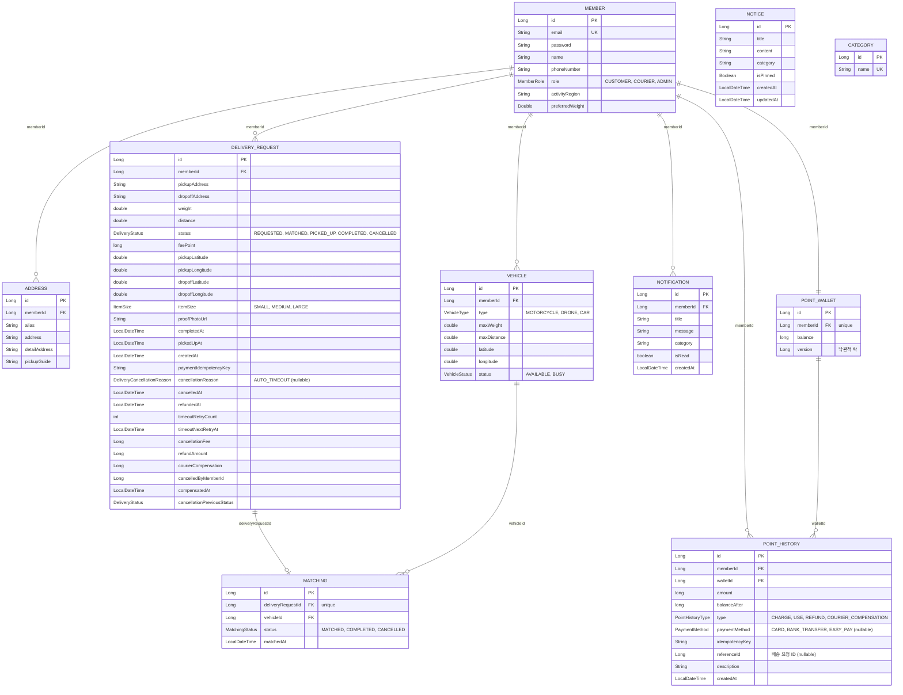

---
metadata:
  ssot_owner: "docs/architecture/ERD-데이터베이스-연관관계도.md"
  last_updated: "2026-08-11"
  status: "APPROVED (SSOT Primary)"
---

# 프로젝트 ERD (Entity-Relationship Diagram)

이 문서는 `shinhan-delivery`의 **전체 테이블 컬럼과 FK 기반 연관관계도에 대한 단일 원본(SSOT) 문서**입니다. Entity를 추가하거나 필드·FK·연관관계를 변경하면 같은 PR 안에서 이 문서도 함께 갱신합니다 ([code-convention.md](../code-convention.md) §4, §15, §17 참고).

- 컬럼 타입·제약조건의 정확한 원본은 `src/main/resources/db/migration/`의 Flyway 마이그레이션 파일입니다. 이 문서는 그것을 사람이 한눈에 보기 좋게 요약한 것이며, 상충하면 마이그레이션 파일이 우선합니다.
- 연관관계 표기(`||--o{` 등)는 FK 컬럼을 기준으로 그린 것이지, 반드시 양방향 JPA 연관관계를 의미하지는 않습니다. 이 저장소는 FK Long 필드를 쓰기 경로로 유지하고 읽기 전용 `@ManyToOne`만 추가하는 정책을 쓰므로([code-convention.md](../code-convention.md) §4), `@OneToMany` 컬렉션이 실제 코드에 있는지는 각 Entity 클래스를 직접 확인하세요.

---

## 설계 배경 (WHY & Trade-offs)

**왜(WHY) 이 문서가 필요한가:** Entity 간 FK 연관관계는 여러 도메인 패키지에 흩어져 있어, 코드만 보고는 전체 테이블 관계를 한눈에 파악하기 어렵습니다. PR마다 Entity 관계도가 코드와 따로 노는 것을 막기 위해, 관계도 자체를 SSOT 문서로 등록하고 Entity 변경 시 같은 PR에서 갱신하도록 강제합니다.

**고려했던 대안(Alternatives Considered):**
- Entity 클래스에 Javadoc으로 관계를 주석만 다는 방식 — 개별 클래스를 봐야만 전체 그림이 보여서 기각.
- `@OneToMany` 양방향 연관관계로 코드 자체가 관계도 역할을 겸하게 하는 방식 — N+1, cascade/orphanRemoval 관리 부담이 커서(§4 참고) 기각하고, 대신 FK Long 필드 + 읽기 전용 `@ManyToOne`만 유지하는 현재 정책을 택함.

**장단점(Trade-offs):**
- 장점: 코드 변경 없이 전체 스키마 관계를 한 문서에서 조회 가능, 신규 인원 온보딩 시간 단축.
- 단점: 문서와 코드가 별도로 존재하므로 갱신을 누락하면 곧바로 드리프트(내용 불일치)가 발생 — 이를 완화하기 위해 §17 PR 체크리스트에 ERD 갱신 여부 확인 항목을 두고 있음.

---

## ER 다이어그램



---

## 도메인 참고 (다른 도메인 FK가 없는 Entity)

- **`NOTICE`**: 공지사항. 다른 도메인을 참조하지 않는 독립 콘텐츠 테이블.
- **`CATEGORY`**: 물품 카테고리 참조 테이블. 다른 도메인과 FK 연관관계 없이 조회 전용으로 쓰인다.

## 관계 요약

| 관계 | 종류 | 설명 |
|---|---|---|
| `Member` → `Address` | 1:N | 회원 한 명이 여러 자주 쓰는 주소를 가질 수 있다 |
| `Member` → `Vehicle` | 1:N | 회원(배송원)이 여러 차량을 소유할 수 있다 |
| `Member` → `DeliveryRequest` | 1:N | 회원(고객)이 여러 배송을 요청할 수 있다 |
| `Member` → `Notification` | 1:N | 회원이 여러 알림을 받는다 |
| `Member` → `PointWallet` | 1:1 | 회원 한 명이 지갑 하나를 가진다 (`member_id` unique) |
| `Member` → `PointHistory` | 1:N | 회원의 포인트 충전/사용 이력 |
| `DeliveryRequest` → `Matching` | 1:0..1 | 배송 요청 하나에 매칭은 최대 하나 (`delivery_request_id` unique) |
| `Vehicle` → `Matching` | 1:N | 차량 한 대가 여러 매칭(배송 이력)에 등장할 수 있다 |
| `PointWallet` → `PointHistory` | 1:N | 지갑 하나에 여러 충전/사용 이력이 쌓인다 |

---

## 검증 방법 (Reproducible Verification)

아래 명령은 **Entity 코드와 실제 DB 스키마가 서로 어긋나지 않는지**만 검증합니다 — `spring.jpa.hibernate.ddl-auto: validate` 설정 덕분에 애플리케이션/테스트 구동 시점에 자동으로 확인됩니다. Entity에 선언된 컬럼·FK가 Flyway로 적용된 실제 테이블과 다르면 그 즉시 `SchemaManagementException`으로 기동이 실패합니다. **이 문서(erd.md)의 표·다이어그램 텍스트 자체가 코드와 일치하는지는 자동으로 검증되지 않으므로, Entity를 변경했다면 이 문서도 사람이 직접 함께 갱신해야 합니다** (§15 참고).

```bash
./scripts/verify.sh
```

**기대 결과:** 마지막에 아래와 같이 전체 통과 메시지가 출력되고 종료 코드가 `0`이어야 합니다.

```text
🎉 [Test Harness] 모든 검증 통과! 안전하게 커밋/PR 가능합니다.
```

만약 Entity의 `@JoinColumn`/`@Column` 선언과 Flyway 마이그레이션(`src/main/resources/db/migration/`)이 어긋나 있다면, 이 명령이 `SchemaManagementException: Schema-validation`으로 실패합니다 — 이 경우 Entity 코드와 실제 DB 스키마 중 어느 쪽이 잘못됐는지 먼저 확인하세요.
