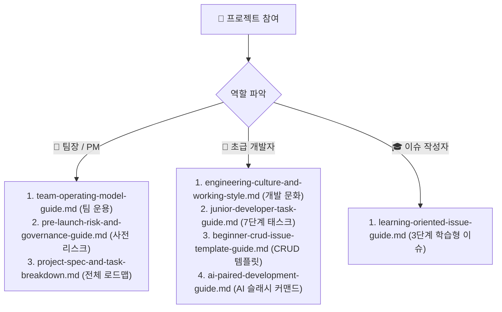

---
metadata:
  version: "1.1.0"
  ssot_owner: "docs/architecture/SSOT-문서화-정책-가이드.md"
  last_updated: "2026-07-28"
  status: "APPROVED (SSOT Primary)"
---

# 🏛️ 프로젝트 문서 단일 원본 관리(SSOT) 및 전문 기술 문서화 표준 가이드북

이 문서는 `shinhan-delivery` 프로젝트의 **모든 지식 자산, 가이드북, 규격 문서를 작성할 때 적용되는 단일 원본 관리(SSOT - Single Source of Truth) 시스템 및 구글/애플/메타 수준의 전문 기술 문서화 표준 규격**입니다.

---

## 📌 1. SSOT (Single Source of Truth)란 무엇이며 왜 필수인가요?

프로젝트 규모가 커지고 문서의 양이 많아질수록 **동일한 수칙이 여러 문서에 중복 작성(Duplicate Copy)**되는 현상이 발생합니다.  
규칙이 변경되었을 때 일부 문서만 수정되면 **문서 간 내용 불일치(Documentation Drift)**가 발생하여 개발자와 AI가 어떤 규칙이 진짜인지 혼란을 겪게 됩니다.

> [!IMPORTANT]
> **SSOT 3대 핵심 원칙**
> 1. 프로젝트 내 **모든 지식/규칙은 오직 단 하나의 전담 문서만 원본(Primary Owner)으로 갖는다.**
> 2. 파생 문서(가이드북, 체크리스트, README 등)에서는 동일 내용을 재작성하지 않고, **원본 문서의 마크다운 링크로 참조(Cross-Reference)만 집행**한다.
> 3. 모든 문서는 아래 **5대 전문 기술 문서화 작성 규격**을 100% 준수하여 작성한다.

---

## 📐 2. SSOT 문서 작성 3대 철칙 (Core Rules)

1. **Rule 1 (Single Primary Owner):** 지식 영역별로 원본을 관리하는 단 하나의 정식 문서만 지정을 허용합니다.
2. **Rule 2 (Zero Redundancy):** 파생 가이드북이나 PR 본문에 원본 규약의 구체적 내용을 2번 이상 복사/재작성(Duplicate Copy)하는 행위를 금지합니다.
3. **Rule 3 (Cross-Link Reference Only):** 세부 규약이 필요한 경우 반드시 원본 문서의 상대 경로 마크다운 링크(`[code-convention.md](../code-convention.md)`)로 참조시킵니다.

---

## 🗺️ 3. 우리 프로젝트의 SSOT 문서 지도 (Primary SSOT Registry)

프로젝트 내 지식 영역별 **유일한 단일 원본 문서 매핑 테이블**입니다:

| 지식 영역 (Knowledge Domain) | 단일 원본 문서 (Single Primary Owner) | 파생 참조 문서 (Referencing Docs) |
| :--- | :--- | :--- |
| **전체 E2E 유저 플로우 & 화면-API 매핑** | [`docs/architecture/전체-유저-플로우-가이드.md`](./전체-유저-플로우-가이드.md) | `README.md` |
| **코딩 규약 & 아키텍처 규칙** | [`code-convention.md`](../code-convention.md) | `AGENTS.md`, `테스트-하네스-판단-및-통제-정책.md` |
| **데이터베이스 ERD & 테이블 연관관계도** | [`docs/architecture/ERD-데이터베이스-연관관계도.md`](./ERD-데이터베이스-연관관계도.md) | `code-convention.md` |
| **AI 에이전트 작업 8대 원칙** | [`AGENTS.md`](../AGENTS.md) | `README.md`, `code-convention.md` |
| **아키텍처 의사결정 기록 (ADR)** | [`docs/adr/README.md`](./adr/README.md) | `docs/architecture/보안-및-JWT-가이드.md`, `README.md` |
| **PR 리뷰 & 인라인 댓글 작성 규격** | [`docs/harness/PR-리뷰어-3분-족보-가이드.md`](./PR-리뷰어-3분-족보-가이드.md) | `code-convention.md`, `AGENTS.md` |
| **테스트 하네스 판단 & 통제 정책** | [`docs/harness/테스트-하네스-판단-및-통제-정책.md`](./테스트-하네스-판단-및-통제-정책.md) | `AGENTS.md`, `README.md` |
| **기능 개발 전 설계 2단계 PR 절차** | [`docs/harness/기능-설계-2단계-PR-절차-가이드.md`](./기능-설계-2단계-PR-절차-가이드.md) | `README.md` |
| **Git Flow & 커밋 컨벤션** | [`docs/harness/Git-Flow-및-커밋-컨벤션.md`](./Git-Flow-및-커밋-컨벤션.md) | `README.md` |
| **REST API 설계 규격** | [`docs/architecture/REST-API-설계-규격-가이드.md`](./REST-API-설계-규격-가이드.md) | `README.md` |
| **전역 예외 처리 규격** | [`docs/architecture/전역-예외-처리-규격-가이드.md`](./전역-예외-처리-규격-가이드.md) | `README.md` |
| **프로젝트 전체 기능 명세 & 스프린트 로드맵** | [`docs/architecture/프로젝트-스펙-및-태스크-분할.md`](./프로젝트-스펙-및-태스크-분할.md) | `README.md` |
| **팀 리더십 & 프로젝트 운용 프레임워크** | [`docs/onboarding/팀-운용-프레임워크-가이드.md`](./팀-운용-프레임워크-가이드.md) | `README.md` |
| **팀 개발 문화 & 일하는 방식 7대 철학** | [`docs/onboarding/엔지니어링-문화-및-일하는-방식.md`](./엔지니어링-문화-및-일하는-방식.md) | `README.md` |
| **초급 개발자 7단계 태스크 분할 가이드** | [`docs/beginners/초급-개발자-태스크-분할-가이드.md`](./초급-개발자-태스크-분할-가이드.md) | `README.md` |
| **학습형 3단계 GitHub Issue 작성 규격** | [`docs/beginners/학습형-이슈-작성-규격-가이드.md`](./학습형-이슈-작성-규격-가이드.md) | `README.md` |
| **AI 기반 초급자 페어 프로그래밍 가이드** | [`docs/onboarding/AI-기반-페어-프로그래밍-가이드.md`](./AI-기반-페어-프로그래밍-가이드.md) | `README.md` |
| **초급자 CRUD & 레이어별 이슈 분할 템플릿** | [`docs/beginners/초급자-CRUD-이슈-템플릿-가이드.md`](./초급자-CRUD-이슈-템플릿-가이드.md) | `README.md` |
| **프로젝트 착수 전 6대 사전 리스크 감사** | [`docs/onboarding/사전-리스크-감사-및-거버넌스-가이드.md`](./사전-리스크-감사-및-거버넌스-가이드.md) | `README.md` |

---

## 🧭 4. 신규 가이드북 종합 내비게이션 & 읽기 흐름도 (Document Navigation Map)

프로젝트에 참여하는 팀원(리더, 팀원, 초급 개발자)이 자신의 역할과 상황에 따라 **어떤 순서로 문서를 참조해야 하는지 보여주는 통합 내비게이션 지도**입니다:



---

## 🏆 5. 세계 최고 수준(World-Class) 전문 기술 문서화 5대 작성 규격

문서의 기술적 깊이(Technical Depth)와 가독성, 전문적 권위를 극대화하기 위해 앞으로 프로젝트 내 **모든 마크다운 문서는 다음 5대 작성 규격을 100% 반영**합니다:

### ① 📋 메타데이터 헤더 표기 (Standard Metadata Header)
모든 문서의 최상단에 YAML Front-matter 형태의 표준 메타데이터 헤더를 반드시 수록합니다:
```yaml
---
metadata:
  version: "1.0.0"
  ssot_owner: "docs/architecture/SSOT-문서화-정책-가이드.md"
  last_updated: "2026-07-28"
  status: "APPROVED"
---
```

### ② 📊 Mermaid 아키텍처 다이어그램 필수 배치 (Visual Diagramming)
텍스트만으로 구성된 서술을 지양하고, 시스템 구조/흐름을 한눈에 파악할 수 있도록 **Mermaid.js 다이어그램(Sequence, Flowchart, Component)**을 상단에 1개 이상 필수 수록합니다.

> [!TIP]
> **다이어그램 예시:**
> ```mermaid
> graph TD
>     Client[클라이언트] -->|인증 요청| Security[Spring Security Filter]
>     Security -->|토큰 검증| JwtProvider[JwtProvider]
>     JwtProvider -->|인가 완료| Service[MemberService]
> ```

### ③ 💡 GitHub 시각적 캘아웃 블록 활용 (Visual Callout Blocks)
주의사항, 팁, 중요 수칙을 전달할 때는 단순 텍스트 대신 **GitHub 표준 캘아웃 블록**을 도입하여 직관적인 시각적 조화를 이룹니다:
- `> [!NOTE]` : 배경 설명 및 참고 정보
- `> [!TIP]` : 성능 최적화, 개발 모범 사례(Best Practices)
- `> [!IMPORTANT]` : 필수 준수 요구사항 및 핵심 수칙
- `> [!WARNING]` : 호환성 문제, 주의가 필요한 사이드 이펙트
- `> [!CAUTION]` : 데이터 손실이나 보안 위험이 있는 고위험 액션

### ④ 🧠 의사결정 이유 및 Trade-off 명시 (Empirical Rationale & Context)
"무엇을(WHAT) 어떻게(HOW) 구현하는가"만 설명하지 않고, **"왜 이 방식을 선택했는지(WHY)", "고려했던 다른 대안은 무엇인지(Alternatives Considered)", "장단점(Trade-offs)"**을 명쾌하게 기술합니다.

### ⑤ 🧪 재현 가능한 실증 검증 명령어 기재 (Reproducible Verification Commands)
문서의 마지막 섹션에는 읽는 사람이 터미널에서 바로 실행해 볼 수 있는 **실증 검증 명령어(`cURL`, `./scripts/verify.sh`, `./gradlew test`)와 기대 결과(Expected Output)**를 명확히 포함시킵니다.

---

## 🛠️ 6. 신규 문서 작성 및 PR 검토 시 SSOT 체크리스트

모든 개발자와 AI 에이전트는 신규 문서를 생성하거나 수정할 때 다음 사항을 반드시 검증합니다:

- [ ] 작성하려는 내용의 단일 원본(Primary Owner) 문서가 이미 존재하지 않는가?
- [ ] 기존 원본 문서가 존재할 경우, 내용을 중복 기술하지 않고 마크다운 링크로 참조시켰는가?
- [ ] 문서 상단에 YAML 메타데이터 헤더와 시각적 캘아웃 블록(`> [!NOTE]` 등)을 적용했는가?
- [ ] 아키텍처 다이어그램(Mermaid)과 기술적 의사결정 배경(WHY & Trade-offs)이 포함되었는가?
- [ ] 새로운 지식 영역일 경우 `docs/ssot-documentation-policy.md` 단일 원본 지도 테이블에 정식 등록했는가?

