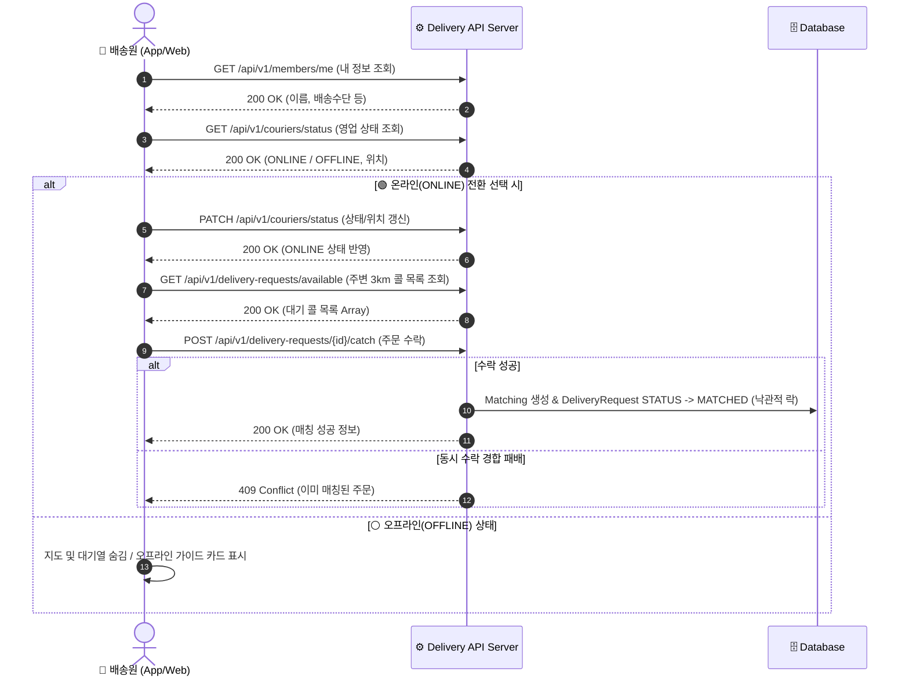

# 📜 배송원 워크스페이스 & 배송 매칭 API 표준 명세서 (API Specification)

> **Document Version**: `v1.2.0`  
> **Last Updated**: `2026-08-06`  
> **Author**: ShinhanDS Delivery Backend Team  
> **Target Audience**: Frontend / Courier Mobile App Developers & AI Agents  

---

## 📌 1. 개요 (Overview)

본 API 명세서는 **배송원(Courier/Rider) 워크스페이스 홈 UI** 및 **실시간 배송 매칭 시스템**에서 사용되는 백엔드 RESTful API에 대한 표준 규격 문서입니다.

* **Base URL**: `/api/v1`
* **Content-Type**: `application/json;charset=UTF-8`
* **인증 방식**: `Bearer <JWT_ACCESS_TOKEN>` (HTTP Header `Authorization` 사용)

---

## 🔄 2. 라이더 워크플로우 & API 연동 흐름 (Sequence Diagram)



---

## 📋 3. 상세 API 명세 목록

### 1️⃣ 배송원 본인 프로필 조회 API
> **로그인한 배송원의 기본 인적사항 및 배송 수단을 조회합니다.**

* **Endpoint**: `GET /api/v1/members/me`
* **Auth Required**: `Yes (COURIER or ALL)`

#### 📥 Request Headers
| Header Name | Type | Required | Description | Example |
| :--- | :--- | :--- | :--- | :--- |
| `Authorization` | String | **Yes** | JWT 인증 토큰 | `Bearer eyJhbGciOi...` |

#### 📤 Response Body (`200 OK`)
```json
{
  "id": 1,
  "email": "courier01@shinhan.com",
  "name": "홍길동",
  "phoneNumber": "010-1234-5678",
  "role": "COURIER",
  "transportMode": "오토바이"
}
```

---

### 2️⃣ 배송원 영업 상태 조회 API
> **배송원의 현재 영업 상태(ONLINE/OFFLINE) 및 저장된 GPS 위치를 조회합니다.**

* **Endpoint**: `GET /api/v1/couriers/status`
* **Auth Required**: `Yes (COURIER)`

#### 📥 Request Headers
| Header Name | Type | Required | Description | Example |
| :--- | :--- | :--- | :--- | :--- |
| `Authorization` | String | **Yes** | JWT 인증 토큰 | `Bearer eyJhbGciOi...` |

#### 📤 Response Body (`200 OK`)
```json
{
  "memberId": 1,
  "workStatus": "ONLINE",
  "latitude": 37.5665,
  "longitude": 126.9780
}
```

#### 🚨 Error Responses
| HTTP Status | Error Code | Description |
| :--- | :--- | :--- |
| `401 Unauthorized` | `UNAUTHORIZED` | 인증 실패 또는 토큰 만료 |
| `403 Forbidden` | `ACCESS_DENIED` | 배송원(COURIER) 권한이 아닌 사용자의 접근 |

---

### 3️⃣ 배송원 영업 상태 및 GPS 위치 변경 API
> **출근(ONLINE) / 퇴근(OFFLINE) 상태 및 실시간 GPS 위도/경도를 업데이트합니다.**

* **Endpoint**: `PATCH /api/v1/couriers/status`
* **Auth Required**: `Yes (COURIER)`

#### 📥 Request Headers
| Header Name | Type | Required | Description | Example |
| :--- | :--- | :--- | :--- | :--- |
| `Authorization` | String | **Yes** | JWT 인증 토큰 | `Bearer eyJhbGciOi...` |

#### 📥 Request Body
```json
{
  "status": "ONLINE",
  "latitude": 37.5665,
  "longitude": 126.9780
}
```

| Field Name | Type | Required | Description | Constraints |
| :--- | :--- | :--- | :--- | :--- |
| `status` | String | **Yes** | 변경할 영업 상태 | `ONLINE` 또는 `OFFLINE` |
| `latitude` | Double | **Yes** | 현재 위치 위도 (Latitude) | -90.0 ~ 90.0 |
| `longitude` | Double | **Yes** | 현재 위치 경도 (Longitude) | -180.0 ~ 180.0 |

#### 📤 Response Body (`200 OK`)
```json
{
  "memberId": 1,
  "workStatus": "ONLINE",
  "latitude": 37.5665,
  "longitude": 126.9780
}
```

---

### 4️⃣ 주변 대기 중인 배달 콜(주문) 목록 조회 API
> **배송원 위치 기준 반경 3km 이내의 대기 중인(`REQUESTED`) 주문 목록을 픽업 거리순으로 조회합니다.**

* **Endpoint**: `GET /api/v1/delivery-requests/available`
* **Auth Required**: `Yes (COURIER)`

#### 📥 Query Parameters (Optional)
| Parameter Name | Type | Default | Description |
| :--- | :--- | :--- | :--- |
| `radiusKm` | Double | `3.0` | 조회 검색 반경 (km 단위) |
| `lat` | Double | Current Lat | 배송원 기준 위도 |
| `lng` | Double | Current Lng | 배송원 기준 경도 |

#### 📤 Response Body (`200 OK`)
```json
[
  {
    "deliveryRequestId": 101,
    "pickupAddress": "서울 마포구 백범로 31 (신한DS 건물)",
    "dropoffAddress": "서울 마포구 독막로 12 (상수빌딩)",
    "distanceKm": 2.1,
    "distanceToPickupKm": 0.8,
    "feePoint": 4500,
    "itemSize": "소형",
    "createdAt": "2026-08-06T09:30:00"
  },
  {
    "deliveryRequestId": 102,
    "pickupAddress": "서울 영등포구 여의대로 108 (더현대)",
    "dropoffAddress": "서울 영등포구 신길로 45 (아파트 102동)",
    "distanceKm": 3.5,
    "distanceToPickupKm": 1.4,
    "feePoint": 6000,
    "itemSize": "중형",
    "createdAt": "2026-08-06T09:32:15"
  }
]
```

---

### 5️⃣ 배달 주문 수락 (Catch) API
> **대기 중인 배달 콜을 수락하여 배송원 본인에게 배차 매칭시킵니다. (낙관적 락 적용)**

* **Endpoint**: `POST /api/v1/delivery-requests/{deliveryRequestId}/catch`
* **Auth Required**: `Yes (COURIER)`

#### 📥 Path Variables
| Variable Name | Type | Description | Example |
| :--- | :--- | :--- | :--- |
| `deliveryRequestId` | Long | 수락할 배달 요청 ID | `101` |

#### 📤 Response Body (`200 OK` 또는 `201 Created`)
```json
{
  "matchingId": 501,
  "deliveryRequestId": 101,
  "courierId": 1,
  "status": "MATCHED",
  "matchedAt": "2026-08-06T09:44:00"
}
```

#### 🚨 Error Responses
| HTTP Status | Error Code | Description |
| :--- | :--- | :--- |
| `400 Bad Request` | `INVALID_DELIVERY_STATUS` | 이미 취소되었거나 수락 불가능한 주문 |
| `409 Conflict` | `DELIVERY_ALREADY_MATCHED` | **동시성 경합 발생**: 다른 배송원이 찰나의 순간 먼저 수락함 |
| `404 Not Found` | `DELIVERY_REQUEST_NOT_FOUND` | 요청한 ID의 배달 건이 존재하지 않음 |

---

## 🔒 4. 공통 에러 응답 포맷 (Error Response Specification)

예외 발생 시 백엔드 글로벌 예외 처리기(`GlobalExceptionHandler`)가 아래의 표준 규격 JSON 구조로 4xx/5xx 응답을 반환합니다.

```json
{
  "timestamp": "2026-08-06T09:45:00.123",
  "status": 409,
  "error": "Conflict",
  "code": "DELIVERY_ALREADY_MATCHED",
  "message": "이미 다른 배송원에게 배차 완료된 주문입니다.",
  "path": "/api/v1/delivery-requests/101/catch"
}
```

---

> [!NOTE]
> 본 API 명세서는 단일 진실 원칙(SSOT)을 준수하며, 백엔드 서비스의 최신 상태를 반영하고 있습니다.
