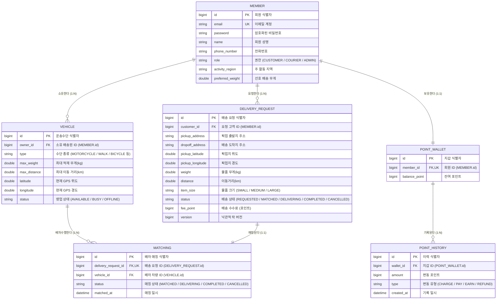

# 🗄️ 배송원 워크스페이스 & 배송 매칭 시스템 ERD 명세서

> **Document Version**: `v1.1.0`  
> **Last Updated**: `2026-08-06`  
> **Author**: ShinhanDS Delivery Database Engineering Team  
> **Target Audience**: Backend Developers, DBAs, Frontend Developers & AI Agents  

---

## 📌 1. 개요 (Overview)

본 명세서는 **배송원(Courier) 워크스페이스 및 배송 매칭 시스템**의 데이터 모델링(Database Entity Relationship Diagram)을 정의합니다.

* **Database**: MySQL 8.0+ / H2 (Test Environment)
* **ORM Engine**: Spring Data JPA / Hibernate
* **동시성 제어**: 낙관적 락(Optimistic Locking via `@Version`)

---

## 📐 2. ERD 다이어그램 (Mermaid ER Diagram)

---

## 📑 3. 테이블별 상세 명세서 (Data Dictionary)

### 1️⃣ `MEMBER` (회원 테이블)
> **고객(CUSTOMER)과 배송원(COURIER) 정보를 관리하는 핵심 엔티티**

| Column Name | Data Type | Nullable | Key | Constraints | Description |
| :--- | :--- | :--- | :--- | :--- | :--- |
| `id` | BIGINT | **No** | **PK** | Auto Increment | 회원 고유 식별자 |
| `email` | VARCHAR(100) | **No** | **UK** | Unique | 로그인 이메일 계정 |
| `password` | VARCHAR(255) | **No** | - | BCrypt Hashed | 암호화된 비밀번호 |
| `name` | VARCHAR(50) | **No** | - | - | 회원 성명 (기사님 이름) |
| `phone_number` | VARCHAR(20) | **No** | - | - | 연락처 |
| `role` | VARCHAR(20) | **No** | - | Enum | `CUSTOMER`, `COURIER`, `ADMIN` |
| `activity_region` | VARCHAR(100) | Yes | - | - | 배송원 주 활동 지역 |
| `preferred_weight`| DOUBLE | Yes | - | - | 배송원 선호 최대 배송 무게 |

---

### 2️⃣ `VEHICLE` (운송 수단 & 위치/영업상태 테이블)
> **배송원(COURIER)이 등록한 배송 수단 및 실시간 GPS 위치, 온라인/오프라인 영업 상태 관리**

| Column Name | Data Type | Nullable | Key | Constraints | Description |
| :--- | :--- | :--- | :--- | :--- | :--- |
| `id` | BIGINT | **No** | **PK** | Auto Increment | 운송수단 식별자 |
| `owner_id` | BIGINT | **No** | **FK** | -> `MEMBER.id` | 소유 배송원 회원 ID |
| `type` | VARCHAR(20) | **No** | - | Enum | `MOTORCYCLE`, `WALK`, `BICYCLE`, `KICKBOARD`, `DRONE` |
| `max_weight` | DOUBLE | **No** | - | > 0 | 최대 적재 가능 무게(kg) |
| `max_distance` | DOUBLE | **No** | - | > 0 | 최대 운행 가능 거리(km) |
| `latitude` | DOUBLE | **No** | - | -90.0 ~ 90.0 | 배송원 실시간 위도 (GPS) |
| `longitude` | DOUBLE | **No** | - | -180.0 ~ 180.0 | 배송원 실시간 경도 (GPS) |
| `status` | VARCHAR(20) | **No** | - | Enum | `AVAILABLE`(온라인/대기), `BUSY`(배송중), `OFFLINE`(퇴근) |

---

### 3️⃣ `DELIVERY_REQUEST` (배송 요청/주문 테이블)
> **고객이 신청한 배송 요청 정보 및 낙관적 락(Optimistic Locking) 버전 관리**

| Column Name | Data Type | Nullable | Key | Constraints | Description |
| :--- | :--- | :--- | :--- | :--- | :--- |
| `id` | BIGINT | **No** | **PK** | Auto Increment | 배송 요청 식별자 |
| `customer_id` | BIGINT | **No** | **FK** | -> `MEMBER.id` | 요청한 고객 회원 ID |
| `pickup_address` | VARCHAR(255) | **No** | - | - | 픽업 출발지 주소 |
| `dropoff_address`| VARCHAR(255) | **No** | - | - | 배송 도착지 주소 |
| `pickup_latitude`| DOUBLE | Yes | - | - | 픽업 위치 위도 |
| `pickup_longitude`| DOUBLE | Yes | - | - | 픽업 위치 경도 |
| `weight` | DOUBLE | **No** | - | > 0 | 물품 무게(kg) |
| `distance` | DOUBLE | **No** | - | > 0 | 출발지-도착지 이동거리(km) |
| `item_size` | VARCHAR(20) | Yes | - | Enum | `SMALL`, `MEDIUM`, `LARGE` |
| `status` | VARCHAR(20) | **No** | - | Enum | `REQUESTED`, `MATCHED`, `DELIVERING`, `COMPLETED`, `CANCELLED` |
| `fee_point` | BIGINT | **No** | - | >= 0 | 배송 수수료 포인트 |
| `version` | BIGINT | **No** | - | `@Version` | **동시성 제어용 낙관적 락 버전** |

---

### 4️⃣ `MATCHING` (배차 매칭 테이블)
> **배송 요청(`DELIVERY_REQUEST`)과 수락한 배송원의 수단(`VEHICLE`) 간 매칭 정보**

| Column Name | Data Type | Nullable | Key | Constraints | Description |
| :--- | :--- | :--- | :--- | :--- | :--- |
| `id` | BIGINT | **No** | **PK** | Auto Increment | 배차 매칭 식별자 |
| `delivery_request_id` | BIGINT | **No** | **FK, UK** | -> `DELIVERY_REQUEST.id` (Unique) | 1:1 매칭되는 배송 요청 ID |
| `vehicle_id` | BIGINT | **No** | **FK** | -> `VEHICLE.id` | 수락한 배송원의 차량 ID |
| `status` | VARCHAR(20) | **No** | - | Enum | `MATCHED`, `DELIVERING`, `COMPLETED`, `CANCELLED` |
| `matched_at` | DATETIME | **No** | - | Default `NOW()` | 배차 성공 일시 |

---

## ⚡ 4. 핵심 엔티티 관계 & 동시성 제어 메커니즘

1. **배송원 - 차량 (1:N)**
   - 배송원(`MEMBER`)은 1개 이상의 운송수단(`VEHICLE`)을 보유할 수 있으며, 현재 출근 시 사용하는 `VEHICLE.status`가 `AVAILABLE`(온라인)로 업데이트됩니다.

2. **배송 요청 - 매칭 (1:1 Unique)**
   - `DELIVERY_REQUEST.id`와 `MATCHING.delivery_request_id`는 1:1 관계이며 `UNIQUE` 제약조건이 걸려 있어 중복 배차를 방지합니다.

3. **수락 경합 (Optimistic Lock)**
   - 여러 배송원이 동일한 대기 요청(`REQUESTED`)을 동시 수락할 때 `DELIVERY_REQUEST.version`으로 **낙관적 락**을 검증합니다. 가장 먼저 수락한 1명만 DB 커밋에 성공하고, 늦게 요청한 배송원에게는 `409 Conflict` 예외가 발생합니다.
