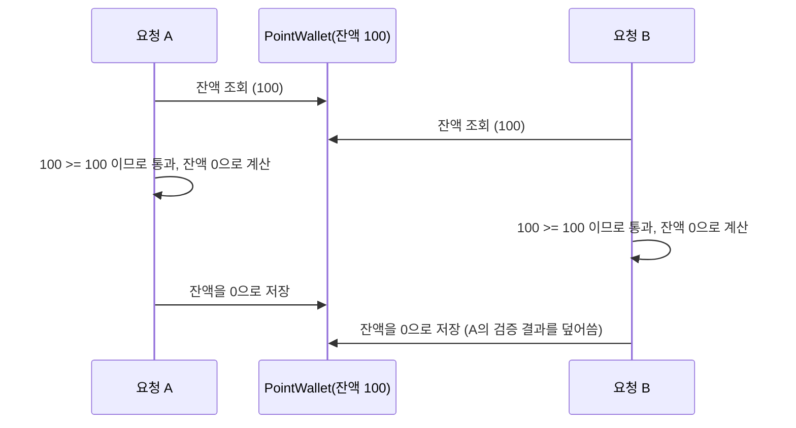
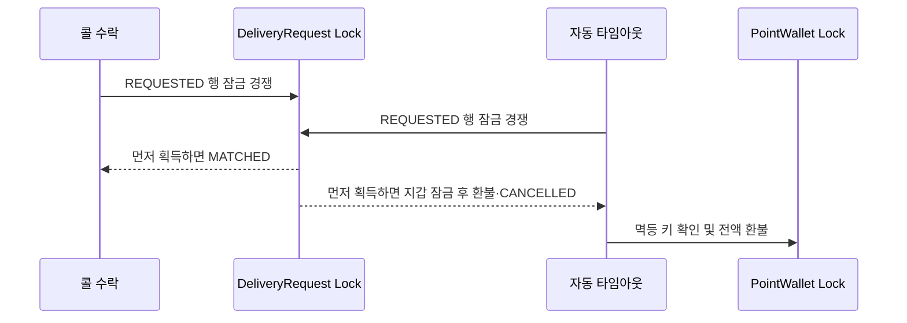

# 🔒 초보자를 위한 동시성 제어(Concurrency Control) 가이드

안녕하세요, 교육생 여러분! ShinhanDS Delivery 백엔드 개발팀입니다.

혼자 API를 호출해서 테스트할 때는 절대 발생하지 않다가, 실제 서비스에 여러 사용자가 동시에 몰리는 순간에만 터지는 버그가 있습니다. 바로 **동시성(Concurrency) 버그**입니다. 이 문서는 **왜 동시 요청이 위험한지, JPA 락(Lock)이 어떻게 이를 막아주는지, 그리고 우리 프로젝트에서 동시성을 검증하는 테스트를 작성하는 법**을 해설해 드립니다. 🎓

---

## 📚 목차
* **Part 1. 동시성 문제란 무엇인가요? (Lost Update)**
* **Part 2. 낙관적 락 vs 비관적 락**
* **Part 3. 우리 프로젝트의 적용 사례**
* **Part 4. 동시성 검증 테스트 작성법 (ExecutorService & CountDownLatch)**
* **Part 5. [공식 규칙] 우리 프로젝트의 동시성 제어 수칙**

---

## Part 1. 동시성 문제란 무엇인가요? (Lost Update)

### 1. 🚨 포인트 잔액이 음수가 되는 시나리오

포인트 지갑에 잔액이 `100`포인트 있는데, 두 요청이 동시에 `100`포인트씩 차감하려 한다고 가정해 봅시다. 락(Lock)이 없다면 다음과 같은 순서로 실행될 수 있습니다.



두 요청 모두 "잔액이 충분하다"고 판단하고 각각 차감에 성공해 버립니다. 결과적으로 `100`포인트만 있던 지갑에서 `200`포인트가 빠져나가는 **초과 인출(이중 지불)** 사고가 발생합니다. 이런 문제를 **Lost Update(갱신 유실)**라고 부르며, "조회 → 판단 → 저장"이 하나의 원자적(Atomic) 단위로 묶이지 않았을 때 발생합니다.

### 2. 🚚 배송 매칭이 중복되는 시나리오

같은 원리로, 배송 요청 1건에 차량 두 대가 동시에 "콜 수락" 버튼을 누르면 둘 다 매칭에 성공해 버려 한 배송 건에 기사 두 명이 배정되는 사고가 날 수 있습니다.

---

## Part 2. 낙관적 락 vs 비관적 락

동시성 문제를 막는 대표적인 두 가지 전략입니다.

| 구분 | 비관적 락 (Pessimistic Lock) | 낙관적 락 (Optimistic Lock) |
|---|---|---|
| **동작 방식** | 조회 시점에 DB 행에 락을 걸어, 다른 트랜잭션이 같은 행을 수정하지 못하고 대기하게 만듦 | 조회 시점엔 락을 걸지 않고, 저장 시점에 `@Version` 값이 그 사이 바뀌었는지 검사. 바뀌었으면 예외를 던짐 |
| **구현 방법** | `@Lock(LockModeType.PESSIMISTIC_WRITE)` + `SELECT ... FOR UPDATE` | Entity에 `@Version` 필드 추가, 충돌 시 `OptimisticLockingFailureException` |
| **충돌이 잦을 때** | 유리 (대기했다가 순서대로 처리되므로 실패 없음) | 불리 (재시도 로직을 직접 구현해야 함) |
| **충돌이 드물 때** | 불필요하게 대기 시간 발생 가능 | 유리 (락 대기 비용이 없음) |
| **이 프로젝트의 선택** | ✅ 포인트 잔액, 차량 배정, 배송 매칭 등 **"돈"과 "재고"처럼 정확성이 최우선인 자원**은 비관적 락을 사용 | - |

우리 프로젝트는 포인트 잔액·차량 배정·배송 매칭처럼 **잘못되면 되돌리기 어렵고(돈이 새거나 중복 배정), 충돌이 발생했을 때 클라이언트가 재시도 로직을 구현하기보다는 서버가 순서대로 처리해 주는 편이 사용자 경험상 낫다고 판단되는 자원**에는 일관되게 **비관적 락**을 사용합니다.

---

## Part 3. 우리 프로젝트의 적용 사례

Repository에 `findByIdForUpdate`라는 이름으로 비관적 쓰기 락 조회 메서드를 추가하고, Service에서 값을 변경하는 경로(충전/차감, 배정)에서만 이 메서드를 사용합니다. 단순 조회(GET)에는 락을 걸 필요가 없으므로 기존 `findById`를 그대로 씁니다.

```java
public interface PaymentRepository extends JpaRepository<PointWallet, Long> {

  /** 포인트 충전·차감 시 동시성 제어를 위해 비관적 쓰기 락으로 포인트 지갑을 조회한다. */
  @Lock(LockModeType.PESSIMISTIC_WRITE)
  @Query("select w from PointWallet w where w.id = :id")
  Optional<PointWallet> findByIdForUpdate(@Param("id") Long id);
}
```

```java
@Transactional
public PointWalletResponse usePoint(Long walletId, PointUseRequest request) {
  // findById가 아니라 findByIdForUpdate! 이 트랜잭션이 끝날 때까지 해당 지갑 행이 잠긴다.
  PointWallet wallet = findWalletForUpdateOrThrow(walletId);
  if (wallet.getBalance() < request.getAmount()) {
    throw new InsufficientPointException(walletId, request.getAmount());
  }
  wallet.setBalance(wallet.getBalance() - request.getAmount());
  return PointWalletResponse.from(wallet);
}
```

같은 패턴이 이미 `VehicleRepository.findByIdForUpdate`(차량 배정 시), `DeliveryRequestRepository.findByIdForUpdate`(배송 콜 수락 시)에도 적용되어 있습니다. `MatchingService.createMatching(...)`은 배송 요청 행에 이 락을 건 뒤 상태(`REQUESTED`)를 확인하고 매칭을 생성하므로, 여러 차량이 동시에 같은 콜을 수락하려 해도 **먼저 락을 획득한 트랜잭션 하나만 성공**하고 나머지는 갱신된 상태(`MATCHED`)를 보고 `AlreadyMatchedException`을 받습니다. 매칭 테이블에는 `delivery_request_id`에 대한 **DB 유니크 제약(`uq_matching_delivery_request`)**도 걸려 있어, 애플리케이션 로직에 버그가 있더라도 DB 차원에서 중복 매칭 자체가 불가능하도록 이중으로 방어합니다.

> ⚠️ **비관적 락 사용 시 주의: 데드락(Deadlock) 방지**
> 한 트랜잭션 안에서 여러 행에 비관적 락을 걸어야 한다면, 항상 **같은 순서**로 락을 획득해야 합니다. `MatchingService.createMatching`은 항상 "배송 요청 → 차량" 순서로만 락을 겁니다. 만약 어떤 코드는 "배송 요청 → 차량" 순서로, 다른 코드는 "차량 → 배송 요청" 순서로 락을 건다면 두 트랜잭션이 서로의 락을 기다리며 영원히 멈추는 데드락이 발생할 수 있습니다.

---

## Part 4. 동시성 검증 테스트 작성법 (ExecutorService & CountDownLatch)

락을 걸었다고 주장하는 것과, 실제로 동시 요청 상황에서 정합성이 지켜지는지 **증명**하는 것은 다릅니다. Mockito로 Repository를 mock하는 일반 단위 테스트는 실제 DB 락 경합을 재현할 수 없으므로, 동시성 테스트는 `@SpringBootTest`로 실제 스프링 빈과 실제 DB 트랜잭션을 사용해야 합니다.

### 1. 기본 패턴: ready → start → done 3단 래치(Latch)

```java
int threadCount = 100;
// ⚠️ 스레드 풀 크기는 반드시 threadCount 이상이어야 한다!
ExecutorService executorService = Executors.newFixedThreadPool(threadCount);
CountDownLatch readyLatch = new CountDownLatch(threadCount); // 모든 스레드가 "준비됐다"고 신호
CountDownLatch startLatch = new CountDownLatch(1);           // 메인 스레드가 "출발!"을 신호
CountDownLatch doneLatch = new CountDownLatch(threadCount);  // 모든 스레드가 "끝났다"고 신호

for (int i = 0; i < threadCount; i++) {
  executorService.submit(() -> {
    readyLatch.countDown();      // 나 준비 끝났어요
    try {
      startLatch.await();        // 다 같이 출발 신호 기다리기
      paymentService.usePoint(walletId, request); // 실제 테스트 대상 호출
    } finally {
      doneLatch.countDown();     // 나 끝났어요
    }
  });
}

readyLatch.await();   // 100개 스레드가 전부 대기 상태가 될 때까지 기다림
startLatch.countDown(); // 동시에 출발!
doneLatch.await(30, TimeUnit.SECONDS); // 전부 끝날 때까지 대기
```

이렇게 하면 100개의 요청이 "각자 준비된 뒤, 동시에 출발"하게 되어 실제 동시 요청 상황과 최대한 비슷하게 재현됩니다.

### 2. 🪤 흔한 실수: 스레드 풀 크기 < 동시 요청 수 → 데드락

```java
// ❌ BAD: 스레드 풀이 32개뿐인데 100개 작업을 넣으면?
ExecutorService executorService = Executors.newFixedThreadPool(32);
```

위 3단 래치 패턴은 **`threadCount`개의 스레드가 동시에 살아서 `startLatch.await()`로 대기하고 있어야** 성립합니다. 풀 크기가 `threadCount`보다 작으면, 먼저 실행된 스레드들이 `startLatch.await()`에서 영원히 멈춰버려(메인 스레드가 `readyLatch.await()`에서 나머지 스레드가 시작되길 기다리고 있으므로) **서로가 서로를 기다리는 데드락**에 빠집니다. 반드시 `Executors.newFixedThreadPool(threadCount)`처럼 **풀 크기를 동시 요청 수 이상**으로 잡아야 합니다.

### 3. 검증 포인트

동시성 테스트는 단순히 "예외 없이 끝났다"가 아니라, **최종 데이터 정합성**을 assert해야 의미가 있습니다.

```java
// 예: 잔액 5000에서 100씩 100번 동시 차감 시도 → 정확히 50번만 성공, 잔액은 정확히 0
assertThat(successCount.get()).isEqualTo(50);
assertThat(insufficientCount.get()).isEqualTo(50);
assertThat(finalBalance).isZero(); // 음수도 아니고, 유실(부정확한 값)도 아님
```

실제 예시는 `PaymentConcurrencyTest`(포인트 잔액), `MatchingConcurrencyTest`(배송 매칭)를 참고하세요.

---

## Part 5. [공식 규칙] 우리 프로젝트의 동시성 제어 수칙

1. **잔액·재고·배정처럼 "동시에 두 번 성공하면 안 되는" 자원을 변경하는 Service 메서드는 반드시 비관적 락(`findByIdForUpdate`)으로 조회한 뒤 수정한다.** 단순 조회(GET)에는 락을 걸지 않는다.
2. **Repository의 락 조회 메서드는 `findByIdForUpdate`로 이름을 통일한다.** (`@Lock(LockModeType.PESSIMISTIC_WRITE)` + `@Query("select e from Entity e where e.id = :id")`)
3. **한 트랜잭션에서 여러 리소스에 락을 걸어야 한다면 항상 같은 순서로 락을 획득해 데드락을 방지한다.**
4. **새로운 동시성 민감 로직을 추가하면 `ExecutorService` + `CountDownLatch`(스레드 풀 크기 ≥ 동시 요청 수) 패턴으로 최소 100개 동시 요청 테스트를 작성하고, 최종 데이터 정합성을 assert한다.**
5. **PR 자가 체크리스트 필수 확인:** 잔액/배정 로직을 변경했다면 `[ ] 동시성 제어(docs/concurrency-control-guide.md)가 필요한 변경인가? 필요하다면 비관적 락과 동시성 테스트를 추가했는가?` 항목을 검토한다.

정확한 동시성 제어는 사용자의 돈과 신뢰를 지키는 가장 기본적인 안전장치입니다. 규칙을 지켜 튼튼한 백엔드를 함께 만들어 봅시다! 🚀

---

## Part 6. 배송 자동 타임아웃과 환불



자동 타임아웃은 콜 수락과 동일한 `DeliveryRequestRepository.findByIdForUpdate`를 사용한다. 락 획득 후 상태와 30분 경과 여부를 다시 검사하고, 결제 요청이면 `PointWallet`을 잠근 뒤 `delivery-timeout-refund:{deliveryRequestId}` 키로 환불한다. 락 순서는 항상 `DeliveryRequest → PointWallet`이며 100개 동시 실행 테스트로 환불 이력이 한 건만 생성되는지 검증한다.

환불 등 타임아웃 처리가 실패하면 해당 요청에 다음 재시도 시각을 기록하고 5분 동안 후보 조회에서 제외한다. 오래된 영구 실패 요청이 매 실행의 첫 배치를 독점해 이후 정상 요청이 처리되지 않는 기아(starvation)를 방지하기 위한 백오프다.
