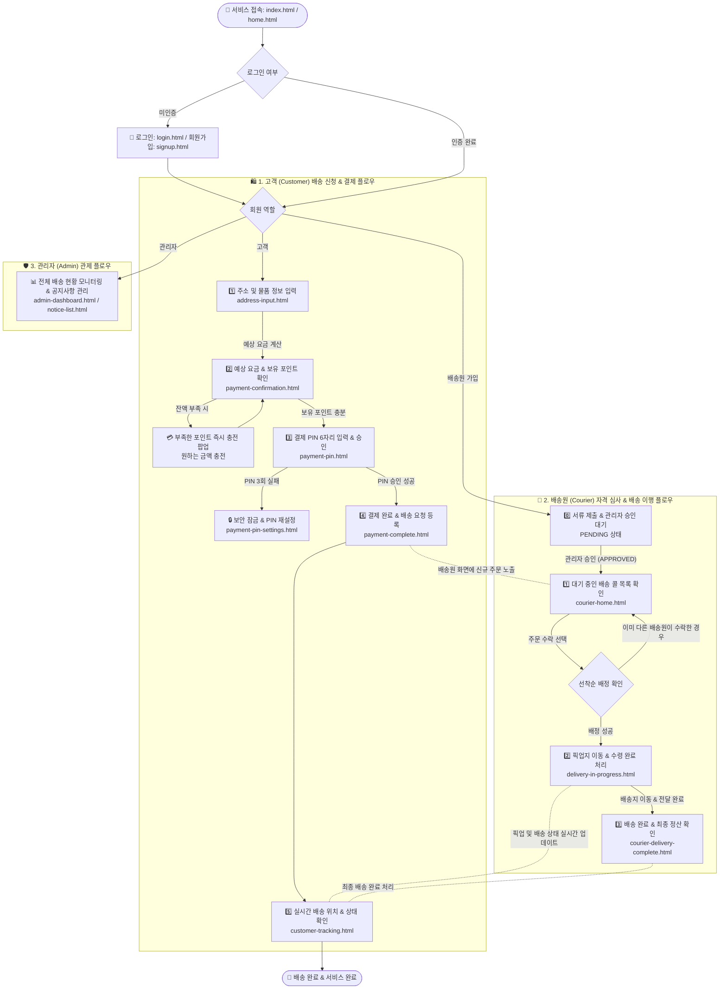
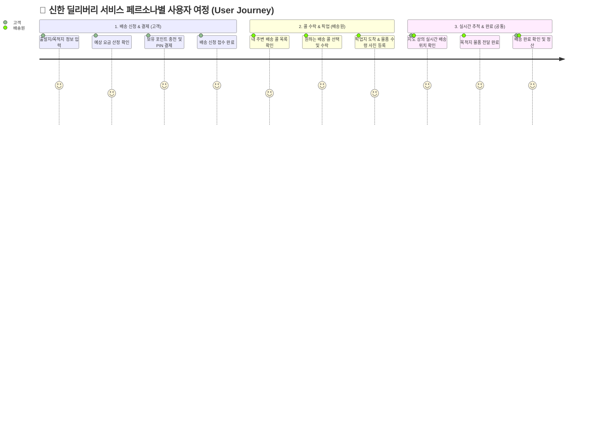
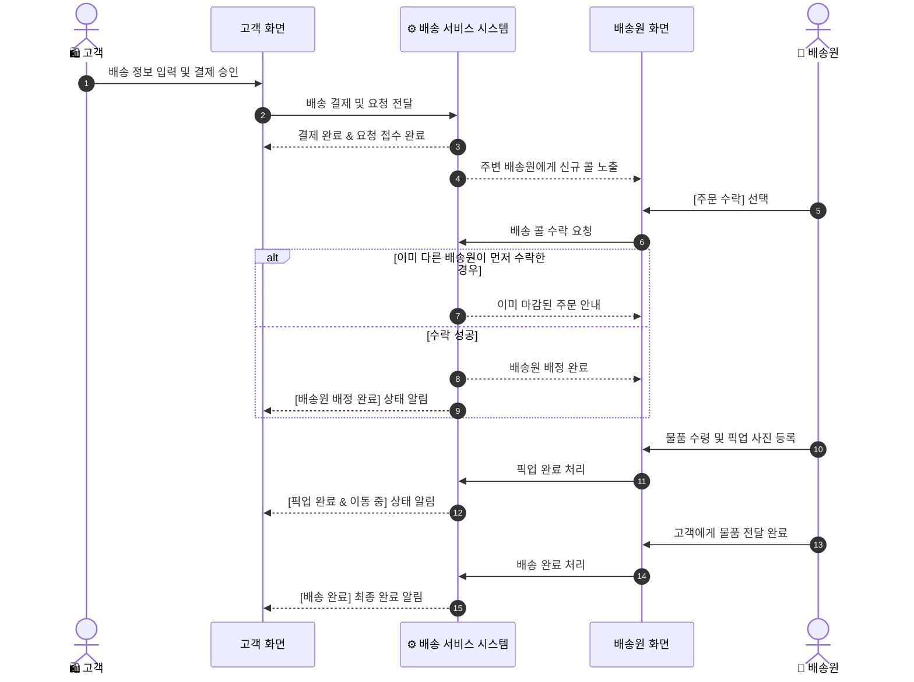

# 🗺️ 신한 딜리버리 전체 E2E 유저 플로우 가이드 (End-to-End User Flow Standard)

> [!NOTE]
> 본 문서는 **신한 딜리버리(Shinhan Delivery)** 서비스의 전체 유저 플로우(End-to-End User Flow), 화면(`*.html`) 간 이동 구조, 서비스 기능 매핑 및 사용자 이탈 방지 흐름을 일원화하여 제공하는 **단일 원본(SSOT) 사용자 여정 문서**입니다.

---

## 📌 1. 개요 및 목적 (Executive Summary)

신한 딜리버리 배송 플랫폼은 **고객(Customer)**의 배송 신청부터 **배송원(Courier)**의 즉시 콜 수락 및 이행, **관리자(Admin)**의 전체 현황 관제까지 3대 역할이 유기적으로 연동되는 서비스입니다.

### 🎯 핵심 사용자 경험(UX) 목표
1. **단절 없는 배송 신청 & 결제:** 요금 확인 ➔ 잔액 부족 시 즉시 충전 ➔ 결제 PIN 승인 ➔ 배송 요청 완료.
2. **빠르고 공정한 콜 수락:** 주변 3km 이내 배송원에게 대기 주문을 노출하고, 가장 먼저 수락한 1명에게 공정하게 배정.
3. **투명한 실시간 위치 공유:** 픽업부터 배달 완료까지 배송원의 위치 및 배송 상태를 고객 화면에 실시간으로 공유.

---

## 🗺️ 2. E2E 전체 유저 플로우 다이어그램 (End-to-End Flowchart)

---

## 👤 3. 페르소나별 상세 유저 플로우 & 화면 매핑

### 3.1 🛍️ 고객 (Customer) 유저 여정

| 단계 | 화면 파일명 | 주요 사용자 활동 | 사용자 제공 가치 |
| :--- | :--- | :--- | :--- |
| **1단계** | `address-input.html` | 출발지/목적지 주소 및 물품(무게/크기) 입력 | 정확한 거리 및 물품 기반 예상 요금 자동 산정 |
| **2단계** | `payment-confirmation.html` | 예상 요금 확인 및 보유 포인트 비교 | 잔액 부족 시 이탈 없이 즉시 충전 팝업 제공 |
| **3단계** | `payment-pin.html` | 비밀번호(PIN 6자리) 입력 및 간편 결제 승인 | 보안 PIN을 통한 안전하고 간편한 결제 체계 |
| **4단계** | `payment-complete.html` | 결제 성공 안내 및 배송 요청 등록 완료 | 배송 신청 접수 확인 및 실시간 추적 페이지 이동 |
| **5단계** | `customer-tracking.html` | 지도 상에서 배송원 위치 및 배송 진행 상태 확인 | 픽업~배달까지 투명한 위치 및 예상 도착 시간 공유 |

---

### 3.2 🚴 배송원 (Courier) 유저 여정

| 단계 | 화면 파일명 | 주요 사용자 활동 | 사용자 제공 가치 |
| :--- | :--- | :--- | :--- |
| **0단계** | `courier-signup.html` / `courier-pending.html` | 배송 수단 선택, 자격 증빙 서류 업로드 및 심사 대기 | 신뢰할 수 있는 자격 검증 프로세스 및 심사 현황 안내 |
| **1단계** | `courier-home.html` | 내 주변(반경 3km) 대기 중인 신규 주문 콜 목록 확인 및 출근 상태 변경 | 거리·요금 정보를 확인하고 원하는 배송 콜 선택 |
| **2단계** | `courier-pickup.html` | 픽업지로 이동 후 물품 수령 완료 사진 등록 | 물품 상태를 사진으로 기록하여 픽업 완료 공유 |
| **3단계** | `courier-delivery-complete.html` | 목적지 도착 후 고객에게 물품 전달 및 배송 완료 | 배송 완료 처리 및 건별 배송 수수료 정산 확인 |

---

## 🎨 4. 사용자 경험 여정 지도 (User Journey)

---

## 🔄 5. 주요 서비스 진행 단계 (Service Milestones)

---

## 🛡️ 6. 사용자 이탈 방지 & 안심 서비스 흐름 (User Retention & Safety)

> [!IMPORTANT]
> **사용자의 원활한 이용을 돕는 3대 안심 장치:**
> 1. **결제 전 포인트 부족 케어:** 결제 확인 화면에서 잔액이 부족해도 화면을 벗어날 필요 없이 **부족한 금액 즉시 충전 팝업**을 제공하여 연속된 결제 흐름을 유지합니다.
> 2. **비밀번호 보안 안심 잠금:** 결제 PIN 3회 연속 오입력 시 이용자의 자산을 보호하기 위해 안전하게 결제를 잠그고, 본인 확인 후 PIN 재설정 화면으로 안내합니다.
> 3. **공정한 선착순 콜 배정:** 동일한 배송 콜에 대해 여러 배송원이 동시에 수락을 누르더라도, **가장 먼저 수락한 배송원 1명에게 공정하게 배정**하고 다른 배송원에게는 마감 상태를 친절하게 안내합니다.

---

## 🔗 7. 도메인별 디테일 기능 설계서 딥다이브 (Domain Deep-Dive Links)

> [!TIP]
> 각 도메인별 세부 비즈니스 규칙, API 스펙, ERD 컬럼 및 에러 예외 핸들링은 아래의 **도메인별 단일 원본(SSOT) 기능 설계서**를 통해 확인하실 수 있습니다:

| 도메인 영역 | 디테일 설계서 단일 원본 (Deep-Dive Spec) | 주요 기재 내용 |
| :--- | :--- | :--- |
| 👤 **회원 & PIN 결제** | 📖 [**회원 인증 기능 설계서**](./design/회원-인증-기능-설계서.md) | JWT 인증, 회원 가입/수정, 결제 PIN 6자리 승인 및 3회 잠금 |
| 🛍️ **배송 신청 & 요금** | 📖 [**배송 요청 기능 설계서**](./design/배송-요청-기능-설계서.md) | 거리·무게·크기별 가산 요금 산정식, 배송 요청 등록 및 취소 |
| 🚴 **배송 오퍼 & 콜 매칭** | 📖 [**배송 매칭 기능 설계서**](./design/배송-매칭-기능-설계서.md) | 반경 3km 검색, 오퍼 선착순 수락(Catch) 및 배정 |
| 💳 **포인트 지갑 & 충전** | 📖 [**포인트 지갑 기능 설계서**](./design/포인트-지갑-기능-설계서.md) | 포인트 잔액 조회, 결제 차감 및 부족 금액 즉시 충전 유스케이스 |
| 🗺️ **실시간 위치 추적** | 📖 [**위치 추적 기능 설계서**](./design/위치-추적-기능-설계서.md) | 배송원 GPS 위치 자동 전송, 지도 상 위치 실시간 공유 |
| 🔄 **배송 상태 전이** | 📖 [**배송 상태 전이도**](./design/배송-상태-전이도.md) | `REQUESTED` ➔ `MATCHED` ➔ `PICKED_UP` ➔ `DELIVERED` 전이 규칙 |
| 📢 **공지사항 & 관리자** | 📖 [**공지사항 기능 설계서**](./design/공지사항-기능-설계서.md) | 공지사항 등록/조회 및 관리자 현황 모니터링 |

