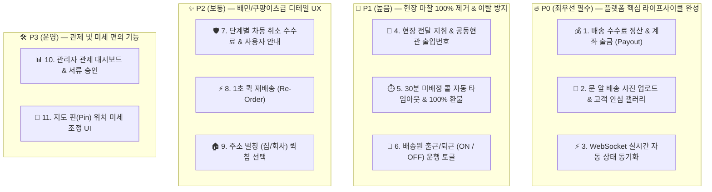
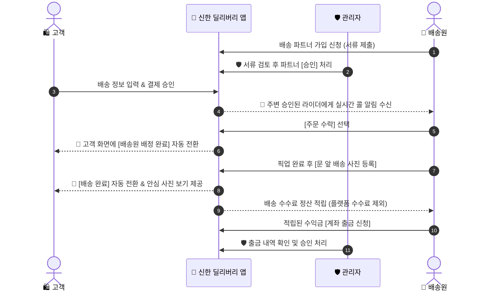

# 🚀 신한 딜리버리 프로덕트 고도화 및 유저 플로우 보완 기획서 (Product Enhancement Specification)

> [!NOTE]
> 본 기획서는 **신한 딜리버리(Shinhan Delivery)** 서비스의 현재 사용자 흐름을 정밀 분석하고, 실사용자(고객/배송원) 및 운영 관리자(Admin) 관점에서 프로덕트 완성도를 100% 사수하기 위한 **비즈니스 고도화 11대 기능 기획서(PRD)**입니다.

---

## 📌 1. 개요 및 기획 목적 (Executive Summary)

신한 딜리버리는 고객의 배송 요청, 결제, 배송원의 콜 수락, 위치 추적에 이르는 서비스 기본 흐름이 구축되어 있습니다.

본 기획은 디테일한 기술 스택 구현보다는 **"사용자가 서비스를 이용할 때 단 하나의 불편이나 흐름 단절도 없는 완결성 높은 프로덕트 경험"**을 제공하는 것에 집중하며, **비즈니스 완결성 및 유저 임팩트 기준의 중요도 우선순위(P0~P3)**에 따라 정렬하여 정리하였습니다.

---

## 🏆 2. 11대 고도화 기능 중요도 우선순위 매트릭스 (P0 ~ P3)

---

## 📋 3. 중요도 우선순위별 11대 핵심 고도화 명세 (Priority Ranked Specifications)

### 🔥 P0 (최우선 필수) — 플랫폼 핵심 라이프사이클 완성

#### 1) 💰 배송원 수익 정산 및 계좌 출금 (Courier Payout)
- **기획 개요:** 배송 완료 시 결제 금액 중 플랫폼 수수료(10%)를 제외한 배송료(90%)가 배송원 지갑에 자동 적립되며, 배송원은 자금을 실제 은행 계좌로 출금 신청합니다.
- **우선순위 이유:** 결제 차감만 있고 수수료 적립/출금이 없으면 배송 플랫폼의 결제 정산 라이프사이클이 불완전하므로 최우선 과제입니다.

#### 2) 📸 문 앞 배송 사진 업로드 및 안심 갤러리 (Proof of Delivery)
- **기획 개요:** 배송원이 물품 전달 완료 후 현장 사진을 등록하면, 고객이 배송 상세 화면에서 즉시 확인 가능합니다.
- **우선순위 이유:** 비대면 배송 시 물품 분실/오배송 분쟁을 방지하고 고객 안심을 사수하는 핵심 이행 검증 요소입니다.

#### 3) ⚡ 실시간 상태 자동 업데이트 (Real-Time Zero-F5 UX)
- **기획 개요:** 고객이 배송을 신청하면 주변 배송원에게 실시간 알림이 송신되고, 배송원의 상태 변경 시 고객 화면이 새로고침 없이 즉시 자동 전환됩니다.
- **우선순위 이유:** 새로고침을 지속해야 하는 답답함을 해결하여 배민/쿠팡급 라이브 사용자 경험을 제공합니다.

---

### 🚀 P1 (높음) — 현장 유저 마찰 100% 제거 & 이탈 방지

#### 4) 🚪 현장 전달 지침 & 공동현관 출입번호 선택 (Delivery Instructions)
- **기획 개요:** "문 앞에 두고 벨X", "공동현관 출입번호(#1234*)", "경비실에 맡겨주세요" 등 현장 수령 지침 선택 및 저장.
- **우선순위 이유:** 배송원이 현장에 도착해서 문을 못 열어 당황하거나 고객에게 전화하는 현장 마찰을 100% 차단합니다.

#### 5) ⏱️ 30분 미배정 콜 자동 타임아웃 & 100% 자동 환불 (Auto Timeout Refund)
- **기획 개요:** 배송 요청 후 30분간 배송원이 매칭되지 않을 경우 시스템이 자동으로 취소하고 결제 포인트를 100% 자동 환불합니다.
- **우선순위 이유:** 고객의 포인트 잔액이 마냥 묶여 있는 무한 대기 현상을 차단하고 시스템 무결성을 높입니다.

#### 6) 🚴 배송원 출근/퇴근 (ON / OFF) 운행 상태 토글 (Courier Duty Switch)
- **기획 개요:** 배송원 UI 상단에 **[배송 시작(ON)] / [퇴근하기(OFF)]** 토글 스위치를 제공합니다.
- **우선순위 이유:** 퇴근 상태 시 콜 알림 및 위치 추적을 차단하여 라이더의 휴식과 사생활을 케어합니다.

---

### ✨ P2 (보통) — 배민/쿠팡이츠급 디테일 UX

#### 7) 🛡️ 단계별 차등 취소 수수료 & 사용자 안내 (Cancellation Policy)
- **기획 개요:** 매칭 전 취소 시 100% 환불, 매칭 후 이동 중 취소 시 1,000P 라이더 이동 보상 수수료 차감 후 잔액 환불.
- **우선순위 이유:** 불필요한 취소로 인한 배송원의 헛걸음 피해를 방지합니다.

#### 8) ⚡ 1초 퀵 재배송 (Re-Order / Repeat Booking)
- **기획 개요:** 과거 배송 내역에서 **[이 배송 다시 보내기]** 클릭 시 이전 출발지/목적지/물품 정보가 1초 만에 자동 채워집니다.
- **우선순위 이유:** 자주 배송을 보낼 때 반복 입력 번거로움을 단축시킵니다.

#### 9) 🏠 자주 쓰는 주소 별칭(집 🏠 / 회사 🏢) 퀵 칩 선택 (Address Chips)
- **기획 개요:** 상단 퀵 칩 클릭으로 사전에 등록한 "우리집", "회사" 주소를 1초 만에 선택 입력합니다.
- **우선순위 이유:** 입력 단계를 2단계 단축시킵니다.

---

### 🛠️ P3 (운영/보조) — 플랫폼 관제 & 미세 조율

#### 10) 📊 관리자(Admin) 관제 대시보드 & 서류 승인 관리 (Admin Console)
- **기획 개요:** 전체 배송 요청/진행 건수 모니터링, 지연 건 조치, 배송 파트너 자격 서류 검토 후 [승인]/[반려] 처리.
- **우선순위 이유:** 플랫폼 운영자의 서비스 통제탑 역할을 수행합니다.

#### 11) 📍 지도 핀(Pin) 위치 미세 조정 UI (Map Pin Fine Tuning)
- **기획 개요:** 건물 입구 위치로 핀을 직접 드래그하여 정확한 픽업/배달 위치 지정.
- **우선순위 이유:** 아파트 단지나 빌딩 픽업 시 라이더의 위치 착오를 미세 조율합니다.

---

## 🗺️ 4. 보완된 E2E 서비스 흐름 (Enhanced Service Flow)

---

## 🛠️ 5. 중요도 기반 단계별 프로덕트 로드맵 (Priority-Based Roadmap)

| 우선순위 | 구분 | 주요 내용 | 검증 목표 |
| :---: | :--- | :--- | :---: |
| **P0 Phase 1** | **플랫폼 필수** | 💰 정산/출금 ➔ 📸 배송 사진 갤러리 ➔ ⚡ WebSocket 실시간 동기화 | 라이프사이클 완결 |
| **P1 Phase 2** | **현장 마찰 제거** | 🚪 전달 지침/공동현관 비번 ➔ ⏱️ 30분 타임아웃 환불 ➔ 🚴 라이더 ON/OFF | 현장 마찰 0% |
| **P2 Phase 3** | **디테일 UX** | 🛡️ 차등 취소 수수료 ➔ ⚡ 1초 재배송 ➔ 🏠 주소 별칭 칩 | 배민/쿠팡급 편의 |
| **P3 Phase 4** | **관제 & 미세조정** | 📊 관리자 대시보드 & 서류 승인 ➔ 📍 지도 핀 미세 조정 | 운영 통제탑 |
