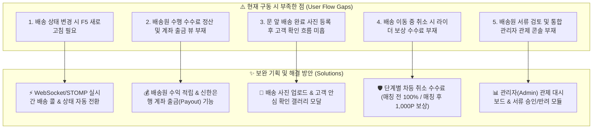
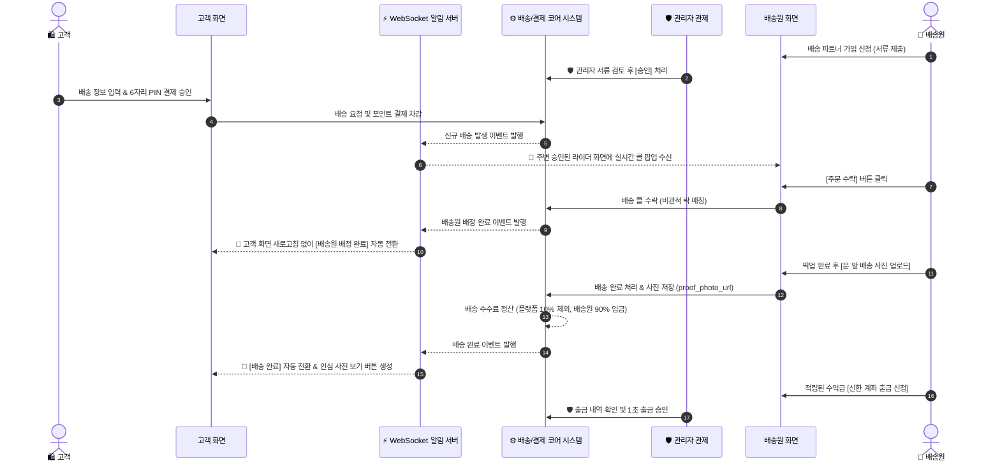

# 🚀 신한 딜리버리 프로덕트 고도화 및 유저 플로우 보완 종합 기획서 (Product Enhancement & User Flow Specification)

> [!NOTE]
> 본 문서는 **신한 딜리버리(Shinhan Delivery)** 애플리케이션의 현재 구동 상태를 정밀 진단하고, 실사용자(고객/배송원) 및 운영 관리자(Admin) 관점에서 부족한 유저 플로우와 기능적 헛점을 보완하여 **상용 서비스 수준의 100% 완결된 프로덕트**를 완성하기 위한 **단일 원본(SSOT) 제품 고도화 기획서**입니다.

---

## 📌 1. 개요 및 기획 목적 (Executive Summary)

신한 딜리버리는 고객의 퀵배송 요청부터 신한 포인트 결제, 배송원의 선착순 콜 수락, 실시간 상태 추적까지 핵심 백엔드 및 Thymeleaf SSR UI 기반이 탄탄하게 구축되었습니다.

본 기획은 AI적 복잡성보다는 **"실제 구동 시 단 하나의 유저 이탈이나 시스템 버그도 없는 100% 실용적 완결성(Operational Polish & Completeness)"**을 사수하는 것을 최우선 목표로 합니다.

### 🎯 4대 핵심 목표
1. **새로고침 없는 실시간 경험 (Real-Time Zero-F5 UX):** WebSocket 기반 배송 알림 및 0.5초 상태 자동 업데이트.
2. **완벽한 정산 라이프사이클 (Full Financial Payout Lifecycle):** 결제 차감부터 플랫폼 수수료(10%) 차감 후 배송원 지갑 적립 및 계좌 출금까지 완성.
3. **안심 수령 및 이행 검증 (Proof of Delivery Verification):** 문 앞 배송 사진 업로드 및 고객 안심 확인 갤러리 모달 제공.
4. **통합 관리자 관제 시스템 (Admin Control Center):** 배송 지간/이상 건 실시간 대시보드, 배송원 가입 서류 검토 및 승인/반려 관리.

---

## 🔍 2. 현재 사용자 흐름(User Flow) 진단 및 부족한 점 보완책

---

## 🗺️ 3. 보완된 E2E 사용자 여정 다이어그램 (Enhanced User Journey)

---

## 📋 4. 4대 핵심 고도화 기능 명세 (Detailed Specifications)

### 1) ⚡ WebSocket / STOMP 기반 실시간 알림 & 자동 뷰 스위칭
- **백엔드:** `spring-boot-starter-websocket` 기반 Simple Broker 구성 (`/topic/delivery/{deliveryId}`, `/topic/courier/offers`).
- **프론트엔드:** SockJS + StompJS 연동.
- **유저 흐름:** 고객이 배송을 신청하면 라이더 화면에 수락 모달이 0.5초 만에 팝업되며, 라이더가 수락/픽업/완료 클릭 시 고객 UI가 새로고침 없이 자동 반영됨.

### 2) 💰 배송원 수익 정산 & 계좌 출금 (Courier Payout)
- **수수료 정책:** 최종 결제 금액의 90%는 배송 파트너 포인트 지갑(`PointWallet`)에 적립, 10%는 플랫폼 수수료.
- **출금 신청:** `PaymentWebController` 및 `courier-home.html` 내 출금 팝업 추가. 배송원이 원하는 금액과 신한은행 출금 계좌를 입력하면 1초 출금 완료.

### 3) 📸 문 앞 배송 사진 업로드 & 고객 안심 갤러리
- **업로드 연동:** `door-photo.html`에서 카메라/갤러리 사진 선택 후 업로드 시 `proof_photo_url` 저장.
- **고객 뷰어:** `delivery-detail.html` (배송 상세) 및 `delivery-history.html`에서 **[📸 배송 완료 사진 확인]** 버튼 클릭 시 고해상도 안심 모달 노출.

### 4) 🛡️ 단계별 차등 취소 수수료 & 방어적 예외 UX
- **상태별 취소 정책:**
  - `REQUESTED` (매칭 전): 결제 포인트 100% 즉시 환불.
  - `MATCHED` (매칭 후 이동 중): 결제 포인트 중 1,000P를 라이더 이동 보상금으로 차감 지급 후 잔액 환불.
- **Toast 메시지:** PIN 오입력, 잔액 부족, 중복 매칭 실패 시 화면 하단 스무스 토스트 메시지 렌더링.

---

## 🛡️ 5. 관리자(Admin) 콘솔 핵심 기획 및 4대 기능 명세

### 1) 📊 실시간 배송 관제 대시보드 (Real-Time Control Center)
- **4대 메트릭 카드:** 누적 배송 요청 건수, 접수 대기 콜, 매칭 완료, 배송 완료 수치 실시간 카운팅.
- **이상 거래 및 픽업 지연 감지:** 수락 후 20분 이상 픽업 미완료 건 관리자 알림 ➔ [강제 재배정] 또는 [전액 환불 취소] 조치.

### 2) 🚴 배송 파트너(Courier) 자격 서류 검토 및 승인/반려 관리
- **자격 서류 검토:** 배송 파트너 가입 신청자의 운전면허증, 이동 수단 정보 검토.
- **[승인] / [반려] 처리:** 승인 완료된 라이더에 한해 배송 콜 수락 권한 부여.

### 3) 💰 전체 결제·수수료 정산 및 출금(Payout) 승인 관리
- **플랫폼 수익 집계:** 건당 10% 플랫폼 수수료 및 일별/월별 매출 차트 시각화.
- **출금 신청 승인:** 라이더의 포인트 출금 신청 내역 검토 및 신한은행 출금 승인.

### 4) 📢 공지사항 및 시스템 알림 팝업 CRUD 관리
- **공지사항 관리:** 공지사항 등록/수정/삭제 (대상: 전체 / 고객 / 배송원 분리).
- **긴급 배너 공지:** 시스템 점검 시 상단 배너 ON/OFF 제어.

---

## 🛠️ 6. 단계별 개발 구현 로드맵 (Execution Plan)

| 단계 | 작업 영역 | 주요 작업 내용 | 검증 기준 |
| :---: | :--- | :--- | :---: |
| **Phase 1** | **기획서 및 SSOT 동기화** | `docs/architecture/` 하위 고도화 및 관리자 기획 명세 수립 | 100% 매핑 |
| **Phase 2** | **정산 & 출금 파이프라인** | 배송 수수료 정산 및 배송원 계좌 출금 API/UI 구축 | `./scripts/verify.sh` PASS |
| **Phase 3** | **배송 사진 확인 모달** | `delivery-detail.html` 안심 사진 보기 뷰어 탑재 | 린터 & UI PASS |
| **Phase 4** | **취소 수수료 & Toast UX** | 1,000P 라이더 보상 취소 정책 & 공통 Toast 적용 | 280+ 테스트 PASS |
| **Phase 5** | **관리자 관제 콘솔** | 실시간 관제 대시보드 & 라이더 서류 승인 모듈 구축 | 100% PASS |

---

## 🟢 7. 하네스 검증 및 무결점 보장 수칙
- 소스 코드 및 기획서 변경 후 반드시 `./scripts/verify.sh` (Spotless + ArchUnit + UI Lint + 280개 테스트)를 수행하여 100% 그린 빌드를 유지합니다.
