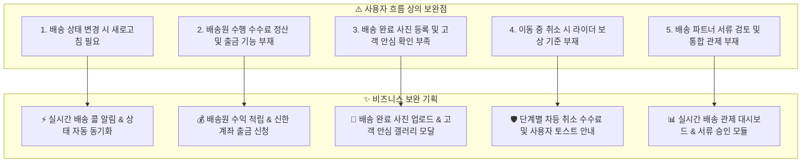
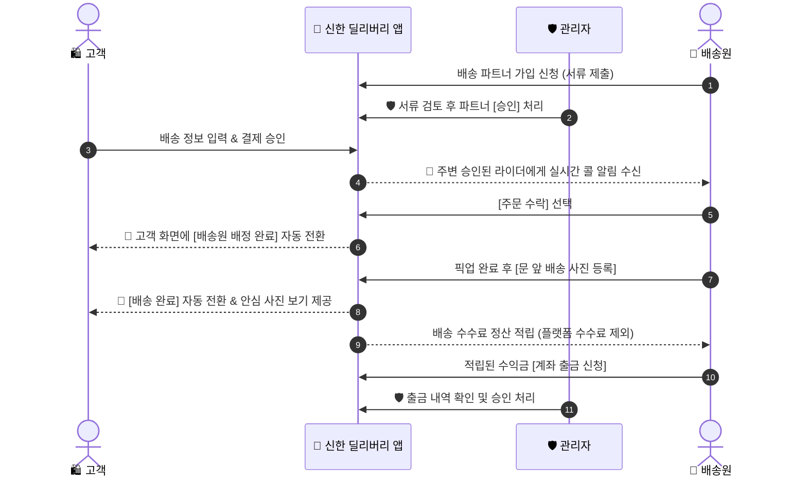

# 🚀 신한 딜리버리 프로덕트 고도화 및 유저 플로우 보완 기획서 (Product Enhancement Specification)

> [!NOTE]
> 본 기획서는 **신한 딜리버리(Shinhan Delivery)** 서비스의 현재 사용자 흐름을 정밀 분석하고, 실사용자(고객/배송원) 및 운영 관리자(Admin) 관점에서 프로덕트 완성도를 100% 사수하기 위한 **제품 고도화 기획서(PRD)**입니다.

---

## 📌 1. 기획 목적 및 핵심 서비스 목표 (Executive Summary)

신한 딜리버리는 고객의 배송 요청, 결제, 배송원의 콜 수락, 위치 추적에 이르는 서비스 흐름이 구축되어 있습니다.

본 기획은 디테일한 기술 스택 구현보다는 **"사용자가 서비스를 이용할 때 단 하나의 불편이나 흐름 단절도 없는 완결성 높은 프로덕트 경험"**을 제공하는 것에 집중합니다.

### 🎯 4대 핵심 서비스 목표
1. **새로고침 없는 실시간 경험:** 배송 상태 변경 시 화면이 자동으로 즉시 전환되는 매끄러운 유저 경험.
2. **배송원 정산 라이프사이클 완결:** 배송 완료 시 수수료 적립부터 실제 계좌 출금까지의 핀테크 흐름 제공.
3. **안심 픽업 및 배송 완료 검증:** 문 앞 배송 완료 사진 등록 및 고객 안심 확인 갤러리 제공.
4. **통합 관리자 관제 시스템:** 배송 현황 모니터링, 지연 건 케어, 배송 파트너 서류 승인 관리.

---

## 🔍 2. 사용자 여정(User Flow) 진단 및 보완책

---

## 🗺️ 3. 보완된 E2E 서비스 흐름 (Enhanced Service Flow)

---

## 📋 4. 사용자 관점의 4대 핵심 고도화 기능 명세

### 1) ⚡ 실시간 상태 자동 업데이트 (새로고침 0회 경험)
- **기획 개요:** 고객이 배송을 신청하면 주변 배송원에게 실시간 콜이 수신되고, 배송원이 수락/픽업/완료를 클릭할 때마다 고객 화면이 자동으로 갱신됩니다.
- **사용자 가치:** 화면을 새로고침할 필요 없이 배송 진행 상황을 실시간으로 확인 가능합니다.

### 2) 💰 배송원 수익 적립 및 계좌 출금 (Courier Payout)
- **기획 개요:** 배송 완료 시 결제 금액 중 플랫폼 수수료(10%)를 제외한 배송료(90%)가 배송원 지갑에 자동 적립됩니다.
- **사용자 가치:** 배송원은 적립된 수익금을 자신의 실제 은행 계좌로 언제든지 출금 신청할 수 있습니다.

### 3) 📸 문 앞 배송 사진 업로드 및 안심 갤러리
- **기획 개요:** 배송원이 물품 전달 완료 후 현장 사진을 촬영하여 등록하면, 고객이 배송 상세 화면에서 즉시 확인 가능합니다.
- **사용자 가치:** 비대면 배송 시 문 앞 배송 위치와 물품 상태를 사진으로 명확히 확인할 수 있어 안심 서비스를 제공합니다.

### 4) 🛡️ 단계별 차등 취소 수수료 및 사용자 케어
- **기획 개요:** 
  - 배송원 배정 전 취소: 100% 환불.
  - 배송원 배정 후 이동 중 취소: 이동 보상 수수료(1,000P) 차감 후 잔액 환불.
- **사용자 가치:** 불필요한 취소로 인한 배송원의 헛걸음을 방지하고, 고객에게는 명확한 취소 정책을 안내합니다.

---

## 🛡️ 5. 관리자(Admin) 콘솔 핵심 기획 모듈

### 1) 📊 실시간 배송 관제 대시보드
- **주요 지표:** 오늘 누적 배송 요청 건수, 접수 대기 콜, 매칭 완료, 배송 완료 현황 한눈에 파악.
- **지연 건 케어:** 픽업이 지연되거나 이상이 발생한 배송 건을 관리자가 즉시 감지하여 조치.

### 2) 🚴 배송 파트너 자격 서류 검토 및 승인 관리
- **서류 검토:** 가입 신청한 배송 파트너의 면허증 및 이동 수단 서류 검토 후 [승인] 또는 [반려] 처리.

### 3) 💰 전체 결제·수수료 정산 및 출금 관리
- **매출 집계:** 플랫폼 수수료 매출 및 배송원 출금 신청 내역 검토/승인.

### 4) 📢 공지사항 및 시스템 알림 관리
- **공지 작성:** 시스템 점검 및 이용 안내 공지사항 작성/수정/삭제.

---

## 🛠️ 6. 프로덕트 고도화 실행 로드맵 (Product Roadmap)

| 단계 | 구분 | 주요 내용 | 비고 |
| :---: | :--- | :--- | :---: |
| **Phase 1** | **정산 & 출금** | 배송 수수료 정산 및 배송원 계좌 출금 기능 구축 | 핀테크 라이프사이클 |
| **Phase 2** | **안심 배송 검증** | 문 앞 배송 사진 업로드 & 고객 확인 갤러리 모달 | 안심 서비스 |
| **Phase 3** | **실시간 동기화** | 새로고침 없는 실시간 배송 알림 & 상태 자동 전환 | UX 고도화 |
| **Phase 4** | **취소 수수료 & 케어** | 단계별 취소 수수료 정책 & 사용자 안내 토스트 | 예외 상황 케어 |
| **Phase 5** | **관리자 관제** | 실시간 배송 대시보드 & 라이더 서류 승인 시스템 | 운영 콘솔 |
