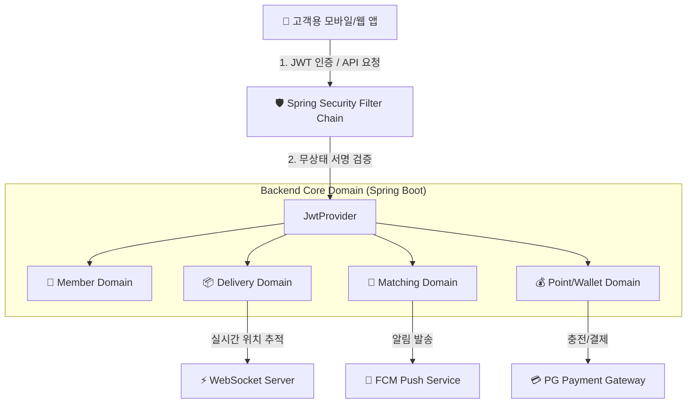
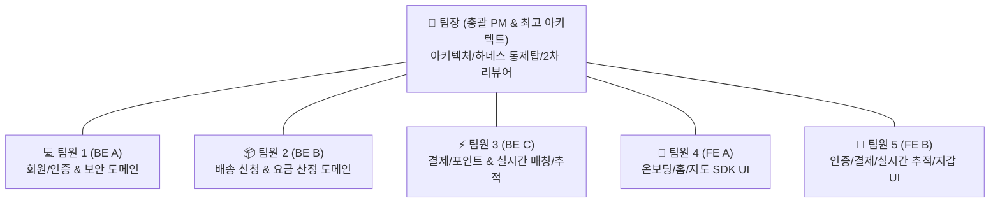

---
metadata:
  version: "1.0.0"
  ssot_owner: "docs/architecture/프로젝트-스펙-및-태스크-분할.md"
  last_updated: "2026-07-28"
  status: "APPROVED (SSOT Primary)"
---

# 📦 Deliver Happiness — 프로젝트 전체 기능 명세서 & 스프린트 태스크 할당 가이드

이 문서는 `DeliverHappiness.pdf` 기획서를 바탕으로 **10개 핵심 모듈(FE-001 ~ FE-031), 30+ 백엔드 REST API 엔드포인트, 6대 스프린트 로드맵 및 파트별(BE / FE / DevOps) 태스크 할당 체계**를 정리한 유일한 단일 원본(SSOT) 명세서입니다.

> [!NOTE]
> 본 명세서는 프로젝트의 [docs/ssot-documentation-policy.md](./ssot-documentation-policy.md) 전문 기술 문서화 표준 규격과 [code-convention.md](../code-convention.md) 단방향 레이어링 규칙을 100% 준수합니다.

---

## 🗺️ 1. 프로젝트 전체 시스템 아키텍처 다이어그램



---

## 🧩 2. 10대 핵심 모듈 및 화면 명세 (FE-001 ~ FE-031)

### 📌 모듈 1: 온보딩 (Onboarding)
* **FE-001 스플래시 화면 (`onboarding 1`):** 3초 자동 전환 애니메이션, 로그인 토큰 존재 시 홈 분기
* **FE-002 워크스루 슬라이드 (`walkthrough 1, 2, 3`):** 3단계 슬라이드(문앞 픽업, 실시간 추적, 안전 완료), 건너뛰기/시작하기 분기

### 📌 모듈 2: 인증 & 회원가입 (Auth & Member)
* **FE-003 소셜 로그인 (`customer-login`):** 카카오, Apple, Google, NAVER OAuth 연동 (`POST /api/auth/social-login`)
* **FE-004 이메일 로그인 (`customer-email-login`):** 이메일/비밀번호 유효성 검사, JWT 토큰 발급 (`POST /api/members/login`)
* **FE-005 역할 선택 (`role-selection`):** 개인고객(`ROLE_CUSTOMER`) vs 배송파트너(`ROLE_COURIER`) 분기 (`PATCH /api/members/role`)
* **FE-006 고객 회원가입 (`signup-customer`):** SMS 인증번호 발송/검증 (`POST /api/auth/send-verification`), 회원 생성 (`POST /api/members`)

### 📌 모듈 3: 홈 대시보드 (Home Dashboard)
* **FE-007 고객 홈 (`customer-home`):** 진행 중 배송 카드, 새 배송 신청 예약, 매칭 현황 (`GET /api/deliveries/active`)
* **FE-008 알림센터 (`notification-center`):** 카테고리별 알림 조회 및 읽음 처리 (`GET /api/notifications`)

### 📌 모듈 4: 배송 신청 (Delivery Request Flow)
* **FE-009 주소 입력 & 요금 산정 (`customer-address-input`):** GPS 역지오코딩, 요금 자동 산정 (`POST /api/deliveries/estimate`)
* **FE-010 ~ FE-011 지도 픽업/도착지 지정 (`pickup/destination-map`):** 카카오맵/TMap 연동, A/B 마커 및 경로선 Polyline 렌더링
* **FE-012 카테고리 선택 (`category-selection`):** 9종 물품 카테고리 그리드 (`GET /api/categories`)
* **FE-013 ~ FE-014 픽업 가이드 및 물품 상세 (`pickup-guide & item-detail`):** 문앞 사진 최대 3장 업로드 (`POST /api/uploads/image`), 가액/주의사항 작성

### 📌 모듈 5: 결제 (Payment & Checkout)
* **FE-015 결제 확인 (`payment-confirmation`):** 기본료, 거리/크기 할증 산정, 보유 포인트 비교
* **FE-016 결제 PIN 입력 (`payment-pin`):** 6자리 보안 PIN 입력 (`POST /api/payments/verify-pin`), 3회 실패 시 잠금
* **FE-017 결제 완료 (`payment-complete`):** 결제 완료 처리 (`POST /api/deliveries/pay`) 및 매칭 대기 전환

### 📌 모듈 6: 배송원 매칭 (Matching)
* **FE-018 매칭 대기 (`matching-wait`):** 진입 시 REST로 상태를 1회 확인하고 WebSocket(STOMP) push로 매칭 상태 감시(간격 폴링 없음), 매칭 취소 (`DELETE /api/deliveries/{id}/matching`)
* **FE-019 매칭 완료 (`matching-complete`):** 배정된 배송원 프로필(아바타, 평점, 건수) 및 예상 픽업 시각 표시

### 📌 모듈 7: 실시간 추적 & 완료 확인 (Real-Time Tracking)
* **FE-020 실시간 추적 (`realtime-tracking`):** 지도 위 배송원 위치 마커 실시간 이동 (WebSocket `delivery:location-update`)
* **FE-021 문앞 사진 확인 (`door-photo-verification`):** 배송 완료 전달 사진 확대 뷰어 (`GET /api/deliveries/{id}/proof-photo`)

### 📌 모듈 8: 배송 내역 (History)
* **FE-022 ~ FE-024 배송 내역 목록 및 취소 상세 (`delivery-history & cancel-detail`):** 완료/취소 구분 페이징 조회 (`GET /api/deliveries`)

### 📌 모듈 9: 포인트 지갑 (Point Wallet)
* **FE-025 ~ FE-026 포인트 지갑 및 충전 (`point-wallet & charge`):** 포인트 잔액/내역 조회 (`GET /api/points/balance`), PG 결제 연동 충전 (`POST /api/points/charge`)

### 📌 모듈 10: 마이페이지 & 설정 (My Page & Settings)
* **FE-027 ~ FE-031 프로필, 주소 관리, 비밀번호 변경, 공지사항:** 내 정보 조회 (`GET /api/members/me`), 주소 CRUD (`/api/addresses`), 비밀번호 변경 (`PATCH /api/members/password`), 공지사항 (`GET /api/notices`)

---

## 🗓️ 3. 6대 스프린트(Sprint 1 ~ 6) 로드맵 및 태스크 할당표

| 스프린트 (Sprint) | 기간 | 목표 모듈 | 백엔드(BE) 개발 태스크 | 프론트엔드(FE) 개발 태스크 | DevOps / QA 하네스 태스크 |
| :--- | :--- | :--- | :--- | :--- | :--- |
| **Sprint 1** | 2주 | 인증 & 온보딩 | • 회원가입/소셜로그인 API<br/>• SMS 인증번호 연동<br/>• 역할 변경 (`PATCH /api/members/role`) | • 스플래시/워크스루 컴포넌트<br/>• 소셜/이메일 로그인 UI<br/>• 고객 회원가입 입력 폼 | • GitHub Actions PR Lint 가동<br/>• Security Default-Deny 검증<br/>• JaCoCo 커버리지 60%+ |
| **Sprint 2** | 2주 | 홈 & 배송 신청 | • 요금 산정 로직 (`POST /estimate`)<br/>• 이미지 업로드 (`POST /uploads`)<br/>• 카테고리 목록 조회 API | • 홈 대시보드 카드 UI<br/>• 카카오맵/TMap 지도 SDK 연동<br/>• 물품 카테고리 & 픽업가이드 | • Flyway 마이그레이션 V2 스크립트<br/>• ArchUnit 단방향 의존성 검증 |
| **Sprint 3** | 2주 | 결제 & 매칭 | • 결제 PIN 검증 (`POST /verify-pin`)<br/>• 배송 결제 & 포인트 차감<br/>• 배송원 매칭 이벤트 로직 | • 6자리 결제 PIN 커스텀 키패드<br/>• 결제 확인/완료 화면<br/>• 매칭 대기 애니메이션 스피너 | • Concurrency 멱등성 검증<br/>• 결제 3회 실패 잠금 테스트 |
| **Sprint 4** | 2주 | 실시간 추적 & 내역 | • WebSocket 위치 추적 핸들러<br/>• 배송 내역/상세 조회 API<br/>• 포인트 충전 PG 연동 API | • 지도 위 위치 마커 이동 애니메이션<br/>• 문앞 배송완료 사진 뷰어<br/>• 포인트 지갑 & PG 충전 UI | • WebSocket 재연결 로직 하네스<br/>• DB 스키마 무결성 검증 |
| **Sprint 5** | 1주 | 마이페이지 & 설정 | • 내 정보 조회/수정 API<br/>• 주소 관리 CRUD API<br/>• 공지사항 리스트/상세 API | • 마이페이지 프로필 편집 UI<br/>• 주소 목록/추가/수정 UI<br/>• 공지사항 목록/상세 화면 | • API 응답 DTO 하위호환성 검증<br/>• Lombok 100% 린트 검사 |
| **Sprint 6** | 1주 | 폴리싱 & QA | • 전역 예외 메시지 정제<br/>• Actuator 헬스체크 모니터링 | • 빈 상태(Empty State) UI<br/>• 네트워크 오류 재시도 토스트 | • `./scripts/verify.sh` 무결점 검증<br/>• JaCoCo 커버리지 80%+ 래칫 |

---

## 👥 4. 6인 팀 구조 (1인 팀장 + 5인 팀원) 역할 정의 및 태스크 매핑 매트릭스

총 6명(팀장 1명 + 팀원 5명)의 프로젝트 조직 구조에 맞춰 **팀장의 아키텍처/품질 통제탑 역할과 5인 팀원의 파트별(BE 3명 / FE 2명) 실전 개발 태스크**를 명확히 분배합니다:



---

### 👑 팀장 (Leader - 총괄 PM & 최고 아키텍처 수호자)
* **주요 역할:** 전체 프로젝트 총괄, Spring Security/JWT 무상태 인증 구조 수호, 로컬 하네스(`verify.sh`) 및 CI/CD 파이프라인 관리, PR 2차 최종 승인(Approve), 팀원 블로커(Blocker) 즉시 해소
* **주요 과업:** 프로젝트 퀄리티 게이트 통제, ADR 작성 가이드, 기술 문서화 표준(SSOT) 준수 검증

---

### 💻 팀원 1 (Member 1 - 백엔드 A: 회원/인증 & 보안 도메인)
* **주요 역할:** 회원가입, 이메일/소셜 로그인 백엔드 API, 역할 설정(`PATCH /api/members/role`), 비밀번호 변경, 프로필 수정 API
* **담당 모듈:** 모듈 2 (인증/회원가입 API), 모듈 10 중 프로필/비밀번호 변경 API (`GET /api/members/me`, `PATCH /api/members/password`)

### 📦 팀원 2 (Member 2 - 백엔드 B: 배송 신청 & 요금 산정 도메인)
* **주요 역할:** 배송 신청 예약 API, GPS 거리/크기 가중치 요금 자동 산정 엔진, 카테고리 목록, 배송 목록/상세 페이징 API
* **담당 모듈:** 모듈 4 (배송 신청/요금 산정/픽업가이드 API), 모듈 8 (배송 내역/상세/취소 API)

### ⚡ 팀원 3 (Member 3 - 백엔드 C: 결제/포인트 & 실시간 매칭/추적)
* **주요 역할:** 6자리 결제 PIN 검증 API, 배송 결제 & 포인트 차감 로직, WebSocket 실시간 위치 추적 백엔드, 알림/주소 CRUD API
* **담당 모듈:** 모듈 3 (알림센터 API), 모듈 5 (결제/PIN 검증 API), 모듈 6~7 (매칭/실시간 위치 추적 WebSocket API), 모듈 9 (포인트 지갑/충전 API)

---

### 📱 팀원 4 (Member 4 - 프론트엔드 A: 온보딩/홈/배송신청 UI)
* **주요 역할:** 고객용 앱 메인 UX, 스플래시/워크스루, 홈 대시보드, 주소 입력/역지오코딩 UI, 카카오맵/TMap 지도 SDK 연동
* **담당 모듈:** FE-001~002 (스플래시/워크스루 UI), FE-007 (홈 대시보드), FE-009~014 (주소/지도/카테고리/픽업가이드 UI)

### 🎨 팀원 5 (Member 5 - 프론트엔드 B: 인증/결제/추적/포인트 UI)
* **주요 역할:** 소셜/이메일 로그인 화면, 6자리 결제 PIN 키패드, 지도 위 실시간 위치 마커 이동 UI, 포인트 지갑 & 마이페이지 UI
* **담당 모듈:** FE-003~006 (로그인/회원가입 UI), FE-015~017 (결제 PIN 키패드 UI), FE-018~021 (매칭/실시간 위치 마커 UI), FE-025~031 (포인트/마이페이지 UI)

---

## 🧪 5. 실증 검증 명령어 (Verification Commands)

스프린트 시작 전 로컬 하네스가 정상적으로 동작하는지 확인하기 위해 다음 명령어를 구동합니다:

```bash
# 1. 로컬 코드 스타일 & 린트 자동 교정
./gradlew spotlessApply

# 2. 로컬 하네스 전체 검증 (단위 테스트, ArchUnit 아키텍처, JaCoCo 커버리지)
./scripts/verify.sh
```

---

## 🛠️ 6. 다음 추천 액션: GitHub Issues 자동 생성

위 로드맵의 **Sprint 1 (인증 & 온보딩)** 태스크부터 순차적으로 **GitHub Issues를 자동으로 오픈**하여 관리할까요? 

원하시는 담당자(Assignee)나 레이블(Labels)이 있으시면 말씀해 주세요! 🚀
