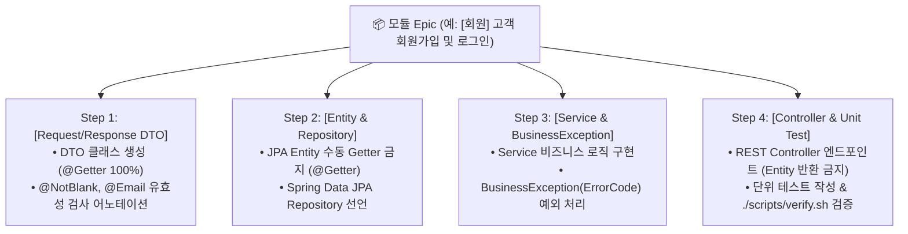

---
metadata:
  version: "1.0.0"
  ssot_owner: "docs/beginners/초급자-CRUD-이슈-템플릿-가이드.md"
  last_updated: "2026-07-28"
  status: "APPROVED (SSOT Primary)"
---

# 🔰 초급 개발자 전용 CRUD & 레이어별 초상세 이슈 분할 가이드북

이 문서는 `shinhan-delivery` 프로젝트에서 **개발 초급자가 DTO, Entity, Repository, Service, Controller를 헤매지 않고 라인 바이 라인으로 따라 하며 개발할 수 있도록 제공하는 초상세 이슈 분할 및 템플릿 가이드북**입니다.

> [!NOTE]
> 본 가이드북은 [docs/architecture/SSOT-문서화-정책-가이드.md](./SSOT-문서화-정책-가이드.md) 단일 원본 원칙과 [code-convention.md](../code-convention.md) 단방향 의존성 규칙을 100% 준수합니다.

---

## 🏛️ 초급자 CRUD 레이어별 4단계 이슈 분할 구조

단순히 "로그인 API 구현"이라고 한 줄로 이슈를 주면 초급자는 막연함을 느낍니다. 따라서 하나의 CRUD 기능을 **아래 4개 레이어(DTO ➔ Entity/Repo ➔ Service ➔ Controller/Test) 단위로 초상세 세분화**하여 가이드합니다:



---

## 📋 초급 개발자 전용 표준 이슈 마크다운 템플릿 (Super-Detailed)

앞으로 GitHub에 생성되는 초급자용 이슈는 **개발자가 체크박스를 상단부터 하나씩 클릭해가며 가이드를 따라 할 수 있는 최상위 가이드 양식**으로 발행됩니다:

```markdown
## 📌 1. 이슈 개요
* **기능명:** `[도메인명] 기능 상세설명 (예: [회원] 이메일 로그인 API 구현)`
* **목표 API:** `POST /api/members/login`
* **담당자:** `[팀원 1]`

---

## 🛠️ 2. 초급자 초상세 레이어별 가이드 & 체크리스트

### 🟦 Step 1: DTO (Data Transfer Object) 정의
- [ ] `src/main/java/.../dto/LoginRequestDto.java` 생성
  - [ ] `@Getter`, `@NoArgsConstructor` 100% Lombok 어노테이션 부착 (수동 Getter 작성 금지)
  - [ ] `@NotBlank(message = "이메일은 필수입니다")`, `@Email` 유효성 검사 수록
- [ ] `src/main/java/.../dto/TokenResponseDto.java` 생성
  - [ ] `@Getter`, `@AllArgsConstructor` 부착 (`accessToken`, `tokenType`)

### 🟩 Step 2: Entity & Repository 확인/작성
- [ ] `Member.java` Entity 확인
  - [ ] 수동 Getter/Setter 0개 확인! 무조건 `@Getter` 수록
- [ ] `MemberRepository.java` 인터페이스 작성
  - [ ] `Optional<Member> findByEmail(String email);` 메서드 선언

### 🟨 Step 3: Service 비즈니스 로직 & 예외 처리
- [ ] `MemberService.java` 내 `login(LoginRequestDto dto)` 메서드 작성
  - [ ] 이메일로 회원 조회 ➔ 미존재 시 `throw new BusinessException(ErrorCode.MEMBER_NOT_FOUND);`
  - [ ] 비밀번호 일치 검증 ➔ 불일치 시 `throw new BusinessException(ErrorCode.INVALID_PASSWORD);`
  - [ ] JWT 토큰 발급 후 `TokenResponseDto` 반환

### 🟥 Step 4: Controller 엔드포인트 작성
- [ ] `MemberController.java` 내 `POST /api/members/login` 메서드 수록
  - [ ] **필수 주의:** Entity 직접 반환 금지! 무조건 `ResponseEntity<TokenResponseDto>` 반환
  - [ ] `@Valid @RequestBody LoginRequestDto request` 파라미터 수록

### 🧪 Step 5: 단위 테스트 (Unit Test) 작성
- [ ] `MemberServiceTest.java` 수록
  - [ ] 정상 로그인 성공 케이스 (200 OK & JWT 토큰 반환)
  - [ ] 비밀번호 불일치 예외 케이스 (401 Unauthorized / `INVALID_PASSWORD`)

### 🛡️ Step 6: 하네스 자가 치유 검증 & PR 3분 족보 작성
- [ ] 터미널에서 `./scripts/verify.sh` 구동 ➔ 0 exit code 패스 확인
- [ ] PR 오픈 시 `1분 서머리 + Mermaid 읽기 순서 + 핀포인트 인라인 댓글 3개` 부착

---

## 📖 3. 참고할 SSOT 가이드북 마크다운 링크
* [코딩 컨벤션 수칙 (code-convention.md)](../code-convention.md)
* [전역 예외 처리 가이드 (docs/architecture/전역-예외-처리-규격-가이드.md)](./전역-예외-처리-규격-가이드.md)
* [PR 리뷰어 3분 족보 가이드 (docs/harness/PR-리뷰어-3분-족보-가이드.md)](./PR-리뷰어-3분-족보-가이드.md)
* [초급 개발자 7단계 태스크 가이드 (docs/beginners/초급-개발자-태스크-분할-가이드.md)](./초급-개발자-태스크-분할-가이드.md)
```

---

## 💡 초급자를 위한 3대 개발 수칙 강조

1. **DTO 작성 시 수동 Getter 작성 금지:**  
   무조건 Lombok `@Getter`를 사용하여 코딩 스타일 통일성을 높입니다.
2. **Controller에서 Entity 직접 반환 절대 금지:**  
   JPA Entity가 JSON으로 직렬화되면서 일어나는 순환 참조(Circular Reference)와 데이터 노출 사고를 방지하기 위해 100% DTO로 변환하여 반환합니다.
3. **`verify.sh` 1초 구동:**  
   코드를 변경할 때마다 터미널에서 `./scripts/verify.sh`를 구동하여 린트 오류를 스스로 수정(자가 치유)합니다.

---

## 🧪 실증 검증 명령어 (Verification Commands)

```bash
# 로컬 하네스 검증 구동
./scripts/verify.sh
```
