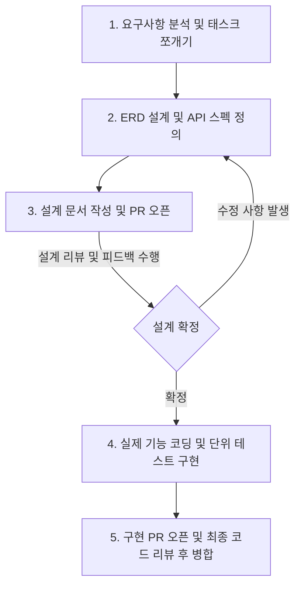

# 기능 개발 전 설계 단계 프로세스 가이드

이 문서는 기능을 개발하기 전, 논리적 오류를 예방하고 원활한 협업 및 고품질 코딩을 위해 설계 단계에서 교육생들이 필수적으로 작성해야 할 문서 포맷과 프로세스를 정의합니다.

---

## 📅 권장하는 개발 프로세스: 2단계 PR 전략

교육생들은 기능 구현 시 아래 2단계 절차를 거치며 개발할 것을 강력히 권장합니다.



* **1단계: 설계 PR (Design-First PR)**
  * 코드를 작성하기 전, ERD 및 API 스펙 문서를 작성합니다. 만약 신규 기술 스택 도입이나 핵심 아키텍처 변경이 포함된다면 `docs/adr/` 규격에 맞춰 **공식 ADR(Architecture Decision Record)**을 함께 작성하여 PR을 생성합니다.
  * 리뷰어(동료, AI, 멘토)로부터 데이터베이스 관계 설정이 올바른지, API 및 아키텍처 설계에 빈틈이 없는지 먼저 확인받습니다.
* **2단계: 구현 PR (Implementation PR)**
  * 설계 및 ADR 리뷰가 통과되면, 해당 설계를 바탕으로 실제 코드 구현 및 테스트 코드를 작성하여 최종 PR을 올리고 병합합니다.

---

## 📝 설계 단계 4대 핵심 산출물 양식 (템플릿)

새로운 기능을 개발할 때, `docs/design/` 디렉토리 아래에 `기능명-design.md` 형식으로 파일을 생성한 뒤 아래 템플릿을 채워 넣어 작성합니다.

---

### 1. 요구사항 정의서 (User Story 기반)
단순한 기능 목록 대신 **"어떤 사용자가, 왜 이 기능을 원하며, 성공 조건은 무엇인가"**를 구체적으로 기술합니다.

* **형식:** `우리는 [사용자 역할]로서, [원하는 목적]을 위해, [기능 설명]을 하기를 원한다.`
* **성공 기준(Acceptance Criteria):** 이 기능이 정상 동작한다고 판단할 수 있는 시나리오 조건

> **💡 작성 예시**
> * **User Story:** 우리는 **배송 요청자**로서, **빠르게 배송원을 배정받기 위해**, **출발지 좌표와 차량 조건을 만족하는 배송원을 자동으로 매칭**받기를 원한다.
> * **성공 기준:**
>   1. 배송 요청이 들어오면 가용한 배송원 차량 중 가장 가까운(최단거리) 차량이 매칭되어야 한다.
>   2. 만약 반경 내에 매칭 가능한 차량이 전혀 없다면, `422 Unprocessable Entity` 에러를 반환하고 트랜잭션이 롤백되어 배송 요청 생성이 취소되어야 한다.

---

### 2. ERD (Entity-Relationship Diagram) 설계
데이터베이스의 테이블 구조와 릴레이션 관계(1:N, N:M 등)를 기술합니다.
* **꿀팁:** 별도의 이미지 캡처 없이, 마크다운 내에 **Mermaid 문법**을 사용해 텍스트로 적으면 GitHub에서 실시간으로 ERD 다이어그램을 렌더링해 줍니다. 깃으로 변경 이력 추적도 가능합니다.

> **💡 작성 예시 (Mermaid ERD)**
>
> ````markdown
> ```mermaid
> erDiagram
>     MEMBER ||--o{ VEHICLE : "owns"
>     VEHICLE ||--o{ MATCHING : "assigned_to"
>     DELIVERY_REQUEST ||--o| MATCHING : "creates"
> 
>     MEMBER {
>         Long id PK
>         String email
>         String password
>         String role
>     }
>     VEHICLE {
>         Long id PK
>         Long member_id FK
>         String status "AVAILABLE / BUSY"
>         Double max_weight
>     }
> ```
> ````

---

### 3. API 명세서 (API Specification)
컨트롤러를 만들기 전에 클라이언트와 서버가 주고받을 데이터 포맷을 테이블 형식으로 약속합니다.

* **엔드포인트:** `POST /api/delivery-requests` (배송 요청 및 자동 매칭 실행)
* **요청 바디 (Request Body):**
  ```json
  {
    "pickupLatitude": 37.50,
    "pickupLongitude": 127.00,
    "weight": 10.5
  }
  ```
* **응답 바디 및 상태 코드 (Response Body & Status):**
  * **Success (201 Created):**
    ```json
    {
      "deliveryRequestId": 12,
      "status": "MATCHED",
      "assignedVehicleId": 3
    }
    ```
  * **Failure (422 Unprocessable Entity - 가용 차량 없음):**
    ```json
    {
      "message": "배송 가능한 차량이 없습니다: weight=10.5"
    }
    ```

---

### 4. 작업 분할 목록 (WBS / Task Checklist)
초보 개발자들은 전체 개발 일정을 산정하는 데 가장 어려움을 겪습니다. 작업을 **2시간~최대 4시간 단위**로 잘게 쪼개어 체크리스트로 관리하도록 유도합니다.

- [ ] V7 데이터베이스 마이그레이션 스크립트 작성 (`V7__add_pickup_coordinates.sql`)
- [ ] JPA Entity 매핑 및 Repository 구현 (`Vehicle`, `DeliveryRequest` 변경)
- [ ] 두 좌표 간의 거리를 계산하는 하버사인 공식 유틸리티 작성 및 단위 테스트 구현
- [ ] 최단 거리 매칭 비즈니스 로직 작성 (`MatchingService.autoMatch()`)
- [ ] 가용 차량 부족 시 트랜잭션 롤백 예외 처리 및 통합 테스트 코드 작성
- [ ] API Controller 연동 및 API E2E 검증

---

## ⚠️ 구현 필수 수칙: Swagger API 문서화 의무화

설계 단계가 완료된 후 실제 코딩(구현)에 착수할 때, 추가되거나 변경되는 모든 API 컨트롤러(`Controller`)와 입출력 DTO 클래스에는 **반드시 Swagger 어노테이션을 활용한 문서화 코드가 포함**되어야 합니다.

### 🛠️ 주요 어노테이션 적용 규칙
1. **컨트롤러 클래스 수준:** `@Tag(name = "도메인명", description = "도메인 컨트롤러 설명")`을 명시하여 그룹화합니다.
2. **컨트롤러 메서드(엔드포인트) 수준:** `@Operation(summary = "기능 요약", description = "호출 시 상세 동작 원리 및 발생 가능한 예외 상황")`을 기술합니다.
3. **DTO 필드 수준:** `@Schema(description = "필드 설명", example = "예시 데이터")`를 기재하여 입출력 규격을 선명하게 드러냅니다.

> 💡 **학습 팁:** 서버를 실행한 뒤 Swagger UI(`http://localhost:8080/swagger-ui/index.html`)에 접속했을 때, **프론트엔드 개발자나 동료 교육생이 코드를 단 한 줄도 열어보지 않고 해당 명세만으로 API를 완벽히 이해하고 테스트할 수 있어야** 비로소 개발 작업이 완료된 것으로 인정됩니다.
