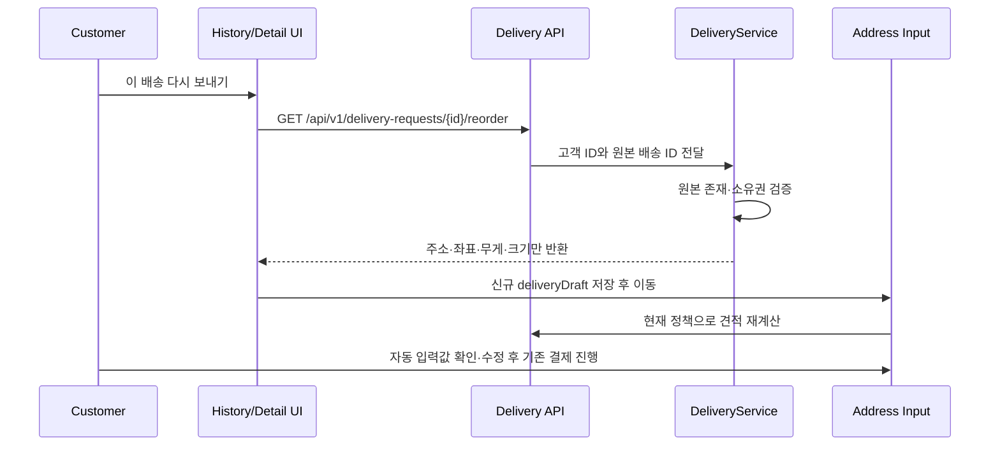

# 1초 퀵 재배송(Re-Order)

> [!IMPORTANT]
> 재배송은 과거 주문을 복제하거나 즉시 결제하지 않는다. 고객 본인의 이전 배송에서 재사용 가능한 입력값만 신규 배송 초안에 채우고, 견적과 결제는 기존 API에서 현재 정책으로 다시 수행한다.

## WHY

반복 배송 고객이 출발지·목적지·물품 정보를 매번 다시 입력하는 불편을 줄이면서도, 과거 요금이나 정산 상태가 신규 주문에 섞이지 않도록 한다.

## 사용자 흐름



## API 및 데이터 경계

- `GET /api/v1/delivery-requests/{deliveryRequestId}/reorder`
- 응답에는 출발지·목적지 주소와 좌표, 무게, 물품 크기만 포함한다.
- 과거 요금, 결제 멱등 키, 배송 상태, 배송원, 사진, 취소·환불·보상 정보는 반환하지 않는다.
- 다른 고객의 배송은 `DeliveryAccessDeniedException`, 없는 배송은 공통 `EntityNotFoundException`으로 거절한다.

## 신규 주문 안전성

- UI는 기존 `deliveryDraft`를 통째로 교체하고 과거 `paymentEstimate`와 `paymentResult`를 보존하지 않는다.
- 물품 카테고리는 현재 배송 엔티티에 저장되지 않으므로 `기타`로 표시하며 사용자가 결제 전에 수정할 수 있다.
- `address-input.html`이 기존 견적 API를 호출해 현재 거리·요금 정책으로 다시 계산한다.
- 결제는 기존 PIN 및 `Idempotency-Key` 생성 흐름을 그대로 사용하므로 원본 배송과 독립적인 신규 요청이 생성된다.

## Trade-off

별도 재배송 테이블이나 원본 배송 FK를 만들지 않아 구조가 단순하고 개인정보 복제 범위가 작다. 대신 재배송 전환 자체의 분석 데이터는 남지 않으며, 추후 필요하면 별도 이벤트로 확장한다.

## 검증

```bash
./gradlew test --tests '*DeliveryServiceTest' --tests '*DeliveryControllerTest'
./scripts/verify.sh
```

- 고객 본인 조회와 타인 접근 차단을 검증한다.
- 응답 DTO에 재사용 가능한 필드만 존재하는지 검증한다.
- 화면 초안이 과거 결제·정산 값을 포함하지 않고 기존 견적 흐름으로 이동하는지 확인한다.
