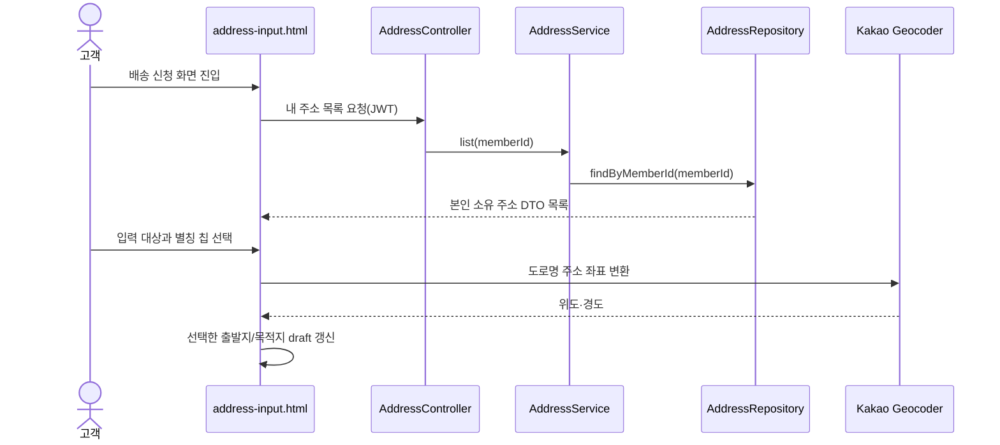

---
metadata:
  version: "1.0.0"
  ssot_owner: "docs/design/address-quick-chips-design.md"
  last_updated: "2026-08-13"
  status: "APPROVED"
---

# 자주 쓰는 주소 별칭 퀵 칩 설계

## 목적

배송 신청자가 주소 관리 화면에 저장한 집·회사 등의 주소를 다시 검색하지 않고 출발지 또는 목적지에 즉시 입력하도록 한다. 주소 저장과 소유권 검증의 단일 원본은 기존 Address 도메인과 `GET /api/v1/addresses`를 그대로 사용한다.



## 동작 규칙

1. 기본 입력 대상은 목적지이며 사용자는 `출발지` 또는 `목적지`를 먼저 선택할 수 있다.
2. 별칭 칩은 서버가 반환한 본인 소유 주소만 렌더링하며, 집·우리집은 `🏠`, 회사·직장은 `🏢`, 나머지는 `📍` 아이콘을 사용한다.
3. 칩을 누르면 주소를 좌표로 변환한 뒤 선택한 입력 대상만 갱신한다. 배송 생성이나 결제는 수행하지 않는다.
4. 연속 클릭으로 좌표 변환 응답 순서가 뒤바뀌어도 가장 마지막 선택만 반영한다.
5. 주소가 없거나 조회·좌표 변환에 실패하면 기존 입력값을 유지하고 사용자에게 안내한다.

> [!IMPORTANT]
> 클라이언트가 전달하는 회원 ID를 신뢰하지 않는다. 주소 목록은 인증 주체의 ID로 조회하므로 다른 회원의 주소는 퀵 칩에 노출되지 않는다.

## WHY와 Trade-off

- **WHY:** 기존 주소 CRUD API를 재사용하면 새 스키마와 중복 API 없이 입력 단계를 줄일 수 있다.
- **Trade-off:** 주소 테이블에 좌표가 없어 선택 시 지도 API 호출이 한 번 필요하다. 대신 좌표를 영구 저장해 생길 수 있는 데이터 불일치와 마이그레이션 비용을 피한다.
- **접근성:** 입력 대상 버튼은 `aria-pressed`, 주소 칩은 구체적인 `aria-label`을 제공하며 키보드로 조작할 수 있는 `button` 요소를 사용한다.

## 검증

```bash
./scripts/verify.sh
```

수동 검증은 주소 관리에서 집·회사 주소를 등록한 뒤 `/address-input`에서 출발지와 목적지를 각각 선택해 칩을 눌러 입력값이 올바른 칸에 반영되는지 확인한다.
