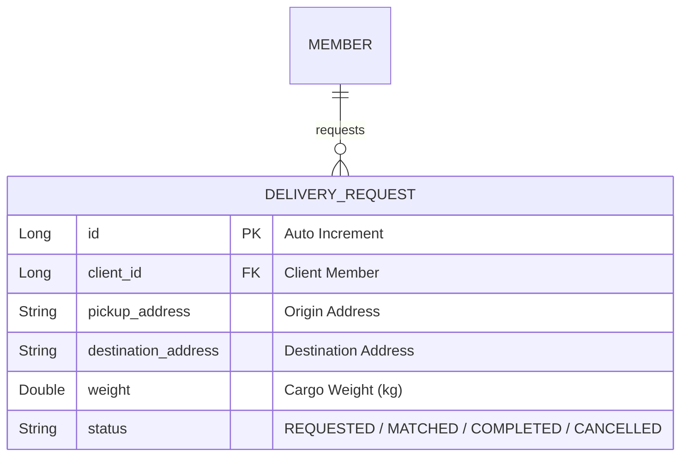

# 설계서: 배송 요청 등록 및 조회 (Delivery Request)

이 문서는 화주 고객이 배송을 의뢰하는 배송 요청 기능에 대한 설계 문서입니다.

---

## 1. 요구사항 정의서 (User Story)

* **User Story:** 
  우리는 **화주 고객(Client)**으로서, 상품을 배송지로 운송하기 위해 **배송할 화물의 위치 정보(출발지/목적지 주소)와 무게를 기록해 배송 요청을 등록하고 조회**하기를 원한다.
* **성공 기준 (Acceptance Criteria):**
  1. 배송을 요청하는 회원은 반드시 실제로 존재하는 회원이어야 하며, 아닐 경우 `404 Not Found` 에러를 반환한다.
  2. 요청하는 배송 화물의 무게는 `0.1kg` 이상이어야 하며, 미달 시 `400 Bad Request` 에러를 발생시킨다.
  3. 배송 요청이 신규 등록되면, 차량 매칭이 되기 전이므로 최초 상태값은 `REQUESTED`가 된다.

---

## 2. ERD 설계 (Entity-Relationship Diagram)



---

## 3. API 명세서 (API Specification)

### 3.1 배송 요청 생성
* **엔드포인트:** `POST /api/delivery-requests`
* **요청 바디 (Request Body):**
  ```json
  {
    "clientId": 1,
    "pickupAddress": "서울시 마포구 백범로 31",
    "destinationAddress": "서울시 중구 을지로 100",
    "weight": 25.5
  }
  ```
* **응답 바디 및 상태 코드 (Response Body & Status):**
  * **Success (201 Created):**
    ```json
    {
      "id": 1,
      "clientId": 1,
      "pickupAddress": "서울시 마포구 백범로 31",
      "destinationAddress": "서울시 중구 을지로 100",
      "weight": 25.5,
      "status": "REQUESTED"
    }
    ```
  * **Failure (404 Not Found - 고객 존재 안 함):**
    ```json
    {
      "message": "존재하지 않는 회원입니다: id=99"
    }
    ```

### 3.2 배송 요청 단건 조회
* **엔드포인트:** `GET /api/delivery-requests/{id}`
* **응답 바디 및 상태 코드 (Response Body & Status):**
  * **Success (200 OK):**
    ```json
    {
      "id": 1,
      "clientId": 1,
      "pickupAddress": "서울시 마포구 백범로 31",
      "destinationAddress": "서울시 중구 을지로 100",
      "weight": 25.5,
      "status": "REQUESTED"
    }
    ```
  * **Failure (404 Not Found - 배송 요청 없음):**
    ```json
    {
      "message": "존재하지 않는 배송 요청입니다: id=99"
    }
    ```

---

## 4. 작업 분할 목록 (WBS)

- [x] 배송 요청 스키마 생성 마이그레이션 스크립트 작성 (`V4__create_delivery_request_table.sql`)
- [x] `DeliveryRequest` 도메인 Entity 설계 및 `DeliveryStatus` 상태 이늄 설정
- [x] `DeliveryRequestNotFoundException` 커스텀 예외 클래스 설계
- [x] 화주 고객 정보 유효성 검사 및 화물 적재 중량 유효 범위(> 0.1kg) 체크 비즈니스 로직 작성
- [x] 배송 요청 등록/조회 서비스 레이어 비즈니스 로직 설계 및 단위 테스트 구현
- [x] `DeliveryController` 및 API 컨트롤러 슬라이스 통합 테스트 구현
