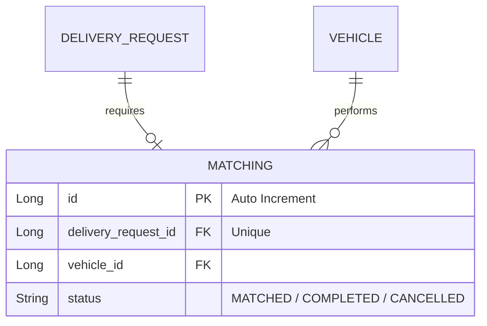

# 설계서: 배송 매칭 (Matching)

이 문서는 생성된 배송 요청에 가용 차량(배송원)을 연결하고 상호 리소스의 상태를 조율하는 매칭 기능에 대한 설계 문서입니다.

---

## 1. 요구사항 정의서 (User Story)

* **User Story:** 
  우리는 **시스템 및 운영자**로서, 배송 프로세스를 안정적으로 중개하기 위해 **배송 요청 건과 특정 차량을 연결(매칭)하고, 이에 맞게 배송 및 차량 상태를 자동으로 연동하여 갱신**하기를 원한다.
* **성공 기준 (Acceptance Criteria):**
  1. 배송 매칭이 생성되면 매칭 데이터가 기록되고, 대상 차량의 상태는 즉시 `BUSY`로 전환되어 다른 주문에 배정되지 않아야 한다. 동시에 대상 배송 요청 상태는 `MATCHED`로 갱신된다.
  2. 이미 다른 주문을 수행 중인 `BUSY` 상태의 차량에 중복 매칭을 시도하는 경우 `422 Unprocessable Entity` 에러를 발생시킨다.
  3. 완료(`COMPLETED`)나 취소/삭제(`CANCELLED`) 등 매칭 상태가 해제되는 이벤트가 발생하면, 대상 차량 상태는 자동으로 `AVAILABLE`로 복귀되어야 한다.

---

## 2. ERD 설계 (Entity-Relationship Diagram)



---

## 3. API 명세서 (API Specification)

### 3.1 수동 배송 매칭 생성 (Operator)
* **엔드포인트:** `POST /api/matchings`
* **요청 바디 (Request Body):**
  ```json
  {
    "deliveryRequestId": 1,
    "vehicleId": 1
  }
  ```
* **응답 바디 및 상태 코드 (Response Body & Status):**
  * **Success (201 Created):**
    ```json
    {
      "id": 1,
      "deliveryRequestId": 1,
      "vehicleId": 1,
      "status": "MATCHED"
    }
    ```
  * **Failure (422 Unprocessable Entity - 차량 상태가 AVAILABLE이 아님):**
    ```json
    {
      "message": "이미 매칭중인 차량입니다: vehicleId=1"
    }
    ```

### 3.2 매칭 완료 처리 (상태 수정)
* **엔드포인트:** `PUT /api/matchings/{id}`
* **요청 바디 (Request Body):**
  ```json
  {
    "status": "COMPLETED"
  }
  ```
* **응답 바디 및 상태 코드 (Response Body & Status):**
  * **Success (200 OK):**
    ```json
    {
      "id": 1,
      "deliveryRequestId": 1,
      "vehicleId": 1,
      "status": "COMPLETED"
    }
    ```
  *(비즈니스 로직 연동: 배송 요청 상태는 COMPLETED가 되고, 차량 상태는 AVAILABLE로 원상복귀됨)*

### 3.3 매칭 삭제 (취소 처리)
* **엔드포인트:** `DELETE /api/matchings/{id}`
* **응답 상태 코드:** `204 No Content`
  *(비즈니스 로직 연동: 차량 상태는 AVAILABLE로 돌아가고, 배송 요청은 미매칭 상태인 REQUESTED로 복원됨)*

---

## 4. 작업 분할 목록 (WBS)

- [x] 매칭 관리 테이블 생성 스크립트 작성 (`V5__create_matching_table.sql`)
- [x] `Matching` 도메인 Entity 설계 및 `MatchingStatus` 매핑
- [x] `AlreadyMatchedException`, `MatchingNotFoundException` 글로벌 오류 추가
- [x] 매칭 상태 변화에 따른 타겟 테이블(`Vehicle`, `DeliveryRequest`) 데이터 동기화 로직 구현 (`applyStatus` 헬퍼 설계)
- [x] 이미 배정된 차량 중복 등록 방지 락(Lock) 처리 및 예외 처리 구현
- [x] 매칭 생성/수정/삭제 비즈니스 로직 구현 및 통합 예외 처리 단위 테스트 구현
- [x] `MatchingController` 엔드포인트 연동 및 API E2E 검증 테스트 구현
