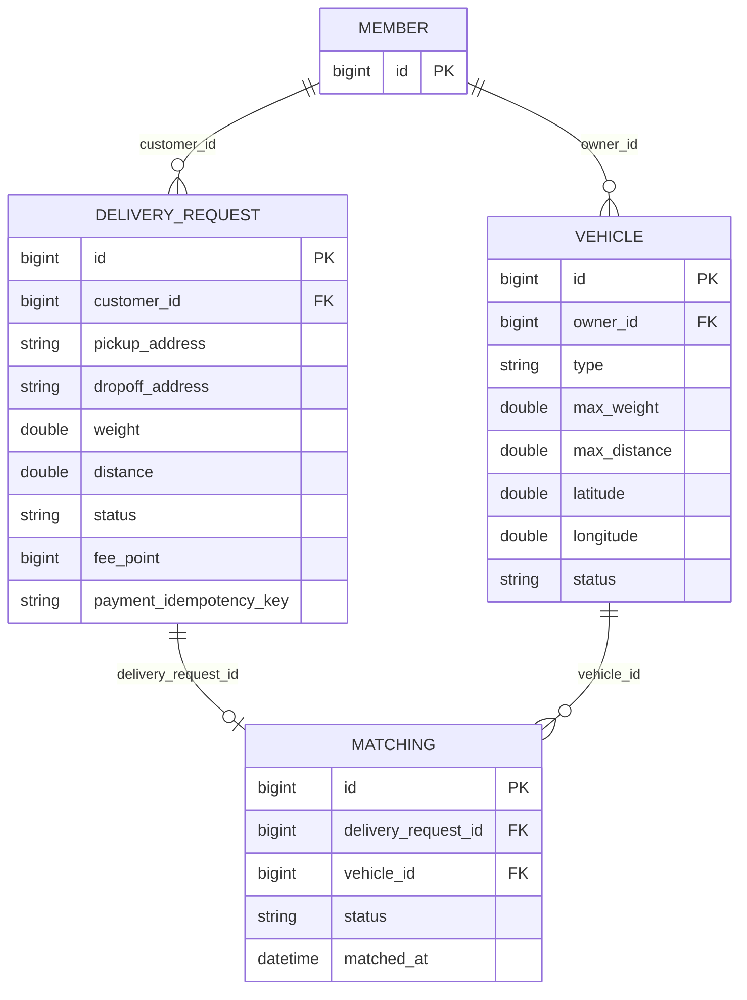

# ERD (Entity Relationship Diagram) 템플릿

## 문서 정보
| 항목 | 내용 |
|---|---|
| 기능/도메인명 | 배송 요청-차량 매칭 (Matching) |
| 작성자 | @kms7522 (kms) |
| 작성일 | 2026-08-05 |
| 상태 | 확정 |
| 관련 PRD 링크 | `docs/design/matching-prd-example.md` |

---

## 1. 개요 (Overview)
- 이 문서는 `Matching`(배송 요청-차량 매칭) 도메인이 다루는 3개 테이블(`vehicle`, `delivery_request`, `matching`)의 스키마와 관계를 다룬다.
- `matching` 테이블이 이번 기능의 핵심 테이블이고, `vehicle`/`delivery_request`는 매칭이 성립하기 위해 필요한 연관 테이블이다. `member` 테이블은 `vehicle.owner_id`/`delivery_request.customer_id`가 참조하는 외부 도메인이라 이 문서 범위 밖이며 최소 정보만 기재한다.
- 컬럼·제약조건의 원본은 `src/main/resources/db/migration/`의 Flyway 마이그레이션 파일이며, 이 문서는 그 내용을 사람이 보기 좋게 정리한 것이다.

## 2. 엔티티 목록 (Entities)
| 엔티티명 | 설명 | 신규/기존 |
|---|---|---|
| Member | 회원(고객/배송원/관리자) | 기존 (이 문서 범위 밖, 참조용) |
| Vehicle | 배송원이 등록한 차량 | 기존 |
| DeliveryRequest | 고객의 배송 요청 | 기존 |
| Matching | 배송 요청과 차량을 연결하는 매칭 | 신규 |

## 3. 엔티티별 속성 정의 (Attributes)

### 3.1 `Member` (참조용, 최소 정보만)
| 컬럼명 | 타입 | PK/FK | Null 허용 | 기본값 | 설명 |
|---|---|---|---|---|---|
| id | BIGINT | PK | N | auto_increment | 회원 고유 ID |

### 3.2 `Vehicle`
| 컬럼명 | 타입 | PK/FK | Null 허용 | 기본값 | 설명 |
|---|---|---|---|---|---|
| id | BIGINT | PK | N | auto_increment | 차량 고유 ID |
| owner_id | BIGINT | FK → Member.id | N | | 차량 소유주(배송원) |
| type | VARCHAR(20) | | N | | 차량 종류 (`MOTORCYCLE`/`DRONE`/`CAR`) |
| max_weight | DOUBLE | | N | | 최대 적재 중량 |
| max_distance | DOUBLE | | N | | 최대 운행 거리 |
| latitude | DOUBLE | | N | 0 | 현재 위도 |
| longitude | DOUBLE | | N | 0 | 현재 경도 |
| status | VARCHAR(20) | | N | `AVAILABLE` | 차량 상태 (`AVAILABLE`/`BUSY`) |

### 3.3 `DeliveryRequest`
| 컬럼명 | 타입 | PK/FK | Null 허용 | 기본값 | 설명 |
|---|---|---|---|---|---|
| id | BIGINT | PK | N | auto_increment | 배송 요청 고유 ID |
| customer_id | BIGINT | FK → Member.id | N | | 요청 고객 |
| pickup_address | VARCHAR(255) | | N | | 픽업지 주소 |
| dropoff_address | VARCHAR(255) | | N | | 도착지 주소 |
| weight | DOUBLE | | N | | 물품 무게 |
| distance | DOUBLE | | N | | 배송 거리 |
| status | VARCHAR(20) | | N | | `REQUESTED`/`MATCHED`/`PICKED_UP`/`COMPLETED`/`CANCELLED` |
| fee_point | BIGINT | | N | | 배송 요금(포인트) |
| pickup_latitude | DOUBLE | | N | 0 | 픽업지 위도 |
| pickup_longitude | DOUBLE | | N | 0 | 픽업지 경도 |
| dropoff_latitude | DOUBLE | | N | 0 | 도착지 위도 |
| dropoff_longitude | DOUBLE | | N | 0 | 도착지 경도 |
| item_size | VARCHAR(20) | | N | `MEDIUM` | 물품 크기 |
| proof_photo_url | VARCHAR(255) | | Y | | 배송 완료 증거 사진 |
| completed_at | TIMESTAMP | | Y | | 배송 완료 시각 |
| picked_up_at | TIMESTAMP | | Y | | 픽업 완료 시각 |
| created_at | TIMESTAMP | | Y | | 생성 시각 |
| payment_idempotency_key | VARCHAR(100) | | Y | | 결제 멱등키 |

### 3.4 `Matching`
| 컬럼명 | 타입 | PK/FK | Null 허용 | 기본값 | 설명 |
|---|---|---|---|---|---|
| id | BIGINT | PK | N | auto_increment | 매칭 고유 ID |
| delivery_request_id | BIGINT | FK → DeliveryRequest.id, UNIQUE | N | | 대상 배송 요청 (배송 요청 1건당 매칭 최대 1개) |
| vehicle_id | BIGINT | FK → Vehicle.id | N | | 배정된 차량 |
| status | VARCHAR(20) | | N | | `MATCHED`/`COMPLETED`/`CANCELLED` |
| matched_at | DATETIME | | N | | 매칭 성사 시각 |

## 4. 관계 정의 (Relationships)
| 엔티티 A | 관계 | 엔티티 B | 설명 |
|---|---|---|---|
| Member | 1 : N | Vehicle | 배송원 한 명이 차량을 여러 대 등록할 수 있다 |
| Member | 1 : N | DeliveryRequest | 고객 한 명이 배송을 여러 건 요청할 수 있다 |
| DeliveryRequest | 1 : 0..1 | Matching | 배송 요청 하나에 매칭은 최대 하나 (`delivery_request_id` UNIQUE) |
| Vehicle | 1 : N | Matching | 차량 한 대가 여러 매칭(배송 이력)에 등장할 수 있다 |

- N:M 관계는 없음 — `Matching`이 `DeliveryRequest`와 `Vehicle`을 잇는 조인 성격이지만, `delivery_request_id`가 UNIQUE라 실질적으로 N:1(차량 기준으로는 N, 배송 요청 기준으로는 1) 구조이지 다대다 조인 테이블은 아니다.

## 5. ERD 다이어그램

## 6. 인덱스 (Indexes)
| 테이블 | 인덱스명 | 컬럼 | 유형 | 목적 |
|---|---|---|---|---|
| matching | uq_matching_delivery_request | delivery_request_id | UNIQUE | 배송 요청 1건당 매칭 1개만 허용 |
| matching | fk_matching_delivery_request | delivery_request_id | FK 인덱스 | `DeliveryRequest` 조인 최적화 |
| matching | fk_matching_vehicle | vehicle_id | FK 인덱스 | `Vehicle` 조인 최적화 |
| delivery_request | uq_delivery_request_customer_payment_key | customer_id, payment_idempotency_key | UNIQUE | 동일 고객의 중복 결제 요청 방지 |
| vehicle | fk_vehicle_owner | owner_id | FK 인덱스 | `Member` 조인 최적화 |
| delivery_request | fk_delivery_request_customer | customer_id | FK 인덱스 | `Member` 조인 최적화 |

## 7. 제약조건 (Constraints)
- **Unique 제약**: `matching.delivery_request_id`(배송 요청당 매칭 1개), `delivery_request(customer_id, payment_idempotency_key)`(고객별 결제 멱등성)
- **삭제 정책**: 세 FK(`fk_vehicle_owner`, `fk_delivery_request_customer`, `fk_matching_delivery_request`, `fk_matching_vehicle`) 전부 `ON DELETE` 옵션이 명시되어 있지 않다 — MariaDB 기본값인 **RESTRICT**로 동작한다. 즉 `Member`를 참조 중인 `Vehicle`/`DeliveryRequest`가 하나라도 있으면 그 `Member`는 DB 레벨에서 삭제할 수 없다. Soft delete는 쓰지 않는다(물리 삭제).
- **기타 비즈니스 규칙** (DB 제약이 아니라 애플리케이션 레벨에서 검증):
  - 매칭 상태 전이 규칙(`MatchingStatus`)은 DB CHECK 제약이 아니라 `MatchingService.validateTransition()`에서 코드로 검증한다.
  - 차량의 `max_weight`/`max_distance`가 배송 요청의 `weight`/`distance`를 감당할 수 있는지도 DB 제약이 아니라 `MatchingService.create()`/`update()`에서 코드로 검증한다.

## 8. 마이그레이션 영향 (Migration Impact)
- **신규 테이블 생성**: `matching`.
- **기존 테이블 컬럼 추가**: `vehicle`에 위치 좌표·상태 컬럼, `delivery_request`에 좌표·물품 크기·증거 사진·타임스탬프·결제 멱등키 컬럼.
- **기존 데이터 영향**: 신규 컬럼은 전부 `NOT NULL DEFAULT ...` 또는 `NULL` 허용으로 추가되어 기존 행에 대한 백필(backfill) 로직이 따로 필요하지 않다.
- **롤백 계획**: Flyway는 기본적으로 전진 전용(forward-only)이다. 되돌릴 일이 생기면 새 마이그레이션 파일로 되돌린다 (`code-convention.md` §15, "이미 반영된 마이그레이션 파일은 절대 수정하지 않는다").

## 9. 오픈 이슈 (Open Questions)
- [ ] FK에 `ON DELETE RESTRICT`가 암묵적으로 걸려 있는데, 이게 의도된 정책인지 문서화가 안 되어 있다. `Member` 탈퇴 시나리오를 어떻게 처리할지(예: 소프트 삭제로 전환) 별도 논의가 필요해 보인다.
- [ ] `matching.matched_at`은 `NOT NULL`인데, 매칭이 `CANCELLED`/`COMPLETED`로 바뀌어도 이 컬럼은 최초 매칭 시각 그대로 유지된다 — 상태별 시각(취소 시각, 완료 시각)을 따로 기록할 필요는 없는지 확인 필요.
