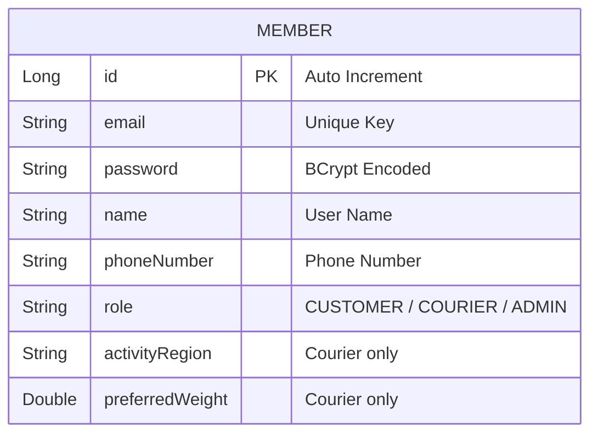

# 설계서: 회원 인증 및 계정 관리 (Member & Auth)

이 문서는 회원 가입, 로그인, 조회, 비밀번호 변경과 배송원 전용 가입 확장 필드를 다룹니다.

---

## 1. 요구사항 정의 (User Story)

* **User Story:**
  우리는 **고객(Customer)** 또는 **배송원(Courier)** 으로서 서비스 이용 권한을 획득하고 계정을 안전하게 관리하기 위해 회원가입, 로그인, 조회, 비밀번호 변경을 수행하기를 원한다.
* **성공 기준 (Acceptance Criteria):**
  1. 이메일 중복 가입 시 `409 Conflict` 를 반환한다.
  2. 비밀번호는 BCrypt 로 암호화해 저장한다.
  3. 존재하지 않는 회원 조회 시 `404 Not Found` 를 반환한다.
  4. 비밀번호 변경은 인증된 본인만 수행할 수 있다.
  5. `COURIER` 회원가입 시 `vehicleType`, `activityRegion`, `preferredWeight` 를 함께 받아야 한다.
  6. `COURIER` 회원가입 성공 시 기본 차량 1대가 같은 트랜잭션에서 생성되어야 한다.

---

## 2. ERD 설계



> [!NOTE]
> `vehicleType` 는 회원 컬럼으로 저장하지 않고, 배송원 가입 직후 기본 `Vehicle` 생성 입력값으로만 사용합니다.

---

## 3. API 명세

### 3.1 회원 가입
* **엔드포인트:** `POST /api/v1/members`
* **Request Body 예시:**
  ```json
  {
    "email": "courier@example.com",
    "password": "Password123!",
    "name": "홍길동",
    "phoneNumber": "010-1234-5678",
    "role": "COURIER",
    "vehicleType": "MOTORCYCLE",
    "activityRegion": "서울 강남구",
    "preferredWeight": 15.0
  }
  ```
* **처리 규칙:**
  1. `CUSTOMER` 는 기존 필드만으로 가입 가능하다.
  2. `COURIER` 는 `vehicleType`, `activityRegion`, `preferredWeight` 가 모두 필수다.
  3. 가입 성공 시 배송원 기본 차량을 함께 생성한다.

### 3.2 회원 조회
* **엔드포인트:** `GET /api/v1/members/{id}`

### 3.3 비밀번호 변경
* **엔드포인트:** `PATCH /api/v1/members/password`
* **인증:** `Authorization: Bearer {accessToken}`

---

## 4. 구현 메모

* `Member` 엔티티에 `activityRegion`, `preferredWeight` 를 추가한다.
* `MemberService.create()` 는 배송원 가입 시 기본 차량 생성을 함께 수행한다.
* `MemberService.delete()` 는 배송원 소유 차량을 먼저 삭제한 뒤 회원을 삭제한다.

## 5. 검증 명령어

```bash
./gradlew.bat test --tests "*MemberServiceTest" --tests "*MemberServiceTransactionTest"
./scripts/verify.sh
```
