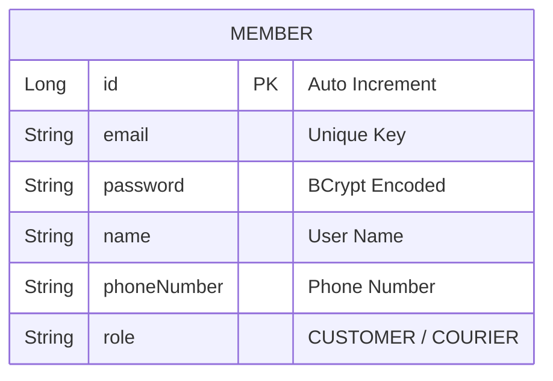

# 설계서: 회원가입 및 회원 정보 조회 (Member & Auth)

이 문서는 사용자 계정 생성 및 조회 기능에 대한 설계 문서입니다.

---

## 1. 요구사항 정의서 (User Story)

* **User Story:** 
  우리는 **고객(Client) 또는 배송원(Courier)**으로서, 서비스 이용 권한을 획득하고 로그인 및 식별에 사용하기 위해 **이메일과 비밀번호로 회원가입 및 회원 정보 조회**를 원한다.
* **성공 기준 (Acceptance Criteria):**
  1. 회원가입 시 이메일은 중복될 수 없으며, 중복 발생 시 `409 Conflict` 예외와 적절한 에러 메시지를 반환해야 한다.
  2. 저장되는 비밀번호는 평문이 아닌 안전한 해시 함수(BCrypt)로 암호화되어 저장되어야 한다.
  3. 존재하지 않는 회원 ID로 정보를 조회하면 `404 Not Found` 에러를 반환해야 한다.

---

## 2. ERD 설계 (Entity-Relationship Diagram)



---

## 3. API 명세서 (API Specification)

### 3.1 회원 가입
* **엔드포인트:** `POST /api/v1/members`
* **요청 바디 (Request Body):**
  ```json
  {
    "email": "trainee@example.com",
    "password": "securepassword123",
    "name": "홍길동",
    "phoneNumber": "010-1234-5678",
    "role": "CUSTOMER"
  }
  ```
* **응답 바디 및 상태 코드 (Response Body & Status):**
  * **Success (201 Created):**
    ```json
    {
      "id": 1,
      "email": "trainee@example.com",
      "name": "홍길동",
      "phoneNumber": "010-1234-5678",
      "role": "CUSTOMER"
    }
    ```
  * **Failure (409 Conflict - 중복 이메일, ErrorCode `M002`):**
    ```json
    {
      "status": 409,
      "code": "M002",
      "message": "이미 가입된 이메일 주소입니다. (Email: trainee@example.com)",
      "timestamp": "2026-07-28T10:00:00"
    }
    ```

### 3.2 회원 정보 조회
* **엔드포인트:** `GET /api/v1/members/{id}`
* **응답 바디 및 상태 코드 (Response Body & Status):**
  * **Success (200 OK):**
    ```json
    {
      "id": 1,
      "email": "trainee@example.com",
      "name": "홍길동",
      "phoneNumber": "010-1234-5678",
      "role": "CUSTOMER"
    }
    ```
  * **Failure (404 Not Found - 회원 없음, ErrorCode `M001`):**
    ```json
    {
      "status": 404,
      "code": "M001",
      "message": "존재하지 않는 회원입니다.",
      "timestamp": "2026-07-28T10:00:00"
    }
    ```

---

## 4. 작업 분할 목록 (WBS)

- [x] 회원 관리 DB 마이그레이션 스크립트 작성 (`V2__create_member_table.sql`)
- [x] `Member` 엔티티 매핑 및 `MemberRole` 이늄(enum) 설계
- [x] `PasswordEncoderConfig` 및 BCrypt 비밀번호 인코더 빈(Bean) 설정
- [x] `DuplicateMemberException`(`BusinessException` 상속) 및 공통 `EntityNotFoundException` + `ErrorCode.MEMBER_NOT_FOUND` 매핑
- [x] 회원가입 비즈니스 로직 구현 및 중복 가입 체크 유닛 테스트 작성
- [x] 회원 조회 비즈니스 로직 구현 및 조회 예외 핸들링 테스트 작성
- [x] `MemberController` API 엔드포인트 연동 및 슬라이스(Controller) 테스트 구현
