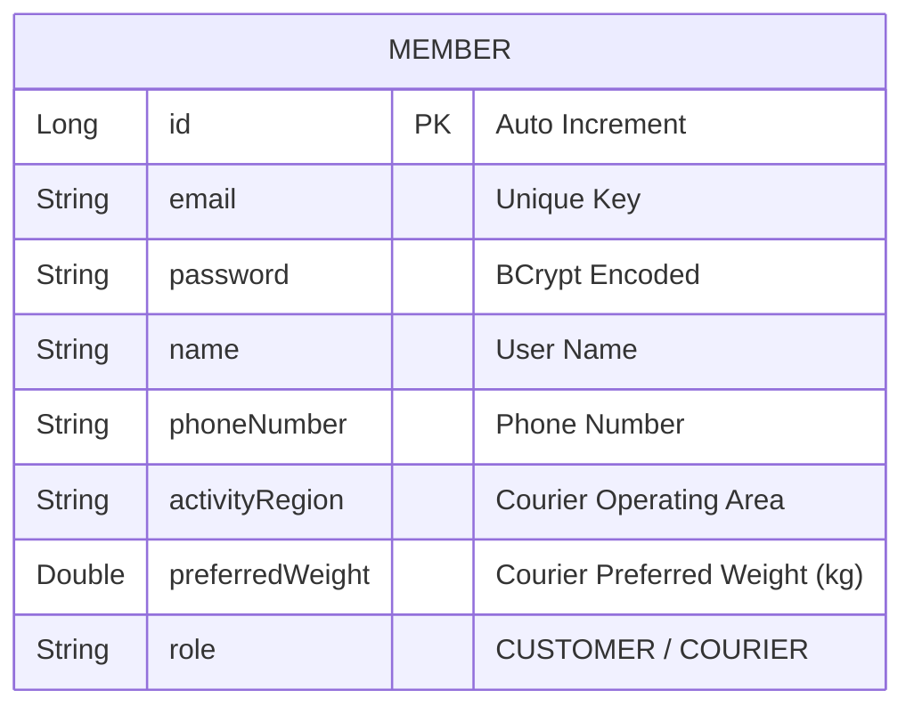

# 설계서: 회원 인증 및 계정 관리 (Member & Auth)

이 문서는 사용자 계정 생성, 조회 및 비밀번호 변경 기능에 대한 설계 문서입니다.

---

## 1. 요구사항 정의서 (User Story)

* **User Story:** 
  우리는 **고객(Client) 또는 배송원(Courier)**으로서, 서비스 이용 권한을 획득하고 계정을 안전하게 관리하기 위해 **이메일과 비밀번호로 회원가입·조회하고 본인 비밀번호를 변경**하기를 원한다. 배송원은 가입 시 차량 종류, 활동 희망 지역, 희망 배송 중량을 함께 제출해 즉시 배송 가능 프로필을 완성한다.
* **성공 기준 (Acceptance Criteria):**
  1. 회원가입 시 이메일은 중복될 수 없으며, 중복 발생 시 `409 Conflict` 예외와 적절한 에러 메시지를 반환해야 한다.
  2. 저장되는 비밀번호는 평문이 아닌 안전한 해시 함수(BCrypt)로 암호화되어 저장되어야 한다.
  3. 존재하지 않는 회원 ID로 정보를 조회하면 `404 Not Found` 에러를 반환해야 한다.
  4. 비밀번호 변경은 JWT로 인증된 본인만 수행할 수 있으며 현재 비밀번호 검증을 통과해야 한다.
  5. 새 비밀번호는 8자 이상 100자 이하이며 영문, 숫자, 특수문자를 각각 포함해야 한다.

---

## 2. ERD 설계 (Entity-Relationship Diagram)



---

## 3. API 명세서 (API Specification)

### 3.1 회원 가입
* **엔드포인트:** `POST /api/v1/members`
* **요청 바디 (Request Body):**
  ```json
  {
    "email": "trainee@example.com",
    "password": "securepassword123",
    "name": "홍길동",
    "phoneNumber": "010-1234-5678",
    "role": "CUSTOMER"
  }
  ```
* **배송원 가입 요청 예시:**
  ```json
  {
    "email": "courier@example.com",
    "password": "securepassword123",
    "name": "박배송",
    "phoneNumber": "010-1234-5678",
    "role": "COURIER",
    "vehicleType": "MOTORCYCLE",
    "activityRegion": "서울특별시 강남구",
    "preferredWeight": 15.0
  }
  ```
* **응답 바디 및 상태 코드 (Response Body & Status):**
  * **Success (201 Created):**
    ```json
    {
      "id": 1,
      "email": "trainee@example.com",
      "name": "홍길동",
      "phoneNumber": "010-1234-5678",
      "role": "CUSTOMER"
    }
    ```
  * **Failure (409 Conflict - 중복 이메일, ErrorCode `M002`):**
    ```json
    {
      "status": 409,
      "code": "M002",
      "message": "이미 가입된 이메일 주소입니다. (Email: trainee@example.com)",
      "timestamp": "2026-07-28T10:00:00"
    }
    ```
  * **Failure (400 Bad Request - 배송원 추가 정보 누락, ErrorCode `C001`):**
    ```json
    {
      "status": 400,
      "code": "C001",
      "message": "배송원 회원가입에는 차량 종류, 활동 희망 지역, 희망 배송 중량이 모두 필요합니다.",
      "timestamp": "2026-08-03T10:00:00"
    }
    ```

### 3.2 회원 정보 조회
* **엔드포인트:** `GET /api/v1/members/{id}`
* **응답 바디 및 상태 코드 (Response Body & Status):**
  * **Success (200 OK):**
    ```json
    {
      "id": 1,
      "email": "trainee@example.com",
      "name": "홍길동",
      "phoneNumber": "010-1234-5678",
      "role": "CUSTOMER"
    }
    ```
  * **Failure (404 Not Found - 회원 없음, ErrorCode `M001`):**
    ```json
    {
      "status": 404,
      "code": "M001",
      "message": "존재하지 않는 회원입니다.",
      "timestamp": "2026-07-28T10:00:00"
    }
    ```

### 3.3 비밀번호 변경
* **엔드포인트:** `PATCH /api/v1/members/password`
* **인증:** `Authorization: Bearer {accessToken}` 헤더가 필요하며, JWT의 회원 ID를 변경 대상으로 사용한다.
* **요청 바디 (Request Body):**
  ```json
  {
    "currentPassword": "OldPassword1!",
    "newPassword": "NewPassword2@",
    "confirmNewPassword": "NewPassword2@"
  }
  ```
* **처리 규칙:**
  1. 새 비밀번호와 확인값을 먼저 비교해 불일치 요청을 빠르게 거절한다.
  2. `PasswordEncoder.matches()`로 현재 비밀번호와 기존 비밀번호 재사용 여부를 검증한다.
  3. 검증을 통과한 새 비밀번호만 BCrypt로 암호화해 저장한다.
  4. 성공 후 클라이언트는 저장된 Access/Refresh 토큰을 제거하고 다시 로그인한다.
* **응답 상태 코드:**
  * **Success:** `204 No Content`
  * **Failure:**

    | 상태 | 코드 | 메시지 |
    |---:|---|---|
    | 400 | `M004` | 현재 비밀번호가 일치하지 않습니다. |
    | 400 | `M005` | 새 비밀번호와 비밀번호 확인이 일치하지 않습니다. |
    | 400 | `M006` | 현재 비밀번호와 다른 비밀번호를 입력해야 합니다. |
    | 401 | `A001` | 인증 권한이 필요합니다. |

---

## 4. 작업 분할 목록 (WBS)

- [x] 회원 관리 DB 마이그레이션 스크립트 작성 (`V2__create_member_table.sql`)
- [x] `Member` 엔티티 매핑 및 `MemberRole` 이늄(enum) 설계
- [x] `PasswordEncoderConfig` 및 BCrypt 비밀번호 인코더 빈(Bean) 설정
- [x] `DuplicateMemberException`(`BusinessException` 상속) 및 공통 `EntityNotFoundException` + `ErrorCode.MEMBER_NOT_FOUND` 매핑
- [x] 회원가입 비즈니스 로직 구현 및 중복 가입 체크 유닛 테스트 작성
- [x] 회원 조회 비즈니스 로직 구현 및 조회 예외 핸들링 테스트 작성
- [x] 로그인 회원 비밀번호 변경, BCrypt 검증·암호화 및 재로그인 흐름 구현
- [x] `MemberController` API 엔드포인트 연동 및 슬라이스(Controller) 테스트 구현
