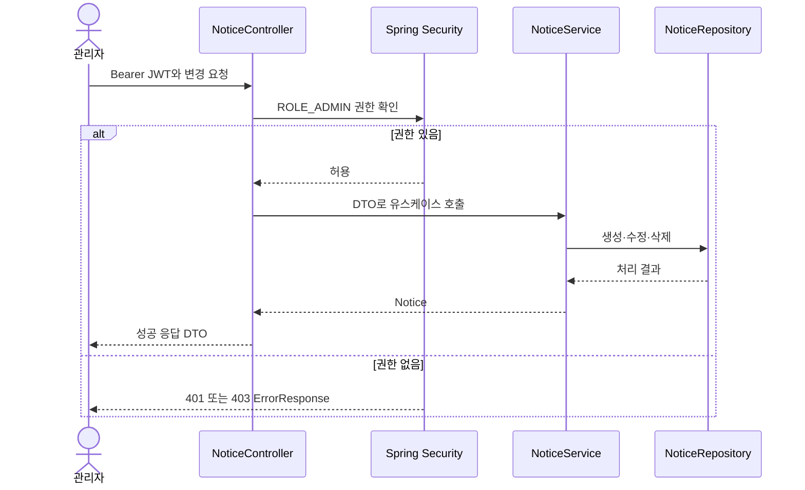

---
metadata:
  version: "1.0.0"
  ssot_owner: "docs/design/notice-admin-management-api.md"
  last_updated: "2026-08-06"
  status: "DRAFT"
---

# 관리자 공지사항 관리 API 명세서

## 문서 정보

| 항목 | 내용 |
|---|---|
| API/기능명 | 관리자 공지사항 생성·수정·삭제 |
| 작성자 | jaeya1006-arch |
| 작성일 | 2026-08-06 |
| 버전 | v1.0 |
| 상태 | 초안 |
| 관련 PRD/ERD 링크 | [`관리자 공지사항 관리 요구사항`](./notice-admin-management-requirements.md), [`공지사항 조회 설계`](./notice-design.md), [`프로젝트 ERD`](../erd.md) |

---

## 1. 개요 (Overview)

- 관리자가 공지사항을 생성·수정·삭제할 수 있는 API를 정의한다.
- 기존 공개 목록·상세 조회 API는 [`notice-design.md`](./notice-design.md)를 따르며 이번 명세에서 변경하지 않는다.
- Base URL: `/api/v1`
- 인증 방식: `Authorization: Bearer {accessToken}` (JWT, `JwtProvider` 발급)
- 인가 조건: 인증된 사용자의 권한이 `ROLE_ADMIN`이어야 한다.

> [!IMPORTANT]
> 화면에서 관리 버튼을 숨기는 것만으로는 권한을 보장할 수 없다. 아래 세 엔드포인트는 서버에서 각각 `ADMIN` 권한을 검증해야 한다.



## 2. 엔드포인트 목록 (Endpoint Summary)

| Method | Endpoint | 설명 | 인증 필요 | 필요 권한 |
|---|---|---|---|---|
| `POST` | `/notices` | 공지사항 생성 | Y | `ADMIN` |
| `PUT` | `/notices/{id}` | 공지사항 전체 수정 | Y | `ADMIN` |
| `DELETE` | `/notices/{id}` | 공지사항 삭제 | Y | `ADMIN` |

## 3. 엔드포인트 상세 (Endpoint Details)

### 3.1 `POST /notices` — 공지사항 생성

**설명**

- 관리자가 제목, 본문, 카테고리, 상단 고정 여부를 입력해 공지사항을 생성한다.
- 생성일시와 수정일시는 클라이언트가 전달하지 않으며 서버가 설정한다.

**Request**

Headers

| 이름 | 필수 | 설명 |
|---|---|---|
| `Authorization` | Y | `Bearer {accessToken}` |
| `Content-Type` | Y | `application/json` |

Path Parameters

| 이름 | 타입 | 필수 | 설명 |
|---|---|---|---|
| - | - | - | - |

Query Parameters

| 이름 | 타입 | 필수 | 설명 |
|---|---|---|---|
| - | - | - | - |

Body

| 필드명 | 타입 | 필수 | 설명 | 제약조건 |
|---|---|---|---|---|
| `title` | string | Y | 공지 제목 | 앞뒤 공백 제거 후 1~150자 |
| `content` | string | Y | 공지 본문 | 앞뒤 공백 제거 후 1자 이상, 일반 텍스트 |
| `category` | string | Y | 공지 카테고리 | `SYSTEM`, `EVENT`, `SERVICE`, `ANNOUNCEMENT` 중 하나 |
| `isPinned` | boolean | Y | 목록 상단 고정 여부 | `true` 또는 `false` |

```json
{
  "title": "[안내] 서비스 정기 점검 안내",
  "content": "서비스 안정화를 위한 정기 점검이 진행될 예정입니다.",
  "category": "SYSTEM",
  "isPinned": true
}
```

**Response**

성공 (`201 Created`)

Headers

| 이름 | 설명 |
|---|---|
| `Location` | 생성된 공지의 URI. 예: `/api/v1/notices/4` |

Body

| 필드명 | 타입 | 설명 |
|---|---|---|
| `id` | number | 생성된 공지사항 ID |
| `title` | string | 공지 제목 |
| `content` | string | 공지 본문 |
| `category` | string | 공지 카테고리 |
| `isPinned` | boolean | 상단 고정 여부 |
| `createdAt` | string(ISO8601) | 생성일시 |
| `updatedAt` | string(ISO8601) | 최종 수정일시 |

```json
{
  "id": 4,
  "title": "[안내] 서비스 정기 점검 안내",
  "content": "서비스 안정화를 위한 정기 점검이 진행될 예정입니다.",
  "category": "SYSTEM",
  "isPinned": true,
  "createdAt": "2026-08-06T10:00:00",
  "updatedAt": "2026-08-06T10:00:00"
}
```

**에러 케이스**

| 상태 코드 | 에러 코드 | 설명 |
|---:|---|---|
| 400 | `C001` | 필수 필드 누락, 공백 값, 제목 길이 초과, 허용되지 않은 카테고리 또는 잘못된 타입 |
| 401 | `A001` | 인증 토큰이 없거나 유효하지 않음 |
| 403 | `C007` | 인증되었지만 `ADMIN` 권한이 아님 |

필드 검증 실패 예시 (`400 Bad Request`)

```json
{
  "status": 400,
  "code": "C001",
  "message": "유효하지 않은 입력값입니다.",
  "timestamp": "2026-08-06T10:00:00",
  "traceId": "abc123",
  "errors": [
    {
      "field": "title",
      "value": "",
      "reason": "공지사항 제목은 필수입니다."
    }
  ]
}
```

### 3.2 `PUT /notices/{id}` — 공지사항 수정

**설명**

- 관리자가 기존 공지사항의 수정 가능 필드 전체를 교체한다.
- `createdAt`은 유지하고 `updatedAt`은 서버가 수정 시각으로 갱신한다.

**Request**

Headers

| 이름 | 필수 | 설명 |
|---|---|---|
| `Authorization` | Y | `Bearer {accessToken}` |
| `Content-Type` | Y | `application/json` |

Path Parameters

| 이름 | 타입 | 필수 | 설명 | 제약조건 |
|---|---|---|---|---|
| `id` | number | Y | 수정할 공지사항 ID | 1 이상의 정수 |

Query Parameters

| 이름 | 타입 | 필수 | 설명 |
|---|---|---|---|
| - | - | - | - |

Body

| 필드명 | 타입 | 필수 | 설명 | 제약조건 |
|---|---|---|---|---|
| `title` | string | Y | 변경할 공지 제목 | 앞뒤 공백 제거 후 1~150자 |
| `content` | string | Y | 변경할 공지 본문 | 앞뒤 공백 제거 후 1자 이상, 일반 텍스트 |
| `category` | string | Y | 변경할 공지 카테고리 | `SYSTEM`, `EVENT`, `SERVICE`, `ANNOUNCEMENT` 중 하나 |
| `isPinned` | boolean | Y | 변경할 상단 고정 여부 | `true` 또는 `false` |

```json
{
  "title": "[변경] 서비스 정기 점검 시간 안내",
  "content": "점검 시간이 02:00~05:00로 변경되었습니다.",
  "category": "SYSTEM",
  "isPinned": true
}
```

**Response**

성공 (`200 OK`)

| 필드명 | 타입 | 설명 |
|---|---|---|
| `id` | number | 수정된 공지사항 ID |
| `title` | string | 수정된 공지 제목 |
| `content` | string | 수정된 공지 본문 |
| `category` | string | 수정된 공지 카테고리 |
| `isPinned` | boolean | 수정된 상단 고정 여부 |
| `createdAt` | string(ISO8601) | 최초 생성일시 |
| `updatedAt` | string(ISO8601) | 수정일시 |

```json
{
  "id": 4,
  "title": "[변경] 서비스 정기 점검 시간 안내",
  "content": "점검 시간이 02:00~05:00로 변경되었습니다.",
  "category": "SYSTEM",
  "isPinned": true,
  "createdAt": "2026-08-06T10:00:00",
  "updatedAt": "2026-08-06T10:30:00"
}
```

**에러 케이스**

| 상태 코드 | 에러 코드 | 설명 |
|---:|---|---|
| 400 | `C001` | 잘못된 ID 형식, 필수 필드 누락, 공백 값, 제목 길이 초과, 허용되지 않은 카테고리 또는 잘못된 타입 |
| 401 | `A001` | 인증 토큰이 없거나 유효하지 않음 |
| 403 | `C007` | 인증되었지만 `ADMIN` 권한이 아님 |
| 404 | `N002` | ID에 해당하는 공지사항이 없음 |

대상 없음 예시 (`404 Not Found`)

```json
{
  "status": 404,
  "code": "N002",
  "message": "존재하지 않는 공지사항입니다.",
  "timestamp": "2026-08-06T10:30:00",
  "traceId": "abc123",
  "errors": []
}
```

### 3.3 `DELETE /notices/{id}` — 공지사항 삭제

**설명**

- 관리자가 기존 공지사항을 물리 삭제한다.
- 삭제 확인 UI는 클라이언트의 책임이며 API는 확인 여부를 별도 파라미터로 받지 않는다.

**Request**

Headers

| 이름 | 필수 | 설명 |
|---|---|---|
| `Authorization` | Y | `Bearer {accessToken}` |

Path Parameters

| 이름 | 타입 | 필수 | 설명 | 제약조건 |
|---|---|---|---|---|
| `id` | number | Y | 삭제할 공지사항 ID | 1 이상의 정수 |

Query Parameters

| 이름 | 타입 | 필수 | 설명 |
|---|---|---|---|
| - | - | - | - |

Body

요청 본문 없음.

**Response**

성공 (`204 No Content`)

- 응답 본문 없음.
- 삭제 성공 후 동일 ID의 상세 조회와 반복 삭제는 `404 Not Found`를 반환한다.

**에러 케이스**

| 상태 코드 | 에러 코드 | 설명 |
|---:|---|---|
| 400 | `C001` | ID가 숫자 형식이 아님 |
| 401 | `A001` | 인증 토큰이 없거나 유효하지 않음 |
| 403 | `C007` | 인증되었지만 `ADMIN` 권한이 아님 |
| 404 | `N002` | ID에 해당하는 공지사항이 없음 또는 이미 삭제됨 |

## 4. 공통 응답 규격 (Common Response Format)

- 성공 응답은 각 엔드포인트에 정의된 DTO를 JSON으로 직접 반환하며 `{success, data}` 래퍼를 사용하지 않는다.
- 삭제 성공은 본문 없이 `204 No Content`를 반환한다.
- 에러 응답은 `GlobalExceptionHandler`가 `ErrorResponse` 형식으로 통일한다.

```json
{
  "status": 400,
  "code": "C001",
  "message": "유효하지 않은 입력값입니다.",
  "timestamp": "2026-08-06T10:00:00",
  "traceId": "abc123",
  "errors": []
}
```

- `errors`는 `@Valid` 필드 검증 실패처럼 필드별 상세가 있을 때 채워지고 그 외에는 비어 있거나 JSON 직렬화 설정에 따라 생략될 수 있다.
- `traceId`는 MDC 기반 로그 추적 ID이며, 값이 없는 경우 JSON 직렬화 설정에 따라 생략될 수 있다.
- 날짜·시간은 서버 로컬 기준 ISO 8601 문자열(`yyyy-MM-dd'T'HH:mm:ss`)로 반환한다.

## 5. 공통 에러 코드 (Common Error Codes)

현재 `ErrorCode.java`에 정의된 코드를 기준으로 한다.

| 상태 코드 | 에러 코드 | 설명 |
|---:|---|---|
| 400 | `C001` | 유효하지 않은 입력값입니다. |
| 405 | `C002` | 지원하지 않는 HTTP 메서드입니다. |
| 500 | `C003` | 서버 내부 오류가 발생했습니다. |
| 404 | `C004` | 존재하지 않는 리소스입니다. |
| 403 | `C007` | 접근 권한이 없습니다. |
| 401 | `A001` | 인증 권한이 필요합니다. |
| 404 | `N002` | 존재하지 않는 공지사항입니다. |

## 6. 보안 및 구현 제약

- Controller는 요청 DTO만 받고 응답 DTO만 반환하며 Entity를 직접 노출하지 않는다.
- 변경 엔드포인트에는 `@PreAuthorize("hasRole('ADMIN')")`와 동등한 서버 측 권한 검사를 적용한다.
- Service의 생성·수정·삭제 메서드에 쓰기 트랜잭션을 적용하고 공유 인스턴스 상태를 두지 않는다.
- 제목과 본문을 로그나 예외 메시지에 기록하지 않는다.
- 본문은 일반 텍스트 계약이며, UI는 응답을 `innerHTML`로 렌더링하지 않는다.
- 생성·수정 요청에서 `id`, `createdAt`, `updatedAt`을 받지 않는다.

> [!NOTE]
> `SecurityConfig`가 다른 경로를 `permitAll`로 두더라도 메서드 수준 관리자 권한 검사는 반드시 유지한다. 이는 기존 공개 API와 관리자 변경 API를 함께 운영하기 위한 방어선이다.

## 7. 검증 명령어

구현 완료 후 다음 명령으로 API 계약, 권한, 아키텍처 및 회귀 테스트를 검증한다.

```bash
# macOS / Linux
./scripts/verify.sh

# Windows
gradlew.bat build
```

필수 자동화 테스트 범위:

- 관리자 생성 성공 `201` 및 `Location` 헤더
- 관리자 수정 성공 `200`과 생성일 유지·수정일 갱신
- 관리자 삭제 성공 `204`
- 비인증 변경 요청 `401`
- `CUSTOMER`, `COURIER` 변경 요청 `403`
- DTO 필드 검증 실패 `400/C001`
- 없는 공지 수정·삭제 `404/N002`
- 기존 공개 조회 API의 응답 및 정렬 회귀 방지

## 8. WHY / Trade-off

- `PUT`을 사용해 네 개 수정 가능 필드를 전체 교체한다. 계약이 단순해지는 대신 부분 수정이 필요한 클라이언트도 현재 값을 모두 보내야 한다.
- 삭제는 현재 데이터 모델에 맞춰 물리 삭제한다. 구현은 간단하지만 복구와 감사 이력은 제공하지 않는다.
- 생성 결과에는 `Location` 헤더와 본문을 함께 제공한다. 클라이언트가 즉시 상세 화면을 구성할 수 있지만 응답 크기가 아주 조금 늘어난다.

## 9. 오픈 이슈 (Open Questions)

- [ ] `SYSTEM`, `EVENT`, `SERVICE`, `ANNOUNCEMENT`를 문자열 검증으로 유지할지 Enum으로 전환할지 확정이 필요하다.
- [ ] 운영 감사 요구가 생길 경우 작성자 ID와 소프트 삭제 정보를 저장할지 결정해야 한다.

