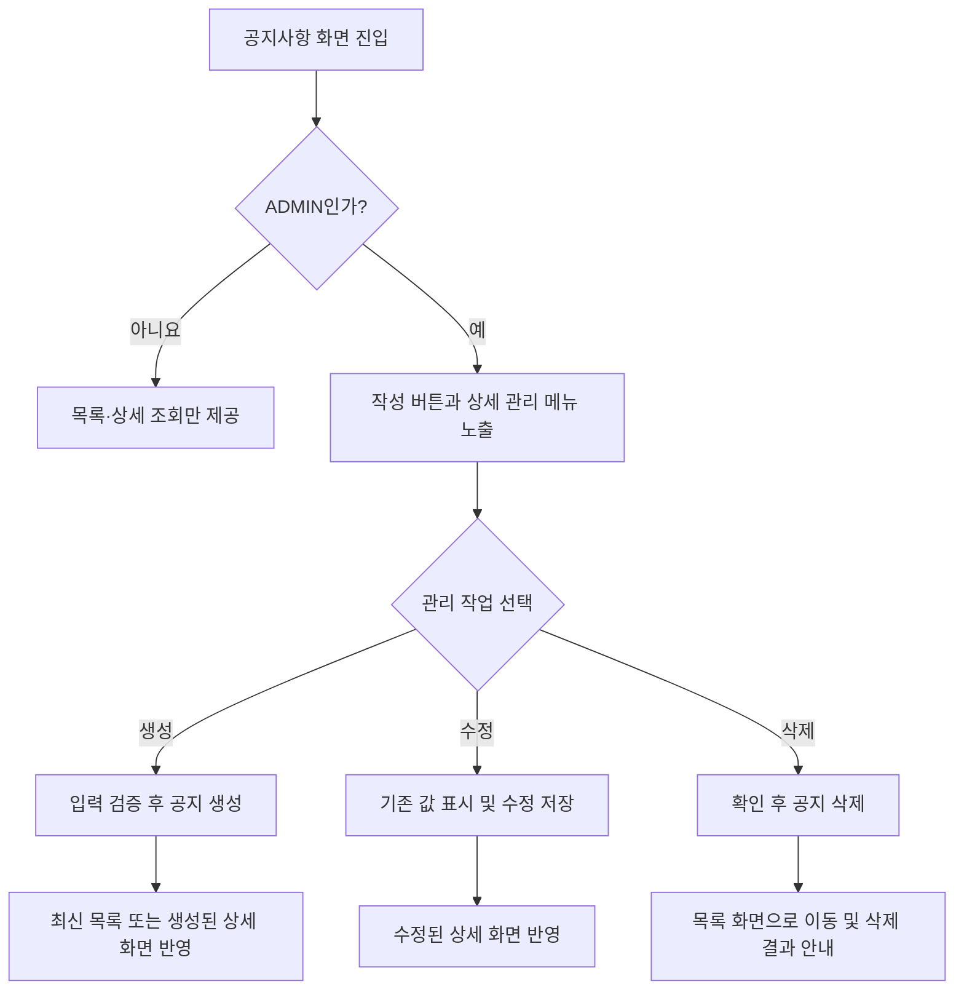
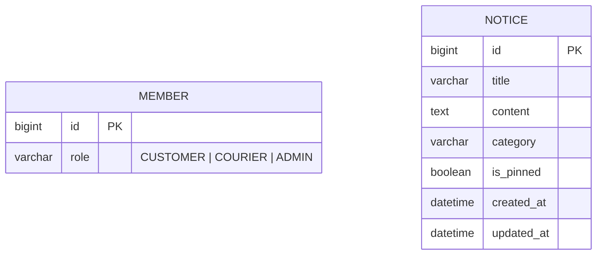
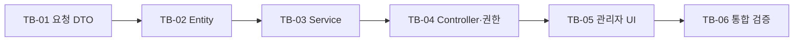

---
metadata:
  version: "1.0.0"
  ssot_owner: "docs/design/notice-admin-management-requirements.md"
  last_updated: "2026-08-06"
  status: "DRAFT"
---

# 관리자 공지사항 관리 요구사항 명세서

이 문서는 관리자가 공지사항 화면에서 공지사항을 생성·수정·삭제하는 기능의 요구사항을 정의하는 단일 원본(SSOT)이다. 기존 공개 목록·상세 조회 계약은 [`notice-design.md`](./notice-design.md)를 따른다.

> [!IMPORTANT]
> 공지사항 목록과 상세 조회는 기존처럼 모든 사용자가 이용할 수 있다. 생성·수정·삭제 UI와 API만 `ADMIN` 역할에 허용한다.

## 문서 정보

| 항목 | 내용 |
|---|---|
| 기능명 | 관리자 공지사항 생성·수정·삭제 |
| 작성자 | jaeya1006-arch |
| 작성일 | 2026-08-06 |
| 상태 | 초안 |
| 관련 문서 | [`notice-design.md`](./notice-design.md), [`erd.md`](../erd.md), [`prd-template.md`](../templates/prd-template.md), [`erd-template.md`](../templates/erd-template.md) |

## 1. 배경 및 문제

현재 공지사항 도메인은 목록 조회와 상세 조회만 지원한다. 새로운 공지를 등록하거나 잘못된 내용을 고치고 만료된 공지를 삭제하려면 DB를 직접 조작해야 하므로 운영 안전성과 업무 효율이 낮다.

관리자가 공지사항 화면에 들어왔을 때 같은 화면에서 관리 기능을 사용할 수 있게 하되, 일반 고객과 배송원에게는 기존 조회 경험만 제공해야 한다.

## 2. 목표 및 성공 기준

- 관리자가 공지사항 화면에서 공지를 생성·수정·삭제할 수 있다.
- 서버가 화면 노출 여부와 무관하게 모든 변경 요청의 `ADMIN` 권한을 검증한다.
- 기존 공개 목록·상세 조회 API의 응답 필드, 상태 코드 및 정렬 규칙을 유지한다.
- 잘못된 입력이나 권한 없는 요청이 공지사항 데이터를 변경하지 못한다.

| 성공 지표 | 현재 | 목표 |
|---|---|---|
| 공지사항 운영을 위한 직접 DB 변경 | 필요 | 불필요 |
| 비관리자의 공지사항 변경 성공 건수 | 측정 없음 | 0건 |
| 생성·수정·삭제 핵심 인수 테스트 | 없음 | 전부 통과 |

> [!NOTE]
> 운영 지표 수집 체계는 이번 범위에 포함하지 않는다. 위 표의 권한 및 기능 목표는 자동화 테스트로 우선 검증한다.

## 3. 범위

### 3.1 포함 범위

- 관리자 여부에 따른 공지사항 관리 UI 노출
- 공지사항 생성, 수정, 삭제 API
- 제목, 본문, 카테고리, 상단 고정 여부의 입력 및 검증
- 인증 실패, 권한 부족, 입력 오류, 대상 없음에 대한 일관된 오류 응답
- 생성·수정·삭제 후 목록 및 상세 화면의 데이터 동기화

### 3.2 제외 범위(Non-goal)

- 공지 예약 발행, 임시 저장, 승인 워크플로
- 첨부 파일 및 이미지 업로드
- 공지 조회 수, 댓글, 좋아요
- 공지 변경 이력 및 복구 기능
- 다국어 공지
- 운영 관리자 계정 생성 또는 권한 승격 API

## 4. 사용자 및 권한

| 사용자 | 목록 조회 | 상세 조회 | 생성 | 수정 | 삭제 | 관리 UI 노출 |
|---|---:|---:|---:|---:|---:|---:|
| 비로그인 사용자 | 허용 | 허용 | 금지 | 금지 | 금지 | 숨김 |
| `CUSTOMER` | 허용 | 허용 | 금지 | 금지 | 금지 | 숨김 |
| `COURIER` | 허용 | 허용 | 금지 | 금지 | 금지 | 숨김 |
| `ADMIN` | 허용 | 허용 | 허용 | 허용 | 허용 | 노출 |

### 권한 판정 원칙

1. 클라이언트는 로그인 사용자의 역할이 `ADMIN`일 때만 생성·수정·삭제 컨트롤을 렌더링한다.
2. 서버는 변경 API마다 `ROLE_ADMIN` 권한을 독립적으로 검증한다.
3. UI 숨김은 편의 기능일 뿐 보안 경계가 아니다. 주소나 HTTP 요청을 직접 조작해도 서버 검증을 우회할 수 없어야 한다.
4. 인증 정보가 없거나 유효하지 않으면 `401 Unauthorized`, 인증되었지만 관리자가 아니면 `403 Forbidden`을 반환한다.

## 5. 사용자 스토리

| 우선순위 | 사용자 스토리 |
|---|---|
| P0 | 관리자로서, 공지사항 화면에서 새 공지를 등록하고 싶다. 그래야 DB를 직접 수정하지 않고 사용자에게 소식을 전달할 수 있기 때문이다. |
| P0 | 관리자로서, 공지사항 상세 화면에서 기존 공지를 수정하고 싶다. 그래야 오탈자나 변경된 정보를 즉시 바로잡을 수 있기 때문이다. |
| P0 | 관리자로서, 더 이상 유효하지 않은 공지를 삭제하고 싶다. 그래야 사용자에게 오래되거나 잘못된 정보를 노출하지 않을 수 있기 때문이다. |
| P0 | 일반 사용자로서, 관리자용 조작 기능이 보이지 않고 변경 요청도 거부되기를 원한다. 그래야 공지 데이터의 무결성을 신뢰할 수 있기 때문이다. |

## 6. 사용자 흐름



## 7. 기능 요구사항

| ID | 요구사항 | 우선순위 | 인수 조건 |
|---|---|---|---|
| NADM-R-001 | 관리자가 공지사항 화면에 진입하면 `공지 작성` 버튼을 표시한다. | P0 | `ADMIN`에게만 버튼이 보인다. |
| NADM-R-002 | 관리자가 공지 상세 화면에 진입하면 `수정`, `삭제` 버튼을 표시한다. | P0 | `ADMIN`에게만 버튼이 보이며 선택한 공지 ID를 대상으로 한다. |
| NADM-R-003 | 관리자는 제목, 본문, 카테고리, 상단 고정 여부를 입력해 공지를 생성할 수 있다. | P0 | 유효한 요청은 저장되고 `201 Created`와 생성 결과를 반환한다. |
| NADM-R-004 | 관리자는 기존 공지의 제목, 본문, 카테고리, 상단 고정 여부를 수정할 수 있다. | P0 | 유효한 요청은 모든 수정 가능 필드를 반영하고 `200 OK`를 반환한다. |
| NADM-R-005 | 수정 화면은 기존 값을 초기값으로 표시한다. | P0 | 관리자가 바꾸지 않은 값은 저장 후에도 유지된다. |
| NADM-R-006 | 관리자는 삭제 전 확인 절차를 거쳐 공지를 삭제할 수 있다. | P0 | 확인 시 삭제 후 `204 No Content`, 취소 시 요청을 보내지 않는다. |
| NADM-R-007 | 생성·수정·삭제 API는 `ADMIN` 역할만 실행할 수 있다. | P0 | 비인증 요청은 401, 비관리자 요청은 403이며 DB는 변경되지 않는다. |
| NADM-R-008 | 제목과 본문은 앞뒤 공백 제거 후 빈 값일 수 없다. | P0 | 위반 시 `400 Bad Request`와 필드별 검증 메시지를 반환한다. |
| NADM-R-009 | 제목은 기존 DB 계약에 맞춰 150자를 초과할 수 없다. | P0 | 151자 이상이면 400이며 저장하지 않는다. |
| NADM-R-010 | 카테고리는 서버가 허용한 값만 받을 수 있다. | P0 | 허용되지 않은 값은 400이며 저장하지 않는다. 초기 허용값은 `SYSTEM`, `EVENT`, `SERVICE`, `ANNOUNCEMENT`이다. |
| NADM-R-011 | 수정·삭제 대상이 없으면 기존 `NOTICE_NOT_FOUND` 오류를 반환한다. | P0 | HTTP 404, 오류 코드 `N002`이며 다른 공지는 변경되지 않는다. |
| NADM-R-012 | 생성 시 `createdAt`과 `updatedAt`을 서버 시간이 설정하고, 수정 시 `createdAt`은 유지하며 `updatedAt`만 갱신한다. | P0 | 클라이언트가 시간 값을 지정하거나 덮어쓸 수 없다. |
| NADM-R-013 | 변경 완료 후 기존 목록 정렬 규칙을 유지한다. | P0 | 상단 고정 우선, 같은 고정 상태에서는 생성일시 최신순이다. |
| NADM-R-014 | 공지 본문은 기본적으로 일반 텍스트로 처리한다. | P0 | 저장·출력 과정에서 임의 HTML/스크립트가 실행되지 않는다. 줄바꿈은 보존한다. |
| NADM-R-015 | 중복 제출로 동일 공지가 연속 생성되지 않도록 제출 중 버튼을 비활성화한다. | P1 | 최초 요청 완료 전 추가 클릭이 새 요청을 만들지 않는다. |
| NADM-R-016 | 로컬 개발 환경에서는 환경변수로 명시적으로 활성화한 경우에만 관리자 계정을 멱등 생성한다. | P0 | 비밀번호는 암호화해 저장하고, 기존 일반 회원을 자동 승격하지 않으며 운영 환경에서는 사용하지 않는다. |

## 8. 화면 요구사항

### 8.1 목록 화면

- `ADMIN`에게 목록 상단의 `공지 작성` 버튼을 제공한다.
- 작성 완료 후 새 공지가 현재 정렬 규칙에 맞는 위치에 나타난다.
- 일반 사용자 화면은 기존 목록 조회 경험을 유지한다.

### 8.2 생성·수정 폼

- 필드: 제목, 카테고리, 본문, 상단 고정 여부
- 필수 항목과 글자 수 제한을 입력 단계에서 안내한다.
- 서버 오류가 발생하면 입력값을 유지하고 원인을 사용자에게 표시한다.
- 저장 중 중복 제출을 방지하며, 성공·실패 결과를 접근 가능한 상태 메시지로 알린다.

### 8.3 상세 화면 및 삭제

- `ADMIN`에게만 `수정`, `삭제` 버튼을 제공한다.
- 삭제 확인창에는 대상 공지 제목과 복구할 수 없다는 안내를 표시한다.
- 삭제 성공 후 목록으로 이동하고 완료 메시지를 표시한다.

> [!IMPORTANT]
> UI 구현은 [`design-system.md`](../design-system.md)의 토큰, `/css/design-system.css`, Thymeleaf 공통 프래그먼트 `templates/fragments/components.html`을 사용한다. 사용자 입력을 `innerHTML`로 삽입하지 않는다.

## 9. API 계약

기존 공개 조회 API는 [`notice-design.md`](./notice-design.md)의 계약을 그대로 유지한다.

| 동작 | Method | Endpoint | 권한 | 성공 응답 |
|---|---|---|---|---|
| 생성 | `POST` | `/api/v1/notices` | `ADMIN` | `201 Created` + `NoticeDetailResponse` |
| 수정 | `PUT` | `/api/v1/notices/{id}` | `ADMIN` | `200 OK` + `NoticeDetailResponse` |
| 삭제 | `DELETE` | `/api/v1/notices/{id}` | `ADMIN` | `204 No Content` |

### 9.1 생성·수정 요청

```json
{
  "title": "[안내] 서비스 점검 안내",
  "content": "서비스 점검 일정을 안내드립니다.",
  "category": "SYSTEM",
  "isPinned": true
}
```

- 생성과 수정은 동일한 검증 규칙을 적용한다.
- `id`, `createdAt`, `updatedAt`은 요청 필드로 받지 않는다.
- 수정은 전체 교체 의미의 `PUT`으로 정의하며 네 필드를 모두 전달한다.

### 9.2 오류 계약

| 상황 | HTTP 상태 | 오류 코드 | 기대 동작 |
|---|---:|---|---|
| 인증 정보 없음·만료·위조 | 401 | 기존 인증 오류 코드 사용 | 데이터 변경 없음 |
| `CUSTOMER` 또는 `COURIER`의 변경 요청 | 403 | 기존 접근 거부 오류 코드 사용 | 데이터 변경 없음 |
| 필수값 누락·길이 초과·잘못된 카테고리 | 400 | 기존 입력 검증 오류 코드 사용 | 필드 오류 제공, 데이터 변경 없음 |
| 수정·삭제 대상 없음 | 404 | `N002` | `NOTICE_NOT_FOUND`, 데이터 변경 없음 |

## 10. 데이터 모델 영향

### 10.1 엔티티 목록

| 엔티티명 | 설명 | 신규/기존 | 변경 여부 |
|---|---|---|---|
| `Member` | 인증 사용자와 `ADMIN` 역할의 원본 | 기존 | 없음 |
| `Notice` | 공지 제목·본문·카테고리·고정 여부·시간 저장 | 기존 | 없음 |

### 10.2 `Notice` 속성

| 컬럼명 | 타입 | PK/FK | Null 허용 | 기본값 | 관리 기능 규칙 |
|---|---|---|---|---|---|
| `id` | `BIGINT` | PK | N | auto increment | 서버 생성, 수정 불가 |
| `title` | `VARCHAR(150)` | - | N | - | 공백 제거 후 1~150자 |
| `content` | `TEXT` | - | N | - | 공백 제거 후 빈 값 금지 |
| `category` | `VARCHAR(50)` | - | N | - | 허용 카테고리만 저장 |
| `is_pinned` | `BOOLEAN` | - | N | `FALSE` | 관리자 선택값 저장 |
| `created_at` | `DATETIME` | - | N | - | 생성 시 서버 설정, 이후 불변 |
| `updated_at` | `DATETIME` | - | N | - | 생성·수정 시 서버 설정 |

### 10.3 관계 및 ERD

현재 `notice`에는 작성자 FK가 없으며, 이번 요구사항도 작성자 추적을 범위에 포함하지 않는다. `ADMIN`은 저장 관계가 아니라 요청 시점의 접근 권한으로만 사용한다.



### 10.4 인덱스 및 제약조건

- 기존 `idx_notice_pinned_created (is_pinned DESC, created_at DESC)`를 유지한다.
- 이번 기능은 테이블이나 인덱스를 변경하지 않으므로 Flyway 마이그레이션이 필요하지 않다.
- 삭제는 현재 스키마와 KISS 원칙에 맞춰 물리 삭제한다.

> [!WARNING]
> 작성자 감사 추적, 삭제 복구 또는 법적 보존 요구가 생기면 `author_id`, 삭제 상태·시각을 추가하는 별도 설계와 Flyway 마이그레이션이 필요하다. 이는 핵심 데이터 정책 변경이므로 구현 전에 ADR로 결정한다.

## 11. 비기능 요구사항

### 11.1 보안

- 변경 권한은 Controller 진입점에서 메서드 보안(예: `@PreAuthorize("hasRole('ADMIN')")`)으로 강제한다.
- Service는 무상태로 유지하고 변경 메서드에 트랜잭션 경계를 둔다.
- 제목과 본문의 사용자 입력을 로그, 예외 메시지 또는 인증 정보와 함께 노출하지 않는다.
- 본문은 HTML이 아닌 일반 텍스트로 렌더링해 저장형 XSS를 방지한다.

### 11.2 호환성 및 운영 안정성

- 기존 `GET /api/v1/notices`, `GET /api/v1/notices/{id}` 계약을 변경하지 않는다.
- Controller는 Entity를 반환하지 않고 응답 DTO만 반환한다.
- 삭제 요청은 이미 없는 대상에 대해 404를 반환하며, 성공한 삭제를 반복 실행해도 다른 데이터에 영향을 주지 않는다.
- Mac에서는 `./gradlew`, Windows에서는 `gradlew.bat` 기반 검증 명령을 사용할 수 있어야 한다.

### 11.3 접근성

- 모든 입력에는 연결된 레이블이 있어야 한다.
- 키보드만으로 생성·수정·삭제 확인과 취소가 가능해야 한다.
- 검증·완료 메시지는 스크린 리더가 인지할 수 있는 라이브 영역으로 제공한다.

## 12. 인수 테스트 시나리오

| ID | Given | When | Then |
|---|---|---|---|
| NADM-AT-001 | `ADMIN`이 로그인함 | 공지사항 목록 진입 | 작성 버튼이 보인다. |
| NADM-AT-002 | 일반 사용자 또는 비로그인 상태 | 공지사항 목록·상세 진입 | 관리 버튼이 보이지 않는다. |
| NADM-AT-003 | `ADMIN`과 유효한 입력 | 생성 요청 | 201을 반환하고 목록·상세 조회에서 확인된다. |
| NADM-AT-004 | `ADMIN`과 기존 공지 | 제목·본문 등을 수정 | 200을 반환하고 `createdAt`은 유지, `updatedAt`은 갱신된다. |
| NADM-AT-005 | `ADMIN`과 기존 공지 | 삭제 확인 | 204를 반환하고 이후 상세 조회는 `N002` 404이다. |
| NADM-AT-006 | 비인증 사용자 | 변경 API 직접 호출 | 401이고 저장소 변경 호출이 없다. |
| NADM-AT-007 | `CUSTOMER` 또는 `COURIER` | 변경 API 직접 호출 | 403이고 저장소 변경 호출이 없다. |
| NADM-AT-008 | `ADMIN`과 빈 제목 또는 본문 | 생성·수정 요청 | 400과 필드 오류를 반환하며 데이터가 바뀌지 않는다. |
| NADM-AT-009 | `ADMIN`과 151자 제목 | 생성·수정 요청 | 400을 반환하며 데이터가 바뀌지 않는다. |
| NADM-AT-010 | `ADMIN`과 허용되지 않은 카테고리 | 생성·수정 요청 | 400을 반환하며 데이터가 바뀌지 않는다. |
| NADM-AT-011 | `ADMIN`과 존재하지 않는 ID | 수정·삭제 요청 | `N002` 404를 반환한다. |
| NADM-AT-012 | 스크립트 문자열이 포함된 본문 | 저장 후 상세 조회 | 문자열로 표시되고 스크립트는 실행되지 않는다. |

## 13. 구현 작업 분할(WBS)

작업은 아래 순서대로 진행한다. 각 작업의 완료 조건과 테스트를 충족한 뒤 다음 작업으로 이동하며, 작업 단위가 끝날 때마다 제시된 메시지로 마이크로 커밋할 수 있다.



### 13.1 작업 요약

| 순서 | 작업 ID | 작업 단위 | 선행 작업 | 주요 결과물 | 권장 커밋 메시지 |
|---:|---|---|---|---|---|
| 1 | TB-01 | 생성·수정 요청 DTO와 입력 검증 | 없음 | 요청 DTO 2개, DTO 테스트 | `feat: 공지사항 관리 요청 DTO와 검증 추가` |
| 2 | TB-02 | `Notice` 생성·수정 도메인 동작 | TB-01 | 팩토리·수정 메서드, Entity 테스트 | `feat: 공지사항 생성 및 수정 동작 추가` |
| 3 | TB-03 | Service CRUD 유스케이스 | TB-01, TB-02 | 생성·수정·삭제 메서드, Service 테스트 | `feat: 관리자 공지사항 관리 서비스 구현` |
| 4 | TB-04 | 변경 API와 관리자 권한 | TB-03 | Controller 엔드포인트, 권한·계약 테스트 | `feat: 관리자 공지사항 관리 API 추가` |
| 5 | TB-05 | 관리자 전용 관리 UI | TB-04 | Thymeleaf 화면·스크립트·UI 테스트 | `feat: 관리자 공지사항 관리 화면 구현` |
| 6 | TB-06 | 전체 회귀 검증과 문서 동기화 | TB-01~05 | 하네스 통과 결과, 문서 상태 갱신 | `test: 공지사항 관리 기능 회귀 검증 보강` |

### 13.2 TB-01 — 생성·수정 요청 DTO와 입력 검증

**대상 파일**

- 신규: `notice/dto/request/NoticeCreateRequest.java`
- 신규: `notice/dto/request/NoticeUpdateRequest.java`
- 신규 또는 변경: DTO 검증 테스트

**구현 내용**

- `title`, `content`, `category`, `isPinned` 필드를 정의한다.
- 제목은 공백 제거 후 필수이며 최대 150자로 검증한다.
- 본문은 공백 제거 후 빈 값을 허용하지 않는다.
- 카테고리는 `SYSTEM`, `EVENT`, `SERVICE`, `ANNOUNCEMENT`만 허용한다.
- `isPinned`은 명시적인 `true` 또는 `false`를 필수로 받는다.
- Getter와 Setter가 필요하면 수동 작성하지 않고 Lombok을 사용한다.

**완료 조건**

- API 명세에 없는 `id`, `createdAt`, `updatedAt` 필드가 요청 DTO에 존재하지 않는다.
- 정상 요청은 검증을 통과하고, 빈 값·151자 제목·잘못된 카테고리는 `C001` 대상이 된다.
- 검증 메시지가 어떤 필드와 규칙을 위반했는지 설명한다.

**검증 테스트**

- 정상 입력 검증 통과
- 제목 `null`, 공백, 151자 검증 실패
- 본문 `null`, 공백 검증 실패
- 허용되지 않은 카테고리 검증 실패
- `isPinned` 누락 검증 실패

### 13.3 TB-02 — `Notice` 생성·수정 도메인 동작

**대상 파일**

- 변경: `notice/entity/Notice.java`
- 신규 또는 변경: `Notice` 단위 테스트

**구현 내용**

- 생성 요청으로 `Notice`를 만드는 정적 팩토리 메서드를 추가한다.
- 수정 요청으로 제목, 본문, 카테고리, 고정 여부를 변경하는 도메인 메서드를 추가한다.
- 생성 시 `createdAt`과 `updatedAt`을 설정한다.
- 수정 시 `createdAt`은 유지하고 `updatedAt`만 갱신한다.
- Entity 필드 접근자는 Lombok을 사용하며 수동 Getter·Setter를 작성하지 않는다.

**완료 조건**

- 생성과 수정에 필요한 값 변경이 Entity 내부의 명명된 동작을 통해서만 수행된다.
- 수정 전후 `id`와 `createdAt`은 변하지 않는다.
- Entity가 Repository, Service 또는 Controller에 의존하지 않는다.

**검증 테스트**

- 생성 시 네 입력 필드와 두 시간 필드 설정
- 수정 시 변경 가능 필드 반영
- 수정 시 `id`, `createdAt` 유지 및 `updatedAt` 갱신

### 13.4 TB-03 — Service 생성·수정·삭제 유스케이스

**대상 파일**

- 변경: `notice/service/NoticeService.java`
- 변경: `notice/repository/NoticeRepository.java` — 필요한 경우에만 최소 변경
- 변경: `notice/service/NoticeServiceTest.java`

**구현 내용**

- 하나의 public 메서드가 하나의 유스케이스가 되도록 `create`, `update`, `delete`를 구현한다.
- 생성·수정·삭제 메서드에 쓰기 트랜잭션을 적용한다.
- 수정·삭제 전에 대상 공지를 조회하고, 없으면 기존 `NoticeNotFoundException`을 던진다.
- Service는 공유 상태를 갖지 않고 `Controller → Service → Repository` 의존 방향을 유지한다.
- 삭제는 요구사항에 따라 물리 삭제한다.

**완료 조건**

- 생성은 저장된 공지를 반환한다.
- 수정은 기존 공지에 변경값을 적용한 결과를 반환한다.
- 삭제는 존재 확인 후 해당 공지만 제거한다.
- 존재하지 않는 ID의 수정·삭제는 `N002`로 변환 가능한 예외를 발생시킨다.

**검증 테스트**

- 생성 성공과 Repository 저장 호출
- 수정 성공 및 변경 필드·시간 검증
- 삭제 성공 및 정확한 대상 삭제 검증
- 수정·삭제 대상 없음 예외
- 기존 목록·상세 조회 Service 테스트 회귀 통과

### 13.5 TB-04 — 변경 API와 `ADMIN` 권한

**대상 파일**

- 변경: `notice/controller/NoticeController.java`
- 변경: `notice/controller/NoticeControllerTest.java`
- 변경 후보: `common/exception/GlobalExceptionHandler.java`, `common/security/SecurityConfig.java` — 기존 401·403 처리가 API 계약과 다를 때만 수정

**구현 내용**

- [`notice-admin-management-api.md`](./notice-admin-management-api.md)에 맞춰 `POST`, `PUT`, `DELETE` 엔드포인트를 추가한다.
- 요청 본문에 `@Valid`를 적용한다.
- 각 변경 엔드포인트에 `@PreAuthorize("hasRole('ADMIN')")`와 동등한 권한 검사를 적용한다.
- 생성은 `201 Created`, `Location` 헤더와 `NoticeDetailResponse`를 반환한다.
- 수정은 `200 OK`와 `NoticeDetailResponse`, 삭제는 본문 없이 `204 No Content`를 반환한다.
- Controller는 Entity를 직접 반환하거나 Repository를 직접 호출하지 않는다.

**완료 조건**

- `ADMIN`만 세 변경 API를 호출할 수 있다.
- 비인증 요청은 `401/A001`, 일반 회원 요청은 `403/C007`을 반환한다.
- 입력 검증 실패는 `400/C001`, 없는 대상은 `404/N002`를 반환한다.
- 기존 공개 `GET` 두 개의 경로와 응답 계약이 유지된다.

**검증 테스트**

- 관리자 생성 `201`과 `Location` 헤더·응답 필드
- 관리자 수정 `200`과 응답 필드
- 관리자 삭제 `204`와 빈 본문
- 비인증 생성·수정·삭제 `401`
- `CUSTOMER`, `COURIER` 생성·수정·삭제 `403`
- 잘못된 요청 `400/C001`
- 없는 대상 수정·삭제 `404/N002`
- 기존 목록·상세 Controller 테스트 회귀 통과

> [!IMPORTANT]
> 권한 테스트는 UI 버튼의 존재 여부가 아니라 서버 엔드포인트를 직접 호출하여 검증한다. 현재 전역 설정의 `permitAll` 여부와 관계없이 변경 메서드 자체가 보호되어야 한다.

### 13.6 TB-05 — 관리자 전용 공지사항 관리 UI

**대상 파일**

- 변경 또는 Thymeleaf 전환: 공지사항 목록·상세 화면
- 신규: 공지사항 생성·수정 폼 템플릿
- 재사용: `templates/fragments/components.html`
- 재사용: `static/css/design-system.css`
- 신규 또는 변경: 공지사항 화면 전용 CSS·JavaScript와 UI 테스트

**구현 내용**

- `ADMIN`에게만 목록의 `공지 작성` 버튼과 상세의 `수정`, `삭제` 버튼을 렌더링한다.
- 생성·수정 폼에서 API와 동일한 필드와 제한을 안내한다.
- 저장 중 버튼을 비활성화해 같은 요청의 연속 제출을 막는다.
- 삭제 전 대상 제목과 복구 불가 안내가 포함된 확인 절차를 제공한다.
- 성공 후 목록 또는 상세 화면을 갱신하고, 실패 시 입력값과 오류 메시지를 유지한다.
- 사용자 입력은 일반 텍스트로 렌더링하고 `innerHTML`에 삽입하지 않는다.
- 공통 디자인 시스템 토큰과 Thymeleaf 프래그먼트를 100% 사용한다.

**완료 조건**

- 관리자와 일반 사용자의 화면 노출 조건이 권한표와 일치한다.
- 키보드만으로 폼 제출, 수정, 삭제 확인·취소가 가능하다.
- 완료·오류 메시지를 스크린 리더가 인식할 수 있다.
- 기존 공지 목록·상세 조회 경험이 깨지지 않는다.

**검증 테스트**

- 역할별 관리 버튼 노출·비노출
- 생성·수정 성공과 화면 반영
- 삭제 확인 취소 시 API 미호출
- 삭제 성공 후 목록 이동
- 검증 실패 시 입력값 유지 및 오류 표시
- 스크립트 문자열이 실행되지 않고 텍스트로 표시됨

### 13.7 TB-06 — 전체 회귀 검증 및 완료 처리

**대상 범위**

- TB-01~05의 전체 변경 파일
- 본 요구사항 명세서와 API 명세서

**실행 순서**

1. 미사용 import, 불필요한 `System.out.println`, 명명 규칙, 주석 및 Lombok 사용 여부를 사전 검토한다.
2. `./scripts/verify.sh`를 실행하고 실패 원인을 수정해 exit code 0을 확보한다.
3. 아키텍처, 예외, DB/Flyway, 보안·개인정보, Mac/Windows DX, 테스트 가치 관점으로 2·3차 검토한다.
4. 구현과 문서의 엔드포인트, 상태 코드, 필드명, 권한 조건을 대조한다.
5. 모든 조건을 통과한 뒤 문서 상태를 `확정`으로 갱신한다.

**최종 완료 조건(Definition of Done)**

- [ ] `POST /api/v1/notices`가 관리자에게만 `201`로 동작한다.
- [ ] `PUT /api/v1/notices/{id}`가 관리자에게만 `200`으로 동작한다.
- [ ] `DELETE /api/v1/notices/{id}`가 관리자에게만 `204`로 동작한다.
- [ ] 비인증·비관리자 변경 요청이 각각 `401`, `403`으로 차단된다.
- [ ] 입력 오류와 대상 없음이 각각 `C001`, `N002` 계약을 지킨다.
- [ ] 기존 공개 목록·상세 API 회귀 테스트가 통과한다.
- [ ] Controller가 Entity를 반환하거나 Repository를 직접 참조하지 않는다.
- [ ] DB 스키마 변경 없이 기존 인덱스와 물리 삭제 정책을 유지한다.
- [ ] 관리자 UI가 디자인 시스템·공통 프래그먼트·접근성 요구사항을 지킨다.
- [ ] `./scripts/verify.sh`가 exit code 0으로 완료된다.

## 14. WHY 및 Trade-off

- **별도 관리자 URL 대신 기존 공지 화면을 사용한다.** 관리자가 사용자에게 보이는 결과를 같은 맥락에서 확인할 수 있다. 대신 역할별 조건부 UI 테스트가 필요하다.
- **권한은 UI와 서버 양쪽에서 검사한다.** UI는 사용성을, 서버는 실제 보안을 담당한다. 중복처럼 보이지만 책임이 다르다.
- **수정은 `PUT` 전체 교체를 사용한다.** 네 개 필드뿐인 현재 모델에서 계약이 단순하고 누락 의미가 명확하다. 부분 수정 요구가 커지면 `PATCH`를 별도로 검토한다.
- **현 단계에서는 물리 삭제한다.** 기존 스키마를 바꾸지 않아 구현이 단순하다. 반면 복구와 감사 추적은 지원하지 않으므로 운영 요구가 생기면 정책을 재결정해야 한다.

## 15. 검증 명령어

```bash
# macOS / Linux
./scripts/verify.sh

# Windows (개별 전체 빌드)
gradlew.bat build
```

## 16. 오픈 이슈

- [ ] 운영 환경에서 공지 삭제 복구 또는 변경 감사 로그가 필요한가?
- [ ] 카테고리 목록을 현재 네 값으로 확정할 것인가, 별도 Enum으로 관리할 것인가?
- [ ] 공지 작성자를 사용자 화면 또는 관리자 감사 화면에 표시할 필요가 있는가?
