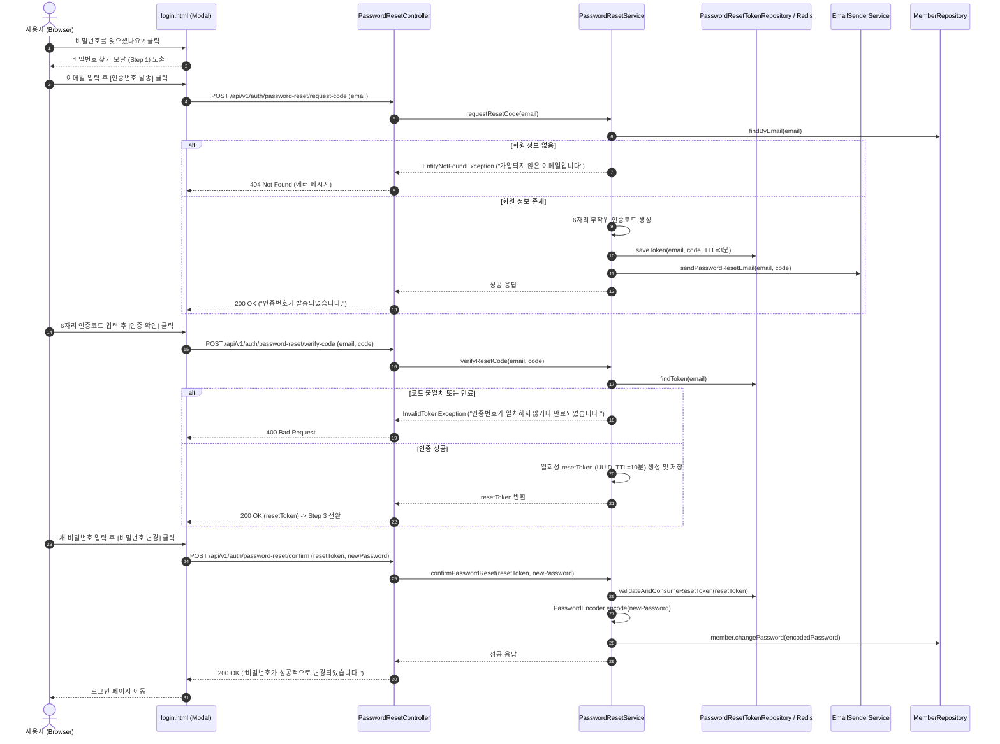

# [설계] 비밀번호 찾기/재설정 기능 기술 설계서 (Password Find & Reset Specification)

> **문서 메타데이터**
> - **작성일자:** 2026-08-04
> - **이슈 번호:** #109
> - **상태:** Draft (기능 구현 전 기술 설계서)
> - **SSOT 영역:** `docs/design/password-reset-design.md`
> - **목적:** 로그인 페이지(`login.html`) 내 "비밀번호를 잊으셨나요?" 클릭 시 실행될 이메일 인증 기반 비밀번호 찾기/재설정 시스템의 엔드투엔드(E2E) 아키텍처 및 상세 명세 정의

---

## 1. 개요 (Overview)

본 설계서는 로그인하지 않은 사용자가 비밀번호를 분실했을 때 안전하게 본인 이메일 인증을 거쳐 신규 비밀번호로 재설정할 수 있는 **비밀번호 찾기/재설정(Find & Reset Password)** 프로세스 설계입니다.

사용자의 요구사항에 따라 **실제 소스 코드 구현은 진행하지 않으며, 백엔드/프론트엔드/보안/DB 구조 전반에 대한 무결점 설계(Design)**를 제공합니다.

---

## 2. 사용자 경험 (UI/UX Workflow Design)

로그인 페이지(`src/main/resources/static/login.html`)의 `<a href="#" id="forgotPassword">비밀번호를 잊으셨나요?</a>` 클릭 시 기존 화면 전환 방식 대신 **모달(Modal) 또는 3단계(Step) 가이드 전환 방식**으로 제공합니다.

```
+-----------------------------------------------------------------------------------+
| [Step 1: 이메일 입력]      -> [Step 2: 6자리 인증번호 입력] -> [Step 3: 비밀번호 재설정]  |
| - 이메일 주소 입력            - 이메일로 전송된 6자리 번호    - 새 비밀번호 입력          |
| - [인증번호 발송] 버튼 클릭   - 남은 시간 3:00 (타이머)       - 비밀번호 확인 입력        |
|                              - [인증 완료] 버튼 클릭        - [비밀번호 변경 완료] 클릭  |
+-----------------------------------------------------------------------------------+
```

### 3단계 워크플로우 상세:
1. **1단계 (본인 확인 요청):**
   - 사용자가 가입한 이메일을 입력하고 `[인증번호 발송]` 클릭.
   - 서버는 등록된 회원인지 확인 후, 6자리 난수 인증 코드 생성 및 이메일 발송 (TTL: 3분).
2. **2단계 (인증 코드 검증):**
   - 6자리 인증 코드 및 3분 카운트다운 타이머 노출.
   - 인증 성공 시 서버로부터 일회성 재설정 토큰(`resetToken`, 10분 유효 UUID)을 수령.
3. **3단계 (비밀번호 변경):**
   - 새 비밀번호 및 비밀번호 확인 입력 (8~20자, 영문/숫자/특수문자 포함).
   - 변경 성공 시 Toast 메시지 출력 후 로그인 페이지로 자동 이동.

---

## 3. 시퀀스 다이어그램 (Sequence Diagram)



---

## 4. REST API 명세서 (API Specification)

| HTTP Method | Endpoint | 설명 | 인증 필요 여부 |
| :--- | :--- | :--- | :--- |
| **POST** | `/api/v1/auth/password-reset/request-code` | 비밀번호 재설정 이메일 인증번호 발송 요청 | 비인증 (Public) |
| **POST** | `/api/v1/auth/password-reset/verify-code` | 이메일 인증번호 검증 및 resetToken 발급 | 비인증 (Public) |
| **POST** | `/api/v1/auth/password-reset/confirm` | resetToken 기반 신규 비밀번호 변경 | 비인증 (Public) |

---

### API 1: 인증번호 발송 요청 (`POST /api/v1/auth/password-reset/request-code`)
- **Request Body:**
  ```json
  {
    "email": "user@example.com"
  }
  ```
- **Response Body (200 OK):**
  ```json
  {
    "message": "비밀번호 재설정 인증번호가 이메일로 발송되었습니다.",
    "expiresInSeconds": 180
  }
  ```

---

### API 2: 인증번호 검증 (`POST /api/v1/auth/password-reset/verify-code`)
- **Request Body:**
  ```json
  {
    "email": "user@example.com",
    "code": "849201"
  }
  ```
- **Response Body (200 OK):**
  ```json
  {
    "resetToken": "550e8400-e29b-41d4-a716-446655440000",
    "expiresInSeconds": 600
  }
  ```

---

### API 3: 비밀번호 확정 변경 (`POST /api/v1/auth/password-reset/confirm`)
- **Request Body:**
  ```json
  {
    "resetToken": "550e8400-e29b-41d4-a716-446655440000",
    "newPassword": "NewPassword123!",
    "newPasswordConfirm": "NewPassword123!"
  }
  ```
- **Response Body (200 OK):**
  ```json
  {
    "message": "비밀번호가 성공적으로 변경되었습니다. 새 비밀번호로 로그인해주세요."
  }
  ```

---

## 5. 아키텍처 및 클래스 설계 (Class Architecture & Layering)

프로젝트 단방향 의존성 규칙(`Controller -> Service -> Repository`) 및 Lombok (`@Getter`, `@Setter`) 준수 설계:

```
src/main/java/com/example/shinhangaecheokja/
├── member/
│   ├── controller/
│   │   └── PasswordResetController.java       # 비밀번호 재설정 REST Controller
│   ├── dto/
│   │   ├── request/
│   │   │   ├── PasswordResetCodeRequestDto.java   # [인증코드 발송 요청 DTO]
│   │   │   ├── PasswordResetVerifyRequestDto.java # [인증코드 검증 DTO]
│   │   │   └── PasswordResetConfirmRequestDto.java# [비밀번호 변경 DTO]
│   │   └── response/
│   │       ├── PasswordResetCodeResponseDto.java
│   │       └── PasswordResetVerifyResponseDto.java
│   ├── entity/
│   │   └── PasswordResetToken.java             # 재설정 토큰 엔티티 (RDB 저장시)
│   ├── repository/
│   │   └── PasswordResetTokenRepository.java
│   └── service/
│       ├── PasswordResetService.java           # 비밀번호 재설정 핵심 트랜잭션 서비스
│       └── EmailService.java                   # 이메일 전송 인터페이스
```

### 보안 방어 전략 (Defense-in-Depth Security):
1. **Rate Limiting (어뷰징 방지):** 동일 이메일/IP당 1분에 최대 3회만 인증번호 발송 요청 가능.
2. **시도 횟수 제한 (Brute-Force 방지):** 인증번호 검증 실패 5회 초과 시 해당 토큰 파기 및 10분간 재요청 금지.
3. **일회성 토큰 (Single-Use Token):** `confirmPasswordReset` 수행 즉시 `resetToken` 삭제/만료 처리하여 재사용 불가능하도록 보장.
4. **Spring Security 허용:** `SecurityConfig.java`에 `/api/v1/auth/password-reset/**` permitAll 추가.

---

## 6. DB 마이그레이션 계획 (Flyway DDL)

`V21__create_password_reset_token_table.sql` 마이그레이션 파일 설계:

```sql
-- 비밀번호 재설정 토큰/인증코드 관리 테이블
CREATE TABLE password_reset_token (
    id BIGINT AUTO_INCREMENT PRIMARY KEY,
    email VARCHAR(255) NOT NULL,
    verification_code VARCHAR(6) NOT NULL,
    reset_token VARCHAR(36) NULL,
    attempt_count INT NOT NULL DEFAULT 0,
    is_verified BOOLEAN NOT NULL DEFAULT FALSE,
    is_used BOOLEAN NOT NULL DEFAULT FALSE,
    expires_at DATETIME NOT NULL,
    created_at DATETIME NOT NULL DEFAULT CURRENT_TIMESTAMP,
    updated_at DATETIME NOT NULL DEFAULT CURRENT_TIMESTAMP ON UPDATE CURRENT_TIMESTAMP,
    INDEX idx_email_code (email, verification_code),
    INDEX idx_reset_token (reset_token)
) ENGINE=InnoDB DEFAULT CHARSET=utf8mb4 COLLATE=utf8mb4_unicode_ci;
```

---

## 7. 하네스 검증 및 테스트 계획 (Verification Plan)

구현 시 무결점 품질 통과 게이트:
1. **단위 테스트 (Unit Tests):**
   - `PasswordResetServiceTest`:
     - 정상 인증코드 발송 및 6자리 난수 검증
     - 만료된 인증코드 입력 시 `InvalidTokenException` 예외 발생 검증
     - 일회성 resetToken 사용 후 재사용 시도 시 차단 검증
     - 기존 비밀번호와 동일한 비밀번호로 변경 시 거절 검증
2. **건강성 검증 커맨드:**
   - `./scripts/verify.sh` (Spotless 코드 포맷팅 + ArchUnit 레이어링 검증 + JaCoCo 커버리지 60%+ 충족)
