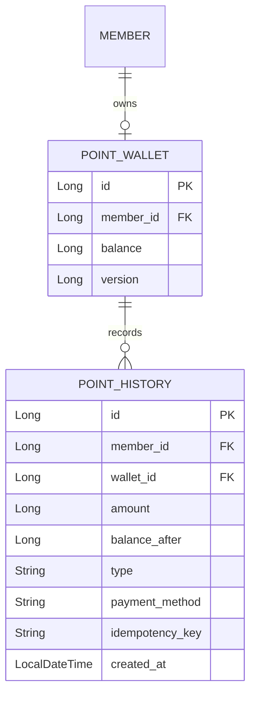

# 설계서: 포인트 지갑 및 충전 (Point Wallet & Payments)

이 문서는 회원 포인트 지갑 생성, 충전, 사용, 충전 이력, 멱등성 처리를 다룹니다.

---

## 1. 요구사항 정의 (User Story)

* **User Story:**
  우리는 **회원(Member)** 으로서 배송 결제와 정산을 위해 개인 포인트 지갑을 보유하고, 충전 및 차감을 수행하기를 원한다.
* **수용 기준 (Acceptance Criteria):**
  1. 회원당 포인트 지갑은 1개만 가진다.
  2. 충전/차감 금액은 0보다 커야 한다.
  3. 잔액 부족 차감은 `400 Bad Request` 로 거절한다.
  4. 인증 회원 기준 충전 API는 `Idempotency-Key` 로 중복 충전을 막아야 한다.
  5. 충전 성공 시 충전 이력이 저장되어야 한다.

---

## 2. ERD 설계



### 2.1 PointWallet DB 설계

| 컬럼명 | 타입 | 제약조건 | 설명 |
| --- | --- | --- | --- |
| `id` | `BIGINT` | PK | 포인트 지갑 식별자 |
| `member_id` | `BIGINT` | FK, UNIQUE, NOT NULL | 지갑 소유 회원 ID |
| `balance` | `BIGINT` | NOT NULL | 현재 포인트 잔액 |
| `version` | `BIGINT` | NOT NULL | 동시성 제어용 버전 값 |

### 2.2 PointHistory DB 설계

| 컬럼명 | 타입 | 제약조건 | 설명 |
| --- | --- | --- | --- |
| `id` | `BIGINT` | PK | 포인트 이력 식별자 |
| `member_id` | `BIGINT` | FK, NOT NULL | 이력 소유 회원 ID |
| `wallet_id` | `BIGINT` | FK, NOT NULL | 대상 포인트 지갑 ID |
| `amount` | `BIGINT` | NOT NULL | 충전 또는 차감 금액 |
| `balance_after` | `BIGINT` | NOT NULL | 처리 후 잔액 |
| `type` | `VARCHAR` | NOT NULL | `CHARGE` 또는 `USE` |
| `payment_method` | `VARCHAR` | NULL 허용 | 충전 시 결제 수단 |
| `idempotency_key` | `VARCHAR` | NULL 허용 | 멱등 처리 키 |
| `created_at` | `DATETIME` | NOT NULL | 이력 생성 시각 |

---

## 3. API 명세

### 3.1 포인트 지갑 생성
* **엔드포인트:** `POST /api/v1/point-wallets`

### 3.2 지갑 기준 충전
* **엔드포인트:** `POST /api/v1/point-wallets/{walletId}/charge`
* **비고:** 기존 관리자/기본 CRUD 성격 API로 유지한다.

### 3.3 지갑 기준 사용
* **엔드포인트:** `POST /api/v1/point-wallets/{walletId}/use`

### 3.4 인증 회원 기준 충전
* **엔드포인트:** `POST /api/v1/points/charge`
* **헤더:** `Authorization: Bearer {accessToken}`, `Idempotency-Key: {uuid}`
* **Request Body 예시:**
  ```json
  {
    "amount": 50000,
    "paymentMethod": "CARD"
  }
  ```
* **Response Body 예시:**
  ```json
  {
    "balance": 50000,
    "lastChargedAt": "2026-08-04T01:30:00"
  }
  ```

> [!IMPORTANT]
> 동일 회원이 같은 `Idempotency-Key` 로 재호출하면 새 이력을 만들지 않고 기존 충전 결과를 그대로 반환합니다.

---

## 4. 구현 메모

* 지갑 잔액 변경은 `PaymentRepository.findByIdForUpdate(...)` 또는 `findByMemberIdForUpdate(...)` 로 비관적 락을 사용한다.
* 인증 회원 기준 충전은 `PointHistory` 에 `CHARGE` 이력을 남긴다.
* `point_history(member_id, idempotency_key)` 유니크 제약으로 멱등성을 보강한다.

---

## 5. 검증 명령어

```bash
./gradlew.bat test --tests "*PaymentServiceTest" --tests "*PointControllerTest"
./scripts/verify.sh
```
