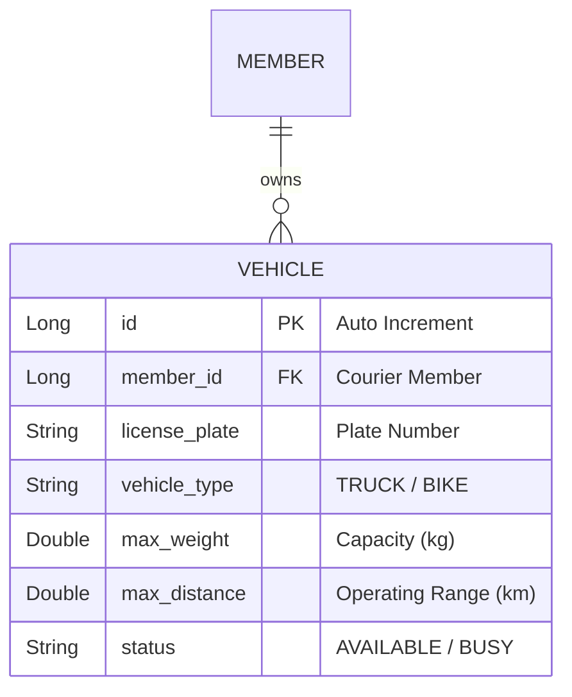

# 설계서: 차량 등록 및 정보 조회 (Vehicle)

이 문서는 배송원 차량 등록 및 정보 조회 기능에 대한 설계 문서입니다.

---

## 1. 요구사항 정의서 (User Story)

* **User Story:** 
  우리는 **배송원(Courier)**으로서, 배송 주문을 매칭받을 자격 조건을 확보하기 위해 **본인의 차량 정보(최대 무게, 최대 이동 거리, 상태 등)를 시스템에 등록하고 조회**하기를 원한다.
* **성공 기준 (Acceptance Criteria):**
  1. 차량 등록 시 차량 소유주는 반드시 존재하는 회원이어야 하며, 존재하지 않는 회원이면 `404 Not Found` 에러를 반환한다.
  2. 등록하는 차량 정보 중 최대 적재 무게는 `0`보다 커야 하며, 최대 이동 거리 역시 `0`보다 커야 한다. 어길 시 `400 Bad Request` 에러를 반환해야 한다.
  3. 차량이 등록되면 기본 상태값은 배송이 가능한 상태인 `AVAILABLE`로 세팅되어야 한다.

---

## 2. ERD 설계 (Entity-Relationship Diagram)



---

## 3. API 명세서 (API Specification)

### 3.1 차량 등록
* **엔드포인트:** `POST /api/vehicles`
* **요청 바디 (Request Body):**
  ```json
  {
    "memberId": 2,
    "licensePlate": "서울12가3456",
    "vehicleType": "TRUCK",
    "maxWeight": 1500.0,
    "maxDistance": 300.0
  }
  ```
* **응답 바디 및 상태 코드 (Response Body & Status):**
  * **Success (201 Created):**
    ```json
    {
      "id": 1,
      "memberId": 2,
      "licensePlate": "서울12가3456",
      "vehicleType": "TRUCK",
      "maxWeight": 1500.0,
      "maxDistance": 300.0,
      "status": "AVAILABLE"
    }
    ```
  * **Failure (400 Bad Request - 유효하지 않은 적재중량 또는 거리):**
    ```json
    {
      "message": "최대 적재 무게는 0보다 커야 합니다."
    }
    ```

### 3.2 차량 조회
* **엔드포인트:** `GET /api/vehicles/{id}`
* **응답 바디 및 상태 코드 (Response Body & Status):**
  * **Success (200 OK):**
    ```json
    {
      "id": 1,
      "memberId": 2,
      "licensePlate": "서울12가3456",
      "vehicleType": "TRUCK",
      "maxWeight": 1500.0,
      "maxDistance": 300.0,
      "status": "AVAILABLE"
    }
    ```
  * **Failure (404 Not Found - 차량 미존재):**
    ```json
    {
      "message": "존재하지 않는 차량입니다: id=99"
    }
    ```

---

## 4. 작업 분할 목록 (WBS)

- [x] 차량 테이블 생성 DB 마이그레이션 스크립트 작성 (`V3__create_vehicle_table.sql`)
- [x] `Vehicle` 엔티티 매핑 및 `VehicleType` 이늄(enum) 매핑
- [x] `InvalidWeightException`, `OverMaxDistanceException` 예외 클래스 정의
- [x] 회원 아이디 존재 여부 검증 및 차량 사양(무게, 거리 > 0) 검증 비즈니스 로직 설계
- [x] 차량 등록 및 상태 조회 서비스 구현 및 슬라이스 테스트 작성
- [x] `VehicleController` API 추가 및 컨트롤러 엔드포인트 테스트 구현
