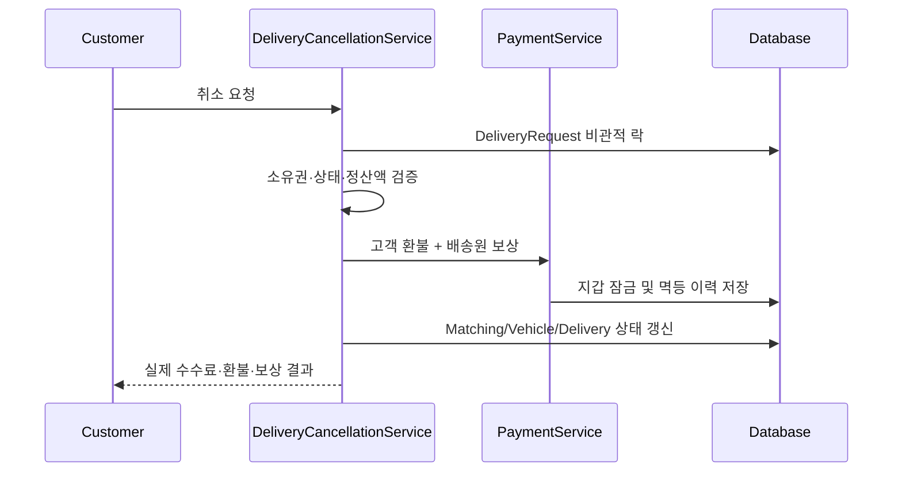

# 단계별 취소 수수료 및 배송원 이동 보상

> [!IMPORTANT]
> 고객 취소는 배송 요청을 삭제하지 않는다. 배송·매칭·포인트 정산을 하나의 트랜잭션에서 상태 전이하고 감사 정보를 보존한다.

## WHY

배정 전에는 전액 환불해 고객 부담을 없애고, 배정 후에는 고객 결제액 범위에서 최대 1,000P를 배송원에게 지급해 헛걸음을 보상한다. 자동 타임아웃 환불은 기존의 수수료 없는 정책을 유지한다.

## 정책

| 취소 직전 상태 | 수수료 | 고객 환불 | 배송원 보상 |
|---|---:|---:|---:|
| `REQUESTED` | 0P | 결제액 100% | 0P |
| `MATCHED` | `min(1,000P, 결제액)` | 결제액 - 수수료 | 수수료와 동일 |
| `PICKED_UP` 이후 | 취소 불가 | - | - |



## 동시성·멱등성

- 락 순서는 `DeliveryRequest → Vehicle → 고객 PointWallet → 배송원 PointWallet`로 고정한다.
- 고객 취소와 픽업은 같은 배송 행을 먼저 잠근 뒤 상태를 재검증하므로 하나만 성공한다.
- 포인트 이력은 `(type, reference_id)` 고유 키로 고객 환불과 배송원 보상을 각각 한 번만 허용한다.
- 환불·보상·상태 전이는 단일 트랜잭션이므로 하나라도 실패하면 전체 롤백한다.

## Trade-off

별도 정산 테이블 대신 배송 요청의 정산 요약과 `point_history` 원장을 함께 사용한다. 테이블 수는 늘리지 않지만 취소 정책 변경 시 두 모델을 함께 동기화해야 한다.

## 검증

```bash
./scripts/verify.sh
```

- 상태별 계산, 인증·소유권, 중복 취소, 정산 실패 롤백을 단위 테스트한다.
- 취소와 픽업의 100개 동시 경합에서 단일 상태 전이와 포인트 이력 건수를 검증한다.
