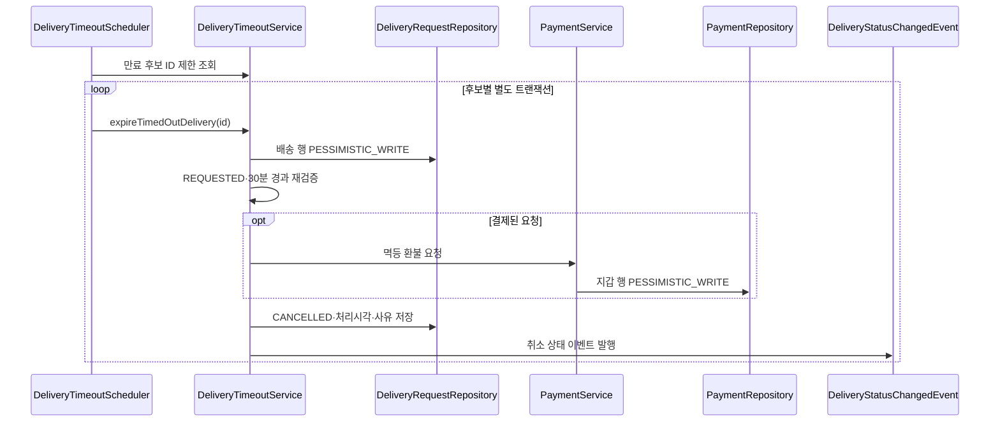
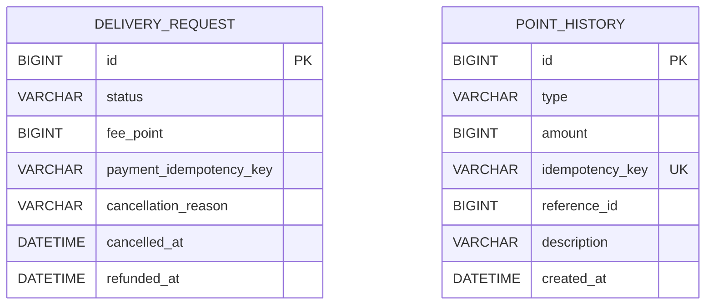

---
metadata:
  version: "1.0.0"
  ssot_owner: "docs/design/배송-자동-타임아웃-환불-기능-설계서.md"
  last_updated: "2026-08-11"
  status: "PROPOSED"
---

# 배송 자동 타임아웃 및 전액 환불 기능 설계서

## 1. 사용자 스토리와 성공 기준

고객은 결제한 배송 요청이 장시간 배정되지 않을 때 포인트가 무기한 묶이지 않기를 원한다. `REQUESTED` 상태로 30분 이상 지난 요청을 시스템이 자동 취소하고, 실제 결제 요청이면 저장된 `feePoint` 전액을 한 번만 환불한다.

> [!IMPORTANT]
> 배송원 콜 수락과 자동 취소는 동일한 배송 요청 행에 비관적 쓰기 락을 획득한 순서대로 처리한다. 먼저 확정된 상태만 성공한다.

성공 기준:

- `createdAt <= now - 30분`인 `REQUESTED` 요청만 처리한다.
- 결제 키가 있는 요청은 `feePoint`를 전액 환불하고, 결제 키가 없는 레거시·직접 생성 요청은 취소만 한다.
- 동일 요청을 여러 인스턴스가 선택해도 취소와 환불은 한 번만 발생한다.
- 환불 실패 시 배송 상태와 포인트 잔액이 모두 롤백된다.

## 2. 아키텍처 흐름



## 3. 데이터 모델과 정책



- 환불 키는 `delivery-timeout-refund:{deliveryRequestId}`로 기록하고, `REFUND + referenceId` 유니크 인덱스를 최종 멱등성 기준으로 사용한다.
- 락 획득 순서는 항상 `DeliveryRequest → PointWallet`이다.
- `CancellationReason.AUTO_TIMEOUT`과 처리 시각으로 사용자 화면과 운영 감사에서 자동 취소를 구분한다.
- 만료 후보 조회는 `(status, created_at, id)` 인덱스를 사용하고 설정된 배치 크기만 읽는다.

## 4. WHY와 트레이드오프

DB 행 락과 포인트 이력 유니크 키를 함께 사용한다. Redis 분산 락은 별도 장애 지점과 운영 복잡도를 추가하므로 현재 단일 DB 트랜잭션 범위에서는 채택하지 않는다. 비관적 락은 짧은 대기 비용이 있지만 돈과 배정의 정합성이 처리량보다 우선이다.

스케줄러는 트랜잭션을 직접 소유하지 않고 후보마다 Service를 호출한다. 한 요청의 실패가 전체 배치를 롤백하지 않지만, 성공한 배송 취소와 환불은 하나의 트랜잭션으로 원자적으로 커밋된다.

## 5. WBS

- [x] 환불 이력과 배송 취소 감사 필드 Flyway 마이그레이션
- [x] `PaymentService` 멱등 환불 유스케이스
- [x] 만료 후보 조회 및 잠금 기반 자동 취소 Service
- [x] 설정 가능한 무상태 스케줄러
- [x] 자동 취소 알림과 실시간 상태 이벤트
- [x] 단위·통합·100개 동시성 테스트
- [x] 상태 전이·포인트·E2E·ERD 문서 동기화

## 6. 검증 명령어

```bash
./scripts/verify.sh
```

기대 결과: Flyway·Spotless·ArchUnit·전체 테스트·JaCoCo 60% 게이트가 모두 통과한다.
