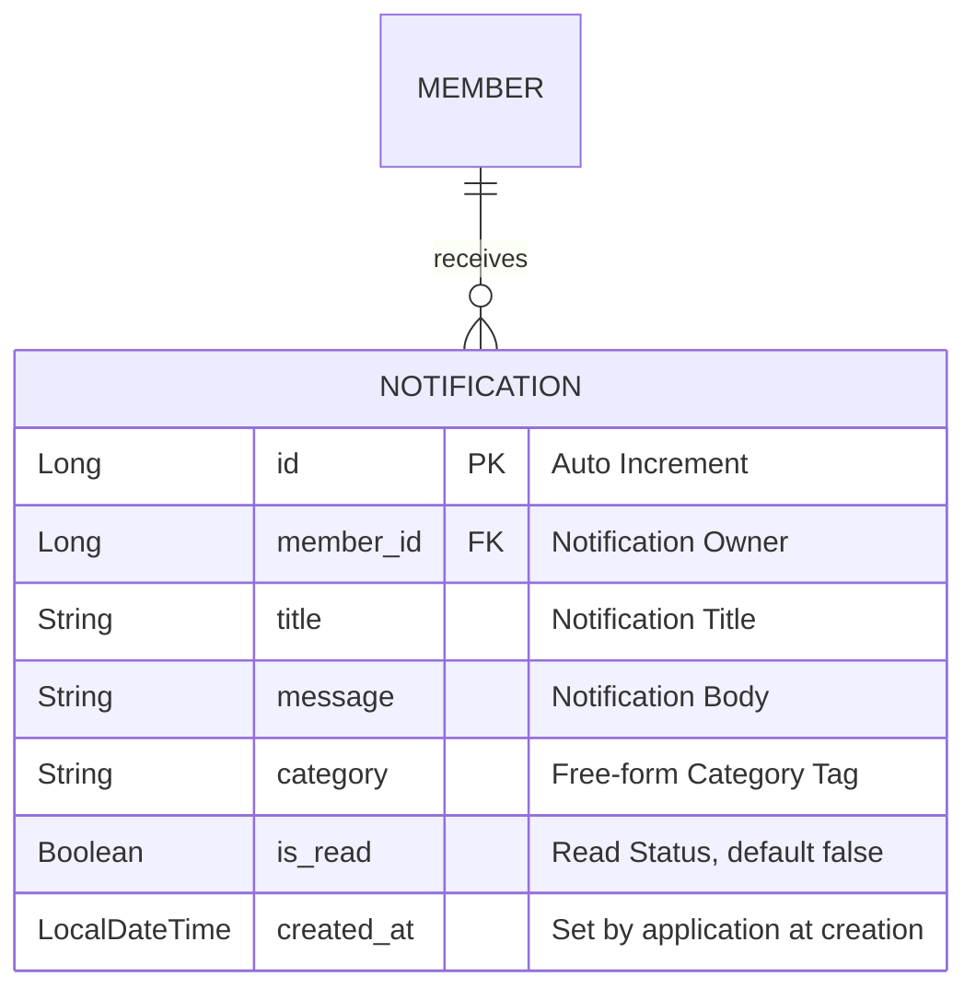

# 설계서: 알림 조회·읽음 처리 및 실시간 생성/Push (Notification)

이 문서는 로그인한 회원이 자신의 알림을 페이징으로 조회하고 읽음 처리하는 기능, 그리고 배송 상태 변경 시 알림이 실제로 생성되어 WebSocket으로 실시간 전달되는 기능에 대한 설계 문서입니다.

---

## 1. 요구사항 정의서 (User Story)

* **User Story:**
  우리는 **로그인한 회원(고객/배송원)**으로서, 배송 상태가 바뀌면 그 알림을 **실시간으로 받고**, 나에게 온 알림을 **카테고리별로 필터링해 페이징으로 조회**하며, 확인한 알림은 **읽음 처리**하기를 원한다.
* **성공 기준 (Acceptance Criteria):**
  1. 알림 목록 조회는 요청자 본인의 알림만 반환한다(다른 회원의 알림은 절대 섞이지 않음), 최신순(`createdAt` 내림차순) 페이징.
  2. `category` 쿼리 파라미터로 선택적 필터링이 가능하다(생략 시 전체 카테고리).
  3. 읽음 처리(`PATCH /{id}/read`)는 그 알림의 소유자 본인만 할 수 있다 — 남의 알림을 읽음 처리하려 하면 거절된다.
  4. 이 저장소에서 **처음으로 실제 로그인 사용자(JWT)를 기준으로 데이터를 필터링**하는 기능이다 — 인증 안 된 요청은 두 API 모두 거절된다(`@PreAuthorize("isAuthenticated()")`).
  5. 배송 상태가 `MATCHED`/`PICKED_UP`/`COMPLETED`/`CANCELLED`로 전이되면, 관련 회원(고객/배정된 배송원)에게 `Notification`이 자동으로 생성된다 — `DeliveryStatusChangedEvent`를 구독해 처리하며, 이벤트를 발행한 트랜잭션이 롤백되면 알림도 생성되지 않는다(`@TransactionalEventListener(AFTER_COMMIT)`).
  6. 생성된 알림은 그 회원 전용 WebSocket 채널(`/topic/members/{memberId}/notifications`)로 즉시 push된다 — 다만 프론트엔드에서 이 채널을 구독하는 것은 별도 이슈(#254)이며, 이 문서 3.3의 범위는 서버가 push까지 하는 것까지다.
  7. 본인 것이 아닌 회원의 알림 채널을 구독하면 거부된다.

---

## 2. ERD 설계 (Entity-Relationship Diagram)



* `V10__create_notification_table.sql`로 테이블만 생성한다.
* `V11__add_notification_indexes.sql`로 `(member_id, created_at)`, `(member_id, category, created_at)` 복합 인덱스를 추가한다 — 조회가 항상 `memberId`로 필터링 후 `createdAt` 정렬(선택적으로 `category` 필터 추가)이라, 데이터가 쌓이면 이 인덱스 없이는 Full Scan + Filesort가 발생한다. `V10`은 이미 로컬 DB에 적용돼 체크섬이 고정된 상태라(V7에서 배운 교훈), 인덱스를 같은 파일에 추가하지 않고 새 마이그레이션으로 분리했다.
* 이 문서 3.3(배송 상태 변경 시 실시간 생성/Push)도 **새 테이블/컬럼이 필요 없다** — 위 `NOTIFICATION` 엔티티를 그대로 쓰고, 수신 대상 조회는 `delivery` 도메인의 `DeliveryRequest.member_id`(고객)와 `Matching`→`Vehicle.member_id`(배송원)를 서비스 레이어에서 참조만 한다(FK 추가 없음).

---

## 3. API 명세서 (API Specification)

인증이 필요한 첫 API라, `Authorization: Bearer <accessToken>` 헤더가 없거나 유효하지 않으면 두 엔드포인트 모두 `403 Forbidden`(ErrorCode `C007`, 표준 `ErrorResponse` 형식)을 반환한다. `@PreAuthorize`가 던지는 `AuthorizationDeniedException`(`AccessDeniedException`의 하위 타입)은 Spring Security의 필터가 아니라 `DispatcherServlet` 내부(메서드 시큐리티는 컨트롤러 호출을 감싸는 AOP라서)에서 발생하기 때문에, Security의 `ExceptionTranslationFilter`보다 먼저 우리 `GlobalExceptionHandler`에 도달한다 — 그래서 `GlobalExceptionHandler`에 `AccessDeniedException` 핸들러를 새로 추가해 표준 형식으로 응답하도록 했다.

### 3.1 알림 목록 조회
* **엔드포인트:** `GET /api/v1/notifications?category={선택}&page={n}&size={n}`
  * (이슈 원문은 `/api/notifications`이나, 이 저장소의 실제 컨벤션 `/api/v1/...`에 맞춤)
* **인증:** `@AuthenticationPrincipal`로 현재 로그인 회원 id를 꺼내 그 회원의 알림만 조회한다.
* **응답 바디 및 상태 코드 (Response Body & Status):**
  * **Success (200 OK):** Spring Data `Page<NotificationResponse>` 그대로 반환(페이징 메타데이터 포함이 필요해서 다른 목록 API처럼 배열로 직접 반환하지 않음).
    ```json
    {
      "content": [
        { "id": 1, "title": "배송이 시작됐어요", "message": "...", "category": "DELIVERY", "read": false, "createdAt": "2026-07-29T10:00:00" }
      ],
      "totalElements": 5,
      "totalPages": 2,
      "number": 0,
      "size": 3
    }
    ```

### 3.2 알림 읽음 처리
* **엔드포인트:** `PATCH /api/v1/notifications/{id}/read`
* **인증:** 요청자가 그 알림의 소유자(`member_id`)가 아니면 거절.
* **응답 바디 및 상태 코드 (Response Body & Status):**
  * **Success (200 OK):** 갱신된 `NotificationResponse` 반환(`read: true`).
  * **Failure (404 Not Found - 알림 없음, ErrorCode `N001`)**
  * **Failure (403 Forbidden - 본인 알림이 아님, ErrorCode `C007` 재사용):** 로그인 자체는 됐지만 그 리소스에 대한 권한이 없는 상황이라 REST 의미상 401(비인증)이 아니라 403(권한 없음)이 맞다. 이번 PR에서 새로 만든 `ErrorCode.ACCESS_DENIED`(C007)를 재사용한다(신규 코드 추가 안 함). *(`tracking` 도메인의 `UnauthorizedTrackingAccessException`은 같은 상황에 401을 쓰는 기존 패턴이었으나, 이번에 지적받아 여기서는 의미상 더 정확한 403으로 감 — `tracking` 쪽은 이번 범위에서 안 건드림)*

### 3.3 배송 상태 변경 알림 실시간 생성/Push (Issue #253)

REST 엔드포인트가 아니라 **내부 이벤트 리스너 + WebSocket 토픽**이 인터페이스다.

* **구독하는 이벤트:** `delivery` 도메인의 기존 `DeliveryStatusChangedEvent(Long deliveryRequestId, DeliveryStatus status, LocalDateTime timestamp)`를 그대로 구독한다(발행 쪽은 안 건드림). `realtime` 패키지의 `DeliveryStatusBroadcastListener`(위치추적 브로드캐스트)와 같은 이벤트를 듣는 두 번째 구독자로, `notification` 패키지에 `NotificationCreateListener`를 신설해 `@TransactionalEventListener(phase = AFTER_COMMIT)`로 받는다.
* **상태별 알림 문구 매핑** (수신자별로 다름):

  | 상태 | 고객 | 배송원 |
  |---|---|---|
  | `MATCHED` | "배송기사 매칭 완료" / 배송기사가 배정되어 곧 픽업을 시작합니다. | "새 배송 배정" / 배송 요청이 배정되었습니다. 픽업을 진행해주세요. |
  | `PICKED_UP` | "픽업 완료" / 배송기사가 물품을 픽업했습니다. | (발송 안 함 — 본인이 방금 한 행동) |
  | `COMPLETED` | "배송 완료" / 배송이 완료되었습니다. 이용해주셔서 감사합니다. | "배송 완료 처리됨" / 배송을 완료 처리했습니다. |
  | `CANCELLED` | "배송 취소" / 배송 요청이 취소되었습니다. | "배정 취소" / 배정된 배송이 취소되었습니다. |

  `category`는 기존 프론트 관례값과 맞춰 `DELIVERY`로 고정한다.
* **WebSocket 토픽 계약:**
  * Destination: `/topic/members/{memberId}/notifications`
  * 구독 인가: `realtime` 패키지의 `StompAuthChannelInterceptor.authorizeSubscribe()`에 이 패턴을 추가한다 — 오퍼 채널(`/topic/vehicles/{vehicleId}/offers`)과 같은 방식으로, `accessor.getUser()`로 뽑은 memberId와 destination의 `{memberId}`가 일치해야 하며 불일치 시 `AccessDeniedException`.
  * Payload: 3.1의 기존 `NotificationResponse`를 그대로 재사용한다(새 DTO 없음).

---

## 4. 작업 분할 목록 (WBS)

- [x] `V10__create_notification_table.sql` 마이그레이션 작성
- [ ] `V11__add_notification_indexes.sql`로 조회 성능용 복합 인덱스 추가
- [ ] `Notification` Entity + `NotificationRepository`(`findByMemberIdOrderByCreatedAtDesc`, `findByMemberIdAndCategoryOrderByCreatedAtDesc`) 작성
- [ ] `NotificationResponse` record 작성
- [ ] `ErrorCode.NOTIFICATION_NOT_FOUND`(N001) 추가, `NotificationAccessDeniedException`(`ErrorCode.ACCESS_DENIED` 재사용) 추가
- [ ] `NotificationService`: `getNotifications(memberId, category, pageable)`, `markAsRead(notificationId, memberId)`(소유권 검증 포함)
- [ ] `NotificationController`: `GET /api/v1/notifications`, `PATCH /api/v1/notifications/{id}/read` — 둘 다 `@PreAuthorize("isAuthenticated()")` + `@AuthenticationPrincipal`
- [ ] 단위 테스트(페이징 조회, category 필터링, 읽음 처리, 소유자 아니면 거절, 미인증 시 403)
- [ ] `NotificationCreateListener`(notification 패키지) 작성 + `DeliveryStatusChangedEvent` 구독 연결
- [ ] 상태→수신자(고객/배송원) 결정 로직 — `deliveryRequestId`로 `DeliveryRequest`, `Matching`(있으면) 조회해 memberId 목록 산출
- [ ] 상태별 title/message 매핑(3.3 표) 구현 + `Notification` row 저장
- [ ] 저장 직후 `SimpMessagingTemplate.convertAndSend`로 `/topic/members/{memberId}/notifications` push
- [ ] `StompAuthChannelInterceptor`에 `/topic/members/{memberId}/notifications` 패턴 인가 규칙 추가
- [ ] 단위 테스트: 상태 전이 시 올바른 수신자·문구로 `Notification`이 생성되는지 / 본인 아닌 토픽 구독 시 거부되는지
